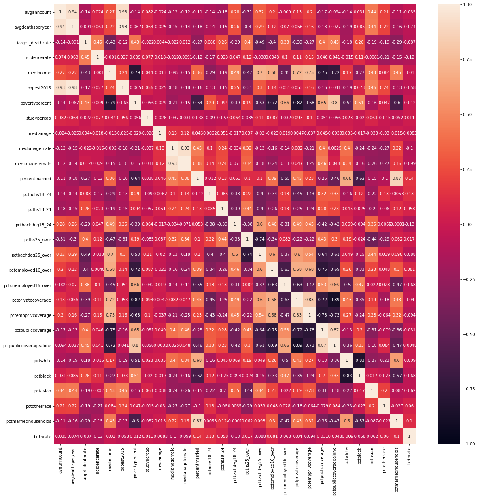
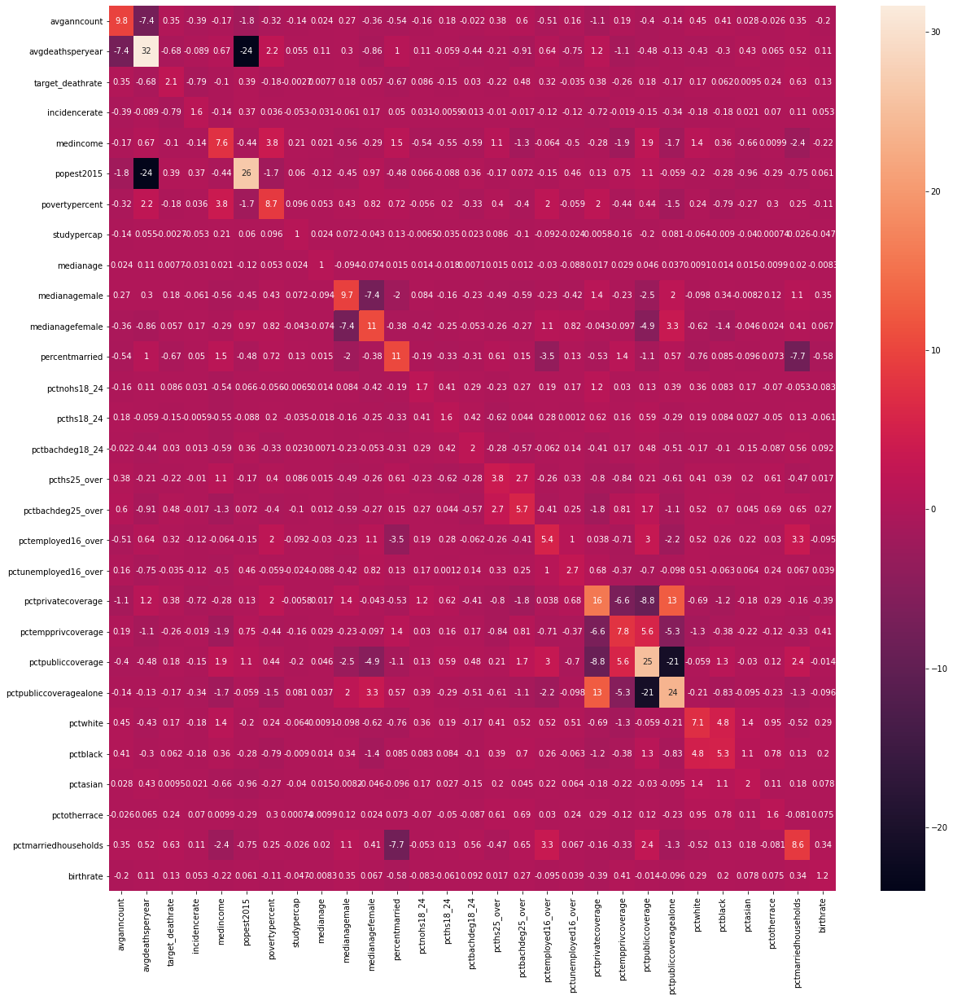
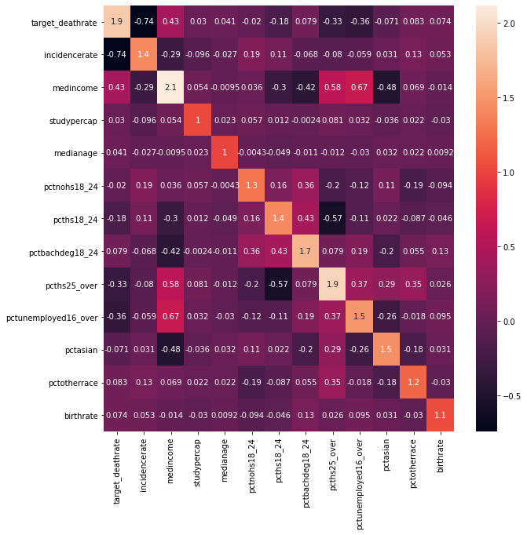
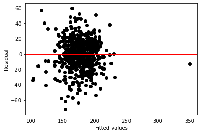

## <font color='#2F4F4F'>1. Defining the Question</font>

### a) Specifying the Data Analysis Question

What are the factors that contribute to the death rate of cancer patients?

### b) Defining the Metric for Success

A cross-validated multiple linear regression model that predicts the death rate of cancer patients based on selected input variables will be the success metric for this project. 

### c) Understanding the Context 

The African Cancer Institute at Stellenbosch University aims to contribute to improving cancer prevention (both primary and secondary prevention, including screening), diagnosis and management in Africa. The institute is a coordinating and directive institution for research and training in the field of cancer within the University.

### e) Data Relevance

The data has relevant variables, however, it would be great if we can obtain variables with a stronger correlation to cancer death rates e.g. absence or presence of cancer case in county residents family.

## <font color='#2F4F4F'>2. Data Cleaning & Preparation</font>


```python
# load libraries
import pandas as pd
import numpy as np
import matplotlib.pyplot as plt
import seaborn as sns

%matplotlib inline

# to display all columns
pd.set_option('display.max.columns', None)

# to display the entire contents of a cell
pd.set_option('display.max_colwidth', None)
```

    /usr/local/lib/python3.6/dist-packages/statsmodels/tools/_testing.py:19: FutureWarning: pandas.util.testing is deprecated. Use the functions in the public API at pandas.testing instead.
      import pandas.util.testing as tm


```python
# load and preview dataset
cancer = pd.read_csv('cancer_reg (1).csv')
cancer.sample(3)
```


<div>
<style scoped>
    .dataframe tbody tr th:only-of-type {
        vertical-align: middle;
    }

    .dataframe tbody tr th {
        vertical-align: top;
    }

    .dataframe thead th {
        text-align: right;
    }
</style>
<table border="1" class="dataframe">
  <thead>
    <tr style="text-align: right;">
      <th></th>
      <th>avganncount</th>
      <th>avgdeathsperyear</th>
      <th>target_deathrate</th>
      <th>incidencerate</th>
      <th>medincome</th>
      <th>popest2015</th>
      <th>povertypercent</th>
      <th>studypercap</th>
      <th>binnedinc</th>
      <th>medianage</th>
      <th>medianagemale</th>
      <th>medianagefemale</th>
      <th>geography</th>
      <th>percentmarried</th>
      <th>pctnohs18_24</th>
      <th>pcths18_24</th>
      <th>pctsomecol18_24</th>
      <th>pctbachdeg18_24</th>
      <th>pcths25_over</th>
      <th>pctbachdeg25_over</th>
      <th>pctemployed16_over</th>
      <th>pctunemployed16_over</th>
      <th>pctprivatecoverage</th>
      <th>pctprivatecoveragealone</th>
      <th>pctempprivcoverage</th>
      <th>pctpubliccoverage</th>
      <th>pctpubliccoveragealone</th>
      <th>pctwhite</th>
      <th>pctblack</th>
      <th>pctasian</th>
      <th>pctotherrace</th>
      <th>pctmarriedhouseholds</th>
      <th>birthrate</th>
    </tr>
  </thead>
  <tbody>
    <tr>
      <th>2875</th>
      <td>96.0</td>
      <td>38</td>
      <td>174.0</td>
      <td>460.0</td>
      <td>41759</td>
      <td>16491</td>
      <td>18.1</td>
      <td>0.000000</td>
      <td>(40362.7, 42724.4]</td>
      <td>40.7</td>
      <td>35.9</td>
      <td>48.6</td>
      <td>Lawrence County, Illinois</td>
      <td>43.0</td>
      <td>49.0</td>
      <td>25.6</td>
      <td>22.2</td>
      <td>3.2</td>
      <td>34.3</td>
      <td>7.3</td>
      <td>30.3</td>
      <td>6.1</td>
      <td>62.1</td>
      <td>NaN</td>
      <td>38.6</td>
      <td>46.0</td>
      <td>24.8</td>
      <td>75.913591</td>
      <td>20.564056</td>
      <td>0.108011</td>
      <td>1.320132</td>
      <td>51.505484</td>
      <td>5.340224</td>
    </tr>
    <tr>
      <th>1924</th>
      <td>75.0</td>
      <td>32</td>
      <td>179.8</td>
      <td>407.5</td>
      <td>42839</td>
      <td>22255</td>
      <td>14.6</td>
      <td>0.000000</td>
      <td>(42724.4, 45201]</td>
      <td>31.1</td>
      <td>30.2</td>
      <td>31.6</td>
      <td>Moore County, Texas</td>
      <td>59.0</td>
      <td>31.0</td>
      <td>29.7</td>
      <td>NaN</td>
      <td>1.4</td>
      <td>26.1</td>
      <td>9.5</td>
      <td>67.4</td>
      <td>4.1</td>
      <td>59.4</td>
      <td>50.7</td>
      <td>46.5</td>
      <td>26.8</td>
      <td>18.1</td>
      <td>79.587990</td>
      <td>2.948701</td>
      <td>8.482564</td>
      <td>5.637090</td>
      <td>63.005948</td>
      <td>10.436469</td>
    </tr>
    <tr>
      <th>1644</th>
      <td>1511.0</td>
      <td>661</td>
      <td>190.7</td>
      <td>463.1</td>
      <td>41316</td>
      <td>231900</td>
      <td>18.9</td>
      <td>12.936611</td>
      <td>(40362.7, 42724.4]</td>
      <td>43.3</td>
      <td>41.2</td>
      <td>45.4</td>
      <td>Mahoning County, Ohio</td>
      <td>45.1</td>
      <td>16.4</td>
      <td>31.8</td>
      <td>43.3</td>
      <td>8.4</td>
      <td>38.1</td>
      <td>14.2</td>
      <td>53.7</td>
      <td>9.5</td>
      <td>63.8</td>
      <td>49.0</td>
      <td>44.3</td>
      <td>40.7</td>
      <td>24.3</td>
      <td>80.246429</td>
      <td>15.502451</td>
      <td>0.793861</td>
      <td>0.769985</td>
      <td>42.507414</td>
      <td>4.348522</td>
    </tr>
  </tbody>
</table>
</div>


```python
# load glossary
glossary = pd.read_csv('regression_project_glossary.csv',header = None)
glossary
```


<div>
<style scoped>
    .dataframe tbody tr th:only-of-type {
        vertical-align: middle;
    }

    .dataframe tbody tr th {
        vertical-align: top;
    }

    .dataframe thead th {
        text-align: right;
    }
</style>
<table border="1" class="dataframe">
  <thead>
    <tr style="text-align: right;">
      <th></th>
      <th>0</th>
    </tr>
  </thead>
  <tbody>
    <tr>
      <th>0</th>
      <td>avganncount, decimal, Mean number of reported cases of cancer diagnosed annually (a)</td>
    </tr>
    <tr>
      <th>1</th>
      <td>avgdeathsperyear, integer, Mean number of reported mortalities due to cancer (a)</td>
    </tr>
    <tr>
      <th>2</th>
      <td>target_deathrate, decimal, Dependent variable. Mean per capita (100,000) cancer mortalities (a)</td>
    </tr>
    <tr>
      <th>3</th>
      <td>incidencerate, decimal, Mean per capita (100,000) cancer diagnoses (a)</td>
    </tr>
    <tr>
      <th>4</th>
      <td>medincome, integer, Median income per county (b)</td>
    </tr>
    <tr>
      <th>5</th>
      <td>popest2015, integer, Population of county (b)</td>
    </tr>
    <tr>
      <th>6</th>
      <td>povertypercent, decimal, Percent of populace in poverty (b)</td>
    </tr>
    <tr>
      <th>7</th>
      <td>studypercap, decimal, Per capita number of cancer-related clinical trials per county (a)</td>
    </tr>
    <tr>
      <th>8</th>
      <td>binnedinc, string, Median income per capita binned by decile (b)</td>
    </tr>
    <tr>
      <th>9</th>
      <td>medianage, decimal, Median age of county residents (b)</td>
    </tr>
    <tr>
      <th>10</th>
      <td>medianagemale, decimal, Median age of male county residents (b)</td>
    </tr>
    <tr>
      <th>11</th>
      <td>medianagefemale, decimal, Median age of female county residents (b)</td>
    </tr>
    <tr>
      <th>12</th>
      <td>geography, string, County name (b)</td>
    </tr>
    <tr>
      <th>13</th>
      <td>percentmarried, decimal, Percent of county residents who are married (b)</td>
    </tr>
    <tr>
      <th>14</th>
      <td>pctnohs18_24, decimal, Percent of county residents ages 18-24 highest education attained: less than high school (b)</td>
    </tr>
    <tr>
      <th>15</th>
      <td>pcths18_24, decimal, Percent of county residents ages 18-24 highest education attained: high school diploma (b)</td>
    </tr>
    <tr>
      <th>16</th>
      <td>pctsomecol18_24, decimal, Percent of county residents ages 18-24 highest education attained: some college (b)</td>
    </tr>
    <tr>
      <th>17</th>
      <td>pctbachdeg18_24, decimal, Percent of county residents ages 18-24 highest education attained: bachelor's degree (b)</td>
    </tr>
    <tr>
      <th>18</th>
      <td>pcths25_over, decimal, Percent of county residents ages 25 and over highest education attained: high school diploma (b)</td>
    </tr>
    <tr>
      <th>19</th>
      <td>pctbachdeg25_over, decimal, Percent of county residents ages 25 and over highest education attained: bachelor's degree (b)</td>
    </tr>
    <tr>
      <th>20</th>
      <td>pctemployed16_over, decimal, Percent of county residents ages 16 and over employed (b)</td>
    </tr>
    <tr>
      <th>21</th>
      <td>pctunemployed16_over, decimal, Percent of county residents ages 16 and over unemployed (b)</td>
    </tr>
    <tr>
      <th>22</th>
      <td>pctprivatecoverage, decimal, Percent of county residents with private health coverage (b)</td>
    </tr>
    <tr>
      <th>23</th>
      <td>pctprivatecoveragealone, decimal, Percent of county residents with private health coverage alone (no public assistance) (b)</td>
    </tr>
    <tr>
      <th>24</th>
      <td>pctempprivcoverage, decimal, Percent of county residents with employee-provided private health coverage (b)</td>
    </tr>
    <tr>
      <th>25</th>
      <td>pctpubliccoverage, decimal, Percent of county residents with government-provided health coverage (b)</td>
    </tr>
    <tr>
      <th>26</th>
      <td>pctpubliccoveragealone, decimal, Percent of county residents with government-provided health coverage alone (b)</td>
    </tr>
    <tr>
      <th>27</th>
      <td>pctwhite, decimal, Percent of county residents who identify as White (b)</td>
    </tr>
    <tr>
      <th>28</th>
      <td>pctblack, decimal, Percent of county residents who identify as Black (b)</td>
    </tr>
    <tr>
      <th>29</th>
      <td>pctasian, decimal, Percent of county residents who identify as Asian (b)</td>
    </tr>
    <tr>
      <th>30</th>
      <td>pctotherrace, decimal, Percent of county residents who identify in a category which is not White, Black, or Asian (b)</td>
    </tr>
    <tr>
      <th>31</th>
      <td>pctmarriedhouseholds, decimal, Percent of married households (b)</td>
    </tr>
    <tr>
      <th>32</th>
      <td>birthrate, decimal, Number of live births relative to number of women in county (b)</td>
    </tr>
  </tbody>
</table>
</div>


```python
# check dataset shape
cancer.shape
```


    (3047, 33)


```python
# preview variable datatypes
cancer.dtypes
```


    avganncount                float64
    avgdeathsperyear             int64
    target_deathrate           float64
    incidencerate              float64
    medincome                    int64
    popest2015                   int64
    povertypercent             float64
    studypercap                float64
    binnedinc                   object
    medianage                  float64
    medianagemale              float64
    medianagefemale            float64
    geography                   object
    percentmarried             float64
    pctnohs18_24               float64
    pcths18_24                 float64
    pctsomecol18_24            float64
    pctbachdeg18_24            float64
    pcths25_over               float64
    pctbachdeg25_over          float64
    pctemployed16_over         float64
    pctunemployed16_over       float64
    pctprivatecoverage         float64
    pctprivatecoveragealone    float64
    pctempprivcoverage         float64
    pctpubliccoverage          float64
    pctpubliccoveragealone     float64
    pctwhite                   float64
    pctblack                   float64
    pctasian                   float64
    pctotherrace               float64
    pctmarriedhouseholds       float64
    birthrate                  float64
    dtype: object


```python
# check for duplicates
cancer.duplicated().sum()
```


    0


```python
# check for missing values
cancer.isna().sum()
```


    avganncount                   0
    avgdeathsperyear              0
    target_deathrate              0
    incidencerate                 0
    medincome                     0
    popest2015                    0
    povertypercent                0
    studypercap                   0
    binnedinc                     0
    medianage                     0
    medianagemale                 0
    medianagefemale               0
    geography                     0
    percentmarried                0
    pctnohs18_24                  0
    pcths18_24                    0
    pctsomecol18_24            2285
    pctbachdeg18_24               0
    pcths25_over                  0
    pctbachdeg25_over             0
    pctemployed16_over          152
    pctunemployed16_over          0
    pctprivatecoverage            0
    pctprivatecoveragealone     609
    pctempprivcoverage            0
    pctpubliccoverage             0
    pctpubliccoveragealone        0
    pctwhite                      0
    pctblack                      0
    pctasian                      0
    pctotherrace                  0
    pctmarriedhouseholds          0
    birthrate                     0
    dtype: int64


Which variables contain missing data?


```python
# calculate the percentage of missing data for each variable

cancer.isna().sum()/cancer.count()
```


    avganncount                0.000000
    avgdeathsperyear           0.000000
    target_deathrate           0.000000
    incidencerate              0.000000
    medincome                  0.000000
    popest2015                 0.000000
    povertypercent             0.000000
    studypercap                0.000000
    binnedinc                  0.000000
    medianage                  0.000000
    medianagemale              0.000000
    medianagefemale            0.000000
    geography                  0.000000
    percentmarried             0.000000
    pctnohs18_24               0.000000
    pcths18_24                 0.000000
    pctsomecol18_24            2.998688
    pctbachdeg18_24            0.000000
    pcths25_over               0.000000
    pctbachdeg25_over          0.000000
    pctemployed16_over         0.052504
    pctunemployed16_over       0.000000
    pctprivatecoverage         0.000000
    pctprivatecoveragealone    0.249795
    pctempprivcoverage         0.000000
    pctpubliccoverage          0.000000
    pctpubliccoveragealone     0.000000
    pctwhite                   0.000000
    pctblack                   0.000000
    pctasian                   0.000000
    pctotherrace               0.000000
    pctmarriedhouseholds       0.000000
    birthrate                  0.000000
    dtype: float64


A rule of thumb is to drop any variable which has more than 5-10% of its data missing.


```python
# drop the variables exceeding this limit and impute the remaining ones with the median.

clean_df = cancer.drop(columns = ['pctsomecol18_24','pctprivatecoveragealone'])
clean_df['pctemployed16_over'] = clean_df['pctemployed16_over'].fillna(clean_df['pctemployed16_over'].median())

# counterchecking the above operations
clean_df.isnull().sum()
```


    avganncount               0
    avgdeathsperyear          0
    target_deathrate          0
    incidencerate             0
    medincome                 0
    popest2015                0
    povertypercent            0
    studypercap               0
    binnedinc                 0
    medianage                 0
    medianagemale             0
    medianagefemale           0
    geography                 0
    percentmarried            0
    pctnohs18_24              0
    pcths18_24                0
    pctbachdeg18_24           0
    pcths25_over              0
    pctbachdeg25_over         0
    pctemployed16_over        0
    pctunemployed16_over      0
    pctprivatecoverage        0
    pctempprivcoverage        0
    pctpubliccoverage         0
    pctpubliccoveragealone    0
    pctwhite                  0
    pctblack                  0
    pctasian                  0
    pctotherrace              0
    pctmarriedhouseholds      0
    birthrate                 0
    dtype: int64


```python
# save the data set to a clean CSV file

clean_df.to_csv('clean_df.csv', index = False)
```


```python
# loading the clean dataset

cancer = pd.read_csv('clean_df.csv')
cancer.head()
```


<div>
<style scoped>
    .dataframe tbody tr th:only-of-type {
        vertical-align: middle;
    }

    .dataframe tbody tr th {
        vertical-align: top;
    }

    .dataframe thead th {
        text-align: right;
    }
</style>
<table border="1" class="dataframe">
  <thead>
    <tr style="text-align: right;">
      <th></th>
      <th>avganncount</th>
      <th>avgdeathsperyear</th>
      <th>target_deathrate</th>
      <th>incidencerate</th>
      <th>medincome</th>
      <th>popest2015</th>
      <th>povertypercent</th>
      <th>studypercap</th>
      <th>binnedinc</th>
      <th>medianage</th>
      <th>medianagemale</th>
      <th>medianagefemale</th>
      <th>geography</th>
      <th>percentmarried</th>
      <th>pctnohs18_24</th>
      <th>pcths18_24</th>
      <th>pctbachdeg18_24</th>
      <th>pcths25_over</th>
      <th>pctbachdeg25_over</th>
      <th>pctemployed16_over</th>
      <th>pctunemployed16_over</th>
      <th>pctprivatecoverage</th>
      <th>pctempprivcoverage</th>
      <th>pctpubliccoverage</th>
      <th>pctpubliccoveragealone</th>
      <th>pctwhite</th>
      <th>pctblack</th>
      <th>pctasian</th>
      <th>pctotherrace</th>
      <th>pctmarriedhouseholds</th>
      <th>birthrate</th>
    </tr>
  </thead>
  <tbody>
    <tr>
      <th>0</th>
      <td>1397.0</td>
      <td>469</td>
      <td>164.9</td>
      <td>489.8</td>
      <td>61898</td>
      <td>260131</td>
      <td>11.2</td>
      <td>499.748204</td>
      <td>(61494.5, 125635]</td>
      <td>39.3</td>
      <td>36.9</td>
      <td>41.7</td>
      <td>Kitsap County, Washington</td>
      <td>52.5</td>
      <td>11.5</td>
      <td>39.5</td>
      <td>6.9</td>
      <td>23.2</td>
      <td>19.6</td>
      <td>51.9</td>
      <td>8.0</td>
      <td>75.1</td>
      <td>41.6</td>
      <td>32.9</td>
      <td>14.0</td>
      <td>81.780529</td>
      <td>2.594728</td>
      <td>4.821857</td>
      <td>1.843479</td>
      <td>52.856076</td>
      <td>6.118831</td>
    </tr>
    <tr>
      <th>1</th>
      <td>173.0</td>
      <td>70</td>
      <td>161.3</td>
      <td>411.6</td>
      <td>48127</td>
      <td>43269</td>
      <td>18.6</td>
      <td>23.111234</td>
      <td>(48021.6, 51046.4]</td>
      <td>33.0</td>
      <td>32.2</td>
      <td>33.7</td>
      <td>Kittitas County, Washington</td>
      <td>44.5</td>
      <td>6.1</td>
      <td>22.4</td>
      <td>7.5</td>
      <td>26.0</td>
      <td>22.7</td>
      <td>55.9</td>
      <td>7.8</td>
      <td>70.2</td>
      <td>43.6</td>
      <td>31.1</td>
      <td>15.3</td>
      <td>89.228509</td>
      <td>0.969102</td>
      <td>2.246233</td>
      <td>3.741352</td>
      <td>45.372500</td>
      <td>4.333096</td>
    </tr>
    <tr>
      <th>2</th>
      <td>102.0</td>
      <td>50</td>
      <td>174.7</td>
      <td>349.7</td>
      <td>49348</td>
      <td>21026</td>
      <td>14.6</td>
      <td>47.560164</td>
      <td>(48021.6, 51046.4]</td>
      <td>45.0</td>
      <td>44.0</td>
      <td>45.8</td>
      <td>Klickitat County, Washington</td>
      <td>54.2</td>
      <td>24.0</td>
      <td>36.6</td>
      <td>9.5</td>
      <td>29.0</td>
      <td>16.0</td>
      <td>45.9</td>
      <td>7.0</td>
      <td>63.7</td>
      <td>34.9</td>
      <td>42.1</td>
      <td>21.1</td>
      <td>90.922190</td>
      <td>0.739673</td>
      <td>0.465898</td>
      <td>2.747358</td>
      <td>54.444868</td>
      <td>3.729488</td>
    </tr>
    <tr>
      <th>3</th>
      <td>427.0</td>
      <td>202</td>
      <td>194.8</td>
      <td>430.4</td>
      <td>44243</td>
      <td>75882</td>
      <td>17.1</td>
      <td>342.637253</td>
      <td>(42724.4, 45201]</td>
      <td>42.8</td>
      <td>42.2</td>
      <td>43.4</td>
      <td>Lewis County, Washington</td>
      <td>52.7</td>
      <td>20.2</td>
      <td>41.2</td>
      <td>2.5</td>
      <td>31.6</td>
      <td>9.3</td>
      <td>48.3</td>
      <td>12.1</td>
      <td>58.4</td>
      <td>35.0</td>
      <td>45.3</td>
      <td>25.0</td>
      <td>91.744686</td>
      <td>0.782626</td>
      <td>1.161359</td>
      <td>1.362643</td>
      <td>51.021514</td>
      <td>4.603841</td>
    </tr>
    <tr>
      <th>4</th>
      <td>57.0</td>
      <td>26</td>
      <td>144.4</td>
      <td>350.1</td>
      <td>49955</td>
      <td>10321</td>
      <td>12.5</td>
      <td>0.000000</td>
      <td>(48021.6, 51046.4]</td>
      <td>48.3</td>
      <td>47.8</td>
      <td>48.9</td>
      <td>Lincoln County, Washington</td>
      <td>57.8</td>
      <td>14.9</td>
      <td>43.0</td>
      <td>2.0</td>
      <td>33.4</td>
      <td>15.0</td>
      <td>48.2</td>
      <td>4.8</td>
      <td>61.6</td>
      <td>35.1</td>
      <td>44.0</td>
      <td>22.7</td>
      <td>94.104024</td>
      <td>0.270192</td>
      <td>0.665830</td>
      <td>0.492135</td>
      <td>54.027460</td>
      <td>6.796657</td>
    </tr>
  </tbody>
</table>
</div>


## <font color='#2F4F4F'>3. Data Analysis</font>

### 3.1 Test for Multicollinearity

Since our dataset consists of largely numerical variables, we will look at the correlations between our variables so we can look at multicollinearity.


```python
# checking the correlations between the numerical variables
corr_matrix = cancer.corr()

#specifying the size of the heatmap
plt.figure(figsize=(20, 20)) 

# plotting the correlations onto a heatmap
sns.heatmap(corr_matrix, vmin = -1, vmax =1, annot = True)
```


    <matplotlib.axes._subplots.AxesSubplot at 0x7fa560e054e0>


    

    


```python
# create a dataframe showing the VIF scores of the above correlations
vif_df = pd.DataFrame(np.linalg.inv(corr_matrix.values), index = corr_matrix.index, columns=corr_matrix.columns)
vif_df
```


<div>
<style scoped>
    .dataframe tbody tr th:only-of-type {
        vertical-align: middle;
    }

    .dataframe tbody tr th {
        vertical-align: top;
    }

    .dataframe thead th {
        text-align: right;
    }
</style>
<table border="1" class="dataframe">
  <thead>
    <tr style="text-align: right;">
      <th></th>
      <th>avganncount</th>
      <th>avgdeathsperyear</th>
      <th>target_deathrate</th>
      <th>incidencerate</th>
      <th>medincome</th>
      <th>popest2015</th>
      <th>povertypercent</th>
      <th>studypercap</th>
      <th>medianage</th>
      <th>medianagemale</th>
      <th>medianagefemale</th>
      <th>percentmarried</th>
      <th>pctnohs18_24</th>
      <th>pcths18_24</th>
      <th>pctbachdeg18_24</th>
      <th>pcths25_over</th>
      <th>pctbachdeg25_over</th>
      <th>pctemployed16_over</th>
      <th>pctunemployed16_over</th>
      <th>pctprivatecoverage</th>
      <th>pctempprivcoverage</th>
      <th>pctpubliccoverage</th>
      <th>pctpubliccoveragealone</th>
      <th>pctwhite</th>
      <th>pctblack</th>
      <th>pctasian</th>
      <th>pctotherrace</th>
      <th>pctmarriedhouseholds</th>
      <th>birthrate</th>
    </tr>
  </thead>
  <tbody>
    <tr>
      <th>avganncount</th>
      <td>9.830106</td>
      <td>-7.407333</td>
      <td>0.347628</td>
      <td>-0.386500</td>
      <td>-0.174896</td>
      <td>-1.832570</td>
      <td>-0.315538</td>
      <td>-0.140939</td>
      <td>0.023981</td>
      <td>0.273395</td>
      <td>-0.355342</td>
      <td>-0.543585</td>
      <td>-0.163864</td>
      <td>0.178431</td>
      <td>-0.021644</td>
      <td>0.381546</td>
      <td>0.599158</td>
      <td>-0.512434</td>
      <td>0.158108</td>
      <td>-1.131189</td>
      <td>0.193691</td>
      <td>-0.398661</td>
      <td>-0.135956</td>
      <td>0.454110</td>
      <td>0.405342</td>
      <td>0.027721</td>
      <td>-0.026414</td>
      <td>0.346315</td>
      <td>-0.201765</td>
    </tr>
    <tr>
      <th>avgdeathsperyear</th>
      <td>-7.407333</td>
      <td>31.649740</td>
      <td>-0.682984</td>
      <td>-0.088501</td>
      <td>0.666164</td>
      <td>-24.011263</td>
      <td>2.249548</td>
      <td>0.055452</td>
      <td>0.107847</td>
      <td>0.301926</td>
      <td>-0.860157</td>
      <td>1.020455</td>
      <td>0.105098</td>
      <td>-0.059499</td>
      <td>-0.436348</td>
      <td>-0.212608</td>
      <td>-0.906046</td>
      <td>0.635235</td>
      <td>-0.746047</td>
      <td>1.219710</td>
      <td>-1.110298</td>
      <td>-0.483197</td>
      <td>-0.125212</td>
      <td>-0.430121</td>
      <td>-0.296315</td>
      <td>0.433414</td>
      <td>0.064573</td>
      <td>0.520438</td>
      <td>0.113098</td>
    </tr>
    <tr>
      <th>target_deathrate</th>
      <td>0.347628</td>
      <td>-0.682984</td>
      <td>2.097260</td>
      <td>-0.793321</td>
      <td>-0.103876</td>
      <td>0.390157</td>
      <td>-0.181042</td>
      <td>-0.002680</td>
      <td>0.007730</td>
      <td>0.180672</td>
      <td>0.056587</td>
      <td>-0.666006</td>
      <td>0.086054</td>
      <td>-0.147457</td>
      <td>0.029570</td>
      <td>-0.218078</td>
      <td>0.480333</td>
      <td>0.324283</td>
      <td>-0.034669</td>
      <td>0.383855</td>
      <td>-0.257840</td>
      <td>0.176866</td>
      <td>-0.174691</td>
      <td>0.171345</td>
      <td>0.062185</td>
      <td>0.009472</td>
      <td>0.237166</td>
      <td>0.632223</td>
      <td>0.130758</td>
    </tr>
    <tr>
      <th>incidencerate</th>
      <td>-0.386500</td>
      <td>-0.088501</td>
      <td>-0.793321</td>
      <td>1.564613</td>
      <td>-0.136234</td>
      <td>0.367856</td>
      <td>0.036349</td>
      <td>-0.052505</td>
      <td>-0.030845</td>
      <td>-0.060762</td>
      <td>0.169388</td>
      <td>0.049909</td>
      <td>0.031337</td>
      <td>-0.005867</td>
      <td>0.013305</td>
      <td>-0.010495</td>
      <td>-0.016902</td>
      <td>-0.122474</td>
      <td>-0.122666</td>
      <td>-0.718874</td>
      <td>-0.018966</td>
      <td>-0.152648</td>
      <td>-0.335347</td>
      <td>-0.183088</td>
      <td>-0.176805</td>
      <td>0.020891</td>
      <td>0.070085</td>
      <td>0.113528</td>
      <td>0.052682</td>
    </tr>
    <tr>
      <th>medincome</th>
      <td>-0.174896</td>
      <td>0.666164</td>
      <td>-0.103876</td>
      <td>-0.136234</td>
      <td>7.608079</td>
      <td>-0.440002</td>
      <td>3.782742</td>
      <td>0.205902</td>
      <td>0.021369</td>
      <td>-0.564402</td>
      <td>-0.292145</td>
      <td>1.490879</td>
      <td>-0.544473</td>
      <td>-0.545517</td>
      <td>-0.587457</td>
      <td>1.072767</td>
      <td>-1.296336</td>
      <td>-0.064237</td>
      <td>-0.504943</td>
      <td>-0.280301</td>
      <td>-1.928498</td>
      <td>1.900367</td>
      <td>-1.718276</td>
      <td>1.366699</td>
      <td>0.360768</td>
      <td>-0.660612</td>
      <td>0.009874</td>
      <td>-2.352930</td>
      <td>-0.224268</td>
    </tr>
    <tr>
      <th>popest2015</th>
      <td>-1.832570</td>
      <td>-24.011263</td>
      <td>0.390157</td>
      <td>0.367856</td>
      <td>-0.440002</td>
      <td>26.489610</td>
      <td>-1.695375</td>
      <td>0.060228</td>
      <td>-0.121852</td>
      <td>-0.445418</td>
      <td>0.968875</td>
      <td>-0.479836</td>
      <td>0.065638</td>
      <td>-0.087676</td>
      <td>0.355088</td>
      <td>-0.173185</td>
      <td>0.071867</td>
      <td>-0.147401</td>
      <td>0.455564</td>
      <td>0.126388</td>
      <td>0.745423</td>
      <td>1.071827</td>
      <td>-0.059061</td>
      <td>-0.203087</td>
      <td>-0.279841</td>
      <td>-0.957726</td>
      <td>-0.285967</td>
      <td>-0.745412</td>
      <td>0.061243</td>
    </tr>
    <tr>
      <th>povertypercent</th>
      <td>-0.315538</td>
      <td>2.249548</td>
      <td>-0.181042</td>
      <td>0.036349</td>
      <td>3.782742</td>
      <td>-1.695375</td>
      <td>8.714357</td>
      <td>0.096064</td>
      <td>0.052655</td>
      <td>0.429650</td>
      <td>0.822024</td>
      <td>0.721315</td>
      <td>-0.055615</td>
      <td>0.198784</td>
      <td>-0.330237</td>
      <td>0.401466</td>
      <td>-0.399708</td>
      <td>2.043890</td>
      <td>-0.058862</td>
      <td>1.999297</td>
      <td>-0.442913</td>
      <td>0.436686</td>
      <td>-1.507088</td>
      <td>0.238370</td>
      <td>-0.789841</td>
      <td>-0.271658</td>
      <td>0.301463</td>
      <td>0.253357</td>
      <td>-0.107649</td>
    </tr>
    <tr>
      <th>studypercap</th>
      <td>-0.140939</td>
      <td>0.055452</td>
      <td>-0.002680</td>
      <td>-0.052505</td>
      <td>0.205902</td>
      <td>0.060228</td>
      <td>0.096064</td>
      <td>1.046922</td>
      <td>0.023648</td>
      <td>0.071609</td>
      <td>-0.042718</td>
      <td>0.125315</td>
      <td>-0.006450</td>
      <td>-0.035194</td>
      <td>0.023169</td>
      <td>0.086224</td>
      <td>-0.104582</td>
      <td>-0.092080</td>
      <td>-0.024236</td>
      <td>-0.005798</td>
      <td>-0.156328</td>
      <td>-0.200516</td>
      <td>0.080692</td>
      <td>-0.064098</td>
      <td>-0.009004</td>
      <td>-0.040461</td>
      <td>0.000736</td>
      <td>-0.026353</td>
      <td>-0.046645</td>
    </tr>
    <tr>
      <th>medianage</th>
      <td>0.023981</td>
      <td>0.107847</td>
      <td>0.007730</td>
      <td>-0.030845</td>
      <td>0.021369</td>
      <td>-0.121852</td>
      <td>0.052655</td>
      <td>0.023648</td>
      <td>1.024094</td>
      <td>-0.093957</td>
      <td>-0.074318</td>
      <td>0.014706</td>
      <td>0.013583</td>
      <td>-0.017900</td>
      <td>0.007118</td>
      <td>0.014695</td>
      <td>0.011706</td>
      <td>-0.030235</td>
      <td>-0.087670</td>
      <td>0.017099</td>
      <td>0.028735</td>
      <td>0.045849</td>
      <td>0.036721</td>
      <td>0.009086</td>
      <td>0.013848</td>
      <td>0.015146</td>
      <td>-0.009862</td>
      <td>0.020374</td>
      <td>-0.008341</td>
    </tr>
    <tr>
      <th>medianagemale</th>
      <td>0.273395</td>
      <td>0.301926</td>
      <td>0.180672</td>
      <td>-0.060762</td>
      <td>-0.564402</td>
      <td>-0.445418</td>
      <td>0.429650</td>
      <td>0.071609</td>
      <td>-0.093957</td>
      <td>9.674554</td>
      <td>-7.438867</td>
      <td>-1.985067</td>
      <td>0.084310</td>
      <td>-0.158053</td>
      <td>-0.229851</td>
      <td>-0.485861</td>
      <td>-0.592839</td>
      <td>-0.229537</td>
      <td>-0.424071</td>
      <td>1.392526</td>
      <td>-0.225075</td>
      <td>-2.492215</td>
      <td>2.003563</td>
      <td>-0.097512</td>
      <td>0.335270</td>
      <td>-0.008230</td>
      <td>0.115535</td>
      <td>1.068202</td>
      <td>0.354938</td>
    </tr>
    <tr>
      <th>medianagefemale</th>
      <td>-0.355342</td>
      <td>-0.860157</td>
      <td>0.056587</td>
      <td>0.169388</td>
      <td>-0.292145</td>
      <td>0.968875</td>
      <td>0.822024</td>
      <td>-0.042718</td>
      <td>-0.074318</td>
      <td>-7.438867</td>
      <td>10.688743</td>
      <td>-0.377623</td>
      <td>-0.424189</td>
      <td>-0.248450</td>
      <td>-0.053386</td>
      <td>-0.258866</td>
      <td>-0.270302</td>
      <td>1.088490</td>
      <td>0.818516</td>
      <td>-0.042771</td>
      <td>-0.096828</td>
      <td>-4.927093</td>
      <td>3.287502</td>
      <td>-0.624341</td>
      <td>-1.358975</td>
      <td>-0.046425</td>
      <td>0.023616</td>
      <td>0.406984</td>
      <td>0.066763</td>
    </tr>
    <tr>
      <th>percentmarried</th>
      <td>-0.543585</td>
      <td>1.020455</td>
      <td>-0.666006</td>
      <td>0.049909</td>
      <td>1.490879</td>
      <td>-0.479836</td>
      <td>0.721315</td>
      <td>0.125315</td>
      <td>0.014706</td>
      <td>-1.985067</td>
      <td>-0.377623</td>
      <td>10.543736</td>
      <td>-0.192635</td>
      <td>-0.331462</td>
      <td>-0.308053</td>
      <td>0.607607</td>
      <td>0.146451</td>
      <td>-3.487358</td>
      <td>0.128596</td>
      <td>-0.532134</td>
      <td>1.398315</td>
      <td>-1.118837</td>
      <td>0.569203</td>
      <td>-0.761807</td>
      <td>0.084507</td>
      <td>-0.096004</td>
      <td>0.072963</td>
      <td>-7.726811</td>
      <td>-0.579289</td>
    </tr>
    <tr>
      <th>pctnohs18_24</th>
      <td>-0.163864</td>
      <td>0.105098</td>
      <td>0.086054</td>
      <td>0.031337</td>
      <td>-0.544473</td>
      <td>0.065638</td>
      <td>-0.055615</td>
      <td>-0.006450</td>
      <td>0.013583</td>
      <td>0.084310</td>
      <td>-0.424189</td>
      <td>-0.192635</td>
      <td>1.680134</td>
      <td>0.410046</td>
      <td>0.285837</td>
      <td>-0.227258</td>
      <td>0.265434</td>
      <td>0.187150</td>
      <td>0.167454</td>
      <td>1.246652</td>
      <td>0.029504</td>
      <td>0.128093</td>
      <td>0.388501</td>
      <td>0.364025</td>
      <td>0.083162</td>
      <td>0.174755</td>
      <td>-0.070428</td>
      <td>-0.053200</td>
      <td>-0.082745</td>
    </tr>
    <tr>
      <th>pcths18_24</th>
      <td>0.178431</td>
      <td>-0.059499</td>
      <td>-0.147457</td>
      <td>-0.005867</td>
      <td>-0.545517</td>
      <td>-0.087676</td>
      <td>0.198784</td>
      <td>-0.035194</td>
      <td>-0.017900</td>
      <td>-0.158053</td>
      <td>-0.248450</td>
      <td>-0.331462</td>
      <td>0.410046</td>
      <td>1.643590</td>
      <td>0.423720</td>
      <td>-0.615183</td>
      <td>0.043634</td>
      <td>0.284411</td>
      <td>0.001248</td>
      <td>0.624608</td>
      <td>0.156071</td>
      <td>0.592585</td>
      <td>-0.285659</td>
      <td>0.191344</td>
      <td>0.084219</td>
      <td>0.026855</td>
      <td>-0.049556</td>
      <td>0.127015</td>
      <td>-0.061426</td>
    </tr>
    <tr>
      <th>pctbachdeg18_24</th>
      <td>-0.021644</td>
      <td>-0.436348</td>
      <td>0.029570</td>
      <td>0.013305</td>
      <td>-0.587457</td>
      <td>0.355088</td>
      <td>-0.330237</td>
      <td>0.023169</td>
      <td>0.007118</td>
      <td>-0.229851</td>
      <td>-0.053386</td>
      <td>-0.308053</td>
      <td>0.285837</td>
      <td>0.423720</td>
      <td>1.960888</td>
      <td>-0.276475</td>
      <td>-0.567116</td>
      <td>-0.061769</td>
      <td>0.142114</td>
      <td>-0.412708</td>
      <td>0.169715</td>
      <td>0.479099</td>
      <td>-0.514094</td>
      <td>-0.173535</td>
      <td>-0.103354</td>
      <td>-0.149846</td>
      <td>-0.087297</td>
      <td>0.555327</td>
      <td>0.091539</td>
    </tr>
    <tr>
      <th>pcths25_over</th>
      <td>0.381546</td>
      <td>-0.212608</td>
      <td>-0.218078</td>
      <td>-0.010495</td>
      <td>1.072767</td>
      <td>-0.173185</td>
      <td>0.401466</td>
      <td>0.086224</td>
      <td>0.014695</td>
      <td>-0.485861</td>
      <td>-0.258866</td>
      <td>0.607607</td>
      <td>-0.227258</td>
      <td>-0.615183</td>
      <td>-0.276475</td>
      <td>3.788062</td>
      <td>2.741003</td>
      <td>-0.257175</td>
      <td>0.328473</td>
      <td>-0.803387</td>
      <td>-0.841202</td>
      <td>0.211394</td>
      <td>-0.613049</td>
      <td>0.407825</td>
      <td>0.386096</td>
      <td>0.202346</td>
      <td>0.613451</td>
      <td>-0.471385</td>
      <td>0.017101</td>
    </tr>
    <tr>
      <th>pctbachdeg25_over</th>
      <td>0.599158</td>
      <td>-0.906046</td>
      <td>0.480333</td>
      <td>-0.016902</td>
      <td>-1.296336</td>
      <td>0.071867</td>
      <td>-0.399708</td>
      <td>-0.104582</td>
      <td>0.011706</td>
      <td>-0.592839</td>
      <td>-0.270302</td>
      <td>0.146451</td>
      <td>0.265434</td>
      <td>0.043634</td>
      <td>-0.567116</td>
      <td>2.741003</td>
      <td>5.748875</td>
      <td>-0.414203</td>
      <td>0.250037</td>
      <td>-1.807762</td>
      <td>0.808864</td>
      <td>1.731631</td>
      <td>-1.134861</td>
      <td>0.523274</td>
      <td>0.702490</td>
      <td>0.045497</td>
      <td>0.688137</td>
      <td>0.646702</td>
      <td>0.273119</td>
    </tr>
    <tr>
      <th>pctemployed16_over</th>
      <td>-0.512434</td>
      <td>0.635235</td>
      <td>0.324283</td>
      <td>-0.122474</td>
      <td>-0.064237</td>
      <td>-0.147401</td>
      <td>2.043890</td>
      <td>-0.092080</td>
      <td>-0.030235</td>
      <td>-0.229537</td>
      <td>1.088490</td>
      <td>-3.487358</td>
      <td>0.187150</td>
      <td>0.284411</td>
      <td>-0.061769</td>
      <td>-0.257175</td>
      <td>-0.414203</td>
      <td>5.393760</td>
      <td>1.005320</td>
      <td>0.037673</td>
      <td>-0.714082</td>
      <td>3.036317</td>
      <td>-2.184717</td>
      <td>0.515303</td>
      <td>0.264178</td>
      <td>0.224956</td>
      <td>0.029791</td>
      <td>3.277977</td>
      <td>-0.094691</td>
    </tr>
    <tr>
      <th>pctunemployed16_over</th>
      <td>0.158108</td>
      <td>-0.746047</td>
      <td>-0.034669</td>
      <td>-0.122666</td>
      <td>-0.504943</td>
      <td>0.455564</td>
      <td>-0.058862</td>
      <td>-0.024236</td>
      <td>-0.087670</td>
      <td>-0.424071</td>
      <td>0.818516</td>
      <td>0.128596</td>
      <td>0.167454</td>
      <td>0.001248</td>
      <td>0.142114</td>
      <td>0.328473</td>
      <td>0.250037</td>
      <td>1.005320</td>
      <td>2.689918</td>
      <td>0.684700</td>
      <td>-0.374575</td>
      <td>-0.703492</td>
      <td>-0.098031</td>
      <td>0.510271</td>
      <td>-0.063244</td>
      <td>0.064176</td>
      <td>0.243130</td>
      <td>0.066793</td>
      <td>0.038910</td>
    </tr>
    <tr>
      <th>pctprivatecoverage</th>
      <td>-1.131189</td>
      <td>1.219710</td>
      <td>0.383855</td>
      <td>-0.718874</td>
      <td>-0.280301</td>
      <td>0.126388</td>
      <td>1.999297</td>
      <td>-0.005798</td>
      <td>0.017099</td>
      <td>1.392526</td>
      <td>-0.042771</td>
      <td>-0.532134</td>
      <td>1.246652</td>
      <td>0.624608</td>
      <td>-0.412708</td>
      <td>-0.803387</td>
      <td>-1.807762</td>
      <td>0.037673</td>
      <td>0.684700</td>
      <td>15.847315</td>
      <td>-6.649968</td>
      <td>-8.835968</td>
      <td>12.590675</td>
      <td>-0.685502</td>
      <td>-1.165677</td>
      <td>-0.175682</td>
      <td>0.287286</td>
      <td>-0.156930</td>
      <td>-0.392211</td>
    </tr>
    <tr>
      <th>pctempprivcoverage</th>
      <td>0.193691</td>
      <td>-1.110298</td>
      <td>-0.257840</td>
      <td>-0.018966</td>
      <td>-1.928498</td>
      <td>0.745423</td>
      <td>-0.442913</td>
      <td>-0.156328</td>
      <td>0.028735</td>
      <td>-0.225075</td>
      <td>-0.096828</td>
      <td>1.398315</td>
      <td>0.029504</td>
      <td>0.156071</td>
      <td>0.169715</td>
      <td>-0.841202</td>
      <td>0.808864</td>
      <td>-0.714082</td>
      <td>-0.374575</td>
      <td>-6.649968</td>
      <td>7.815496</td>
      <td>5.573716</td>
      <td>-5.305123</td>
      <td>-1.337337</td>
      <td>-0.384031</td>
      <td>-0.216400</td>
      <td>-0.115370</td>
      <td>-0.325100</td>
      <td>0.412705</td>
    </tr>
    <tr>
      <th>pctpubliccoverage</th>
      <td>-0.398661</td>
      <td>-0.483197</td>
      <td>0.176866</td>
      <td>-0.152648</td>
      <td>1.900367</td>
      <td>1.071827</td>
      <td>0.436686</td>
      <td>-0.200516</td>
      <td>0.045849</td>
      <td>-2.492215</td>
      <td>-4.927093</td>
      <td>-1.118837</td>
      <td>0.128093</td>
      <td>0.592585</td>
      <td>0.479099</td>
      <td>0.211394</td>
      <td>1.731631</td>
      <td>3.036317</td>
      <td>-0.703492</td>
      <td>-8.835968</td>
      <td>5.573716</td>
      <td>25.318168</td>
      <td>-20.783597</td>
      <td>-0.058860</td>
      <td>1.312315</td>
      <td>-0.030188</td>
      <td>0.123436</td>
      <td>2.415217</td>
      <td>-0.014116</td>
    </tr>
    <tr>
      <th>pctpubliccoveragealone</th>
      <td>-0.135956</td>
      <td>-0.125212</td>
      <td>-0.174691</td>
      <td>-0.335347</td>
      <td>-1.718276</td>
      <td>-0.059061</td>
      <td>-1.507088</td>
      <td>0.080692</td>
      <td>0.036721</td>
      <td>2.003563</td>
      <td>3.287502</td>
      <td>0.569203</td>
      <td>0.388501</td>
      <td>-0.285659</td>
      <td>-0.514094</td>
      <td>-0.613049</td>
      <td>-1.134861</td>
      <td>-2.184717</td>
      <td>-0.098031</td>
      <td>12.590675</td>
      <td>-5.305123</td>
      <td>-20.783597</td>
      <td>23.764153</td>
      <td>-0.207662</td>
      <td>-0.828844</td>
      <td>-0.094717</td>
      <td>-0.234190</td>
      <td>-1.336808</td>
      <td>-0.095879</td>
    </tr>
    <tr>
      <th>pctwhite</th>
      <td>0.454110</td>
      <td>-0.430121</td>
      <td>0.171345</td>
      <td>-0.183088</td>
      <td>1.366699</td>
      <td>-0.203087</td>
      <td>0.238370</td>
      <td>-0.064098</td>
      <td>0.009086</td>
      <td>-0.097512</td>
      <td>-0.624341</td>
      <td>-0.761807</td>
      <td>0.364025</td>
      <td>0.191344</td>
      <td>-0.173535</td>
      <td>0.407825</td>
      <td>0.523274</td>
      <td>0.515303</td>
      <td>0.510271</td>
      <td>-0.685502</td>
      <td>-1.337337</td>
      <td>-0.058860</td>
      <td>-0.207662</td>
      <td>7.149345</td>
      <td>4.797061</td>
      <td>1.352617</td>
      <td>0.945553</td>
      <td>-0.518360</td>
      <td>0.285813</td>
    </tr>
    <tr>
      <th>pctblack</th>
      <td>0.405342</td>
      <td>-0.296315</td>
      <td>0.062185</td>
      <td>-0.176805</td>
      <td>0.360768</td>
      <td>-0.279841</td>
      <td>-0.789841</td>
      <td>-0.009004</td>
      <td>0.013848</td>
      <td>0.335270</td>
      <td>-1.358975</td>
      <td>0.084507</td>
      <td>0.083162</td>
      <td>0.084219</td>
      <td>-0.103354</td>
      <td>0.386096</td>
      <td>0.702490</td>
      <td>0.264178</td>
      <td>-0.063244</td>
      <td>-1.165677</td>
      <td>-0.384031</td>
      <td>1.312315</td>
      <td>-0.828844</td>
      <td>4.797061</td>
      <td>5.255283</td>
      <td>1.061397</td>
      <td>0.784359</td>
      <td>0.126608</td>
      <td>0.202706</td>
    </tr>
    <tr>
      <th>pctasian</th>
      <td>0.027721</td>
      <td>0.433414</td>
      <td>0.009472</td>
      <td>0.020891</td>
      <td>-0.660612</td>
      <td>-0.957726</td>
      <td>-0.271658</td>
      <td>-0.040461</td>
      <td>0.015146</td>
      <td>-0.008230</td>
      <td>-0.046425</td>
      <td>-0.096004</td>
      <td>0.174755</td>
      <td>0.026855</td>
      <td>-0.149846</td>
      <td>0.202346</td>
      <td>0.045497</td>
      <td>0.224956</td>
      <td>0.064176</td>
      <td>-0.175682</td>
      <td>-0.216400</td>
      <td>-0.030188</td>
      <td>-0.094717</td>
      <td>1.352617</td>
      <td>1.061397</td>
      <td>1.976549</td>
      <td>0.109718</td>
      <td>0.175255</td>
      <td>0.077578</td>
    </tr>
    <tr>
      <th>pctotherrace</th>
      <td>-0.026414</td>
      <td>0.064573</td>
      <td>0.237166</td>
      <td>0.070085</td>
      <td>0.009874</td>
      <td>-0.285967</td>
      <td>0.301463</td>
      <td>0.000736</td>
      <td>-0.009862</td>
      <td>0.115535</td>
      <td>0.023616</td>
      <td>0.072963</td>
      <td>-0.070428</td>
      <td>-0.049556</td>
      <td>-0.087297</td>
      <td>0.613451</td>
      <td>0.688137</td>
      <td>0.029791</td>
      <td>0.243130</td>
      <td>0.287286</td>
      <td>-0.115370</td>
      <td>0.123436</td>
      <td>-0.234190</td>
      <td>0.945553</td>
      <td>0.784359</td>
      <td>0.109718</td>
      <td>1.579230</td>
      <td>-0.081239</td>
      <td>0.075134</td>
    </tr>
    <tr>
      <th>pctmarriedhouseholds</th>
      <td>0.346315</td>
      <td>0.520438</td>
      <td>0.632223</td>
      <td>0.113528</td>
      <td>-2.352930</td>
      <td>-0.745412</td>
      <td>0.253357</td>
      <td>-0.026353</td>
      <td>0.020374</td>
      <td>1.068202</td>
      <td>0.406984</td>
      <td>-7.726811</td>
      <td>-0.053200</td>
      <td>0.127015</td>
      <td>0.555327</td>
      <td>-0.471385</td>
      <td>0.646702</td>
      <td>3.277977</td>
      <td>0.066793</td>
      <td>-0.156930</td>
      <td>-0.325100</td>
      <td>2.415217</td>
      <td>-1.336808</td>
      <td>-0.518360</td>
      <td>0.126608</td>
      <td>0.175255</td>
      <td>-0.081239</td>
      <td>8.607346</td>
      <td>0.342808</td>
    </tr>
    <tr>
      <th>birthrate</th>
      <td>-0.201765</td>
      <td>0.113098</td>
      <td>0.130758</td>
      <td>0.052682</td>
      <td>-0.224268</td>
      <td>0.061243</td>
      <td>-0.107649</td>
      <td>-0.046645</td>
      <td>-0.008341</td>
      <td>0.354938</td>
      <td>0.066763</td>
      <td>-0.579289</td>
      <td>-0.082745</td>
      <td>-0.061426</td>
      <td>0.091539</td>
      <td>0.017101</td>
      <td>0.273119</td>
      <td>-0.094691</td>
      <td>0.038910</td>
      <td>-0.392211</td>
      <td>0.412705</td>
      <td>-0.014116</td>
      <td>-0.095879</td>
      <td>0.285813</td>
      <td>0.202706</td>
      <td>0.077578</td>
      <td>0.075134</td>
      <td>0.342808</td>
      <td>1.207960</td>
    </tr>
  </tbody>
</table>
</div>


```python
# plotting the heatmap with the VIF scores and specifying size
plt.figure(figsize=[20,20])

sns.heatmap(vif_df, annot = True)
```


    <matplotlib.axes._subplots.AxesSubplot at 0x7fa5602fac88>


    

    


A VIF score of 5 and higher indicates that that particular variable has relatively high multicollinearity with one or more variables in the dataset, and that variable needs to be removed to carry out regression. Since having little or no multicollinearity is one of the assumptions of linear regression, of which we will do multiple linear regression, we should create a dataset with little to no multicollinearity.


```python
# drop the variables with VIF scores higher than 5
columns_to_drop = ['avganncount','avgdeathsperyear','popest2015','povertypercent','medianagemale','medianagefemale',
                   'percentmarried','pctbachdeg25_over','pctemployed16_over','pctprivatecoverage','pctempprivcoverage',
                   'pctpubliccoverage','pctpubliccoveragealone','pctwhite','pctblack','pctmarriedhouseholds']

cancer_revised = cancer.drop(columns = columns_to_drop)

# calculate the correlations of the new dataset
corr = cancer_revised.corr()

# get the VIF score
vif_df_revised = pd.DataFrame(np.linalg.inv(corr.values), index = corr.index, columns=corr.columns)

# enlargening the plot due to the number of features
plt.figure(figsize= [10,10])

# plot the VIF score
sns.heatmap(vif_df_revised, annot = True)
```


    <matplotlib.axes._subplots.AxesSubplot at 0x7fa55ec84d30>


    

    


```python
# checking the data types
cancer_revised.dtypes
```


    target_deathrate        float64
    incidencerate           float64
    medincome                 int64
    studypercap             float64
    binnedinc                object
    medianage               float64
    geography                object
    pctnohs18_24            float64
    pcths18_24              float64
    pctbachdeg18_24         float64
    pcths25_over            float64
    pctunemployed16_over    float64
    pctasian                float64
    pctotherrace            float64
    birthrate               float64
    dtype: object


```python
# removing non-numerical variables
cancer_final = cancer_revised.drop(columns = ['binnedinc','geography'])
```

## <font color='#2F4F4F'>4. Data Modeling</font>


```python
# viewing the variables in our dataset
cancer_final.columns
```


    Index(['target_deathrate', 'incidencerate', 'medincome', 'studypercap',
           'medianage', 'pctnohs18_24', 'pcths18_24', 'pctbachdeg18_24',
           'pcths25_over', 'pctunemployed16_over', 'pctasian', 'pctotherrace',
           'birthrate'],
          dtype='object')


```python
# dividing our dataset into features (X) and target (y)
X = cancer_final[['incidencerate','medincome','studypercap','medianage','pctnohs18_24','pcths18_24','pctbachdeg18_24',
                  'pcths25_over','pctunemployed16_over','pctasian','pctotherrace','birthrate']]

y = cancer_final['target_deathrate']
```


```python
# splitting into train and test sets 80-20
from sklearn.model_selection import train_test_split as tts

X_train, X_test, y_train, y_test = tts(X, y, test_size = 0.2, random_state = 0)
```


```python
# importing our Linear Regression function
from sklearn.linear_model import LinearRegression

# instantiating our regressor
regressor = LinearRegression()
```


```python
# fitting our regressor to our training data
regressor.fit(X_train, y_train)
```


    LinearRegression(copy_X=True, fit_intercept=True, n_jobs=None, normalize=False)


```python
# making predictions on the test set of our independent variables
y_pred = regressor.predict(X_test)
```


```python
# comparing the actual output values with the predicted values
compare = pd.DataFrame({
    'Actual' : y_test, 
    'Predicted' : y_pred
})

# previewing 10 samples
compare.sample(10)
```


<div>
<style scoped>
    .dataframe tbody tr th:only-of-type {
        vertical-align: middle;
    }

    .dataframe tbody tr th {
        vertical-align: top;
    }

    .dataframe thead th {
        text-align: right;
    }
</style>
<table border="1" class="dataframe">
  <thead>
    <tr style="text-align: right;">
      <th></th>
      <th>Actual</th>
      <th>Predicted</th>
    </tr>
  </thead>
  <tbody>
    <tr>
      <th>716</th>
      <td>183.7</td>
      <td>201.502193</td>
    </tr>
    <tr>
      <th>1916</th>
      <td>155.6</td>
      <td>148.311310</td>
    </tr>
    <tr>
      <th>2437</th>
      <td>219.8</td>
      <td>193.712290</td>
    </tr>
    <tr>
      <th>648</th>
      <td>139.7</td>
      <td>164.154961</td>
    </tr>
    <tr>
      <th>227</th>
      <td>188.8</td>
      <td>170.868242</td>
    </tr>
    <tr>
      <th>1003</th>
      <td>167.5</td>
      <td>182.410764</td>
    </tr>
    <tr>
      <th>1032</th>
      <td>176.7</td>
      <td>173.943926</td>
    </tr>
    <tr>
      <th>2765</th>
      <td>184.8</td>
      <td>170.244671</td>
    </tr>
    <tr>
      <th>2724</th>
      <td>184.3</td>
      <td>174.744342</td>
    </tr>
    <tr>
      <th>719</th>
      <td>213.5</td>
      <td>208.523901</td>
    </tr>
  </tbody>
</table>
</div>


```python
# evaluating model performance using Root Mean Squared Error (RMSE)
from sklearn import metrics 
print('Root Mean Squared Error (RMSE):', np.sqrt(metrics.mean_squared_error(y_test, y_pred)))
```

    Root Mean Squared Error (RMSE): 19.712817364925144


```python
print("10% of target death rate mean:", cancer.target_deathrate.mean() * 0.1)
```

    10% of target death rate mean: 17.866406301279973


The RMSE is slightly greater than 10% of the mean of the target death rate which indicates that our model is fairly accurate.


```python
print('R-squared:', metrics.r2_score(y_test, y_pred))
```

    R-squared: 0.5074678565370374


The co-efficient of determination of 50% indicates that 50% of the data fits the regression model. 

### 4.1 Residual Plots & Heteroscedasticity


```python
# create residuals by substracting the test value from the predicted value for each row in our dataset
residuals = np.subtract(y_pred, y_test)

# converting the residuals array into a dataframe
pd.DataFrame(residuals)

# previewing the summary statistics
pd.DataFrame(residuals).describe()
```


<div>
<style scoped>
    .dataframe tbody tr th:only-of-type {
        vertical-align: middle;
    }

    .dataframe tbody tr th {
        vertical-align: top;
    }

    .dataframe thead th {
        text-align: right;
    }
</style>
<table border="1" class="dataframe">
  <thead>
    <tr style="text-align: right;">
      <th></th>
      <th>target_deathrate</th>
    </tr>
  </thead>
  <tbody>
    <tr>
      <th>count</th>
      <td>610.000000</td>
    </tr>
    <tr>
      <th>mean</th>
      <td>-0.219746</td>
    </tr>
    <tr>
      <th>std</th>
      <td>19.727769</td>
    </tr>
    <tr>
      <th>min</th>
      <td>-72.179774</td>
    </tr>
    <tr>
      <th>25%</th>
      <td>-11.919638</td>
    </tr>
    <tr>
      <th>50%</th>
      <td>0.319722</td>
    </tr>
    <tr>
      <th>75%</th>
      <td>13.252426</td>
    </tr>
    <tr>
      <th>max</th>
      <td>59.483995</td>
    </tr>
  </tbody>
</table>
</div>


We will plot our residuals on a scatter plot. If the points in the residual plot are randomly dispersed around the horizontal axis, a linear regression model is appropriate for the data; otherwise, a nonlinear model is more appropriate.


```python
# plotting our residuals
plt.scatter(y_pred, residuals, color='black')
plt.ylabel('Residual')
plt.xlabel('Fitted values')
plt.axhline(y = residuals.mean(), color='red', linewidth = 1)
plt.show()
```


    

    


We see that a lot of values are scattered around the mean while a fairly large amount are spread further apart from the mean, meaning that there are no obvious patterns. We will go ahead and perform a test for heteroscedasticity to be certain. We will use Bartlett's Test to test the null hypothesis that the variances in this dataset are homogeneous (equal).


```python
import scipy as sp

# using the scipy bartlett function to get our test result and p-value
test_result, p_value = sp.stats.bartlett(y_pred, residuals)

# computing the critical value of a chi-squared distribution
degree_of_freedom = len(y_pred)-1
probability = 1 - p_value

critical_value = sp.stats.chi2.ppf(probability, degree_of_freedom)
print(critical_value)

# print the critical value
print("Critical value:", critical_value)
```

    573.1830609896183
    Critical value: 573.1830609896183


If the test result of our Bartlett test is greater than the critical value of the chi-squared distribution, then we will reject our null value and conclude that the variances in our dataset are not equal, i.e., they are heterogeneous. Otherwise, we will accept that this dataset's variances are homogeneous.


```python
if (test_result > critical_value):
    print(" The variances are heterogeneous (unequal), and the model needs to be reassessed.")
else:
    print('The variances are homogeneous (equal).')
```

    The variances are homogeneous (equal).


## <font color='#2F4F4F'>5. Summary of Findings</font>

The factors affecting the death rate of cancer patients are as follows:
1. Incidence Rate - The Mean Per Capita (100,000) cancer diagnoses
2. Medincome - The median income per county
3. studypercap - Per Capita number of cancer related clinical trials
4. Medianage - Median Age of County Residents
5. pctnohs18_24 - percentage of county residents ages 18 - 24 highest education obtained: less than high school
6. pcths18_24 - Percent of county residents ages 18-24 highest education attained: high school diploma
7. pctbachdeg18_24 - Percent of county residents ages 18-24 highest education attained: bachelor's degree
8. pcths25_over - Percent of county residents ages 25 and over highest education attained: high school diploma
9. pctunemployed16_over - Percent of county residents ages 16 and over unemployed
10. pctasian - Percent of county residents who identify as Asian
11. pctotherrace - Percent of county residents who identify in a category which is not White, Black, or Asian
12. birthrate - Number of live births relative to number of women in county

The variables with the strongest correlation to the death rate are: incidencerate, medincome and pcths25_over. 

Our multiple regression model can take the above variables as inputs and produce a death rate value with fair accuracy based on our RMSE which is only slightly larger than the mean of our dependent variable. 


## <font color='#2F4F4F'>6. Recommendations</font>

Improve the model accuracy by reducing the number of independent variables, obtaining more data records to increase the number of observations and obtaining higher quality variables such as history of illness, presence/absence of cancer in county residents families, etc.

## <font color='#2F4F4F'>7. Challenging your Solution</font>

Improvements can be made by perhaps using fewer independent variables to train our algorithm. Additionally, we could obtain better quality data with stronger correlations to our target variable. 
