# Data Importation and Cleaning


```python
#importing the relevant python libraries
import pandas as pd                     # pandas for performing data manipulation
import numpy as np                      # numpy for performing scientific computations
import matplotlib.pyplot as plt         # matplotlib for performing data visualizations
plt.style.use('fivethirtyeight')        # addition of custom styling to data visualizations 
import seaborn as sns                   # seaborn for performing additional data visualizations on top of matplotlib
```


```python
# loading and previewing the first 5 rows of our dataset
df = pd.read_excel('safe_cais.xlsx', parse_dates = True)
df.head()
```


<div>
<style scoped>
    .dataframe tbody tr th:only-of-type {
        vertical-align: middle;
    }

    .dataframe tbody tr th {
        vertical-align: top;
    }

    .dataframe thead th {
        text-align: right;
    }
</style>
<table border="1" class="dataframe">
  <thead>
    <tr style="text-align: right;">
      <th></th>
      <th>id</th>
      <th>CompanyType</th>
      <th>CustomerCode</th>
      <th>CAISDate</th>
      <th>AccountType</th>
      <th>AccountNumber</th>
      <th>JointAccount</th>
      <th>StartDate</th>
      <th>EndDate</th>
      <th>DefaultDate</th>
      <th>...</th>
      <th>RepaymentValue</th>
      <th>RepaymentPeriod</th>
      <th>RepaymentFrequency</th>
      <th>CurrentStatus</th>
      <th>Postcode</th>
      <th>BirthDate</th>
      <th>Age</th>
      <th>NewAccountNumber</th>
      <th>created_at</th>
      <th>ImportedFileFormat</th>
    </tr>
  </thead>
  <tbody>
    <tr>
      <th>0</th>
      <td>1</td>
      <td>FN</td>
      <td>G</td>
      <td>2020-10-01</td>
      <td>2</td>
      <td>4000005310</td>
      <td>N</td>
      <td>2020-06-22</td>
      <td>0000-00-00</td>
      <td>0000-00-00</td>
      <td>...</td>
      <td>571</td>
      <td>120</td>
      <td>M</td>
      <td>0</td>
      <td>SW16 3</td>
      <td>1963</td>
      <td>58</td>
      <td></td>
      <td>2021-06-03 00:14:29</td>
      <td>cais2007</td>
    </tr>
    <tr>
      <th>1</th>
      <td>2</td>
      <td>FN</td>
      <td>G</td>
      <td>2020-10-01</td>
      <td>2</td>
      <td>33000002571</td>
      <td>N</td>
      <td>2017-11-24</td>
      <td>2020-10-01 00:00:00</td>
      <td>0000-00-00</td>
      <td>...</td>
      <td>72</td>
      <td>36</td>
      <td>M</td>
      <td>0</td>
      <td>SW9 8</td>
      <td>1961</td>
      <td>60</td>
      <td></td>
      <td>2021-06-03 00:14:29</td>
      <td>cais2007</td>
    </tr>
    <tr>
      <th>2</th>
      <td>3</td>
      <td>FN</td>
      <td>G</td>
      <td>2020-10-01</td>
      <td>2</td>
      <td>38000004182</td>
      <td>N</td>
      <td>2019-11-11</td>
      <td>0000-00-00</td>
      <td>0000-00-00</td>
      <td>...</td>
      <td>151</td>
      <td>300</td>
      <td>M</td>
      <td>0</td>
      <td>SE6 2</td>
      <td>1965</td>
      <td>56</td>
      <td></td>
      <td>2021-06-03 00:14:29</td>
      <td>cais2007</td>
    </tr>
    <tr>
      <th>3</th>
      <td>4</td>
      <td>FN</td>
      <td>G</td>
      <td>2020-10-01</td>
      <td>2</td>
      <td>38000004183</td>
      <td>N</td>
      <td>2019-11-11</td>
      <td>0000-00-00</td>
      <td>0000-00-00</td>
      <td>...</td>
      <td>144</td>
      <td>300</td>
      <td>M</td>
      <td>0</td>
      <td>SE6 2</td>
      <td>1965</td>
      <td>56</td>
      <td></td>
      <td>2021-06-03 00:14:29</td>
      <td>cais2007</td>
    </tr>
    <tr>
      <th>4</th>
      <td>5</td>
      <td>FN</td>
      <td>G</td>
      <td>2020-10-01</td>
      <td>2</td>
      <td>44000004177</td>
      <td>N</td>
      <td>2019-11-05</td>
      <td>0000-00-00</td>
      <td>0000-00-00</td>
      <td>...</td>
      <td>149</td>
      <td>48</td>
      <td>M</td>
      <td>0</td>
      <td>CR2 6</td>
      <td>1955</td>
      <td>66</td>
      <td></td>
      <td>2021-06-03 00:14:29</td>
      <td>cais2007</td>
    </tr>
  </tbody>
</table>
<p>5 rows × 28 columns</p>
</div>


```python
#Examining the data types on the file

df.dtypes
```


    id                               int64
    CompanyType                     object
    CustomerCode                    object
    CAISDate                datetime64[ns]
    AccountType                      int64
    AccountNumber                   object
    JointAccount                    object
    StartDate               datetime64[ns]
    EndDate                         object
    DefaultDate                     object
    CreditLimit                      int64
    Flags                           object
    TransientAssociation            object
    SpecialIndicator                object
    CurrentBalance                   int64
    CurrentBalanceSign              object
    DefaultBalance                   int64
    StartBalance                     int64
    RepaymentValue                   int64
    RepaymentPeriod                  int64
    RepaymentFrequency              object
    CurrentStatus                   object
    Postcode                        object
    BirthDate                        int64
    Age                              int64
    NewAccountNumber                object
    created_at              datetime64[ns]
    ImportedFileFormat              object
    dtype: object


```python
# evaluating the shape of the dataframe
df.shape
```


    (85292, 28)


```python
# Generating a quick statistical summary of the data set

df.describe().transpose()
```


<div>
<style scoped>
    .dataframe tbody tr th:only-of-type {
        vertical-align: middle;
    }

    .dataframe tbody tr th {
        vertical-align: top;
    }

    .dataframe thead th {
        text-align: right;
    }
</style>
<table border="1" class="dataframe">
  <thead>
    <tr style="text-align: right;">
      <th></th>
      <th>count</th>
      <th>mean</th>
      <th>std</th>
      <th>min</th>
      <th>25%</th>
      <th>50%</th>
      <th>75%</th>
      <th>max</th>
    </tr>
  </thead>
  <tbody>
    <tr>
      <th>id</th>
      <td>85292.0</td>
      <td>42646.500000</td>
      <td>24621.823917</td>
      <td>1.0</td>
      <td>21323.75</td>
      <td>42646.5</td>
      <td>63969.25</td>
      <td>85292.0</td>
    </tr>
    <tr>
      <th>AccountType</th>
      <td>85292.0</td>
      <td>2.000176</td>
      <td>0.022969</td>
      <td>2.0</td>
      <td>2.00</td>
      <td>2.0</td>
      <td>2.00</td>
      <td>5.0</td>
    </tr>
    <tr>
      <th>CreditLimit</th>
      <td>85292.0</td>
      <td>0.468977</td>
      <td>61.250644</td>
      <td>0.0</td>
      <td>0.00</td>
      <td>0.0</td>
      <td>0.00</td>
      <td>8000.0</td>
    </tr>
    <tr>
      <th>CurrentBalance</th>
      <td>85292.0</td>
      <td>1739.394762</td>
      <td>6281.920469</td>
      <td>0.0</td>
      <td>290.00</td>
      <td>791.0</td>
      <td>1595.00</td>
      <td>162464.0</td>
    </tr>
    <tr>
      <th>DefaultBalance</th>
      <td>85292.0</td>
      <td>170.881912</td>
      <td>657.386468</td>
      <td>0.0</td>
      <td>0.00</td>
      <td>0.0</td>
      <td>0.00</td>
      <td>15000.0</td>
    </tr>
    <tr>
      <th>StartBalance</th>
      <td>85292.0</td>
      <td>1229.681506</td>
      <td>1658.636372</td>
      <td>0.0</td>
      <td>100.00</td>
      <td>800.0</td>
      <td>1600.00</td>
      <td>35649.0</td>
    </tr>
    <tr>
      <th>RepaymentValue</th>
      <td>85292.0</td>
      <td>101.908151</td>
      <td>106.154025</td>
      <td>3.0</td>
      <td>49.00</td>
      <td>82.0</td>
      <td>126.00</td>
      <td>17077.0</td>
    </tr>
    <tr>
      <th>RepaymentPeriod</th>
      <td>85292.0</td>
      <td>25.079140</td>
      <td>23.722591</td>
      <td>1.0</td>
      <td>14.00</td>
      <td>21.0</td>
      <td>28.00</td>
      <td>999.0</td>
    </tr>
    <tr>
      <th>BirthDate</th>
      <td>85292.0</td>
      <td>1978.222319</td>
      <td>12.324956</td>
      <td>1925.0</td>
      <td>1970.00</td>
      <td>1980.0</td>
      <td>1988.00</td>
      <td>2003.0</td>
    </tr>
    <tr>
      <th>Age</th>
      <td>85292.0</td>
      <td>42.777681</td>
      <td>12.324956</td>
      <td>18.0</td>
      <td>33.00</td>
      <td>41.0</td>
      <td>51.00</td>
      <td>96.0</td>
    </tr>
  </tbody>
</table>
</div>


```python
df.count()
```


    id                      85292
    CompanyType             85292
    CustomerCode            85292
    CAISDate                85292
    AccountType             85292
    AccountNumber           85292
    JointAccount            20300
    StartDate               85292
    EndDate                 85292
    DefaultDate             85292
    CreditLimit             85292
    Flags                   85292
    TransientAssociation    85292
    SpecialIndicator        85292
    CurrentBalance          85292
    CurrentBalanceSign      85292
    DefaultBalance          85292
    StartBalance            85292
    RepaymentValue          85292
    RepaymentPeriod         85292
    RepaymentFrequency      85292
    CurrentStatus           85292
    Postcode                85283
    BirthDate               85292
    Age                     85292
    NewAccountNumber        85292
    created_at              85292
    ImportedFileFormat      85292
    dtype: int64


```python
# Evaluating the percentage of missing values in the variable names 

df.isnull().sum()/(df.count() + df.isnull().sum())*100
```


    id                       0.000000
    CompanyType              0.000000
    CustomerCode             0.000000
    CAISDate                 0.000000
    AccountType              0.000000
    AccountNumber            0.000000
    JointAccount            76.199409
    StartDate                0.000000
    EndDate                  0.000000
    DefaultDate              0.000000
    CreditLimit              0.000000
    Flags                    0.000000
    TransientAssociation     0.000000
    SpecialIndicator         0.000000
    CurrentBalance           0.000000
    CurrentBalanceSign       0.000000
    DefaultBalance           0.000000
    StartBalance             0.000000
    RepaymentValue           0.000000
    RepaymentPeriod          0.000000
    RepaymentFrequency       0.000000
    CurrentStatus            0.000000
    Postcode                 0.010552
    BirthDate                0.000000
    Age                      0.000000
    NewAccountNumber         0.000000
    created_at               0.000000
    ImportedFileFormat       0.000000
    dtype: float64


A cursory glance at the variables reveals the JointAccount variable has 76% of its values missing and thus may not prove particularly useful in the analysis.

### Renaming the categorical variables in the file in accordance with the Experian CAIS File Specification


```python
# Replacing AccountType variable with specific loan product

df['AccountType'] = df['AccountType'].astype(object)

df['AccountType'] = df['AccountType'].replace({2 :'Unsecured_Personal_Loan', 5 :'Credit_Card'})
```


```python
# Replacing RepaymentFrequency with specific period

df['RepaymentFrequency'] = df['RepaymentFrequency'].replace({'W':'Weekly','F':'Fortnightly',
                                                             'M':'Monthly','Q':'Quarterly',
                                                            'A':'Annually','P':'Periodically'})
```


```python
# Replacing Flags with underlying flag meaning

df['Flags'] = df['Flags'].replace({'D':'deceased','P':'partial_settlement','C':'debt_assigned_non_cais',
                                  'S':'debt_sold_cais', 'G':'gone_away','R':'recourse','V':'voluntary_termination',
                                  'A':'arrangement','M':'debt_management_programme',
                                   'I':'third_party_payment','Q':'account_query'})
```


```python
# Replacing current status with underlying repayment status

df['CurrentStatus'] = df['CurrentStatus'].replace({'U':'unclassified','D':'dormant',0:'on_time',
                                                   1:'two_payments', 2:'three_payments',
                                                   3:'four_payments',4:'five_payments',
                                                  5:'six_payments',6:'over_6_payments',
                                                   8:'reported_default', 'S':'debt_sold_cais',
                                                  'I':'third_party_payment','Q':'account_query'})
```

The interpretation of the current status variable is as follows: 
<li> <b>0:</b> Up to date with payments </li>
<li> <b>1:</b> 1 months payment in arrears </li>
<li> <b>2:</b> 2 months payment in arrears </li>
<li> <b>3:</b> 3 months payment in arrears </li>
<li> <b>4:</b> 4 months payment in arrears </li>
<li> <b>5:</b> 5 months payment in arrears </li>
<li> <b>6:</b> 6 months payment in arrears </li>
<li> <b>N:</b> Inactive </li>
<li> <b>Q:</b> Query (account under review) </li>
<li> <b>U:</b> Unclassified (no payment due) </li>
<li> <b>S:</b> Debt sold to a CAIS member </li> 
<li> <b>I:</b> Paid by a third party </li>
<li> <b>Q:</b> Account query i.e. a merchandise complaint or a dispute over a defaulted account </li>
<li> <b>D:</b> Dormant i.e. the account has been inactive for a period of time usually with a defaulted balance </li> 
<br></br>
Further, it is important to note that there are some additional statuses that are available to CAIS-members for reporting but are not present in the Soar CAIS file. These are: 
<li> <b>V:</b> Voluntary termination. <i>Potentially include the conditions listed for voluntary termination here </i> </li>
<li> <b>M:</b> Debt Management Programme is used where a borrower enters into a debt management programme with a third party </li>


```python
df['AccountNumber'].nunique()
```


    23590


There are 23,590 loan accounts in the data set over the 6 month period. This variable shall be used to estimate lender volumes and default rates as it is representative of the unique records in any given month. 


```python
df['JointAccount'].value_counts()
```


    N    18494
    Y     1806
    Name: JointAccount, dtype: int64


Initial conclusion about the JointAccount variable was incorrect as the data is cumulative over 6 months.

# Exploratory Data Analysis - Credit Union Portfolio Level

## A. Cumulative Data Aggregation Across the 6-Month Data Period

### Volume of Loans Across the DataSet


```python
sns.countplot(y = 'CustomerCode', data = df, orient = 'h')
plt.xlabel('Count of Loan Records')
plt.ylabel('Lender')
plt.title('Cumulative Loan Records by Lender (6-month Duration)');
```


    
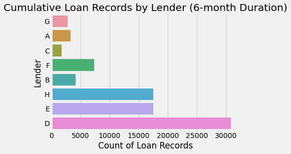
    


```python
df.groupby(['CustomerCode'])['AccountNumber'].nunique()
```


    CustomerCode
    A     654
    B    2289
    C    1758
    D    8372
    E    4876
    F    1630
    G     474
    H    3544
    Name: AccountNumber, dtype: int64


Lender D represents 35% of the dataset
Lender E represents 21% of the dataset
Lender H represents 15% of the dataset
Lender B represents 10% of the dataset
Lender C represents 7% of the dataset
Lender F represents 7% of the dataset
Lender A represents 3% of the dataset
Lender G represents 2% of the dataset


```python
# Visualizing Lending Volume in the 6-month portfolio
df.groupby(['CustomerCode'])['AccountNumber'].nunique().sort_values(ascending = False).plot(kind = 'barh', 
                                                           figsize = (10,5), 
                                                           color = ['green','orange','blue','red','yellow','pink','violet'])
plt.xlabel('Cumulative Loan Accounts by Lender', labelpad = 14)
plt.ylabel('Lender', labelpad = 14)
plt.title('Lender Customer Volume');
```


    
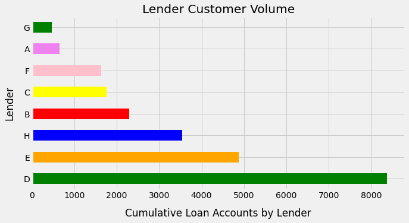
    


### Age Distribution Across the Dataset


```python
df['Age'].describe()
```


    count    85292.000000
    mean        42.777681
    std         12.324956
    min         18.000000
    25%         33.000000
    50%         41.000000
    75%         51.000000
    max         96.000000
    Name: Age, dtype: float64


```python
sns.distplot(df['Age']);
plt.title('Age Distribution Across Soar Lender Porfolio');
```

    /Users/peter/opt/anaconda3/lib/python3.8/site-packages/seaborn/distributions.py:2551: FutureWarning: `distplot` is a deprecated function and will be removed in a future version. Please adapt your code to use either `displot` (a figure-level function with similar flexibility) or `histplot` (an axes-level function for histograms).
      warnings.warn(msg, FutureWarning)


    
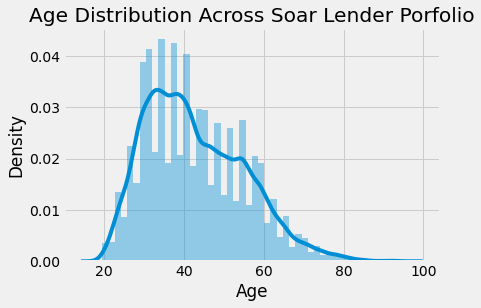
    


```python
sns.boxenplot(x = 'CustomerCode', y = 'Age', data = df, palette = 'rainbow')
plt.xlabel('Lender')
plt.title('Age Distribution by Lender');
```


    
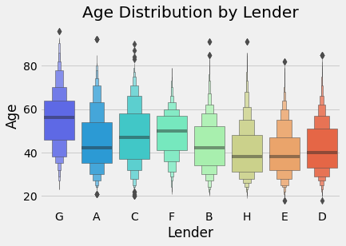
    


<p> The median age across the dataset is 41. From the boxen plot above, it is apparent that Lenders E & H have the youngest consumers while lender G has the oldest consumers with their median age approaching 60. </p>

### Repayment Frequency Trends


```python
df.groupby(['RepaymentFrequency'])['AccountNumber'].nunique()
```


    RepaymentFrequency
    Fortnightly      1374
    Monthly         11683
    Periodically     2821
    Weekly           7746
    Name: AccountNumber, dtype: int64


```python
df.groupby(['RepaymentFrequency'])['AccountNumber'].nunique().sort_values(ascending = False).plot(kind = 'area', 
                                                           figsize = (10,5))
plt.ylabel('Accounts by Repayment Frequency', labelpad = 14)
plt.xlabel('Repayment Frequency', labelpad = 14)
plt.title('Loan Volume by Repayment Period');
```


    
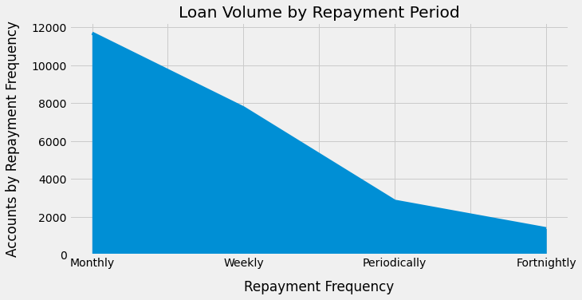
    


49% of the accounts in the dataset are on monthly payments. 
33% of the accounts in the dataset are on weekly payments. 
12% of the accounts in the dataset are on periodic payments. 
6% of the accounts in the dataset are on fortnightly payments. 

According to the experian credit information documentation, periodic payments are custom payment terms that fall out of the other three categories. 


```python
df_repayment = df.groupby(['CustomerCode','RepaymentFrequency'], as_index = False)['AccountNumber'].nunique().reset_index()
plt.figure(figsize = (12,7))
sns.barplot(x = 'CustomerCode', y = 'AccountNumber', data = df_repayment, hue = 'RepaymentFrequency', palette = 'rainbow')
plt.xlabel('Lender')
plt.ylabel('Count of Accounts')
plt.title('Loan Volume by Repayment Period and Lender');
```


    
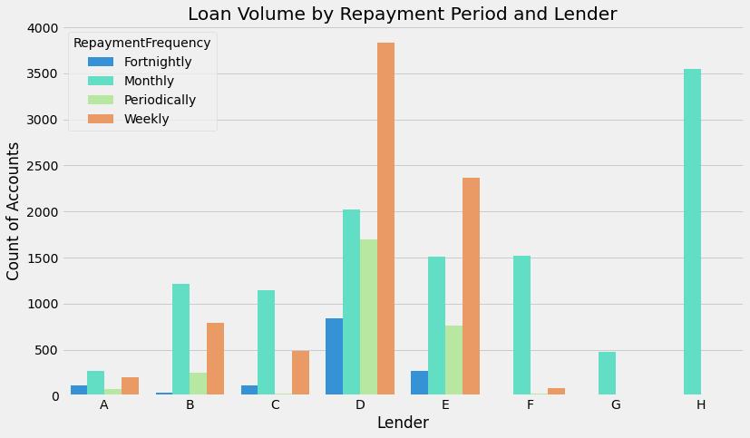
    


The following observations are made on the dataset:

<li> Lender A --> offers all type of repayment periods with monthly and weekly loans being the most common </li>

<li> Lender B --> offers all type of repayment periods with monthly, periodically, and weekly being the most frequent</li>

<li> Lender C -->offers all type of repayment periods with monthly and weekly payment terms being the most frequent </li>

<li> Lender D --> offers all type of repayment periods with weekly, monthly and periodic payment terms being the most frequent </li>

<li>Lender E --> offers all repayment periods with weekly and monthly being the most frequent</li>

<li>Lender F --> predominantly offers monthly repayment terms</li>

<li>Lender G --> Monthly repayment terms only </li>

<li>Lender H --> Monthly repayemnt terms only </li>

<br></br>


### Distinguishing the Account Types in the Lender Portfolio


```python
df.groupby(['AccountType'])['AccountNumber'].nunique().plot(kind = 'barh', figsize = (10,5), color = ['red','green']);
plt.xlabel('Count of Account Types')
plt.ylabel('Account Type')
plt.title('Break-down of Account Types in Portfolio');
```


    
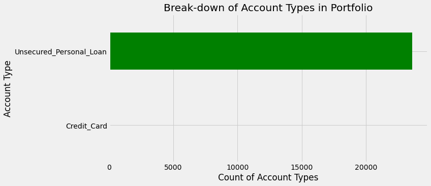
    


There is only one credit card that has been recorded in the transaction period. 

### Exploring the Joint Account Variable Across the Portfolio


```python
plt.figure(figsize = (10,5))
sns.countplot(y = 'JointAccount', data = df);
plt.title('Break-down of Joint Account Types in Portfolio');
plt.xlabel('Account Count')
plt.ylabel('Account Type');
```


    
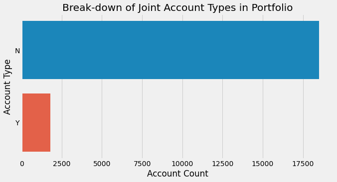
    


```python
plt.figure(figsize = (10,5))
sns.countplot(y = 'JointAccount', data = df, hue = 'CustomerCode');
plt.title('Break-down of Joint Account Types in Portfolio by Lender');
plt.xlabel('Account Count')
plt.ylabel('Account Type');
plt.legend(loc='center left', bbox_to_anchor=(1.0, 0.5));
```


    
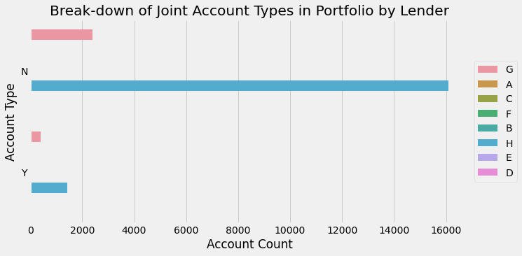
    


Only Lender G and H have a clear indication of whether an account is joint or individual. This could either be a data quality issue (non-submission of this field from other lenders in the portfolio) or could be a distinguishing product feature for Lenders G and H i.e. they offer loans to joint account holders.

<br></br>

### Examining the volume of default occurence in the portfolio


```python
# Getting the volume of accounts across each status on the portfolio

df['CurrentStatus'].value_counts()/df['CurrentStatus'].count() * 100
```


    on_time                58.594006
    dormant                12.230924
    debt_sold_cais          7.823711
    unclassified            5.995873
    reported_default        5.347512
    over_6_payments         5.318201
    two_payments            1.204099
    three_payments          0.943817
    four_payments           0.784364
    third_party_payment     0.599118
    five_payments           0.568635
    six_payments            0.484219
    account_query           0.105520
    Name: CurrentStatus, dtype: float64


<p> The European Banking Authority and Prudential Regulatory Authority definition of default is 90 days (3 months/3 installments) thus default rate could effectively go up to <b>12.63%</b> </p>

<p> However, given that different lenders have varying lending durations for their credit facilities this could also explain the assumed discrepancy in the default rate e.g. a weekly loan that is 6 payment terms overdue will still fall under an acceptable range if the 90 day definition is observed. </p>


```python
# Visualizing the cumulative occurrence of default in the portfolio
explode = (0, 0, 0, 0.1, 0.1, 0.2, 0.3, 0.4, 0.6, 0.7, 0.8,0.9,1)
df['CurrentStatus'].value_counts().plot.pie(figsize=(10, 10),autopct='%1.1f%%', startangle=90, explode = explode);
plt.title('Cumulative Default Status in Portfolio');
plt.legend(loc='center left', bbox_to_anchor=(1.0, 0.5));
```


    
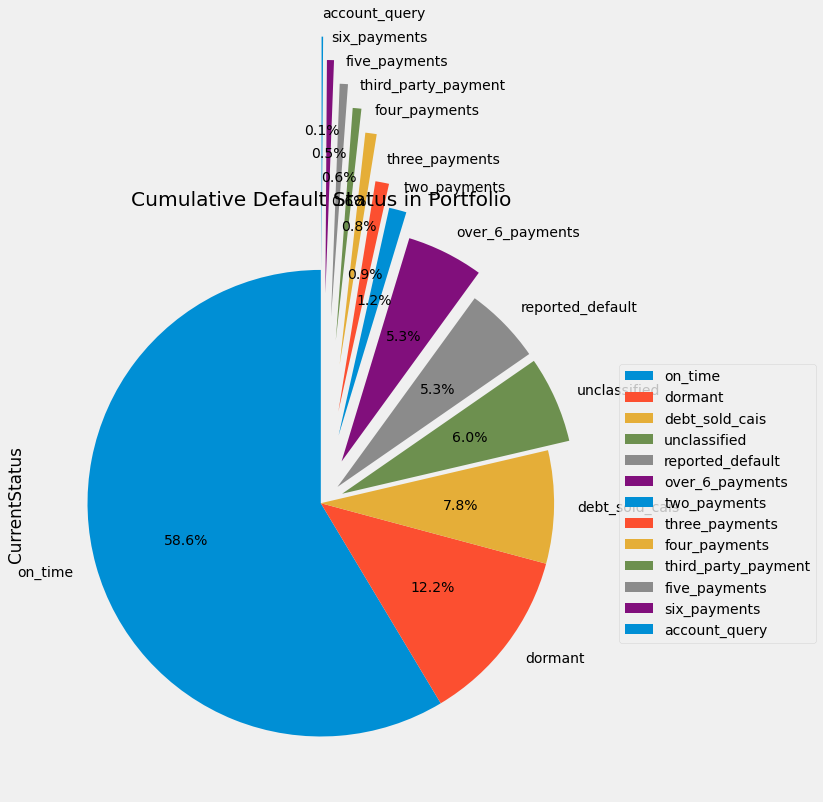
    


The cumulative default rate across the entire portfolio is <b>5.34%</b>. However this could be significantly higher with delayed reporting to the credit information provider by lenders safeguarding their members from negative listing.
<br></br>

### Establishing the cumulative default by Lender

### Repayment Frequency vs Loan Classifcaiton


```python
df_repayment = df.groupby(['RepaymentFrequency','CurrentStatus'], as_index = False).count().reset_index()
```


```python
# Segmenting the repayment dataset by repayment frequency
df_monthly = df_repayment[df_repayment['RepaymentFrequency'] == 'Monthly']
df_weekly = df_repayment[df_repayment['RepaymentFrequency'] == 'Weekly']
df_fortnight = df_repayment[df_repayment['RepaymentFrequency'] == 'Fortnightly']
df_periodic = df_repayment[df_repayment['RepaymentFrequency'] == 'Periodically']
```


```python
plt.figure(figsize = (10,10))
sns.barplot(x = 'id', y = 'RepaymentFrequency', data = df_repayment, palette = 'rainbow', hue = 'CurrentStatus')
plt.ylabel('Repayment Frequency')
plt.xlabel('Account Volume')
plt.title('Account Classification by Repayment Frequency');
```


    
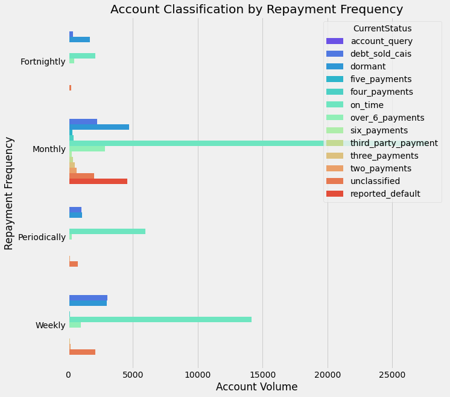
    


The volume of defaulted loans is highest in loans with monthly payment terms. This is followed by weekly, periodic and fortnightly payment terms. 


```python
df.groupby(['RepaymentFrequency'])['RepaymentPeriod'].describe()
```


<div>
<style scoped>
    .dataframe tbody tr th:only-of-type {
        vertical-align: middle;
    }

    .dataframe tbody tr th {
        vertical-align: top;
    }

    .dataframe thead th {
        text-align: right;
    }
</style>
<table border="1" class="dataframe">
  <thead>
    <tr style="text-align: right;">
      <th></th>
      <th>count</th>
      <th>mean</th>
      <th>std</th>
      <th>min</th>
      <th>25%</th>
      <th>50%</th>
      <th>75%</th>
      <th>max</th>
    </tr>
    <tr>
      <th>RepaymentFrequency</th>
      <th></th>
      <th></th>
      <th></th>
      <th></th>
      <th></th>
      <th></th>
      <th></th>
      <th></th>
    </tr>
  </thead>
  <tbody>
    <tr>
      <th>Fortnightly</th>
      <td>5030.0</td>
      <td>19.434195</td>
      <td>17.792644</td>
      <td>1.0</td>
      <td>13.0</td>
      <td>20.0</td>
      <td>23.0</td>
      <td>999.0</td>
    </tr>
    <tr>
      <th>Monthly</th>
      <td>46643.0</td>
      <td>27.701198</td>
      <td>27.054265</td>
      <td>1.0</td>
      <td>14.0</td>
      <td>24.0</td>
      <td>35.0</td>
      <td>999.0</td>
    </tr>
    <tr>
      <th>Periodically</th>
      <td>9544.0</td>
      <td>22.473701</td>
      <td>8.738432</td>
      <td>1.0</td>
      <td>16.0</td>
      <td>23.0</td>
      <td>26.0</td>
      <td>92.0</td>
    </tr>
    <tr>
      <th>Weekly</th>
      <td>24075.0</td>
      <td>22.211423</td>
      <td>21.175799</td>
      <td>1.0</td>
      <td>13.0</td>
      <td>19.0</td>
      <td>23.0</td>
      <td>813.0</td>
    </tr>
  </tbody>
</table>
</div>


```python
plt.figure(figsize = (10, 10))
sns.countplot(y = 'CurrentStatus', data = df, palette = 'rainbow', hue = 'CustomerCode')
plt.ylabel('Account Classification')
plt.xlabel('Account Volume')
plt.title('Account Classification by Lender');
```


    
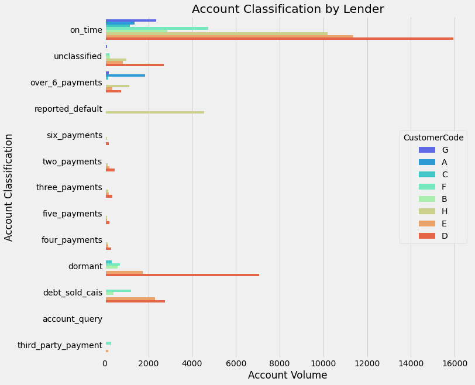
    


```python
# Segmenting the portfolio into the respective lenders
df_A = df[df['CustomerCode'] == 'A']
df_B = df[df['CustomerCode'] == 'B']
df_C = df[df['CustomerCode'] == 'C']
df_D = df[df['CustomerCode'] == 'D']
df_E = df[df['CustomerCode'] == 'E']
df_F = df[df['CustomerCode'] == 'F']
df_G = df[df['CustomerCode'] == 'G']
df_H = df[df['CustomerCode'] == 'H']
```


```python
df_A.groupby('CurrentStatus')['AccountNumber'].nunique().plot(kind = 'barh', figsize = (5,5), color = 'green');
plt.xlabel('Default Volume')
plt.ylabel('Current Status')
plt.title('Lender A Default Break-down');
```


    
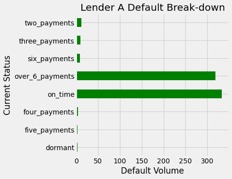
    


```python
df_B.groupby('CurrentStatus')['AccountNumber'].nunique().plot(kind = 'barh', figsize = (5,5), color = 'orange');
plt.xlabel('Default Volume')
plt.ylabel('Current Status')
plt.title('Lender B Default Break-down');
```


    
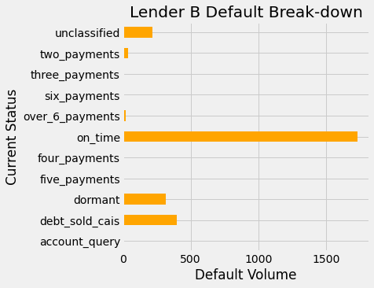
    


```python
df_C.groupby('CurrentStatus')['AccountNumber'].nunique().plot(kind = 'barh', figsize = (5,5), color = 'red');
plt.xlabel('Default Volume')
plt.ylabel('Current Status')
plt.title('Lender C Default Break-down');
```


    
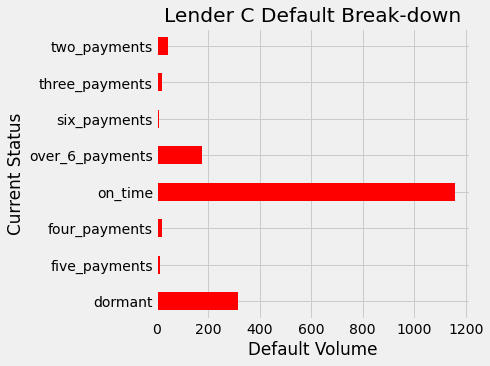
    


```python
df_D.groupby('CurrentStatus')['AccountNumber'].nunique().plot(kind = 'barh', figsize = (5,5), color = 'purple');
plt.xlabel('Default Volume')
plt.ylabel('Current Status')
plt.title('Lender D Default Break-down');
```


    
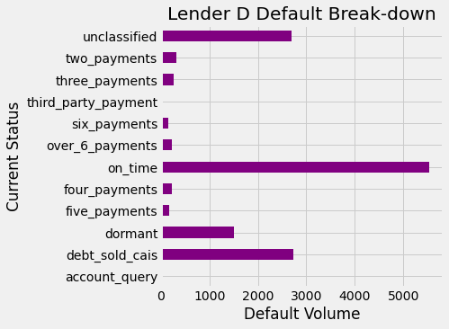
    


```python
df_D.groupby('CurrentStatus')['AccountNumber'].nunique()
```


    CurrentStatus
    account_query            13
    debt_sold_cais         2725
    dormant                1498
    five_payments           174
    four_payments           219
    on_time                5535
    over_6_payments         228
    six_payments            148
    third_party_payment      16
    three_payments          263
    two_payments            310
    unclassified           2695
    Name: AccountNumber, dtype: int64


```python
df_E.groupby('CurrentStatus')['AccountNumber'].nunique().plot(kind = 'barh', figsize = (5,5), color = 'yellow');
plt.xlabel('Default Volume')
plt.ylabel('Current Status')
plt.title('Lender E Default Break-down');
```


    
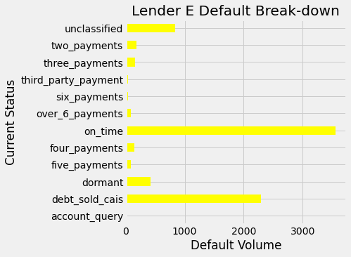
    


Previously it was observed that lender D and E specialized in loans with a weekly repayment frequency. An interesting observation that has been made is the high occurence of debt being resold to CAIS members - 20% and 29% from lender D and E respectively. This is a possible indicator of a secondary market for weekly loans and perceived ease of recovery and collection of such loans. Digging deeper into the weekly loans below reveals 13% are resold to other CAIS members. 


```python
df_weekly.groupby('CurrentStatus').id.sum()
```


    CurrentStatus
    account_query              5
    debt_sold_cais          3013
    dormant                 2976
    five_payments             91
    four_payments            161
    on_time                14171
    over_6_payments          984
    six_payments              84
    third_party_payment      114
    three_payments           163
    two_payments             196
    unclassified            2117
    Name: id, dtype: int64


```python
df_F.groupby('CurrentStatus')['AccountNumber'].nunique().plot(kind = 'barh', figsize = (5,5), color = 'grey');
plt.xlabel('Default Volume')
plt.ylabel('Current Status')
plt.title('Lender F Default Break-down');
```


    
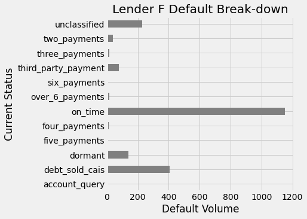
    


```python
df_G.groupby('CurrentStatus')['AccountNumber'].nunique().plot(kind = 'barh', figsize = (5,5), color = 'pink');
plt.xlabel('Default Volume')
plt.ylabel('Current Status')
plt.title('Lender G Default Break-down');
```


    
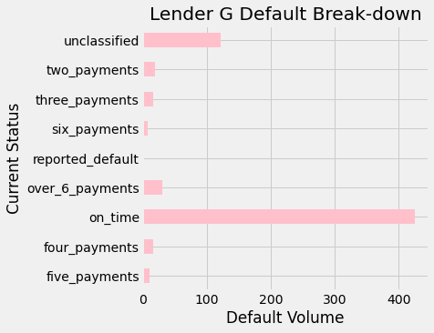
    


```python
df_H.groupby('CurrentStatus')['AccountNumber'].nunique().plot(kind = 'barh', figsize = (5,5), color = 'green');
plt.xlabel('Default Volume')
plt.ylabel('Current Status')
plt.title('Lender H Default Break-down');
```


    
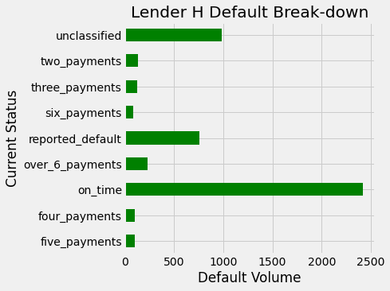
    


Only Lenders G and H appear to be reporting on loan default. The scope of default may need to be extended to have a sufficient data set i.e. From 5 payments overdue and beyond.

### Merging the CAIS File with Postcode Data

To enhance the Soar DataSet we get Postcode Area information from the United Kingdom's Office for National Statistics. 


```python
postcodes = pd.read_csv('postcodes.csv', parse_dates = True)
postcodes.head()
```


<div>
<style scoped>
    .dataframe tbody tr th:only-of-type {
        vertical-align: middle;
    }

    .dataframe tbody tr th {
        vertical-align: top;
    }

    .dataframe thead th {
        text-align: right;
    }
</style>
<table border="1" class="dataframe">
  <thead>
    <tr style="text-align: right;">
      <th></th>
      <th>Postcode area</th>
      <th>Area covered</th>
      <th>Population</th>
      <th>Households</th>
      <th>Postcodes</th>
      <th>Active postcodes</th>
      <th>Non-geographic postcodes</th>
      <th>Latitude</th>
      <th>Longitude</th>
    </tr>
  </thead>
  <tbody>
    <tr>
      <th>0</th>
      <td>AB</td>
      <td>Aberdeen</td>
      <td>499692.0</td>
      <td>218798.0</td>
      <td>38893</td>
      <td>17150</td>
      <td>5</td>
      <td>57.3003</td>
      <td>-2.307320</td>
    </tr>
    <tr>
      <th>1</th>
      <td>AL</td>
      <td>St Albans</td>
      <td>249911.0</td>
      <td>99209.0</td>
      <td>11365</td>
      <td>7788</td>
      <td>0</td>
      <td>51.7756</td>
      <td>-0.283648</td>
    </tr>
    <tr>
      <th>2</th>
      <td>B</td>
      <td>Birmingham</td>
      <td>1904293.0</td>
      <td>750842.0</td>
      <td>61593</td>
      <td>41640</td>
      <td>0</td>
      <td>52.4650</td>
      <td>-1.888620</td>
    </tr>
    <tr>
      <th>3</th>
      <td>BA</td>
      <td>Bath</td>
      <td>434539.0</td>
      <td>183530.0</td>
      <td>20181</td>
      <td>15331</td>
      <td>0</td>
      <td>51.2295</td>
      <td>-2.416710</td>
    </tr>
    <tr>
      <th>4</th>
      <td>BB</td>
      <td>Blackburn</td>
      <td>488564.0</td>
      <td>202015.0</td>
      <td>18937</td>
      <td>13278</td>
      <td>0</td>
      <td>53.7872</td>
      <td>-2.334290</td>
    </tr>
  </tbody>
</table>
</div>


```python
df.head()
```


<div>
<style scoped>
    .dataframe tbody tr th:only-of-type {
        vertical-align: middle;
    }

    .dataframe tbody tr th {
        vertical-align: top;
    }

    .dataframe thead th {
        text-align: right;
    }
</style>
<table border="1" class="dataframe">
  <thead>
    <tr style="text-align: right;">
      <th></th>
      <th>id</th>
      <th>CompanyType</th>
      <th>CustomerCode</th>
      <th>CAISDate</th>
      <th>AccountType</th>
      <th>AccountNumber</th>
      <th>JointAccount</th>
      <th>StartDate</th>
      <th>EndDate</th>
      <th>DefaultDate</th>
      <th>...</th>
      <th>RepaymentValue</th>
      <th>RepaymentPeriod</th>
      <th>RepaymentFrequency</th>
      <th>CurrentStatus</th>
      <th>Postcode</th>
      <th>BirthDate</th>
      <th>Age</th>
      <th>NewAccountNumber</th>
      <th>created_at</th>
      <th>ImportedFileFormat</th>
    </tr>
  </thead>
  <tbody>
    <tr>
      <th>0</th>
      <td>1</td>
      <td>FN</td>
      <td>G</td>
      <td>2020-10-01</td>
      <td>Unsecured_Personal_Loan</td>
      <td>4000005310</td>
      <td>N</td>
      <td>2020-06-22</td>
      <td>0000-00-00</td>
      <td>0000-00-00</td>
      <td>...</td>
      <td>571</td>
      <td>120</td>
      <td>Monthly</td>
      <td>on_time</td>
      <td>SW16 3</td>
      <td>1963</td>
      <td>58</td>
      <td></td>
      <td>2021-06-03 00:14:29</td>
      <td>cais2007</td>
    </tr>
    <tr>
      <th>1</th>
      <td>2</td>
      <td>FN</td>
      <td>G</td>
      <td>2020-10-01</td>
      <td>Unsecured_Personal_Loan</td>
      <td>33000002571</td>
      <td>N</td>
      <td>2017-11-24</td>
      <td>2020-10-01 00:00:00</td>
      <td>0000-00-00</td>
      <td>...</td>
      <td>72</td>
      <td>36</td>
      <td>Monthly</td>
      <td>on_time</td>
      <td>SW9 8</td>
      <td>1961</td>
      <td>60</td>
      <td></td>
      <td>2021-06-03 00:14:29</td>
      <td>cais2007</td>
    </tr>
    <tr>
      <th>2</th>
      <td>3</td>
      <td>FN</td>
      <td>G</td>
      <td>2020-10-01</td>
      <td>Unsecured_Personal_Loan</td>
      <td>38000004182</td>
      <td>N</td>
      <td>2019-11-11</td>
      <td>0000-00-00</td>
      <td>0000-00-00</td>
      <td>...</td>
      <td>151</td>
      <td>300</td>
      <td>Monthly</td>
      <td>on_time</td>
      <td>SE6 2</td>
      <td>1965</td>
      <td>56</td>
      <td></td>
      <td>2021-06-03 00:14:29</td>
      <td>cais2007</td>
    </tr>
    <tr>
      <th>3</th>
      <td>4</td>
      <td>FN</td>
      <td>G</td>
      <td>2020-10-01</td>
      <td>Unsecured_Personal_Loan</td>
      <td>38000004183</td>
      <td>N</td>
      <td>2019-11-11</td>
      <td>0000-00-00</td>
      <td>0000-00-00</td>
      <td>...</td>
      <td>144</td>
      <td>300</td>
      <td>Monthly</td>
      <td>on_time</td>
      <td>SE6 2</td>
      <td>1965</td>
      <td>56</td>
      <td></td>
      <td>2021-06-03 00:14:29</td>
      <td>cais2007</td>
    </tr>
    <tr>
      <th>4</th>
      <td>5</td>
      <td>FN</td>
      <td>G</td>
      <td>2020-10-01</td>
      <td>Unsecured_Personal_Loan</td>
      <td>44000004177</td>
      <td>N</td>
      <td>2019-11-05</td>
      <td>0000-00-00</td>
      <td>0000-00-00</td>
      <td>...</td>
      <td>149</td>
      <td>48</td>
      <td>Monthly</td>
      <td>on_time</td>
      <td>CR2 6</td>
      <td>1955</td>
      <td>66</td>
      <td></td>
      <td>2021-06-03 00:14:29</td>
      <td>cais2007</td>
    </tr>
  </tbody>
</table>
<p>5 rows × 28 columns</p>
</div>


```python
df['Postcode'].nunique()
```


    1893


There are 1,893 unique postcodes in the CAIS dataset. To make the data more qualitative, we can merge the postcodes dataframe with the CAIS dataframe


```python
df[df['Postcode'].isna()].shape
```


    (9, 28)


There are 9 rows in the CAIS dataset where the postal code data has not been filled in. This could either be neligence by the lender or could be a data quality or processing issue. 


```python
# Filling the null values with Unknown
df['Postcode'].fillna('Unknown', inplace = True)
```


```python
# The output below verifies the above replacement of null values
df[df['Postcode'] == 'Unknown']
```


<div>
<style scoped>
    .dataframe tbody tr th:only-of-type {
        vertical-align: middle;
    }

    .dataframe tbody tr th {
        vertical-align: top;
    }

    .dataframe thead th {
        text-align: right;
    }
</style>
<table border="1" class="dataframe">
  <thead>
    <tr style="text-align: right;">
      <th></th>
      <th>id</th>
      <th>CompanyType</th>
      <th>CustomerCode</th>
      <th>CAISDate</th>
      <th>AccountType</th>
      <th>AccountNumber</th>
      <th>JointAccount</th>
      <th>StartDate</th>
      <th>EndDate</th>
      <th>DefaultDate</th>
      <th>...</th>
      <th>RepaymentValue</th>
      <th>RepaymentPeriod</th>
      <th>RepaymentFrequency</th>
      <th>CurrentStatus</th>
      <th>Postcode</th>
      <th>BirthDate</th>
      <th>Age</th>
      <th>NewAccountNumber</th>
      <th>created_at</th>
      <th>ImportedFileFormat</th>
    </tr>
  </thead>
  <tbody>
    <tr>
      <th>949</th>
      <td>950</td>
      <td>FN</td>
      <td>A</td>
      <td>2020-11-01</td>
      <td>Unsecured_Personal_Loan</td>
      <td>FOC001977500001</td>
      <td>NaN</td>
      <td>2018-10-29</td>
      <td>0000-00-00</td>
      <td>0000-00-00</td>
      <td>...</td>
      <td>8</td>
      <td>36</td>
      <td>Weekly</td>
      <td>over_6_payments</td>
      <td>Unknown</td>
      <td>1962</td>
      <td>59</td>
      <td></td>
      <td>2021-06-03 00:14:30</td>
      <td>insights</td>
    </tr>
    <tr>
      <th>1864</th>
      <td>1865</td>
      <td>FN</td>
      <td>A</td>
      <td>2020-12-01</td>
      <td>Unsecured_Personal_Loan</td>
      <td>FOC001977500001</td>
      <td>NaN</td>
      <td>2018-10-29</td>
      <td>0000-00-00</td>
      <td>0000-00-00</td>
      <td>...</td>
      <td>8</td>
      <td>36</td>
      <td>Weekly</td>
      <td>over_6_payments</td>
      <td>Unknown</td>
      <td>1962</td>
      <td>59</td>
      <td></td>
      <td>2021-06-03 00:14:31</td>
      <td>insights</td>
    </tr>
    <tr>
      <th>2765</th>
      <td>2766</td>
      <td>FN</td>
      <td>A</td>
      <td>2021-01-01</td>
      <td>Unsecured_Personal_Loan</td>
      <td>FOC001977500001</td>
      <td>NaN</td>
      <td>2018-10-29</td>
      <td>0000-00-00</td>
      <td>0000-00-00</td>
      <td>...</td>
      <td>8</td>
      <td>36</td>
      <td>Weekly</td>
      <td>over_6_payments</td>
      <td>Unknown</td>
      <td>1962</td>
      <td>59</td>
      <td></td>
      <td>2021-06-03 00:14:31</td>
      <td>insights</td>
    </tr>
    <tr>
      <th>3662</th>
      <td>3663</td>
      <td>FN</td>
      <td>A</td>
      <td>2021-02-01</td>
      <td>Unsecured_Personal_Loan</td>
      <td>FOC001977500001</td>
      <td>NaN</td>
      <td>2018-10-29</td>
      <td>0000-00-00</td>
      <td>0000-00-00</td>
      <td>...</td>
      <td>8</td>
      <td>36</td>
      <td>Weekly</td>
      <td>over_6_payments</td>
      <td>Unknown</td>
      <td>1962</td>
      <td>59</td>
      <td></td>
      <td>2021-06-03 00:14:32</td>
      <td>insights</td>
    </tr>
    <tr>
      <th>4544</th>
      <td>4545</td>
      <td>FN</td>
      <td>A</td>
      <td>2021-03-01</td>
      <td>Unsecured_Personal_Loan</td>
      <td>FOC001977500001</td>
      <td>NaN</td>
      <td>2018-10-29</td>
      <td>0000-00-00</td>
      <td>0000-00-00</td>
      <td>...</td>
      <td>8</td>
      <td>36</td>
      <td>Weekly</td>
      <td>over_6_payments</td>
      <td>Unknown</td>
      <td>1962</td>
      <td>59</td>
      <td></td>
      <td>2021-06-03 00:14:32</td>
      <td>insights</td>
    </tr>
    <tr>
      <th>5421</th>
      <td>5422</td>
      <td>FN</td>
      <td>A</td>
      <td>2021-04-01</td>
      <td>Unsecured_Personal_Loan</td>
      <td>FOC001977500001</td>
      <td>NaN</td>
      <td>2018-10-29</td>
      <td>0000-00-00</td>
      <td>0000-00-00</td>
      <td>...</td>
      <td>8</td>
      <td>36</td>
      <td>Weekly</td>
      <td>over_6_payments</td>
      <td>Unknown</td>
      <td>1962</td>
      <td>59</td>
      <td></td>
      <td>2021-06-03 00:14:33</td>
      <td>insights</td>
    </tr>
    <tr>
      <th>65098</th>
      <td>65099</td>
      <td>FN</td>
      <td>D</td>
      <td>2020-11-01</td>
      <td>Unsecured_Personal_Loan</td>
      <td>25617649841603</td>
      <td>NaN</td>
      <td>2020-03-16</td>
      <td>0000-00-00</td>
      <td>0000-00-00</td>
      <td>...</td>
      <td>56</td>
      <td>22</td>
      <td>Weekly</td>
      <td>on_time</td>
      <td>Unknown</td>
      <td>1994</td>
      <td>27</td>
      <td></td>
      <td>2021-06-03 00:14:58</td>
      <td>insights</td>
    </tr>
    <tr>
      <th>71210</th>
      <td>71211</td>
      <td>FN</td>
      <td>D</td>
      <td>2020-10-01</td>
      <td>Unsecured_Personal_Loan</td>
      <td>25617649841603</td>
      <td>NaN</td>
      <td>2020-03-16</td>
      <td>0000-00-00</td>
      <td>0000-00-00</td>
      <td>...</td>
      <td>56</td>
      <td>22</td>
      <td>Weekly</td>
      <td>on_time</td>
      <td>Unknown</td>
      <td>1994</td>
      <td>27</td>
      <td></td>
      <td>2021-06-03 00:15:00</td>
      <td>insights</td>
    </tr>
    <tr>
      <th>72743</th>
      <td>72744</td>
      <td>FN</td>
      <td>D</td>
      <td>2020-10-01</td>
      <td>Unsecured_Personal_Loan</td>
      <td>17094380120102</td>
      <td>NaN</td>
      <td>2017-02-01</td>
      <td>2018-10-27 00:00:00</td>
      <td>0000-00-00</td>
      <td>...</td>
      <td>25</td>
      <td>30</td>
      <td>Periodically</td>
      <td>debt_sold_cais</td>
      <td>Unknown</td>
      <td>1971</td>
      <td>50</td>
      <td></td>
      <td>2021-06-03 00:15:00</td>
      <td>insights</td>
    </tr>
  </tbody>
</table>
<p>9 rows × 28 columns</p>
</div>


```python
# Removing all the digits associated with the postcode data to remain with the postcode area
df['Postcode'] = df['Postcode'].str.replace('\d+', '')

# Removing the whitespace in the Postcode variable
df['Postcode'] = df['Postcode'].str.strip()
```


```python
# renaming Postcode area to Postcode so the two datasets may be merged
postcodes.rename(columns = {'Postcode area':'Postcode', 'Area covered':'Area'}, inplace = True)
```


```python
postcodes.head()
```


<div>
<style scoped>
    .dataframe tbody tr th:only-of-type {
        vertical-align: middle;
    }

    .dataframe tbody tr th {
        vertical-align: top;
    }

    .dataframe thead th {
        text-align: right;
    }
</style>
<table border="1" class="dataframe">
  <thead>
    <tr style="text-align: right;">
      <th></th>
      <th>Postcode</th>
      <th>Area</th>
      <th>Population</th>
      <th>Households</th>
      <th>Postcodes</th>
      <th>Active postcodes</th>
      <th>Non-geographic postcodes</th>
      <th>Latitude</th>
      <th>Longitude</th>
    </tr>
  </thead>
  <tbody>
    <tr>
      <th>0</th>
      <td>AB</td>
      <td>Aberdeen</td>
      <td>499692.0</td>
      <td>218798.0</td>
      <td>38893</td>
      <td>17150</td>
      <td>5</td>
      <td>57.3003</td>
      <td>-2.307320</td>
    </tr>
    <tr>
      <th>1</th>
      <td>AL</td>
      <td>St Albans</td>
      <td>249911.0</td>
      <td>99209.0</td>
      <td>11365</td>
      <td>7788</td>
      <td>0</td>
      <td>51.7756</td>
      <td>-0.283648</td>
    </tr>
    <tr>
      <th>2</th>
      <td>B</td>
      <td>Birmingham</td>
      <td>1904293.0</td>
      <td>750842.0</td>
      <td>61593</td>
      <td>41640</td>
      <td>0</td>
      <td>52.4650</td>
      <td>-1.888620</td>
    </tr>
    <tr>
      <th>3</th>
      <td>BA</td>
      <td>Bath</td>
      <td>434539.0</td>
      <td>183530.0</td>
      <td>20181</td>
      <td>15331</td>
      <td>0</td>
      <td>51.2295</td>
      <td>-2.416710</td>
    </tr>
    <tr>
      <th>4</th>
      <td>BB</td>
      <td>Blackburn</td>
      <td>488564.0</td>
      <td>202015.0</td>
      <td>18937</td>
      <td>13278</td>
      <td>0</td>
      <td>53.7872</td>
      <td>-2.334290</td>
    </tr>
  </tbody>
</table>
</div>


```python
postcode_list = postcodes['Postcode'].values
postcode_list
```


    array(['AB', 'AL', 'B', 'BA', 'BB', 'BD', 'BF', 'BH', 'BL', 'BN', 'BR',
           'BS', 'BT', 'CA', 'CB', 'CF', 'CH', 'CM', 'CO', 'CR', 'CT', 'CV',
           'CW', 'DA', 'DD', 'DE', 'DG', 'DH', 'DL', 'DN', 'DT', 'DY', 'E',
           'EC', 'EH', 'EN', 'EX', 'FK', 'FY', 'G', 'GL', 'GU', 'HA', 'HD',
           'HG', 'HP', 'HR', 'HS', 'HU', 'HX', 'IG', 'IP', 'IV', 'KA', 'KT',
           'KW', 'KY', 'L', 'LA', 'LD', 'LE', 'LL', 'LN', 'LS', 'LU', 'M',
           'ME', 'MK', 'ML', 'N', 'NE', 'NG', 'NN', 'NP', 'NR', 'NW', 'OL',
           'OX', 'PA', 'PE', 'PH', 'PL', 'PO', 'PR', 'RG', 'RH', 'RM', 'S',
           'SA', 'SE', 'SG', 'SK', 'SL', 'SM', 'SN', 'SO', 'SP', 'SR', 'SS',
           'ST', 'SW', 'SY', 'TA', 'TD', 'TF', 'TN', 'TQ', 'TR', 'TS', 'TW',
           'UB', 'W', 'WA', 'WC', 'WD', 'WF', 'WN', 'WR', 'WS', 'WV', 'YO',
           'ZE'], dtype=object)


```python
# Checking whether all of the input postcodes in the CAIS file are valid
df[df['Postcode'].isin(postcode_list) == False]['Postcode'].value_counts()
```


    MO         53
    CRO        21
    SEO        20
    MI         19
    BRO        17
    SEI        17
    ECY        10
    Unknown     9
    LAI         8
    MQ          8
    MA          7
    NB          6
    SMS         6
    PLB         6
    SWP         6
    UXB         5
    SES         5
    SWV         5
    ECR         5
    BRI         4
    H           3
    SWW         2
    CRI         2
    LOND        1
    Name: Postcode, dtype: int64


As the output above illustrates, there are a number of PostCodes that were incorrectly input. Examining the original dataset, the following substitutions will be made prior to merging the two files: 
<li> SWP, SWV, SWW --> SW </li>
<li> MO, MI, MQ, MA --> M </li>
<li> CRO, CRI --> CR </li>
<li> SEO, SEI, SES --> SE </li>
<li> BRO, BRI --> BR </li>
<li> ECY, ECR --> EC </li>
<li> LAI --> LA </li>
<li> SMS --> SM </li>
<li> NB --> N </li>
<li> PLB --> PL </li>
<li> UXB --> UB </li>
<li> H --> Input_Error </li>
<li> LOND --> Input_Error </li>


```python
# Performing the above replacements on the dataset
df['Postcode'] = df['Postcode'].str.replace('SWP','SW').str.replace('SWV','SW').str.replace('SWW','SW')

df['Postcode'] = df['Postcode'].str.replace('MO','M').str.replace('MI','M').str.replace('MQ','M').str.replace('MA','M')

df['Postcode'] = df['Postcode'].str.replace('CRO','CR').str.replace('CRI','CR')

df['Postcode'] = df['Postcode'].str.replace('SEO','SE').str.replace('SEI','SE').str.replace('SES','SE')

df['Postcode'] = df['Postcode'].str.replace('ECY','EC').str.replace('ECR','EC')

df['Postcode'] = df['Postcode'].str.replace('BRO','BR').str.replace('BRI','BR').str.replace('LAI','LA').str.replace('SMS','SM')

df['Postcode'] = df['Postcode'].str.replace('NB','N').str.replace('PLB','PL').str.replace('UXB','UB')

df['Postcode'] = df['Postcode'].str.replace('LOND', 'Input_Error')

df.Postcode = df.Postcode.replace({"H":"Input_Error"})
```


```python
# Rechecking the results of our substitution, we expect only Unknown and Input_Error as the output
df[df['Postcode'].isin(postcode_list) == False]['Postcode'].value_counts()
```


    Unknown        9
    Input_Error    4
    Name: Postcode, dtype: int64


```python
# creating a new data frame with the requisite data
df2 = postcodes[['Postcode','Area']]
```


```python
# Finally merging the CAIS file with the postcode data
new_df = df.merge(df2, on = 'Postcode', how = 'left')
```


```python
# Assigning the null values with the "Unknown" tag
new_df['Area'].fillna('Unknown', inplace = True)
```

### Analysis of Location Data


```python
new_df.groupby('Area')['AccountNumber'].nunique().sort_values(ascending = False).head(10).plot(kind = 'barh',
                                                                                              figsize = (10,5), 
                                                           color = ['green','orange','blue','red','yellow','pink','violet'])
plt.xlabel('Accounts by Geography', labelpad = 14)
plt.ylabel('Area', labelpad = 14)
plt.title('Top-10 Consumer Locations');
```


    
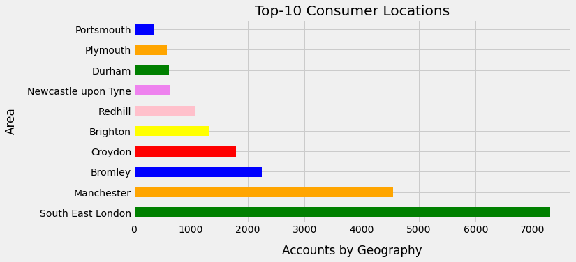
    


```python
# VVisualizing the most frequent geographical accounts by location
explode = (0, 0, 0, 0.1, 0.1, 0.2, 0.3, 0.4, 0.6, 0.7)
new_df['Area'].value_counts().head(10).plot.pie(figsize=(10, 10),autopct='%1.1f%%', startangle=90, explode = explode);
plt.title('Soar Lender Portfolio by Geographic Location');
plt.legend(loc='best');
```


    
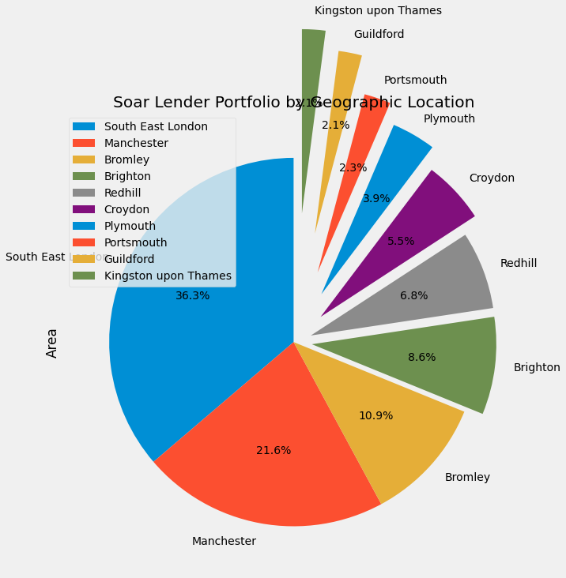
    


```python
# Segmenting the new portfolio into the respective lenders
new_df_A = new_df[new_df['CustomerCode'] == 'A']
new_df_B = new_df[new_df['CustomerCode'] == 'B']
new_df_C = new_df[new_df['CustomerCode'] == 'C']
new_df_D = new_df[new_df['CustomerCode'] == 'D']
new_df_E = new_df[new_df['CustomerCode'] == 'E']
new_df_F = new_df[new_df['CustomerCode'] == 'F']
new_df_G = new_df[new_df['CustomerCode'] == 'G']
new_df_H = new_df[new_df['CustomerCode'] == 'H']
```


```python
new_df_A.groupby('Area')['AccountNumber'].nunique().plot.barh(figsize = (10,10), color = 'green');
plt.title('Lender A - Account Volume by Geography');
```


    
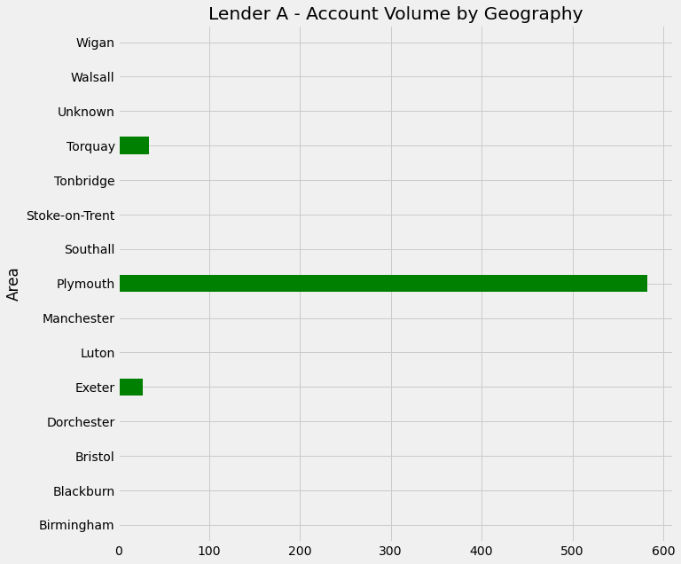
    


Lender A is likely based in Plymouth


```python
new_df_B.groupby('Area')['AccountNumber'].nunique().plot.barh(figsize = (10,10), color = 'orange');
plt.title('Lender B - Account Volume by Geography');
```


    
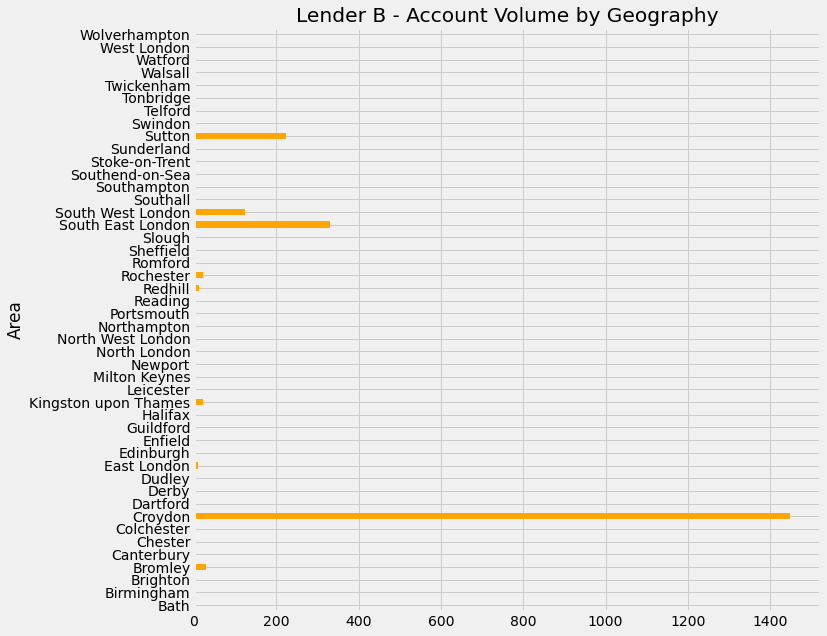
    


Lender B is likely based in Croydon.


```python
new_df_C.groupby('Area')['AccountNumber'].nunique().plot.barh(figsize = (10,10), color = 'red');
plt.title('Lender C - Account Volume by Geography');
```


    
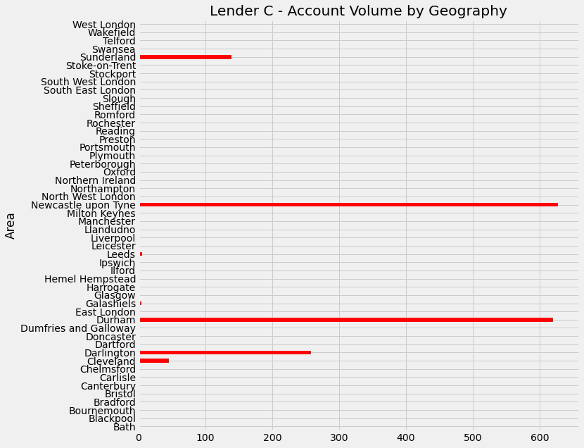
    


Lender C is likely based in NewCastle


```python
new_df_D.groupby('Area')['AccountNumber'].nunique().plot.barh(figsize = (10,12), color = 'purple');
plt.title('Lender D - Account Volume by Geography');
```


    
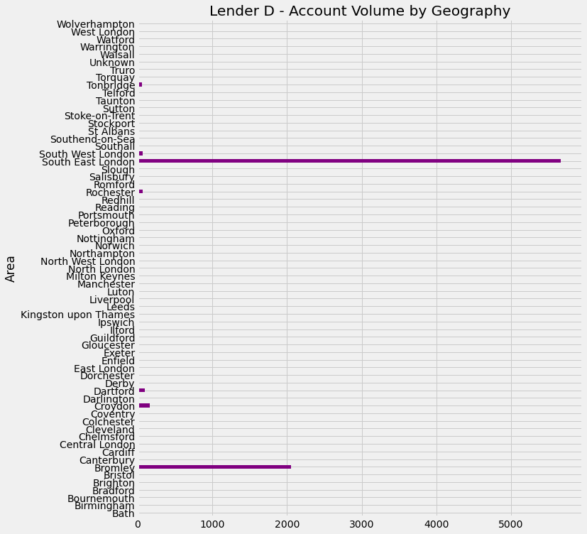
    


Lender D is probably based in London.


```python
new_df_E.groupby('Area')['AccountNumber'].nunique().plot.barh(figsize = (10,10), color = 'yellow');
plt.title('Lender E - Account Volume by Geography');
```


    
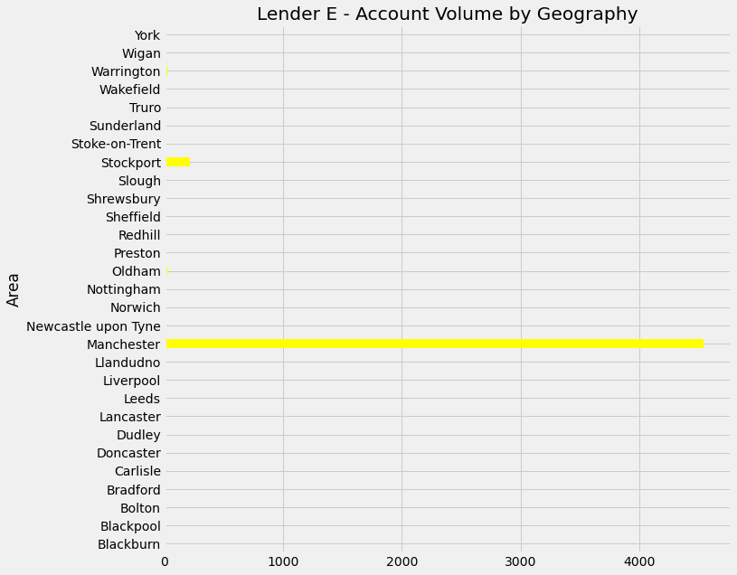
    


Lender E is probably based in Manchester


```python
new_df_F.groupby('Area')['AccountNumber'].nunique().plot.barh(figsize = (10,10), color = 'grey');
plt.title('Lender F - Account Volume by Geography');
```


    
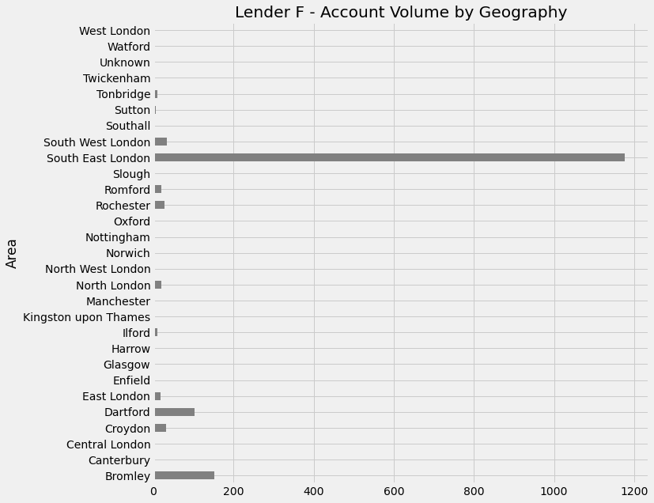
    


Lender F is probably based in London


```python
new_df_G.groupby('Area')['AccountNumber'].nunique().plot.barh(figsize = (10,12), color = 'pink');
plt.title('Lender G - Account Volume by Geography');
```


    
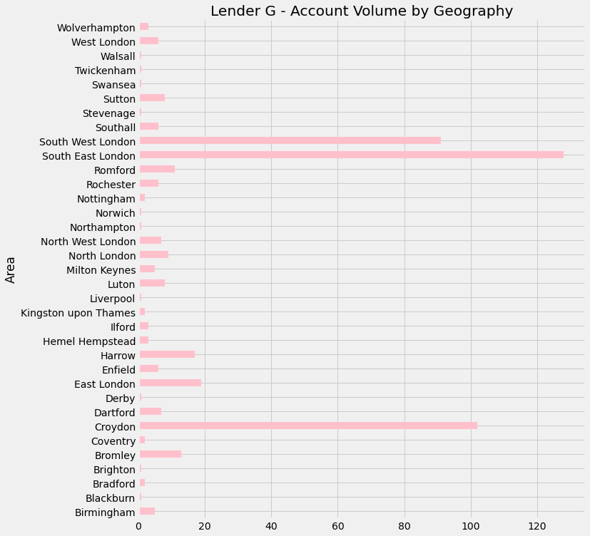
    


Lender G is based in London


```python
new_df_H.groupby('Area')['AccountNumber'].nunique().plot.barh(figsize = (10,12), color = 'blue');
plt.title('Lender H - Account Volume by Geography');
```


    
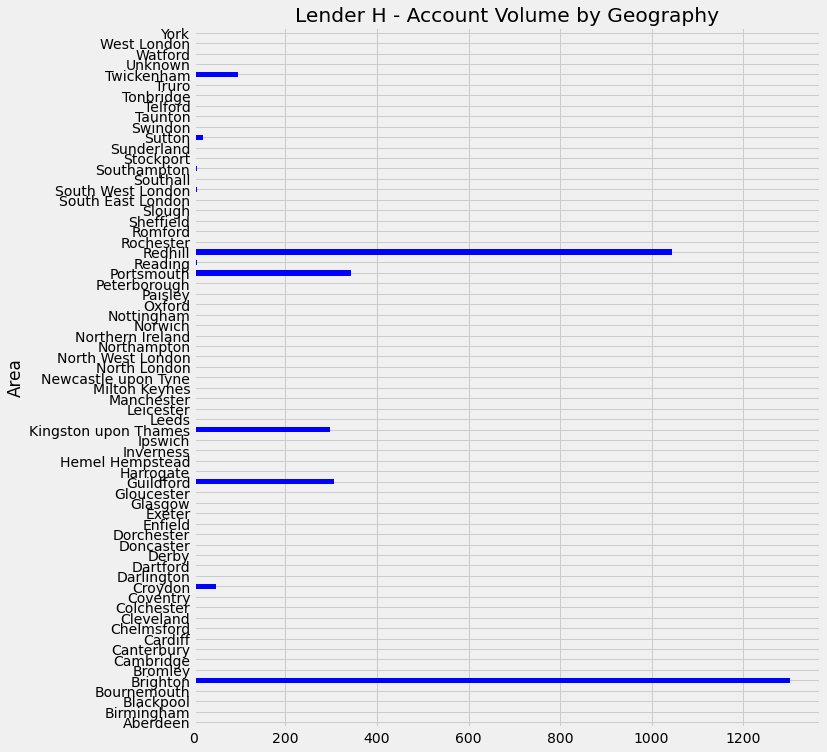
    


Lender H is likely based in Brighton and has the widest reach. 


```python
new_df.groupby('CustomerCode')['Area'].nunique().plot.barh(color = 'red')
plt.xlabel('Lender')
plt.ylabel('Count of Areas Covered')
plt.title('Geographical Areas Coverage by Lender');
```


    
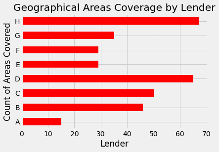
    


Potential Hypothesis to examine at the portfolio level:
<li> Lenders having a larger geographical coverage will have a poorer portfolio quality due to more operational resources being required</li>
<li> Lenders with larger portfolios have poorer portfolio qualities </li>


```python
# Create a new dataframe of the defaulted accounts in the dataset
new_df_Hd = new_df_H[new_df_H['CurrentStatus'] == 'reported_default']
```


```python
new_df_H['CurrentStatus'].value_counts()/new_df_H['CurrentStatus'].count() * 100
```


    on_time             58.180987
    reported_default    26.011197
    over_6_payments      6.375686
    unclassified         5.638711
    three_payments       0.942642
    two_payments         0.856947
    four_payments        0.725548
    five_payments        0.662706
    six_payments         0.605576
    Name: CurrentStatus, dtype: float64


```python
new_df_G['CurrentStatus'].value_counts()/new_df_G['CurrentStatus'].count() * 100
```


    on_time             84.370529
    over_6_payments      6.723891
    unclassified         4.363376
    two_payments         1.287554
    three_payments       0.929900
    four_payments        0.786838
    five_payments        0.679542
    six_payments         0.572246
    reported_default     0.286123
    Name: CurrentStatus, dtype: float64


```python
new_df_F['CurrentStatus'].value_counts()/new_df_F['CurrentStatus'].count() * 100
```


    on_time                64.593822
    debt_sold_cais         16.560076
    dormant                 9.457069
    third_party_payment     3.946115
    unclassified            3.116070
    over_6_payments         0.721187
    two_payments            0.666757
    account_query           0.272146
    three_payments          0.258539
    four_payments           0.176895
    five_payments           0.122466
    six_payments            0.108858
    Name: CurrentStatus, dtype: float64


```python
new_df_E['CurrentStatus'].value_counts()/new_df_E['CurrentStatus'].count() * 100
```


    on_time                64.682427
    debt_sold_cais         13.141555
    dormant                 9.968670
    unclassified            4.790658
    over_6_payments         2.045001
    two_payments            1.315864
    three_payments          1.093705
    four_payments           0.979778
    third_party_payment     0.882939
    five_payments           0.609513
    six_payments            0.336087
    account_query           0.153802
    Name: CurrentStatus, dtype: float64


```python
new_df_D['CurrentStatus'].value_counts()/new_df_D['CurrentStatus'].count() * 100
```


    on_time                51.701893
    dormant                22.896136
    debt_sold_cais          8.921162
    unclassified            8.736385
    over_6_payments         2.460451
    two_payments            1.484699
    three_payments          1.144321
    four_payments           0.982235
    five_payments           0.693724
    six_payments            0.632132
    third_party_payment     0.213952
    account_query           0.132910
    Name: CurrentStatus, dtype: float64


```python
new_df_C['CurrentStatus'].value_counts()/new_df_C['CurrentStatus'].count() * 100
```


    on_time            65.813424
    dormant            17.918089
    over_6_payments     9.954494
    two_payments        2.445961
    four_payments       1.251422
    three_payments      1.251422
    five_payments       0.739477
    six_payments        0.625711
    Name: CurrentStatus, dtype: float64


```python
new_df_B['CurrentStatus'].value_counts()/new_df_B['CurrentStatus'].count() * 100
```


    on_time            68.334131
    dormant            14.145524
    debt_sold_cais      9.502154
    unclassified        5.744375
    two_payments        0.957396
    over_6_payments     0.813787
    three_payments      0.215414
    four_payments       0.095740
    six_payments        0.095740
    account_query       0.047870
    five_payments       0.047870
    Name: CurrentStatus, dtype: float64


```python
new_df_A['CurrentStatus'].value_counts()/new_df_A['CurrentStatus'].count() * 100
```


    over_6_payments    56.053269
    on_time            41.464891
    two_payments        0.605327
    three_payments      0.575061
    dormant             0.544794
    six_payments        0.423729
    four_payments       0.181598
    five_payments       0.151332
    Name: CurrentStatus, dtype: float64


The area coverage hypothesis holds true for the most part with the exception of Lender A that has 56% of its portfolio about to fall into default.

## Analysis of Changes in Default Over Time


```python
new_df.groupby(['CAISDate'])['AccountNumber'].nunique().plot.line(color = 'red');
plt.xlabel('Reporting Period')
plt.ylabel('Number of Accounts Reported')
plt.title('Count of Accounts Reported by Reporting Month');
```


    
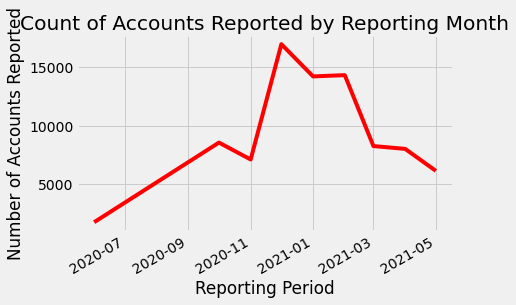
    


```python
# Creating a categorical dataframe so that we can visualize the changes over time:
ct_df = (new_df.reset_index().groupby(['CAISDate','CurrentStatus'], as_index = False).count())
ct_df.drop(columns = ct_df.columns[3:].values)
ct_df.rename(columns = {'CAISDate':'Date','index':'count'}, inplace = True)
```


```python
fig, ax = plt.subplots()

for key, data in ct_df.groupby('CurrentStatus'):
    data.plot(x = 'Date', y = 'count', ax = ax, label = key, figsize = (9,5));
    plt.ylabel('Count of Account Classification')
    plt.title('Account Classification Time Series Analysis');
    plt.legend(loc='center left', bbox_to_anchor=(1.0, 0.5));
```


    
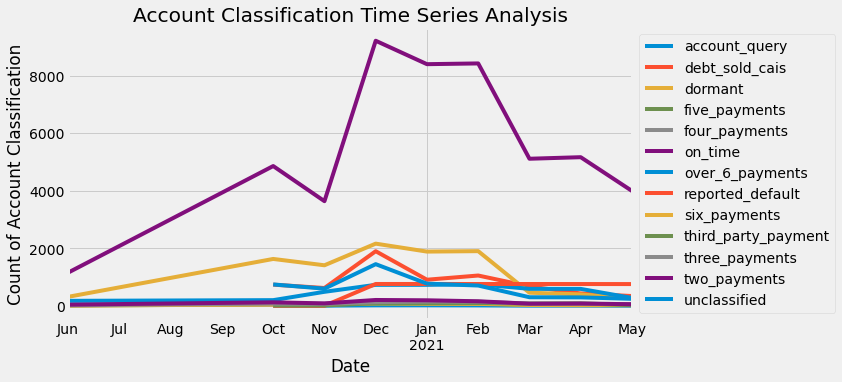
    


```python
# Lender A - Categorical
ct_df_A = (new_df_A.reset_index().groupby(['CAISDate','CurrentStatus'], as_index = False).count())
ct_df_A.drop(columns = ct_df_A.columns[3:].values, inplace = True)
ct_df_A.rename(columns = {'CAISDate':'Date','index':'count'}, inplace = True)

# Lender B - Categorical
ct_df_B = (new_df_B.reset_index().groupby(['CAISDate','CurrentStatus'], as_index = False).count())
ct_df_B.drop(columns = ct_df_B.columns[3:].values, inplace = True)
ct_df_B.rename(columns = {'CAISDate':'Date','index':'count'}, inplace = True)

# Lender C - Categorical
ct_df_C = (new_df_C.reset_index().groupby(['CAISDate','CurrentStatus'], as_index = False).count())
ct_df_C.drop(columns = ct_df_C.columns[3:].values, inplace = True)
ct_df_C.rename(columns = {'CAISDate':'Date','index':'count'}, inplace = True)

# Lender D - Categorical
ct_df_D = (new_df_D.reset_index().groupby(['CAISDate','CurrentStatus'], as_index = False).count())
ct_df_D.drop(columns = ct_df_D.columns[3:].values, inplace = True)
ct_df_D.rename(columns = {'CAISDate':'Date','index':'count'}, inplace = True)

# Lender E - Categorical
ct_df_E = (new_df_E.reset_index().groupby(['CAISDate','CurrentStatus'], as_index = False).count())
ct_df_E.drop(columns = ct_df_E.columns[3:].values, inplace = True)
ct_df_E.rename(columns = {'CAISDate':'Date','index':'count'}, inplace = True)

# Lender F - Categorical
ct_df_F = (new_df_F.reset_index().groupby(['CAISDate','CurrentStatus'], as_index = False).count())
ct_df_F.drop(columns = ct_df_F.columns[3:].values, inplace = True)
ct_df_F.rename(columns = {'CAISDate':'Date','index':'count'}, inplace = True)

# Lender G - Categorical
ct_df_G = (new_df_G.reset_index().groupby(['CAISDate','CurrentStatus'], as_index = False).count())
ct_df_G.drop(columns = ct_df_G.columns[3:].values, inplace = True)
ct_df_G.rename(columns = {'CAISDate':'Date','index':'count'}, inplace = True)

# Lender H - Categorical
ct_df_H = (new_df_H.reset_index().groupby(['CAISDate','CurrentStatus'], as_index = False).count())
ct_df_H.drop(columns = ct_df_H.columns[3:].values, inplace = True)
ct_df_H.rename(columns = {'CAISDate':'Date','index':'count'}, inplace = True)
```


```python
fig, ax = plt.subplots()

for key, data in ct_df_A.groupby('CurrentStatus'):
    data.plot(x = 'Date', y = 'count', ax = ax, label = key, figsize = (9,5));
    plt.ylabel('Count of Account Classification')
    plt.title('Lender A - Account Classification Time Series Analysis');
    plt.legend(loc='center left', bbox_to_anchor=(1.0, 0.5));
```


    
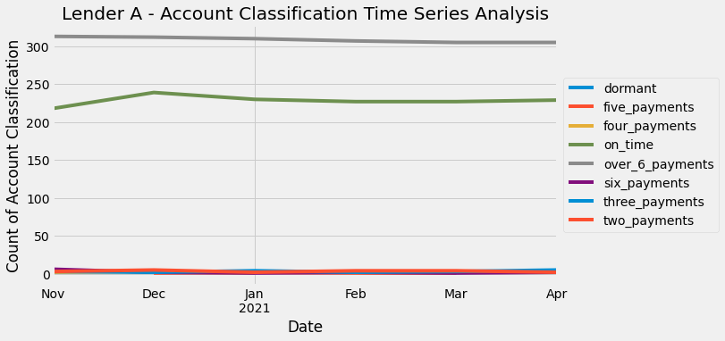
    


```python
fig, ax = plt.subplots()

for key, data in ct_df_B.groupby('CurrentStatus'):
    data.plot(x = 'Date', y = 'count', ax = ax, label = key, figsize = (9,5));
    plt.ylabel('Count of Account Classification')
    plt.title('Lender B - Account Classification Time Series Analysis');
    plt.legend(loc='center left', bbox_to_anchor=(1.0, 0.5));
```


    
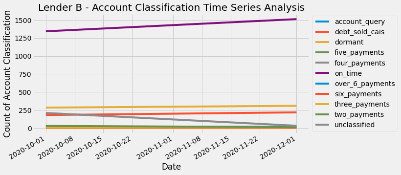
    


```python
fig, ax = plt.subplots()

for key, data in ct_df_C.groupby('CurrentStatus'):
    data.plot(x = 'Date', y = 'count', ax = ax, label = key, figsize = (9,5));
    plt.ylabel('Count of Account Classification')
    plt.title('Lender C - Account Classification Time Series Analysis');
    plt.legend(loc='center left', bbox_to_anchor=(1.0, 0.5));
```


    
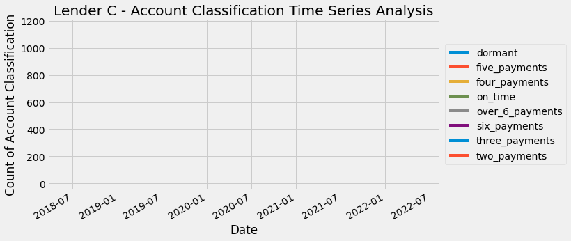
    


Lender C began reporting only in June 2021


```python
fig, ax = plt.subplots()

for key, data in ct_df_D.groupby('CurrentStatus'):
    data.plot(x = 'Date', y = 'count', ax = ax, label = key, figsize = (9,5));
    plt.ylabel('Count of Account Classification')
    plt.title('Lender D - Account Classification Time Series Analysis');
    plt.legend(loc='center left', bbox_to_anchor=(1.0, 0.5));
```


    
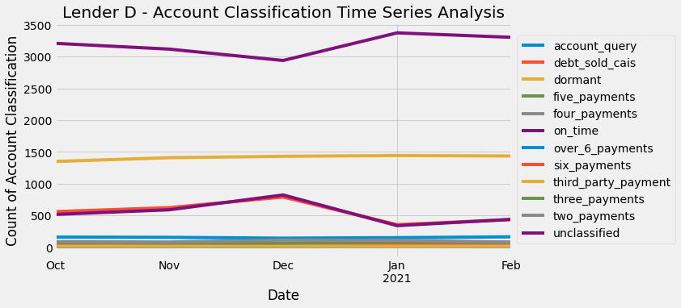
    


```python
fig, ax = plt.subplots()

for key, data in ct_df_E.groupby('CurrentStatus'):
    data.plot(x = 'Date', y = 'count', ax = ax, label = key, figsize = (9,5));
    plt.ylabel('Count of Account Classification')
    plt.title('Lender E - Account Classification Time Series Analysis');
    plt.legend(loc='center left', bbox_to_anchor=(1.0, 0.5));
```


    
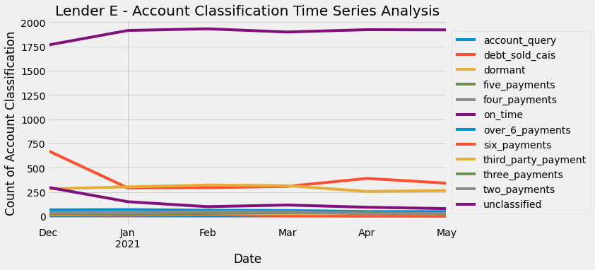
    


```python
fig, ax = plt.subplots()

for key, data in ct_df_F.groupby('CurrentStatus'):
    data.plot(x = 'Date', y = 'count', ax = ax, label = key, figsize = (9,5));
    plt.ylabel('Count of Account Classification')
    plt.title('Lender F - Account Classification Time Series Analysis');
    plt.legend(loc='center left', bbox_to_anchor=(1.0, 0.5));
```


    
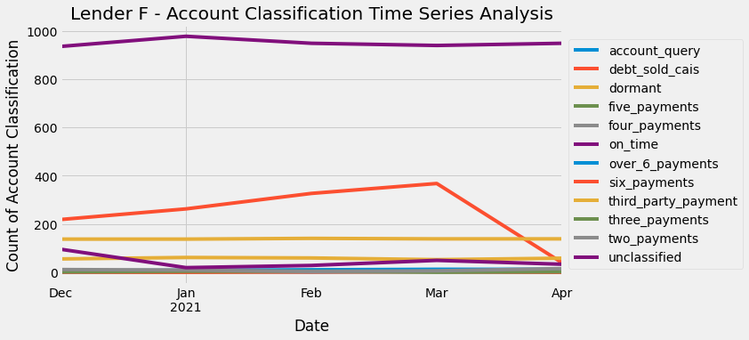
    


```python
fig, ax = plt.subplots()

for key, data in ct_df_G.groupby('CurrentStatus'):
    data.plot(x = 'Date', y = 'count', ax = ax, label = key, figsize = (9,5));
    plt.ylabel('Count of Account Classification')
    plt.title('Lender G - Account Classification Time Series Analysis');
    plt.legend(loc='center left', bbox_to_anchor=(1.0, 0.5));
```


    
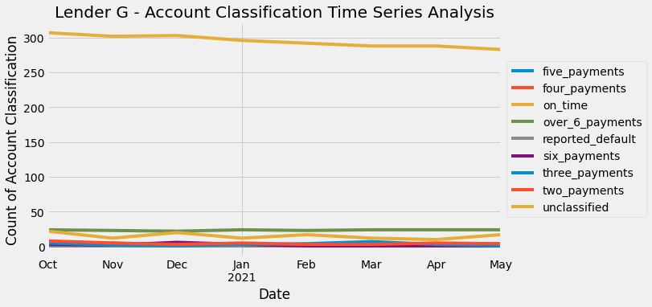
    


```python
fig, ax = plt.subplots()

for key, data in ct_df_H.groupby('CurrentStatus'):
    data.plot(x = 'Date', y = 'count', ax = ax, label = key, figsize = (9,5));
    plt.ylabel('Count of Account Classification')
    plt.title('Lender H - Account Classification Time Series Analysis');
    plt.legend(loc='center left', bbox_to_anchor=(1.0, 0.5));
```


    
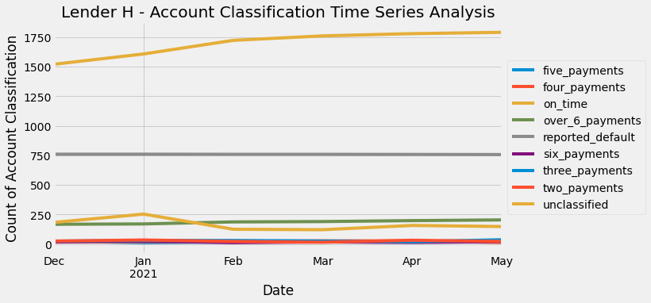
    


```python
new_df.head()
```


<div>
<style scoped>
    .dataframe tbody tr th:only-of-type {
        vertical-align: middle;
    }

    .dataframe tbody tr th {
        vertical-align: top;
    }

    .dataframe thead th {
        text-align: right;
    }
</style>
<table border="1" class="dataframe">
  <thead>
    <tr style="text-align: right;">
      <th></th>
      <th>id</th>
      <th>CompanyType</th>
      <th>CustomerCode</th>
      <th>CAISDate</th>
      <th>AccountType</th>
      <th>AccountNumber</th>
      <th>JointAccount</th>
      <th>StartDate</th>
      <th>EndDate</th>
      <th>DefaultDate</th>
      <th>...</th>
      <th>RepaymentPeriod</th>
      <th>RepaymentFrequency</th>
      <th>CurrentStatus</th>
      <th>Postcode</th>
      <th>BirthDate</th>
      <th>Age</th>
      <th>NewAccountNumber</th>
      <th>created_at</th>
      <th>ImportedFileFormat</th>
      <th>Area</th>
    </tr>
  </thead>
  <tbody>
    <tr>
      <th>0</th>
      <td>1</td>
      <td>FN</td>
      <td>G</td>
      <td>2020-10-01</td>
      <td>Unsecured_Personal_Loan</td>
      <td>4000005310</td>
      <td>N</td>
      <td>2020-06-22</td>
      <td>0000-00-00</td>
      <td>0000-00-00</td>
      <td>...</td>
      <td>120</td>
      <td>Monthly</td>
      <td>on_time</td>
      <td>SW</td>
      <td>1963</td>
      <td>58</td>
      <td></td>
      <td>2021-06-03 00:14:29</td>
      <td>cais2007</td>
      <td>South West London</td>
    </tr>
    <tr>
      <th>1</th>
      <td>2</td>
      <td>FN</td>
      <td>G</td>
      <td>2020-10-01</td>
      <td>Unsecured_Personal_Loan</td>
      <td>33000002571</td>
      <td>N</td>
      <td>2017-11-24</td>
      <td>2020-10-01 00:00:00</td>
      <td>0000-00-00</td>
      <td>...</td>
      <td>36</td>
      <td>Monthly</td>
      <td>on_time</td>
      <td>SW</td>
      <td>1961</td>
      <td>60</td>
      <td></td>
      <td>2021-06-03 00:14:29</td>
      <td>cais2007</td>
      <td>South West London</td>
    </tr>
    <tr>
      <th>2</th>
      <td>3</td>
      <td>FN</td>
      <td>G</td>
      <td>2020-10-01</td>
      <td>Unsecured_Personal_Loan</td>
      <td>38000004182</td>
      <td>N</td>
      <td>2019-11-11</td>
      <td>0000-00-00</td>
      <td>0000-00-00</td>
      <td>...</td>
      <td>300</td>
      <td>Monthly</td>
      <td>on_time</td>
      <td>SE</td>
      <td>1965</td>
      <td>56</td>
      <td></td>
      <td>2021-06-03 00:14:29</td>
      <td>cais2007</td>
      <td>South East London</td>
    </tr>
    <tr>
      <th>3</th>
      <td>4</td>
      <td>FN</td>
      <td>G</td>
      <td>2020-10-01</td>
      <td>Unsecured_Personal_Loan</td>
      <td>38000004183</td>
      <td>N</td>
      <td>2019-11-11</td>
      <td>0000-00-00</td>
      <td>0000-00-00</td>
      <td>...</td>
      <td>300</td>
      <td>Monthly</td>
      <td>on_time</td>
      <td>SE</td>
      <td>1965</td>
      <td>56</td>
      <td></td>
      <td>2021-06-03 00:14:29</td>
      <td>cais2007</td>
      <td>South East London</td>
    </tr>
    <tr>
      <th>4</th>
      <td>5</td>
      <td>FN</td>
      <td>G</td>
      <td>2020-10-01</td>
      <td>Unsecured_Personal_Loan</td>
      <td>44000004177</td>
      <td>N</td>
      <td>2019-11-05</td>
      <td>0000-00-00</td>
      <td>0000-00-00</td>
      <td>...</td>
      <td>48</td>
      <td>Monthly</td>
      <td>on_time</td>
      <td>CR</td>
      <td>1955</td>
      <td>66</td>
      <td></td>
      <td>2021-06-03 00:14:29</td>
      <td>cais2007</td>
      <td>Croydon</td>
    </tr>
  </tbody>
</table>
<p>5 rows × 29 columns</p>
</div>


## Explaining the Trends in Loan Default Across the Dataset


```python
new_df.groupby(['StartDate'])['AccountNumber'].nunique().plot.line(color = 'orange', figsize = (10,10));
plt.xlabel('Loan Origination Date');
plt.title('Loan Disbursement Volume by Year');
```


    
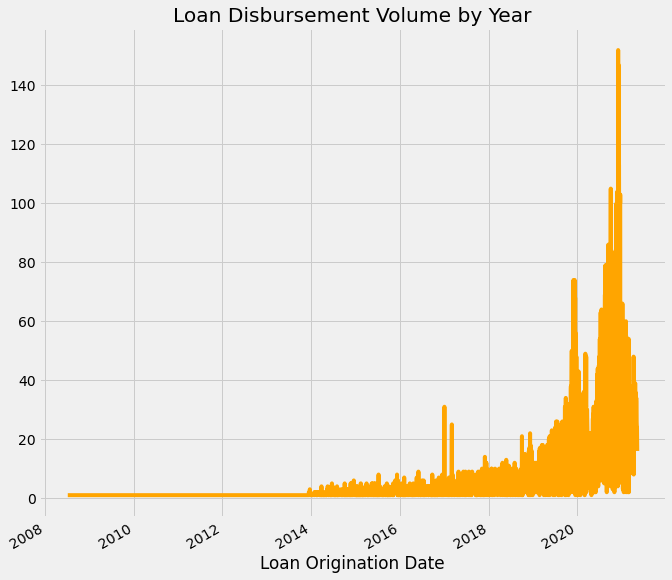
    


```python
# creatng a new dataframe to visualize the volume of loans originated by lender
df_d = new_df.reset_index().groupby(['StartDate','CustomerCode'], as_index = False).count()
df_d.drop(columns = df_d.columns[3:].values, inplace = True)

# visualizing the data
fig, ax = plt.subplots()

for key, data in df_d.groupby('CustomerCode'):
    data.plot(x = 'StartDate', y = 'index', ax = ax, label = key, figsize = (10,10));
    plt.ylabel('Loan Origination Volume')
    plt.xlabel('Loan Origination Date')
    plt.title('Loan Origination Volume by Lender');
    plt.legend(loc='center left', bbox_to_anchor=(1.0, 0.5));
```


    
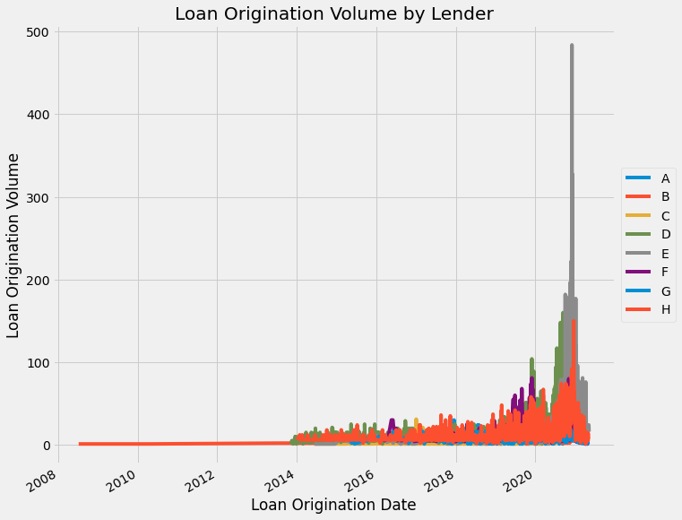
    


```python
# Creating a new dataframe to evaluate the trends of loan origination from 2020 to date
df_d20 = df_d[df_d['StartDate'] >= '2020-01-01']

fig, ax = plt.subplots()

for key, data in df_d20.groupby('CustomerCode'):
    data.plot(x = 'StartDate', y = 'index', ax = ax, label = key, figsize = (10,10));
    plt.ylabel('Loan Origination Volume')
    plt.xlabel('Loan Origination Date')
    plt.title('Loan Origination Volume by Lender (After 2020)');
    plt.legend(loc='center left', bbox_to_anchor=(1.0, 0.5));
```


    
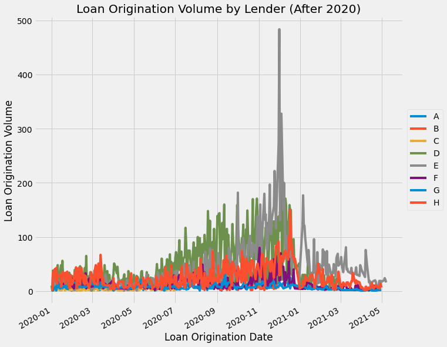
    


<p>The spike in an increase in on-time accounts is explained by increased origination activity.</p>
<p> In May 2020, the Government also announced the immediate release of £65 million dormant assets funding to Fair4all Finance to scale up access to fair, affordable and appropriate financial products/services for those in financial difficulty. </p>


## Consumer Level Analysis

### A. Merging the CAIS FIle Data and the Experian Data


```python
# reading the experian consumer credit check file with details of consumer specific data
experian = pd.read_csv('safe_CR.csv', parse_dates = True)
```

    /Users/peter/opt/anaconda3/lib/python3.8/site-packages/IPython/core/interactiveshell.py:3146: DtypeWarning: Columns (919,920,921,922) have mixed types.Specify dtype option on import or set low_memory=False.
      has_raised = await self.run_ast_nodes(code_ast.body, cell_name,


```python
# exploring the shape of the experian dataset
experian.shape
```


    (1569, 935)


```python
experian_account_list = experian['provider.reference'].values
```


```python
# checking for matches between account number on the CAIS File and provider.reference from the experian file
new_df[new_df['AccountNumber'].isin(experian_account_list) == True]
```


<div>
<style scoped>
    .dataframe tbody tr th:only-of-type {
        vertical-align: middle;
    }

    .dataframe tbody tr th {
        vertical-align: top;
    }

    .dataframe thead th {
        text-align: right;
    }
</style>
<table border="1" class="dataframe">
  <thead>
    <tr style="text-align: right;">
      <th></th>
      <th>id</th>
      <th>CompanyType</th>
      <th>CustomerCode</th>
      <th>CAISDate</th>
      <th>AccountType</th>
      <th>AccountNumber</th>
      <th>JointAccount</th>
      <th>StartDate</th>
      <th>EndDate</th>
      <th>DefaultDate</th>
      <th>...</th>
      <th>RepaymentPeriod</th>
      <th>RepaymentFrequency</th>
      <th>CurrentStatus</th>
      <th>Postcode</th>
      <th>BirthDate</th>
      <th>Age</th>
      <th>NewAccountNumber</th>
      <th>created_at</th>
      <th>ImportedFileFormat</th>
      <th>Area</th>
    </tr>
  </thead>
  <tbody>
  </tbody>
</table>
<p>0 rows × 29 columns</p>
</div>


<b> There are no matches with the experian dataset </b>


```python
# Acquiring a new dataset with matched instances and loading this data to Jupyter Notebooks;
df_m = pd.read_excel('matching_reports.xlsx')
df_m.head()
```


<div>
<style scoped>
    .dataframe tbody tr th:only-of-type {
        vertical-align: middle;
    }

    .dataframe tbody tr th {
        vertical-align: top;
    }

    .dataframe thead th {
        text-align: right;
    }
</style>
<table border="1" class="dataframe">
  <thead>
    <tr style="text-align: right;">
      <th></th>
      <th>Credit Checks</th>
      <th>match_CustomerCode</th>
    </tr>
  </thead>
  <tbody>
    <tr>
      <th>0</th>
      <td>FA00000000084989</td>
      <td>NaN</td>
    </tr>
    <tr>
      <th>1</th>
      <td>FA00000000070814</td>
      <td>NaN</td>
    </tr>
    <tr>
      <th>2</th>
      <td>FA00000000219384</td>
      <td>NaN</td>
    </tr>
    <tr>
      <th>3</th>
      <td>FA00000000207138</td>
      <td>NaN</td>
    </tr>
    <tr>
      <th>4</th>
      <td>FA00000000152172</td>
      <td>NaN</td>
    </tr>
  </tbody>
</table>
</div>


```python
# dropping all the unmatched records - This should leave only the matched records
df_m.dropna(inplace = True)
```


```python
df_m.describe()
```


<div>
<style scoped>
    .dataframe tbody tr th:only-of-type {
        vertical-align: middle;
    }

    .dataframe tbody tr th {
        vertical-align: top;
    }

    .dataframe thead th {
        text-align: right;
    }
</style>
<table border="1" class="dataframe">
  <thead>
    <tr style="text-align: right;">
      <th></th>
      <th>Credit Checks</th>
      <th>match_CustomerCode</th>
    </tr>
  </thead>
  <tbody>
    <tr>
      <th>count</th>
      <td>474</td>
      <td>474</td>
    </tr>
    <tr>
      <th>unique</th>
      <td>474</td>
      <td>460</td>
    </tr>
    <tr>
      <th>top</th>
      <td>FA00000000029292</td>
      <td>FOC002204800005</td>
    </tr>
    <tr>
      <th>freq</th>
      <td>1</td>
      <td>2</td>
    </tr>
  </tbody>
</table>
</div>


<p> There are 474 accounts that have a consumer profile from the Experian Credit Check. We can thus develop some foundational insight and a rudimentary machine learning model that could help Soar's consumers profile their own custoemrs based on historical performance within their respective portfolios and across the industry. </p>


```python
# dropping unneccessary columns in our analysis
experian.drop(columns = ['Unnamed: 0','Unnamed: 0.1','__v'], inplace = True)
```


```python
# renaming the columns appropriately for merging
df_m.rename(columns = {'match_CustomerCode':'AccountNumber', 'Credit Checks':'provider.reference'}, inplace = True)
```


```python
# merging our CAIS File with our matched account numbers and provider reference to create a new dataframe
new_df2 = new_df.merge(df_m, on = 'AccountNumber', how = 'right')
new_df2.head()
```


<div>
<style scoped>
    .dataframe tbody tr th:only-of-type {
        vertical-align: middle;
    }

    .dataframe tbody tr th {
        vertical-align: top;
    }

    .dataframe thead th {
        text-align: right;
    }
</style>
<table border="1" class="dataframe">
  <thead>
    <tr style="text-align: right;">
      <th></th>
      <th>id</th>
      <th>CompanyType</th>
      <th>CustomerCode</th>
      <th>CAISDate</th>
      <th>AccountType</th>
      <th>AccountNumber</th>
      <th>JointAccount</th>
      <th>StartDate</th>
      <th>EndDate</th>
      <th>DefaultDate</th>
      <th>...</th>
      <th>RepaymentFrequency</th>
      <th>CurrentStatus</th>
      <th>Postcode</th>
      <th>BirthDate</th>
      <th>Age</th>
      <th>NewAccountNumber</th>
      <th>created_at</th>
      <th>ImportedFileFormat</th>
      <th>Area</th>
      <th>provider.reference</th>
    </tr>
  </thead>
  <tbody>
    <tr>
      <th>0</th>
      <td>2163</td>
      <td>FN</td>
      <td>A</td>
      <td>2020-12-01</td>
      <td>Unsecured_Personal_Loan</td>
      <td>FOC002386400001</td>
      <td>NaN</td>
      <td>2020-12-15</td>
      <td>0000-00-00</td>
      <td>0000-00-00</td>
      <td>...</td>
      <td>Periodically</td>
      <td>on_time</td>
      <td>PL</td>
      <td>1943</td>
      <td>78</td>
      <td></td>
      <td>2021-06-03 00:14:31</td>
      <td>insights</td>
      <td>Plymouth</td>
      <td>FA00000000074650</td>
    </tr>
    <tr>
      <th>1</th>
      <td>3064</td>
      <td>FN</td>
      <td>A</td>
      <td>2021-01-01</td>
      <td>Unsecured_Personal_Loan</td>
      <td>FOC002386400001</td>
      <td>NaN</td>
      <td>2020-12-15</td>
      <td>0000-00-00</td>
      <td>0000-00-00</td>
      <td>...</td>
      <td>Periodically</td>
      <td>on_time</td>
      <td>PL</td>
      <td>1943</td>
      <td>78</td>
      <td></td>
      <td>2021-06-03 00:14:31</td>
      <td>insights</td>
      <td>Plymouth</td>
      <td>FA00000000074650</td>
    </tr>
    <tr>
      <th>2</th>
      <td>3957</td>
      <td>FN</td>
      <td>A</td>
      <td>2021-02-01</td>
      <td>Unsecured_Personal_Loan</td>
      <td>FOC002386400001</td>
      <td>NaN</td>
      <td>2020-12-15</td>
      <td>0000-00-00</td>
      <td>0000-00-00</td>
      <td>...</td>
      <td>Periodically</td>
      <td>on_time</td>
      <td>PL</td>
      <td>1943</td>
      <td>78</td>
      <td></td>
      <td>2021-06-03 00:14:32</td>
      <td>insights</td>
      <td>Plymouth</td>
      <td>FA00000000074650</td>
    </tr>
    <tr>
      <th>3</th>
      <td>4838</td>
      <td>FN</td>
      <td>A</td>
      <td>2021-03-01</td>
      <td>Unsecured_Personal_Loan</td>
      <td>FOC002386400001</td>
      <td>NaN</td>
      <td>2020-12-15</td>
      <td>0000-00-00</td>
      <td>0000-00-00</td>
      <td>...</td>
      <td>Periodically</td>
      <td>on_time</td>
      <td>PL</td>
      <td>1943</td>
      <td>78</td>
      <td></td>
      <td>2021-06-03 00:14:32</td>
      <td>insights</td>
      <td>Plymouth</td>
      <td>FA00000000074650</td>
    </tr>
    <tr>
      <th>4</th>
      <td>5719</td>
      <td>FN</td>
      <td>A</td>
      <td>2021-04-01</td>
      <td>Unsecured_Personal_Loan</td>
      <td>FOC002386400001</td>
      <td>NaN</td>
      <td>2020-12-15</td>
      <td>2021-04-30 00:00:00</td>
      <td>0000-00-00</td>
      <td>...</td>
      <td>Periodically</td>
      <td>on_time</td>
      <td>PL</td>
      <td>1943</td>
      <td>78</td>
      <td></td>
      <td>2021-06-03 00:14:33</td>
      <td>insights</td>
      <td>Plymouth</td>
      <td>FA00000000074650</td>
    </tr>
  </tbody>
</table>
<p>5 rows × 30 columns</p>
</div>


Now that the provider.reference variable has been added to the CAIS file dataset, we can acquire some additional consumer level information to help in building a predictive machine learning model.


```python
# The experian column has 1569 columns, we need to reduce this to the relevant data that we need
data_columns = ['applicant.title','changeInCircumstances.incomeReductionExpected','decisionRequested',
           'decisionType','employmentStatus','grossAnnualIncome', 'netMonthlyIncome','product.purpose','product.representativeAPR',
          'product.totalBorrowed','product.totalRepayable','progress.currentStatus','provider.decision',
          'provider.decisionCodes','provider.reference']

# creating a new experian dataset with only the list of selected columns above
new_experian = experian.filter(data_columns)
```


```python
# Finally we create a dataframe with the selected variables from the experian data frame
consumer_df = new_df2.merge(new_experian, on = 'provider.reference', how = 'left')
```

### B. Exploratory Data Analysis


```python
# Getting the shape of the new data frame
consumer_df.shape
```


    (1373, 44)


```python
new_df['AccountNumber'].nunique()
```


    23590


The dataset has 1373 rows and 44 columns. <p><i><b>NB:</b> It is important to remember that the data is only representative of 474 customers in the overall dataset which represents 2% of the original CAIS File accounts thus the output of any machine learning model at this point in time may not produce generalised (unbiased) results across a larger dataset.</i></p> 

<p> Nonetheless, the objective of this analysis will be to provide a foundational basis for Soar to begin offering default prediction as a value-add to its consumers in the future once the data quality issues evident in the industry have been overcome. </p>


```python
consumer_df.isnull().sum()
```


    id                                                 0
    CompanyType                                        0
    CustomerCode                                       0
    CAISDate                                           0
    AccountType                                        0
    AccountNumber                                      0
    JointAccount                                     967
    StartDate                                          0
    EndDate                                            0
    DefaultDate                                        0
    CreditLimit                                        0
    Flags                                              0
    TransientAssociation                               0
    SpecialIndicator                                   0
    CurrentBalance                                     0
    CurrentBalanceSign                                 0
    DefaultBalance                                     0
    StartBalance                                       0
    RepaymentValue                                     0
    RepaymentPeriod                                    0
    RepaymentFrequency                                 0
    CurrentStatus                                      0
    Postcode                                           0
    BirthDate                                          0
    Age                                                0
    NewAccountNumber                                   0
    created_at                                         0
    ImportedFileFormat                                 0
    Area                                               0
    provider.reference                                 0
    applicant.title                                    0
    changeInCircumstances.incomeReductionExpected      0
    decisionRequested                                  0
    decisionType                                       0
    employmentStatus                                   0
    grossAnnualIncome                                  0
    netMonthlyIncome                                   0
    product.purpose                                    0
    product.representativeAPR                        108
    product.totalBorrowed                              0
    product.totalRepayable                             0
    progress.currentStatus                             0
    provider.decision                                  0
    provider.decisionCodes                             7
    dtype: int64


```python
df_provider = consumer_df.groupby(['provider.decision', 'decisionType'])['AccountNumber'].nunique().reset_index()
sns.barplot(y = 'provider.decision', x = 'AccountNumber', data = df_provider, palette = 'rainbow', hue = 'decisionType')
plt.ylabel('Provider Decision')
plt.xlabel('Account Volume')
plt.title('Provider Decision Count Across Consumer Portfolio');
```


    
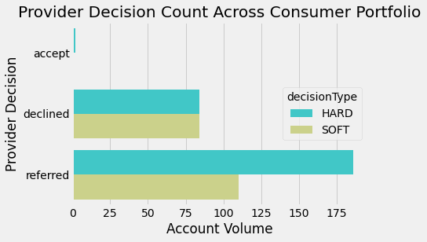
    


```python
# Creating a list with the name of the new quantitative variables in the dataset
num_list = ['grossAnnualIncome','netMonthlyIncome','product.totalBorrowed','product.totalRepayable']

# Getting a description of these variables
consumer_df[num_list].describe()
```


<div>
<style scoped>
    .dataframe tbody tr th:only-of-type {
        vertical-align: middle;
    }

    .dataframe tbody tr th {
        vertical-align: top;
    }

    .dataframe thead th {
        text-align: right;
    }
</style>
<table border="1" class="dataframe">
  <thead>
    <tr style="text-align: right;">
      <th></th>
      <th>grossAnnualIncome</th>
      <th>netMonthlyIncome</th>
      <th>product.totalBorrowed</th>
      <th>product.totalRepayable</th>
    </tr>
  </thead>
  <tbody>
    <tr>
      <th>count</th>
      <td>1.373000e+03</td>
      <td>1373.000000</td>
      <td>1.373000e+03</td>
      <td>1.373000e+03</td>
    </tr>
    <tr>
      <th>mean</th>
      <td>2.402400e+06</td>
      <td>191849.672251</td>
      <td>4.897060e+05</td>
      <td>7.455224e+05</td>
    </tr>
    <tr>
      <th>std</th>
      <td>1.128949e+06</td>
      <td>87301.150111</td>
      <td>1.720103e+06</td>
      <td>2.626033e+06</td>
    </tr>
    <tr>
      <th>min</th>
      <td>1.916000e+05</td>
      <td>2500.000000</td>
      <td>2.000000e+04</td>
      <td>2.280000e+04</td>
    </tr>
    <tr>
      <th>25%</th>
      <td>1.680000e+06</td>
      <td>135700.000000</td>
      <td>8.000000e+04</td>
      <td>9.430000e+04</td>
    </tr>
    <tr>
      <th>50%</th>
      <td>2.200000e+06</td>
      <td>177200.000000</td>
      <td>1.200000e+05</td>
      <td>1.628000e+05</td>
    </tr>
    <tr>
      <th>75%</th>
      <td>2.800000e+06</td>
      <td>229200.000000</td>
      <td>3.000000e+05</td>
      <td>4.050000e+05</td>
    </tr>
    <tr>
      <th>max</th>
      <td>8.712000e+06</td>
      <td>600000.000000</td>
      <td>1.625170e+07</td>
      <td>2.187720e+07</td>
    </tr>
  </tbody>
</table>
</div>


<p> Examining the descriptive statistics of the additional quantitative variables in the dataset reveals some pertinent data quality issues.  </p>

<p> An assumption is made that there is a two decimal rounding error and thus each of the numerical variables shall be divided by 100. </p>


```python
# Create a function that converts the pence to pounds i.e. divides by 100
def pence_to_pound(x):
    return x/100
```


```python
# Applying the pence_to_pound function above and substituting this into our original dataset --> Run only once
consumer_df[num_list] = consumer_df[num_list].apply(pence_to_pound)
```


```python
consumer_df[num_list].describe()
```


<div>
<style scoped>
    .dataframe tbody tr th:only-of-type {
        vertical-align: middle;
    }

    .dataframe tbody tr th {
        vertical-align: top;
    }

    .dataframe thead th {
        text-align: right;
    }
</style>
<table border="1" class="dataframe">
  <thead>
    <tr style="text-align: right;">
      <th></th>
      <th>grossAnnualIncome</th>
      <th>netMonthlyIncome</th>
      <th>product.totalBorrowed</th>
      <th>product.totalRepayable</th>
    </tr>
  </thead>
  <tbody>
    <tr>
      <th>count</th>
      <td>1373.000000</td>
      <td>1373.000000</td>
      <td>1373.000000</td>
      <td>1373.000000</td>
    </tr>
    <tr>
      <th>mean</th>
      <td>24024.003642</td>
      <td>1918.496723</td>
      <td>4897.059723</td>
      <td>7455.224326</td>
    </tr>
    <tr>
      <th>std</th>
      <td>11289.487053</td>
      <td>873.011501</td>
      <td>17201.026608</td>
      <td>26260.325005</td>
    </tr>
    <tr>
      <th>min</th>
      <td>1916.000000</td>
      <td>25.000000</td>
      <td>200.000000</td>
      <td>228.000000</td>
    </tr>
    <tr>
      <th>25%</th>
      <td>16800.000000</td>
      <td>1357.000000</td>
      <td>800.000000</td>
      <td>943.000000</td>
    </tr>
    <tr>
      <th>50%</th>
      <td>22000.000000</td>
      <td>1772.000000</td>
      <td>1200.000000</td>
      <td>1628.000000</td>
    </tr>
    <tr>
      <th>75%</th>
      <td>28000.000000</td>
      <td>2292.000000</td>
      <td>3000.000000</td>
      <td>4050.000000</td>
    </tr>
    <tr>
      <th>max</th>
      <td>87120.000000</td>
      <td>6000.000000</td>
      <td>162517.000000</td>
      <td>218772.000000</td>
    </tr>
  </tbody>
</table>
</div>


```python
consumer_df['product.representativeAPR'].describe()
```


    count    1191.000000
    mean       25.123711
    std        12.230191
    min         3.000000
    25%        18.500000
    50%        19.600000
    75%        42.580000
    max        43.190000
    Name: product.representativeAPR, dtype: float64


```python
fig, ax = plt.subplots(3, 2, figsize=(20,15))

sns.distplot(consumer_df['grossAnnualIncome'], ax=ax[0,0], color="#F7522F")
ax[0,0].set_title("Consumer Gross Annual Income Distribution", fontsize=14)
ax[0,0].set_xlabel("Gross Annual Income", fontsize = 10)

sns.distplot(consumer_df['netMonthlyIncome'], ax=ax[0,1], color="#2F8FF7")
ax[0,1].set_title("Consumer Net Monthly Income Distribution", fontsize=14)
ax[0,1].set_xlabel("Net Monthly Income", fontsize = 10)

sns.distplot(consumer_df['product.totalBorrowed'], ax=ax[1,0], color="#2EAD46")
ax[1,0].set_title("Consumer Total Borrowings Distibution", fontsize = 14)
ax[1,0].set_xlabel("Total Consumer Borrowings", fontsize = 10)

sns.distplot(consumer_df['product.totalRepayable'], ax=ax[1,1], color="#F7522F")
ax[1,1].set_title("Consumer Total Repayable Distribution", fontsize=14)
ax[1,1].set_xlabel("Total Repayable", fontsize = 10);

sns.distplot(consumer_df['product.representativeAPR'],ax=ax[2,0], color="#2F8FF7");
ax[2,0].set_title("Interest Rate Distribution", fontsize=14)
ax[2,0].set_xlabel(" Representative APR", fontsize = 10);
```

    /Users/peter/opt/anaconda3/lib/python3.8/site-packages/seaborn/distributions.py:2551: FutureWarning: `distplot` is a deprecated function and will be removed in a future version. Please adapt your code to use either `displot` (a figure-level function with similar flexibility) or `histplot` (an axes-level function for histograms).
      warnings.warn(msg, FutureWarning)
    /Users/peter/opt/anaconda3/lib/python3.8/site-packages/seaborn/distributions.py:2551: FutureWarning: `distplot` is a deprecated function and will be removed in a future version. Please adapt your code to use either `displot` (a figure-level function with similar flexibility) or `histplot` (an axes-level function for histograms).
      warnings.warn(msg, FutureWarning)
    /Users/peter/opt/anaconda3/lib/python3.8/site-packages/seaborn/distributions.py:2551: FutureWarning: `distplot` is a deprecated function and will be removed in a future version. Please adapt your code to use either `displot` (a figure-level function with similar flexibility) or `histplot` (an axes-level function for histograms).
      warnings.warn(msg, FutureWarning)
    /Users/peter/opt/anaconda3/lib/python3.8/site-packages/seaborn/distributions.py:2551: FutureWarning: `distplot` is a deprecated function and will be removed in a future version. Please adapt your code to use either `displot` (a figure-level function with similar flexibility) or `histplot` (an axes-level function for histograms).
      warnings.warn(msg, FutureWarning)
    /Users/peter/opt/anaconda3/lib/python3.8/site-packages/seaborn/distributions.py:2551: FutureWarning: `distplot` is a deprecated function and will be removed in a future version. Please adapt your code to use either `displot` (a figure-level function with similar flexibility) or `histplot` (an axes-level function for histograms).
      warnings.warn(msg, FutureWarning)


    
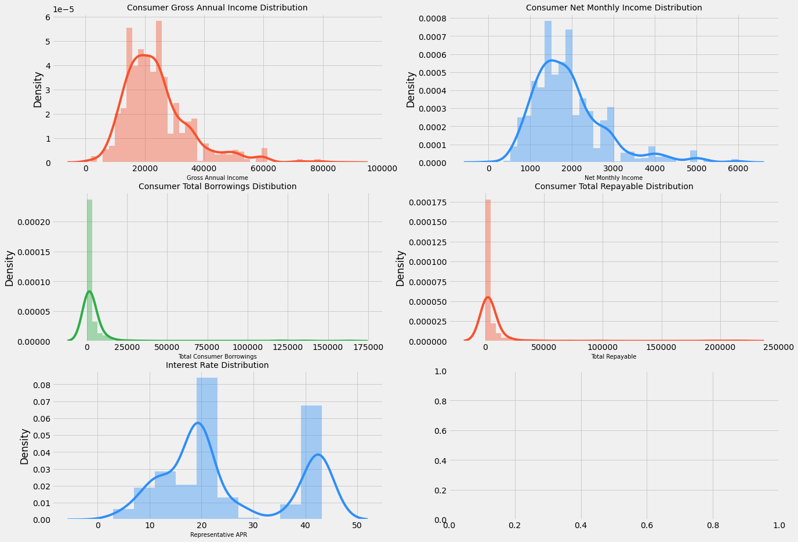
    


Figure out how to get the above plots into two seperate rows!

We anticipate gross annual income and net monthly income to have a strong correlation thus there will be similar trends across these two variables which implies the use of only one of the variables will suffice. 


```python
consumer_df[['grossAnnualIncome','netMonthlyIncome']].corr()
```


<div>
<style scoped>
    .dataframe tbody tr th:only-of-type {
        vertical-align: middle;
    }

    .dataframe tbody tr th {
        vertical-align: top;
    }

    .dataframe thead th {
        text-align: right;
    }
</style>
<table border="1" class="dataframe">
  <thead>
    <tr style="text-align: right;">
      <th></th>
      <th>grossAnnualIncome</th>
      <th>netMonthlyIncome</th>
    </tr>
  </thead>
  <tbody>
    <tr>
      <th>grossAnnualIncome</th>
      <td>1.000000</td>
      <td>0.961517</td>
    </tr>
    <tr>
      <th>netMonthlyIncome</th>
      <td>0.961517</td>
      <td>1.000000</td>
    </tr>
  </tbody>
</table>
</div>


We anticipate the total borrowings and total repayable variables to have a strong correlation thus a single variable will suffice to uncover trends within the dataset.


```python
consumer_df[['product.totalBorrowed','product.totalRepayable']].corr()
```


<div>
<style scoped>
    .dataframe tbody tr th:only-of-type {
        vertical-align: middle;
    }

    .dataframe tbody tr th {
        vertical-align: top;
    }

    .dataframe thead th {
        text-align: right;
    }
</style>
<table border="1" class="dataframe">
  <thead>
    <tr style="text-align: right;">
      <th></th>
      <th>product.totalBorrowed</th>
      <th>product.totalRepayable</th>
    </tr>
  </thead>
  <tbody>
    <tr>
      <th>product.totalBorrowed</th>
      <td>1.000000</td>
      <td>0.955081</td>
    </tr>
    <tr>
      <th>product.totalRepayable</th>
      <td>0.955081</td>
      <td>1.000000</td>
    </tr>
  </tbody>
</table>
</div>


```python
consumer_df['applicant.title'].value_counts()
```


    MISS    584
    MR      433
    MRS     224
    MS      132
    Name: applicant.title, dtype: int64


```python
# Simplifying the applicant.title variable to male, female and married female
consumer_df['applicant.title'] = consumer_df['applicant.title'].replace({'MISS':'Female'
                                                                         ,'MRS':'Married Female'
                                                                         ,'MS':'Female'
                                                                         ,'MR':'Male'})
```


```python
consumer_df['applicant.title'].value_counts()
```


    Female            716
    Male              433
    Married Female    224
    Name: applicant.title, dtype: int64


```python
# Creating a new dataframe to visualize the categorical variables trends
consumer_df_cat = consumer_df.groupby(['employmentStatus','CurrentStatus','Age','applicant.title','product.purpose','Area'
                                     ,'grossAnnualIncome','CustomerCode','product.representativeAPR'
                                     ,'product.totalBorrowed']
                                    , as_index = False)['AccountNumber'].nunique().reset_index()
```

<b> Investigate the reason why there are 100 more loan records in the consumer_df_cat dataframe </b>

#### Comparison of Employment Type and Gender with Gross Annual Income, Total Amount Borrowed and Representative APR


```python
plt.figure(figsize = (16,5))
sns.boxenplot(x = 'employmentStatus', y = 'grossAnnualIncome',data = consumer_df_cat, hue = 'applicant.title', palette = 'rainbow')
plt.xlabel('Employment Status')
plt.xticks(rotation=45)
plt.ylabel('Gross Annual Income')
plt.title('Gross Annual Income by Employment Type and Gender');
```


    
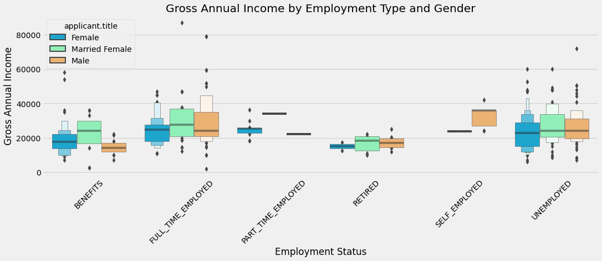
    


```python
plt.figure(figsize = (16,5))
sns.barplot(x = 'employmentStatus', y = 'product.totalBorrowed',data = consumer_df_cat, palette = 'rainbow', hue = 'applicant.title')
plt.xlabel('Employment Status')
plt.xticks(rotation=45)
plt.ylabel('Total Amount Borrowed')
plt.title('Total Amount Borrowed by Employment Type and Gender');
```


    
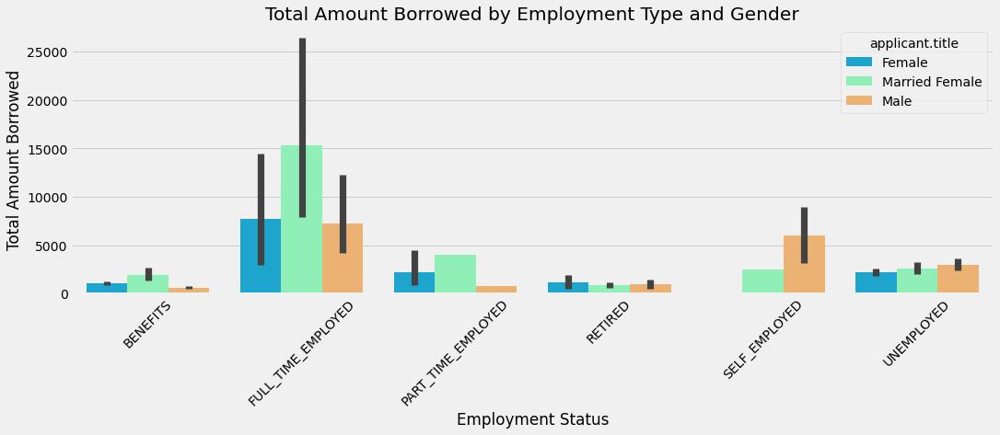
    


```python
plt.figure(figsize = (16,5))
sns.boxplot(x = 'employmentStatus', y = 'product.representativeAPR',data = consumer_df_cat, palette = 'rainbow', )
plt.xlabel('Employment Status')
plt.xticks(rotation=45)
plt.ylabel('Representative APR')
plt.title('Representative APR by Employment Type');
```


    
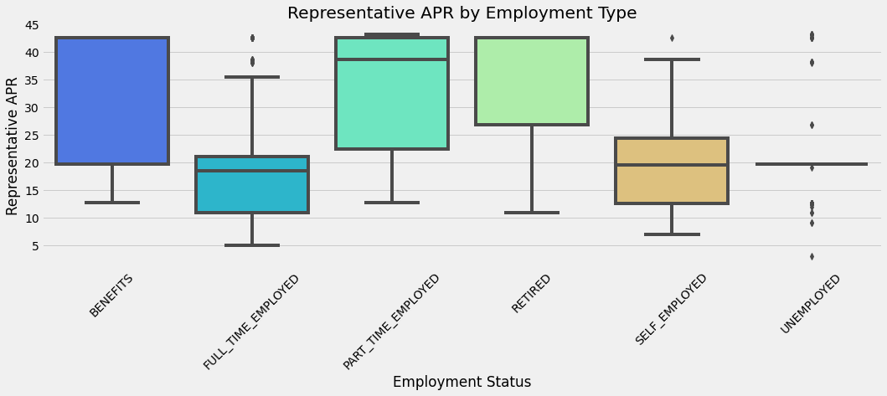
    


```python
plt.figure(figsize = (16,5))
sns.barplot(x = 'employmentStatus', y = 'product.representativeAPR', data = consumer_df_cat, palette = 'rainbow', hue = 'applicant.title')
plt.xlabel('Employment Status')
plt.xticks(rotation=45)
plt.ylabel('Representative APR')
plt.title('Representative APR by Employment Type and Gender');
```


    
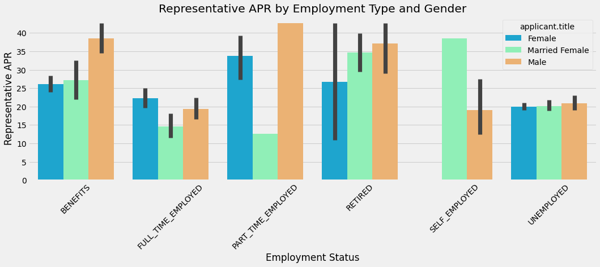
    


#### Comparison of Product Purpose with Gross Annual Income, Total Amount Borrowed and Representative APR


```python
plt.figure(figsize = (12,8))
sns.countplot(y = 'product.purpose',data = consumer_df_cat, palette = 'rainbow',hue ='product.purpose')
plt.xlabel('Account Volume')
plt.ylabel('Product Purpose')
plt.title('Account Volume by Product Purpose');
```


    
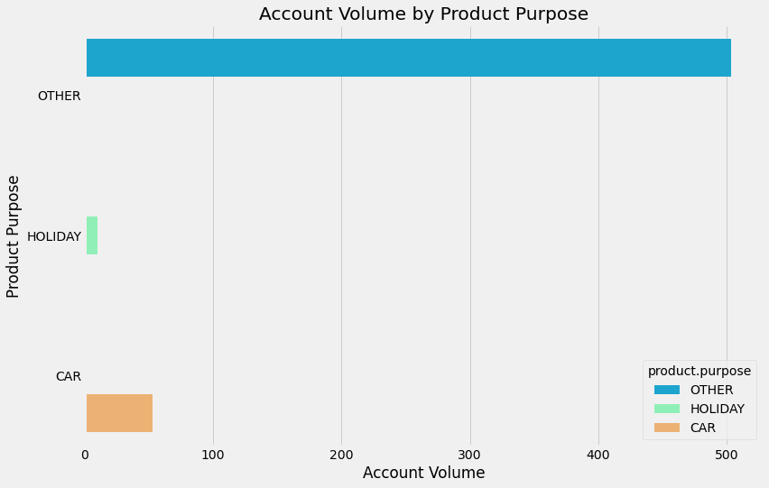
    


```python
plt.figure(figsize = (12,8))
sns.countplot(x = 'employmentStatus',data = consumer_df_cat, palette = 'rainbow',hue ='product.purpose')
plt.xlabel('Employment Status')
plt.xticks(rotation=45)
plt.ylabel('Account Volume')
plt.title('Account Volume by Employment Type & Product Purpose');
```


    
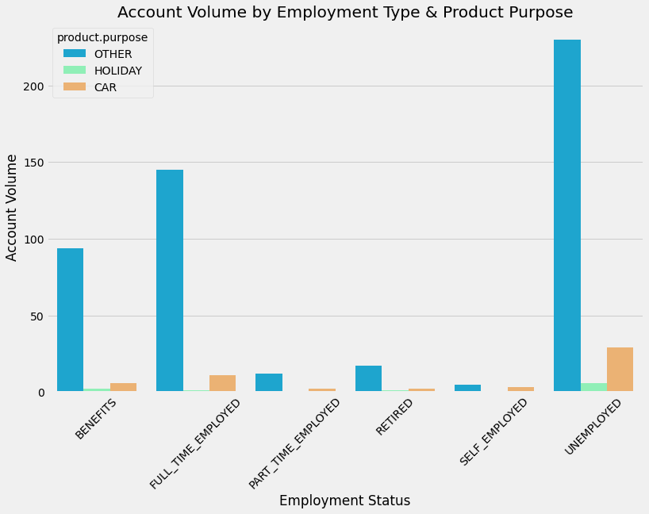
    


```python
plt.figure(figsize = (12,8))
sns.countplot(x = 'applicant.title',data = consumer_df_cat, palette = 'rainbow',hue ='product.purpose')
plt.xlabel('Gender')
plt.xticks(rotation=45)
plt.ylabel('Account Volume')
plt.title('Account Volume by Gender & Product Purpose');
```


    
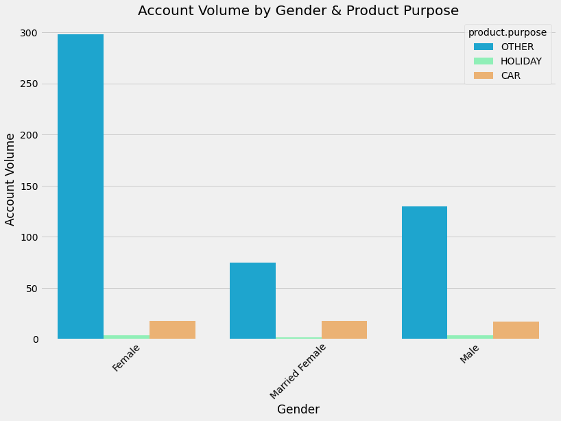
    


```python
plt.figure(figsize = (12,5))
sns.violinplot(x = 'product.purpose', y = 'product.representativeAPR',data = consumer_df_cat, palette = 'rainbow')
plt.xlabel('Product Purpose')
plt.xticks(rotation=45)
plt.ylabel('Representative APR')
plt.title('Representative APR by Product Purpose');
```


    
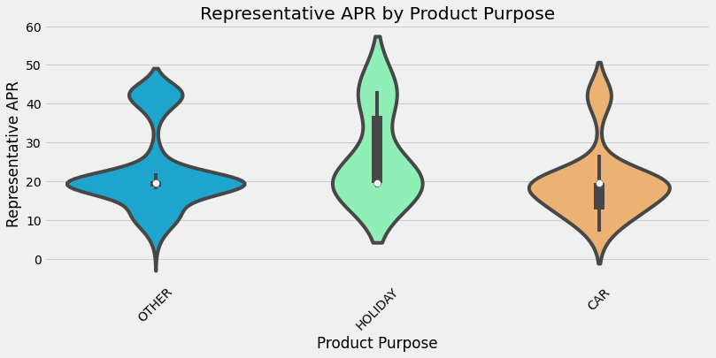
    


```python
plt.figure(figsize = (12,5))
sns.boxenplot(x = 'product.purpose', y = 'grossAnnualIncome',data = consumer_df_cat, palette = 'rainbow')
plt.xlabel('Product Purpose')
plt.xticks(rotation=45)
plt.ylabel('Gross Annual Income')
plt.title('Gross Annual Income by Product Purpose');
```


    
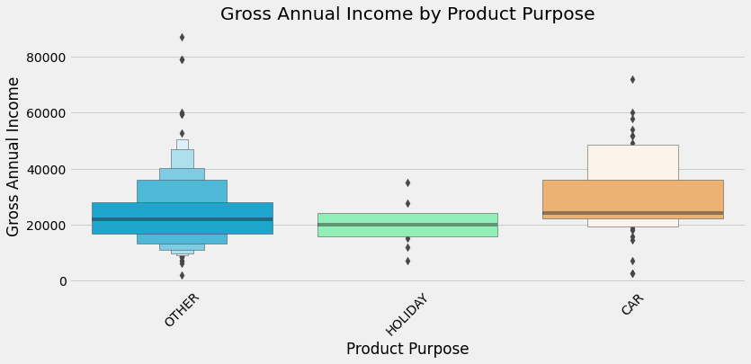
    


```python
plt.figure(figsize = (12,5))
sns.barplot(y = 'product.purpose', x = 'product.totalBorrowed',data = consumer_df_cat, palette = 'rainbow')
plt.xlabel('Total Borrowed')
plt.xticks(rotation=45)
plt.ylabel('Product Purpose')
plt.title('Total Borrowed by Product Purpose');
```


    
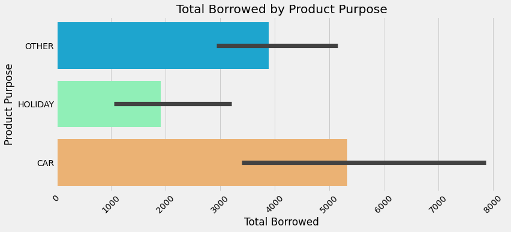
    


#### Comparison of Account Classification with Gross Annual Income, Total Amount Borrowed and Representative APR


```python
plt.figure(figsize = (12,8))
sns.countplot(y = 'CurrentStatus',data = consumer_df_cat, palette = 'rainbow',hue ='product.purpose')
plt.xlabel('Account Volume')
plt.ylabel('Account Classification')
plt.title('Account Volume by Account Clasification and Product Purpose');
```


    
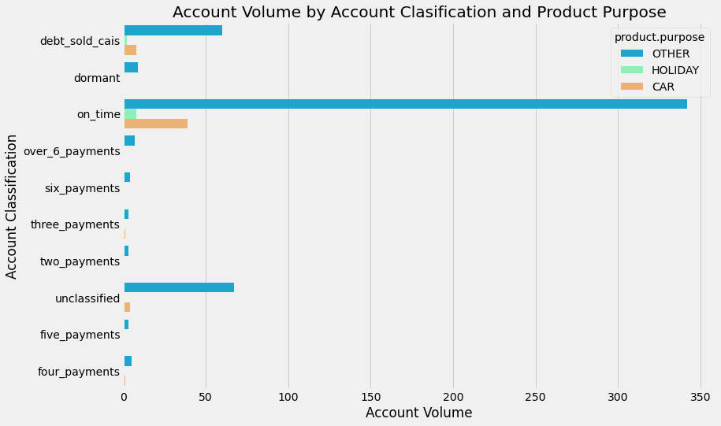
    


```python
plt.figure(figsize = (12,8))
sns.countplot(y = 'CurrentStatus',data = consumer_df_cat, palette = 'rainbow',hue ='applicant.title')
plt.xlabel('Account Volume')
plt.ylabel('Account Classification')
plt.title('Account Volume by Account Clasification and Gender');
```


    
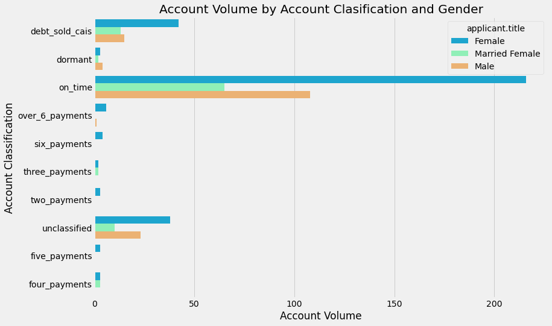
    


```python
plt.figure(figsize = (12,8))
sns.countplot(y = 'CurrentStatus',data = consumer_df_cat, palette = 'husl',hue ='employmentStatus')
plt.xlabel('Account Volume')
plt.ylabel('Account Classification')
plt.title('Account Volume by Account Clasification and Employment Status');
```


    
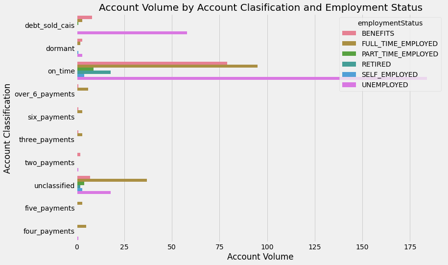
    


```python
plt.figure(figsize = (12,5))
sns.stripplot(x = 'CurrentStatus', y = 'grossAnnualIncome',data = consumer_df_cat, palette = 'husl', hue = 'employmentStatus')
plt.xlabel('Account Classification')
plt.xticks(rotation=45)
plt.ylabel('Gross Annual Income')
plt.title('Gross Annual Income by Account Classification and Employment Status');
```


    
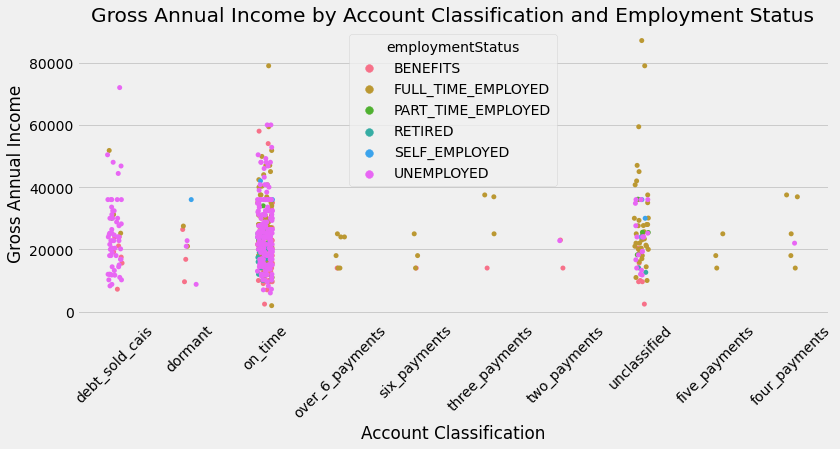
    


```python
plt.figure(figsize = (12,5))
sns.boxplot(x = 'CurrentStatus', y = 'product.representativeAPR',data = consumer_df_cat, palette = 'husl')
plt.xlabel('Account Classification')
plt.xticks(rotation=45)
plt.ylabel('Representative APR')
plt.title('Representative APR by Account Classification');
```


    
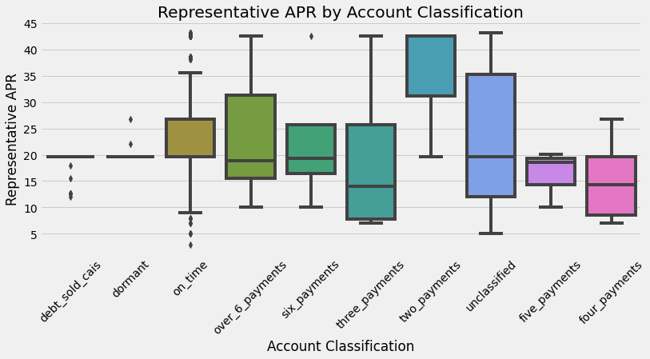
    


```python
plt.figure(figsize = (12,5))
sns.boxplot(x = 'CurrentStatus', y = 'grossAnnualIncome',data = consumer_df_cat, palette = 'husl')
plt.xlabel('Account Classification')
plt.xticks(rotation=45)
plt.ylabel('GrossAnnualIncome')
plt.title('Gross Annual Income by Account Classification');
```


    
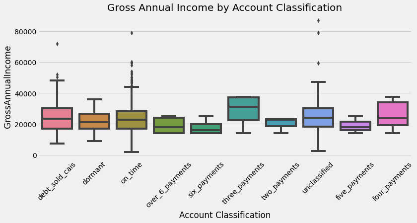
    


```python
plt.figure(figsize = (12,5))
sns.barplot(x = 'CurrentStatus', y = 'product.totalBorrowed',data = consumer_df_cat, palette = 'husl')
plt.xlabel('Account Classification')
plt.xticks(rotation=45)
plt.ylabel('Total Borrowed')
plt.title('Total Borrowed by Account Classification');
```


    
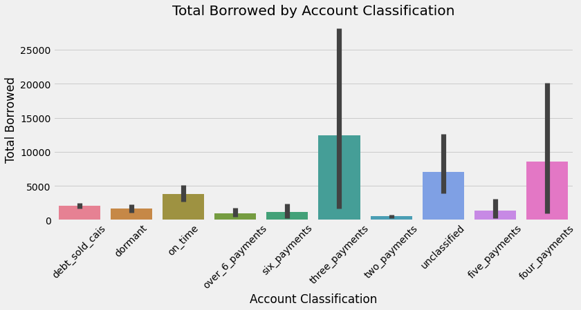
    


### C.  Data Modelling and Feature Engineering

<p> Numerical Variables: Default Balance, Age, grossAnnualIncome, product.representativeAPR, product.totalBorrowed, product.totalRepayable, debt.income.ratio </p>

<p> Categorical Variables: <b>CurrentStatus --> Loan Condition</b>, applicant.title, changeInCircumstances.incomeReductionExpected, employmentStatus, CustomerCode, provider.decision


```python
# Creating a dataframe object with the row indexes that we wish to drop
i = consumer_df[consumer_df['CurrentStatus'] == 'unclassified'].index

# Dropping the loans with unlcassified status
consumer_df.drop(i, inplace = True)
```


```python
# Creating a list with the statuses that shall be considered defaulted
performing_loan = ['on_time', 'two_payments']


# Writing a function that labels the non-performing loans as NPLs and performing loans as PL
def default_labeller(status):
    if status in performing_loan:
        return "PL"
    else:
        return "NPL"

# creating a new column with our default definition
consumer_df['loan_condition'] = consumer_df['CurrentStatus'].apply(default_labeller)
```

#### Encoding the categorical variables in the dataset


```python
# Converting the datatypes of our categorical variables
consumer_df['loan_condition'] = consumer_df['loan_condition'].astype('category').cat.codes
consumer_df['applicant.title'] = consumer_df['applicant.title'].astype('category').cat.codes
consumer_df['changeInCircumstances.incomeReductionExpected'] = consumer_df['changeInCircumstances.incomeReductionExpected'].astype('category').cat.codes
consumer_df['product.purpose'] = consumer_df['product.purpose'].astype('category').cat.codes
consumer_df['employmentStatus'] = consumer_df['employmentStatus'].astype('category').cat.codes
consumer_df['CustomerCode'] = consumer_df['CustomerCode'].astype('category').cat.codes
consumer_df['provider.decision'] = consumer_df['provider.decision'].astype('category').cat.codes

```


```python
# Getting the correlation between all the numerical variables
df_corr = consumer_df.corr()

# Visializing this correlation in the dataset
plt.figure(figsize = (20,12))
sns.heatmap(df_corr, cmap = 'coolwarm', annot = True);
```


    
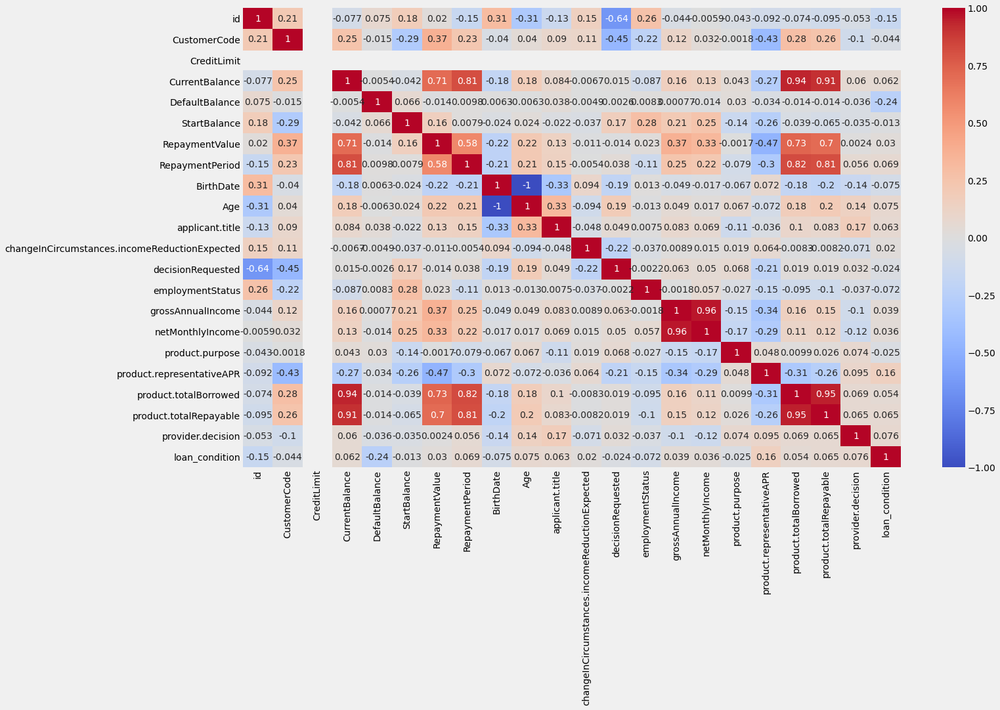
    


Currently, there is low collinearity with the target variable (loan_condition). With the addition of more data, this is expected to change as there will be more trends within the dataset


```python
consumer_df['loan_condition'].value_counts()
```


    1    1140
    0     152
    Name: loan_condition, dtype: int64


1 --> Performing Loan
0 --> Non-Performing Loan

### D. Building a Foundational ML Model

#### Specifying the independent and dependent variables


```python
desired_variables = ['DefaultBalance','Age','applicant.title','changeInCircumstances.incomeReductionExpected','employmentStatus'
          ,'grossAnnualIncome','product.purpose','product.representativeAPR','product.totalBorrowed','provider.decision','loan_condition']
```


```python
consumer_df_new = consumer_df[desired_variables]
```


```python
consumer_df_new.dropna(inplace = True)
```

    <ipython-input-142-bb910ab8f977>:1: SettingWithCopyWarning: 
    A value is trying to be set on a copy of a slice from a DataFrame
    
    See the caveats in the documentation: https://pandas.pydata.org/pandas-docs/stable/user_guide/indexing.html#returning-a-view-versus-a-copy
      consumer_df_new.dropna(inplace = True)


```python
num_var = ['DefaultBalance','Age','applicant.title','changeInCircumstances.incomeReductionExpected','employmentStatus'
          ,'grossAnnualIncome','product.purpose','product.representativeAPR','product.totalBorrowed','provider.decision']
```


```python
# Specifying the predicting variables
X = consumer_df_new[num_var]

# Specifying the target variable       
y = consumer_df_new['loan_condition']
```


```python
from sklearn.model_selection import train_test_split

# specifying our train and test data - We shall use the train:test ratio of 0.75:0.25
X_train, X_test, y_train, y_test = train_test_split(X, y, test_size = 0.25, random_state = 0)
```


```python
# performing feature scaling on our dataset
from sklearn.preprocessing import StandardScaler

sc_X = StandardScaler()

# fitting and transforming our training data
X_train = sc_X.fit_transform(X_train)

# transforming our test data
X_test = sc_X.transform(X_test)
```


```python
# Logistic Regression
from sklearn.linear_model import LogisticRegression
logistic_classifier = LogisticRegression(random_state = 0, solver = 'saga')
logistic_classifier.fit(X_train, y_train)
logistic_y_prediction = logistic_classifier.predict(X_test)

# Decision Tree 
from sklearn.tree import DecisionTreeClassifier
decision_classifier = DecisionTreeClassifier()
decision_classifier.fit(X_train, y_train)
decision_y_prediction = decision_classifier.predict(X_test)

# Random Forest
from sklearn.ensemble import RandomForestClassifier
random_forest_classifier = RandomForestClassifier()
random_forest_classifier.fit(X_train, y_train)
random_forest_y_prediction = random_forest_classifier.predict(X_test)

# KNN
from sklearn.neighbors import KNeighborsClassifier
knn_classifier = KNeighborsClassifier(n_neighbors=5)
knn_classifier.fit(X_train, y_train)
knn_y_prediction = knn_classifier.predict(X_test)
```

    /Users/peter/opt/anaconda3/lib/python3.8/site-packages/sklearn/linear_model/_sag.py:329: ConvergenceWarning: The max_iter was reached which means the coef_ did not converge
      warnings.warn("The max_iter was reached which means "


```python
from sklearn.metrics import classification_report, accuracy_score 

print(accuracy_score(logistic_y_prediction, y_test))
print(accuracy_score(decision_y_prediction, y_test))
print(accuracy_score(random_forest_y_prediction, y_test))
print(accuracy_score(knn_y_prediction, y_test))
```

    0.8825503355704698
    0.8825503355704698
    0.8926174496644296
    0.9026845637583892


```python
print('Logistic classifier:')
print(classification_report(y_test, logistic_y_prediction))

print('Decision Tree classifier:')
print(classification_report(y_test, decision_y_prediction))

print('Random Forest Classifier:')
print(classification_report(y_test, random_forest_y_prediction))

print('KNN Classifier:')
print(classification_report(y_test, knn_y_prediction))
```

    Logistic classifier:
                  precision    recall  f1-score   support
    
               0       1.00      0.12      0.22        40
               1       0.88      1.00      0.94       258
    
        accuracy                           0.88       298
       macro avg       0.94      0.56      0.58       298
    weighted avg       0.90      0.88      0.84       298
    
    Decision Tree classifier:
                  precision    recall  f1-score   support
    
               0       0.56      0.57      0.57        40
               1       0.93      0.93      0.93       258
    
        accuracy                           0.88       298
       macro avg       0.75      0.75      0.75       298
    weighted avg       0.88      0.88      0.88       298
    
    Random Forest Classifier:
                  precision    recall  f1-score   support
    
               0       0.64      0.45      0.53        40
               1       0.92      0.96      0.94       258
    
        accuracy                           0.89       298
       macro avg       0.78      0.71      0.73       298
    weighted avg       0.88      0.89      0.88       298
    
    KNN Classifier:
                  precision    recall  f1-score   support
    
               0       0.76      0.40      0.52        40
               1       0.91      0.98      0.95       258
    
        accuracy                           0.90       298
       macro avg       0.84      0.69      0.74       298
    weighted avg       0.89      0.90      0.89       298
    


```python
from sklearn.metrics import confusion_matrix 
 
print('Logistic Regression classifier:')
print(confusion_matrix(logistic_y_prediction, y_test))

print('Decision Tree classifier:')
print(confusion_matrix(decision_y_prediction, y_test))

print('Random Forest Classifier')
print(confusion_matrix(random_forest_y_prediction, y_test))

print('KNN Classifier:')
print(confusion_matrix(knn_y_prediction, y_test))
```

    Logistic Regression classifier:
    [[  5   0]
     [ 35 258]]
    Decision Tree classifier:
    [[ 23  18]
     [ 17 240]]
    Random Forest Classifier
    [[ 18  10]
     [ 22 248]]
    KNN Classifier:
    [[ 16   5]
     [ 24 253]]


```python

```
