## Project Deliverables:


1.  Perform Exploratory Data Analysis on the Lending Club Dataset
2.  Predict the Probability of Default on a loan issued on the Lending Club Peer to Peer Lending Platform. 


## Business Context:

Lending Club is a US based peer to peer lending (P2P) platform that connects investors to borrowers. The so-called "peers" in the P2P lending model are consumers of comparative social standing as opposed to the typical Business (Traditional Lending Institution) to Consumer model. Peer to peer lending disintermediates banking incumbents by providing an avenue through which retail investors can lend to borrowers. This novel business model is underpinned by robust credit scoring algorithms that are deployed by the platfrom provider. Traditional financial institutions are encumbered by day-to-day operational costs such as physical outlets, personnel, etc thereby limiting their affordability on loan pricing. Peer to peer lenders on the other hand do not have similar operational impediments and are thus able to price their loans more competitively. 

 As of the most recently available data available on Lending Club's corporate website, they have isssued over $60B in loans through their lifetime. To avoid liquidity risks and ensure returns to investors, it is thus imperative for this peer to peer platform to be able to accurately determine the probability of default on a consumer loan based on a combination of data sources that are verified during the KYC and customer on-boarding. 
 
Lending Club Data Available on their website was used to accomplish the project deliverables. 

## Methodology

The following steps shall be used to analyse the Lending Club dataset:
<li> Data Importation </li>
<li> Data Exploration </li>
<li> Data Cleaning </li>
<li> Data Analysis </li>
<li> Data Preparation </li>
<li> Data Modeling </li>
<li> Data Evaluation </li>
<li> Model Cross Validation/Feature Engineering/Hyperparameter Tuning </li>
<li> Conclusion </li>


## Data Importation


```python
# importing the relevant Python Libraries
import pandas as pd                           # pandas for performing data manipulation
import numpy as np                            # numpy for performing scientific computations
import matplotlib.pyplot as plt               # matplotlib for performing data visualizations
import seaborn as sns                         # seaborn for performing enhanced visualizations that are not available on the matplotlib library

# To enable pandas to preview all rows and columns
pd.set_option('display.max_columns', None)
pd.set_option('display.max_rows', None)
```


```python
# Enabling our Google Colab Environment to connect to Drive
from google.colab import drive
drive.mount('/content/drive')
```

    Drive already mounted at /content/drive; to attempt to forcibly remount, call drive.mount("/content/drive", force_remount=True).


```python
# Setting the data access locations in google drive

# Setting Lending Club Data url
lending_club_url = '/content/drive/My Drive/Lending Club Dataset/Lending_Club_Loans_2019.csv'

# Setting the Data Dictionary Data url
lending_club_dictionary_url = '/content/drive/My Drive/Lending Club Dataset/LCDataDictionary.xlsx'
```


```python
# Loading & Previewing the dataset
df = pd.read_csv(lending_club_url, parse_dates = True, index_col = 0)

df.head()
```


<div>
<style scoped>
    .dataframe tbody tr th:only-of-type {
        vertical-align: middle;
    }

    .dataframe tbody tr th {
        vertical-align: top;
    }

    .dataframe thead th {
        text-align: right;
    }
</style>
<table border="1" class="dataframe">
  <thead>
    <tr style="text-align: right;">
      <th></th>
      <th>loan_amnt</th>
      <th>funded_amnt</th>
      <th>funded_amnt_inv</th>
      <th>term</th>
      <th>int_rate</th>
      <th>installment</th>
      <th>grade</th>
      <th>sub_grade</th>
      <th>emp_title</th>
      <th>emp_length</th>
      <th>home_ownership</th>
      <th>annual_inc</th>
      <th>verification_status</th>
      <th>issue_d</th>
      <th>loan_status</th>
      <th>pymnt_plan</th>
      <th>url</th>
      <th>purpose</th>
      <th>title</th>
      <th>zip_code</th>
      <th>addr_state</th>
      <th>dti</th>
      <th>delinq_2yrs</th>
      <th>earliest_cr_line</th>
      <th>fico_range_low</th>
      <th>fico_range_high</th>
      <th>inq_last_6mths</th>
      <th>mths_since_last_delinq</th>
      <th>mths_since_last_record</th>
      <th>open_acc</th>
      <th>pub_rec</th>
      <th>revol_bal</th>
      <th>revol_util</th>
      <th>total_acc</th>
      <th>initial_list_status</th>
      <th>out_prncp</th>
      <th>out_prncp_inv</th>
      <th>total_pymnt</th>
      <th>total_pymnt_inv</th>
      <th>total_rec_prncp</th>
      <th>total_rec_int</th>
      <th>total_rec_late_fee</th>
      <th>recoveries</th>
      <th>collection_recovery_fee</th>
      <th>last_pymnt_d</th>
      <th>last_pymnt_amnt</th>
      <th>next_pymnt_d</th>
      <th>last_credit_pull_d</th>
      <th>last_fico_range_high</th>
      <th>last_fico_range_low</th>
      <th>collections_12_mths_ex_med</th>
      <th>mths_since_last_major_derog</th>
      <th>policy_code</th>
      <th>application_type</th>
      <th>annual_inc_joint</th>
      <th>dti_joint</th>
      <th>verification_status_joint</th>
      <th>acc_now_delinq</th>
      <th>tot_coll_amt</th>
      <th>tot_cur_bal</th>
      <th>open_acc_6m</th>
      <th>open_act_il</th>
      <th>open_il_12m</th>
      <th>open_il_24m</th>
      <th>mths_since_rcnt_il</th>
      <th>total_bal_il</th>
      <th>il_util</th>
      <th>open_rv_12m</th>
      <th>open_rv_24m</th>
      <th>max_bal_bc</th>
      <th>all_util</th>
      <th>total_rev_hi_lim</th>
      <th>inq_fi</th>
      <th>total_cu_tl</th>
      <th>inq_last_12m</th>
      <th>acc_open_past_24mths</th>
      <th>avg_cur_bal</th>
      <th>bc_open_to_buy</th>
      <th>bc_util</th>
      <th>chargeoff_within_12_mths</th>
      <th>delinq_amnt</th>
      <th>mo_sin_old_il_acct</th>
      <th>mo_sin_old_rev_tl_op</th>
      <th>mo_sin_rcnt_rev_tl_op</th>
      <th>mo_sin_rcnt_tl</th>
      <th>mort_acc</th>
      <th>mths_since_recent_bc</th>
      <th>mths_since_recent_bc_dlq</th>
      <th>mths_since_recent_inq</th>
      <th>mths_since_recent_revol_delinq</th>
      <th>num_accts_ever_120_pd</th>
      <th>num_actv_bc_tl</th>
      <th>num_actv_rev_tl</th>
      <th>num_bc_sats</th>
      <th>num_bc_tl</th>
      <th>num_il_tl</th>
      <th>num_op_rev_tl</th>
      <th>num_rev_accts</th>
      <th>num_rev_tl_bal_gt_0</th>
      <th>num_sats</th>
      <th>num_tl_120dpd_2m</th>
      <th>num_tl_30dpd</th>
      <th>num_tl_90g_dpd_24m</th>
      <th>num_tl_op_past_12m</th>
      <th>pct_tl_nvr_dlq</th>
      <th>percent_bc_gt_75</th>
      <th>pub_rec_bankruptcies</th>
      <th>tax_liens</th>
      <th>tot_hi_cred_lim</th>
      <th>total_bal_ex_mort</th>
      <th>total_bc_limit</th>
      <th>total_il_high_credit_limit</th>
      <th>revol_bal_joint</th>
      <th>sec_app_fico_range_low</th>
      <th>sec_app_fico_range_high</th>
      <th>sec_app_earliest_cr_line</th>
      <th>sec_app_inq_last_6mths</th>
      <th>sec_app_mort_acc</th>
      <th>sec_app_open_acc</th>
      <th>sec_app_revol_util</th>
      <th>sec_app_open_act_il</th>
      <th>sec_app_num_rev_accts</th>
      <th>sec_app_chargeoff_within_12_mths</th>
      <th>sec_app_collections_12_mths_ex_med</th>
      <th>hardship_flag</th>
      <th>hardship_type</th>
      <th>hardship_reason</th>
      <th>hardship_status</th>
      <th>deferral_term</th>
      <th>hardship_amount</th>
      <th>hardship_start_date</th>
      <th>hardship_end_date</th>
      <th>payment_plan_start_date</th>
      <th>hardship_length</th>
      <th>hardship_dpd</th>
      <th>hardship_loan_status</th>
      <th>orig_projected_additional_accrued_interest</th>
      <th>hardship_payoff_balance_amount</th>
      <th>hardship_last_payment_amount</th>
      <th>debt_settlement_flag</th>
    </tr>
    <tr>
      <th>id</th>
      <th></th>
      <th></th>
      <th></th>
      <th></th>
      <th></th>
      <th></th>
      <th></th>
      <th></th>
      <th></th>
      <th></th>
      <th></th>
      <th></th>
      <th></th>
      <th></th>
      <th></th>
      <th></th>
      <th></th>
      <th></th>
      <th></th>
      <th></th>
      <th></th>
      <th></th>
      <th></th>
      <th></th>
      <th></th>
      <th></th>
      <th></th>
      <th></th>
      <th></th>
      <th></th>
      <th></th>
      <th></th>
      <th></th>
      <th></th>
      <th></th>
      <th></th>
      <th></th>
      <th></th>
      <th></th>
      <th></th>
      <th></th>
      <th></th>
      <th></th>
      <th></th>
      <th></th>
      <th></th>
      <th></th>
      <th></th>
      <th></th>
      <th></th>
      <th></th>
      <th></th>
      <th></th>
      <th></th>
      <th></th>
      <th></th>
      <th></th>
      <th></th>
      <th></th>
      <th></th>
      <th></th>
      <th></th>
      <th></th>
      <th></th>
      <th></th>
      <th></th>
      <th></th>
      <th></th>
      <th></th>
      <th></th>
      <th></th>
      <th></th>
      <th></th>
      <th></th>
      <th></th>
      <th></th>
      <th></th>
      <th></th>
      <th></th>
      <th></th>
      <th></th>
      <th></th>
      <th></th>
      <th></th>
      <th></th>
      <th></th>
      <th></th>
      <th></th>
      <th></th>
      <th></th>
      <th></th>
      <th></th>
      <th></th>
      <th></th>
      <th></th>
      <th></th>
      <th></th>
      <th></th>
      <th></th>
      <th></th>
      <th></th>
      <th></th>
      <th></th>
      <th></th>
      <th></th>
      <th></th>
      <th></th>
      <th></th>
      <th></th>
      <th></th>
      <th></th>
      <th></th>
      <th></th>
      <th></th>
      <th></th>
      <th></th>
      <th></th>
      <th></th>
      <th></th>
      <th></th>
      <th></th>
      <th></th>
      <th></th>
      <th></th>
      <th></th>
      <th></th>
      <th></th>
      <th></th>
      <th></th>
      <th></th>
      <th></th>
      <th></th>
      <th></th>
      <th></th>
      <th></th>
      <th></th>
      <th></th>
      <th></th>
      <th></th>
      <th></th>
    </tr>
  </thead>
  <tbody>
    <tr>
      <th>149203043</th>
      <td>24000.0</td>
      <td>24000.0</td>
      <td>24000.0</td>
      <td>60 months</td>
      <td>13.90%</td>
      <td>557.20</td>
      <td>C</td>
      <td>C1</td>
      <td>Budget analyst</td>
      <td>10+ years</td>
      <td>MORTGAGE</td>
      <td>86000.0</td>
      <td>Verified</td>
      <td>2019-03-01</td>
      <td>Current</td>
      <td>n</td>
      <td>https://lendingclub.com/browse/loanDetail.acti...</td>
      <td>major_purchase</td>
      <td>Major purchase</td>
      <td>360xx</td>
      <td>AL</td>
      <td>23.54</td>
      <td>1.0</td>
      <td>Jan-2000</td>
      <td>665.0</td>
      <td>669.0</td>
      <td>1.0</td>
      <td>18.0</td>
      <td>NaN</td>
      <td>15.0</td>
      <td>0.0</td>
      <td>10899.0</td>
      <td>73.1%</td>
      <td>28.0</td>
      <td>w</td>
      <td>20427.69</td>
      <td>20427.69</td>
      <td>6649.33</td>
      <td>6649.33</td>
      <td>3572.31</td>
      <td>3077.02</td>
      <td>0.0</td>
      <td>0.0</td>
      <td>0.0</td>
      <td>May-2020</td>
      <td>0.00</td>
      <td>Jul-2020</td>
      <td>May-2020</td>
      <td>659.0</td>
      <td>655.0</td>
      <td>0.0</td>
      <td>NaN</td>
      <td>1.0</td>
      <td>Individual</td>
      <td>NaN</td>
      <td>NaN</td>
      <td>NaN</td>
      <td>0.0</td>
      <td>0.0</td>
      <td>234833.0</td>
      <td>0.0</td>
      <td>4.0</td>
      <td>2.0</td>
      <td>4.0</td>
      <td>11.0</td>
      <td>62839.0</td>
      <td>73.0</td>
      <td>2.0</td>
      <td>3.0</td>
      <td>2784.0</td>
      <td>73.0</td>
      <td>14900.0</td>
      <td>6.0</td>
      <td>6.0</td>
      <td>7.0</td>
      <td>8.0</td>
      <td>15656.0</td>
      <td>3112.0</td>
      <td>70.1</td>
      <td>0.0</td>
      <td>0.0</td>
      <td>134.0</td>
      <td>230.0</td>
      <td>11.0</td>
      <td>10.0</td>
      <td>3.0</td>
      <td>11.0</td>
      <td>NaN</td>
      <td>5.0</td>
      <td>NaN</td>
      <td>0.0</td>
      <td>5.0</td>
      <td>9.0</td>
      <td>6.0</td>
      <td>7.0</td>
      <td>14.0</td>
      <td>10.0</td>
      <td>11.0</td>
      <td>9.0</td>
      <td>15.0</td>
      <td>0.0</td>
      <td>0.0</td>
      <td>0.0</td>
      <td>5.0</td>
      <td>92.9</td>
      <td>66.7</td>
      <td>0.0</td>
      <td>0.0</td>
      <td>255961.0</td>
      <td>73738.0</td>
      <td>10400.0</td>
      <td>77261.0</td>
      <td>NaN</td>
      <td>NaN</td>
      <td>NaN</td>
      <td>NaN</td>
      <td>NaN</td>
      <td>NaN</td>
      <td>NaN</td>
      <td>NaN</td>
      <td>NaN</td>
      <td>NaN</td>
      <td>NaN</td>
      <td>NaN</td>
      <td>Y</td>
      <td>CVD19SKIP</td>
      <td>INCOMECURT</td>
      <td>ACTIVE</td>
      <td>2.0</td>
      <td>0.0</td>
      <td>Apr-2020</td>
      <td>Jun-2020</td>
      <td>Apr-2020</td>
      <td>2.0</td>
      <td>0.0</td>
      <td>ACTIVE</td>
      <td>473.24</td>
      <td>20656.42</td>
      <td>557.2</td>
      <td>N</td>
    </tr>
    <tr>
      <th>149354242</th>
      <td>18500.0</td>
      <td>18500.0</td>
      <td>18500.0</td>
      <td>60 months</td>
      <td>14.74%</td>
      <td>437.60</td>
      <td>C</td>
      <td>C2</td>
      <td>NaN</td>
      <td>NaN</td>
      <td>MORTGAGE</td>
      <td>43000.0</td>
      <td>Verified</td>
      <td>2019-03-01</td>
      <td>Current</td>
      <td>n</td>
      <td>https://lendingclub.com/browse/loanDetail.acti...</td>
      <td>debt_consolidation</td>
      <td>Debt consolidation</td>
      <td>305xx</td>
      <td>GA</td>
      <td>19.73</td>
      <td>0.0</td>
      <td>Apr-1996</td>
      <td>730.0</td>
      <td>734.0</td>
      <td>1.0</td>
      <td>NaN</td>
      <td>NaN</td>
      <td>7.0</td>
      <td>0.0</td>
      <td>5417.0</td>
      <td>24%</td>
      <td>27.0</td>
      <td>w</td>
      <td>15615.82</td>
      <td>15615.82</td>
      <td>5658.50</td>
      <td>5658.50</td>
      <td>2884.18</td>
      <td>2774.32</td>
      <td>0.0</td>
      <td>0.0</td>
      <td>0.0</td>
      <td>May-2020</td>
      <td>437.60</td>
      <td>Jun-2020</td>
      <td>May-2020</td>
      <td>789.0</td>
      <td>785.0</td>
      <td>0.0</td>
      <td>NaN</td>
      <td>1.0</td>
      <td>Individual</td>
      <td>NaN</td>
      <td>NaN</td>
      <td>NaN</td>
      <td>0.0</td>
      <td>0.0</td>
      <td>22602.0</td>
      <td>1.0</td>
      <td>3.0</td>
      <td>1.0</td>
      <td>2.0</td>
      <td>6.0</td>
      <td>17185.0</td>
      <td>77.0</td>
      <td>1.0</td>
      <td>2.0</td>
      <td>499.0</td>
      <td>51.0</td>
      <td>22600.0</td>
      <td>0.0</td>
      <td>11.0</td>
      <td>1.0</td>
      <td>4.0</td>
      <td>3229.0</td>
      <td>11501.0</td>
      <td>4.2</td>
      <td>0.0</td>
      <td>0.0</td>
      <td>275.0</td>
      <td>75.0</td>
      <td>7.0</td>
      <td>6.0</td>
      <td>0.0</td>
      <td>7.0</td>
      <td>NaN</td>
      <td>4.0</td>
      <td>NaN</td>
      <td>0.0</td>
      <td>1.0</td>
      <td>2.0</td>
      <td>2.0</td>
      <td>3.0</td>
      <td>20.0</td>
      <td>4.0</td>
      <td>7.0</td>
      <td>2.0</td>
      <td>7.0</td>
      <td>0.0</td>
      <td>0.0</td>
      <td>0.0</td>
      <td>2.0</td>
      <td>100.0</td>
      <td>0.0</td>
      <td>0.0</td>
      <td>0.0</td>
      <td>44790.0</td>
      <td>22602.0</td>
      <td>12000.0</td>
      <td>22190.0</td>
      <td>NaN</td>
      <td>NaN</td>
      <td>NaN</td>
      <td>NaN</td>
      <td>NaN</td>
      <td>NaN</td>
      <td>NaN</td>
      <td>NaN</td>
      <td>NaN</td>
      <td>NaN</td>
      <td>NaN</td>
      <td>NaN</td>
      <td>N</td>
      <td>NaN</td>
      <td>NaN</td>
      <td>NaN</td>
      <td>NaN</td>
      <td>NaN</td>
      <td>NaN</td>
      <td>NaN</td>
      <td>NaN</td>
      <td>NaN</td>
      <td>NaN</td>
      <td>NaN</td>
      <td>NaN</td>
      <td>NaN</td>
      <td>NaN</td>
      <td>N</td>
    </tr>
    <tr>
      <th>149355875</th>
      <td>24000.0</td>
      <td>24000.0</td>
      <td>24000.0</td>
      <td>36 months</td>
      <td>8.19%</td>
      <td>754.18</td>
      <td>A</td>
      <td>A4</td>
      <td>Pilot</td>
      <td>10+ years</td>
      <td>MORTGAGE</td>
      <td>329991.0</td>
      <td>Not Verified</td>
      <td>2019-03-01</td>
      <td>Current</td>
      <td>n</td>
      <td>https://lendingclub.com/browse/loanDetail.acti...</td>
      <td>debt_consolidation</td>
      <td>Debt consolidation</td>
      <td>309xx</td>
      <td>GA</td>
      <td>20.70</td>
      <td>0.0</td>
      <td>Jul-1995</td>
      <td>685.0</td>
      <td>689.0</td>
      <td>0.0</td>
      <td>NaN</td>
      <td>NaN</td>
      <td>21.0</td>
      <td>0.0</td>
      <td>45747.0</td>
      <td>80%</td>
      <td>39.0</td>
      <td>w</td>
      <td>15357.81</td>
      <td>15357.81</td>
      <td>10536.68</td>
      <td>10536.68</td>
      <td>8642.19</td>
      <td>1894.49</td>
      <td>0.0</td>
      <td>0.0</td>
      <td>0.0</td>
      <td>May-2020</td>
      <td>754.18</td>
      <td>Jun-2020</td>
      <td>May-2020</td>
      <td>739.0</td>
      <td>735.0</td>
      <td>0.0</td>
      <td>NaN</td>
      <td>1.0</td>
      <td>Individual</td>
      <td>NaN</td>
      <td>NaN</td>
      <td>NaN</td>
      <td>0.0</td>
      <td>0.0</td>
      <td>486641.0</td>
      <td>0.0</td>
      <td>11.0</td>
      <td>2.0</td>
      <td>7.0</td>
      <td>9.0</td>
      <td>93397.0</td>
      <td>50.0</td>
      <td>0.0</td>
      <td>1.0</td>
      <td>6922.0</td>
      <td>57.0</td>
      <td>58500.0</td>
      <td>5.0</td>
      <td>5.0</td>
      <td>2.0</td>
      <td>8.0</td>
      <td>23173.0</td>
      <td>12354.0</td>
      <td>59.4</td>
      <td>0.0</td>
      <td>0.0</td>
      <td>106.0</td>
      <td>284.0</td>
      <td>22.0</td>
      <td>9.0</td>
      <td>3.0</td>
      <td>22.0</td>
      <td>NaN</td>
      <td>9.0</td>
      <td>NaN</td>
      <td>0.0</td>
      <td>5.0</td>
      <td>7.0</td>
      <td>7.0</td>
      <td>7.0</td>
      <td>23.0</td>
      <td>9.0</td>
      <td>13.0</td>
      <td>7.0</td>
      <td>21.0</td>
      <td>0.0</td>
      <td>0.0</td>
      <td>0.0</td>
      <td>2.0</td>
      <td>100.0</td>
      <td>28.6</td>
      <td>0.0</td>
      <td>0.0</td>
      <td>611066.0</td>
      <td>139144.0</td>
      <td>28500.0</td>
      <td>187566.0</td>
      <td>NaN</td>
      <td>NaN</td>
      <td>NaN</td>
      <td>NaN</td>
      <td>NaN</td>
      <td>NaN</td>
      <td>NaN</td>
      <td>NaN</td>
      <td>NaN</td>
      <td>NaN</td>
      <td>NaN</td>
      <td>NaN</td>
      <td>N</td>
      <td>NaN</td>
      <td>NaN</td>
      <td>NaN</td>
      <td>NaN</td>
      <td>NaN</td>
      <td>NaN</td>
      <td>NaN</td>
      <td>NaN</td>
      <td>NaN</td>
      <td>NaN</td>
      <td>NaN</td>
      <td>NaN</td>
      <td>NaN</td>
      <td>NaN</td>
      <td>N</td>
    </tr>
    <tr>
      <th>149437986</th>
      <td>2800.0</td>
      <td>2800.0</td>
      <td>2775.0</td>
      <td>36 months</td>
      <td>8.19%</td>
      <td>87.99</td>
      <td>A</td>
      <td>A4</td>
      <td>Brand and Content Strategist</td>
      <td>2 years</td>
      <td>RENT</td>
      <td>48500.0</td>
      <td>Not Verified</td>
      <td>2019-03-01</td>
      <td>Current</td>
      <td>n</td>
      <td>https://lendingclub.com/browse/loanDetail.acti...</td>
      <td>credit_card</td>
      <td>Credit card refinancing</td>
      <td>701xx</td>
      <td>LA</td>
      <td>3.07</td>
      <td>1.0</td>
      <td>Sep-2006</td>
      <td>685.0</td>
      <td>689.0</td>
      <td>0.0</td>
      <td>11.0</td>
      <td>NaN</td>
      <td>3.0</td>
      <td>0.0</td>
      <td>5289.0</td>
      <td>18.3%</td>
      <td>4.0</td>
      <td>f</td>
      <td>1791.71</td>
      <td>1775.71</td>
      <td>1229.31</td>
      <td>1218.33</td>
      <td>1008.29</td>
      <td>221.02</td>
      <td>0.0</td>
      <td>0.0</td>
      <td>0.0</td>
      <td>May-2020</td>
      <td>87.99</td>
      <td>Jun-2020</td>
      <td>May-2020</td>
      <td>694.0</td>
      <td>690.0</td>
      <td>0.0</td>
      <td>NaN</td>
      <td>1.0</td>
      <td>Individual</td>
      <td>NaN</td>
      <td>NaN</td>
      <td>NaN</td>
      <td>0.0</td>
      <td>0.0</td>
      <td>5289.0</td>
      <td>0.0</td>
      <td>0.0</td>
      <td>0.0</td>
      <td>0.0</td>
      <td>49.0</td>
      <td>0.0</td>
      <td>NaN</td>
      <td>0.0</td>
      <td>0.0</td>
      <td>2696.0</td>
      <td>18.0</td>
      <td>28900.0</td>
      <td>0.0</td>
      <td>0.0</td>
      <td>0.0</td>
      <td>0.0</td>
      <td>1763.0</td>
      <td>23611.0</td>
      <td>18.3</td>
      <td>0.0</td>
      <td>0.0</td>
      <td>49.0</td>
      <td>150.0</td>
      <td>73.0</td>
      <td>49.0</td>
      <td>0.0</td>
      <td>73.0</td>
      <td>11.0</td>
      <td>NaN</td>
      <td>11.0</td>
      <td>0.0</td>
      <td>2.0</td>
      <td>2.0</td>
      <td>3.0</td>
      <td>3.0</td>
      <td>1.0</td>
      <td>3.0</td>
      <td>3.0</td>
      <td>2.0</td>
      <td>3.0</td>
      <td>0.0</td>
      <td>0.0</td>
      <td>0.0</td>
      <td>0.0</td>
      <td>75.0</td>
      <td>0.0</td>
      <td>0.0</td>
      <td>0.0</td>
      <td>28900.0</td>
      <td>5289.0</td>
      <td>28900.0</td>
      <td>0.0</td>
      <td>NaN</td>
      <td>NaN</td>
      <td>NaN</td>
      <td>NaN</td>
      <td>NaN</td>
      <td>NaN</td>
      <td>NaN</td>
      <td>NaN</td>
      <td>NaN</td>
      <td>NaN</td>
      <td>NaN</td>
      <td>NaN</td>
      <td>N</td>
      <td>NaN</td>
      <td>NaN</td>
      <td>NaN</td>
      <td>NaN</td>
      <td>NaN</td>
      <td>NaN</td>
      <td>NaN</td>
      <td>NaN</td>
      <td>NaN</td>
      <td>NaN</td>
      <td>NaN</td>
      <td>NaN</td>
      <td>NaN</td>
      <td>NaN</td>
      <td>N</td>
    </tr>
    <tr>
      <th>149511512</th>
      <td>8800.0</td>
      <td>8800.0</td>
      <td>8800.0</td>
      <td>36 months</td>
      <td>20.00%</td>
      <td>327.04</td>
      <td>D</td>
      <td>D2</td>
      <td>CARE GIVER</td>
      <td>3 years</td>
      <td>RENT</td>
      <td>24000.0</td>
      <td>Not Verified</td>
      <td>2019-03-01</td>
      <td>Current</td>
      <td>n</td>
      <td>https://lendingclub.com/browse/loanDetail.acti...</td>
      <td>debt_consolidation</td>
      <td>Debt consolidation</td>
      <td>904xx</td>
      <td>CA</td>
      <td>9.45</td>
      <td>0.0</td>
      <td>Oct-2014</td>
      <td>670.0</td>
      <td>674.0</td>
      <td>1.0</td>
      <td>NaN</td>
      <td>NaN</td>
      <td>6.0</td>
      <td>0.0</td>
      <td>5493.0</td>
      <td>47.4%</td>
      <td>7.0</td>
      <td>w</td>
      <td>5982.11</td>
      <td>5982.11</td>
      <td>4559.00</td>
      <td>4559.00</td>
      <td>2817.89</td>
      <td>1741.11</td>
      <td>0.0</td>
      <td>0.0</td>
      <td>0.0</td>
      <td>May-2020</td>
      <td>327.04</td>
      <td>Jun-2020</td>
      <td>May-2020</td>
      <td>684.0</td>
      <td>680.0</td>
      <td>0.0</td>
      <td>NaN</td>
      <td>1.0</td>
      <td>Individual</td>
      <td>NaN</td>
      <td>NaN</td>
      <td>NaN</td>
      <td>0.0</td>
      <td>0.0</td>
      <td>5493.0</td>
      <td>2.0</td>
      <td>0.0</td>
      <td>0.0</td>
      <td>0.0</td>
      <td>NaN</td>
      <td>0.0</td>
      <td>NaN</td>
      <td>2.0</td>
      <td>6.0</td>
      <td>3250.0</td>
      <td>47.0</td>
      <td>11600.0</td>
      <td>0.0</td>
      <td>0.0</td>
      <td>1.0</td>
      <td>6.0</td>
      <td>916.0</td>
      <td>4162.0</td>
      <td>53.8</td>
      <td>0.0</td>
      <td>0.0</td>
      <td>NaN</td>
      <td>53.0</td>
      <td>0.0</td>
      <td>0.0</td>
      <td>0.0</td>
      <td>4.0</td>
      <td>NaN</td>
      <td>0.0</td>
      <td>NaN</td>
      <td>0.0</td>
      <td>3.0</td>
      <td>4.0</td>
      <td>3.0</td>
      <td>3.0</td>
      <td>0.0</td>
      <td>6.0</td>
      <td>7.0</td>
      <td>4.0</td>
      <td>6.0</td>
      <td>0.0</td>
      <td>0.0</td>
      <td>0.0</td>
      <td>2.0</td>
      <td>100.0</td>
      <td>33.3</td>
      <td>0.0</td>
      <td>0.0</td>
      <td>11600.0</td>
      <td>5493.0</td>
      <td>9000.0</td>
      <td>0.0</td>
      <td>NaN</td>
      <td>NaN</td>
      <td>NaN</td>
      <td>NaN</td>
      <td>NaN</td>
      <td>NaN</td>
      <td>NaN</td>
      <td>NaN</td>
      <td>NaN</td>
      <td>NaN</td>
      <td>NaN</td>
      <td>NaN</td>
      <td>N</td>
      <td>NaN</td>
      <td>NaN</td>
      <td>NaN</td>
      <td>NaN</td>
      <td>NaN</td>
      <td>NaN</td>
      <td>NaN</td>
      <td>NaN</td>
      <td>NaN</td>
      <td>NaN</td>
      <td>NaN</td>
      <td>NaN</td>
      <td>NaN</td>
      <td>NaN</td>
      <td>N</td>
    </tr>
  </tbody>
</table>
</div>


```python
# Loading the Lending Club Data Dictionary 
glossary = pd.read_excel(lending_club_dictionary_url)

# Setting the style of our cell so that the full description is displayed on our notebook
glossary.style.set_properties(subset=['Description'], **{'width': '1000px'})

glossary
```


<div>
<style scoped>
    .dataframe tbody tr th:only-of-type {
        vertical-align: middle;
    }

    .dataframe tbody tr th {
        vertical-align: top;
    }

    .dataframe thead th {
        text-align: right;
    }
</style>
<table border="1" class="dataframe">
  <thead>
    <tr style="text-align: right;">
      <th></th>
      <th>LoanStatNew</th>
      <th>Description</th>
    </tr>
  </thead>
  <tbody>
    <tr>
      <th>0</th>
      <td>acc_now_delinq</td>
      <td>The number of accounts on which the borrower i...</td>
    </tr>
    <tr>
      <th>1</th>
      <td>acc_open_past_24mths</td>
      <td>Number of trades opened in past 24 months.</td>
    </tr>
    <tr>
      <th>2</th>
      <td>addr_state</td>
      <td>The state provided by the borrower in the loan...</td>
    </tr>
    <tr>
      <th>3</th>
      <td>all_util</td>
      <td>Balance to credit limit on all trades</td>
    </tr>
    <tr>
      <th>4</th>
      <td>annual_inc</td>
      <td>The self-reported annual income provided by th...</td>
    </tr>
    <tr>
      <th>5</th>
      <td>annual_inc_joint</td>
      <td>The combined self-reported annual income provi...</td>
    </tr>
    <tr>
      <th>6</th>
      <td>application_type</td>
      <td>Indicates whether the loan is an individual ap...</td>
    </tr>
    <tr>
      <th>7</th>
      <td>avg_cur_bal</td>
      <td>Average current balance of all accounts</td>
    </tr>
    <tr>
      <th>8</th>
      <td>bc_open_to_buy</td>
      <td>Total open to buy on revolving bankcards.</td>
    </tr>
    <tr>
      <th>9</th>
      <td>bc_util</td>
      <td>Ratio of total current balance to high credit/...</td>
    </tr>
    <tr>
      <th>10</th>
      <td>chargeoff_within_12_mths</td>
      <td>Number of charge-offs within 12 months</td>
    </tr>
    <tr>
      <th>11</th>
      <td>collection_recovery_fee</td>
      <td>post charge off collection fee</td>
    </tr>
    <tr>
      <th>12</th>
      <td>collections_12_mths_ex_med</td>
      <td>Number of collections in 12 months excluding m...</td>
    </tr>
    <tr>
      <th>13</th>
      <td>delinq_2yrs</td>
      <td>The number of 30+ days past-due incidences of ...</td>
    </tr>
    <tr>
      <th>14</th>
      <td>delinq_amnt</td>
      <td>The past-due amount owed for the accounts on w...</td>
    </tr>
    <tr>
      <th>15</th>
      <td>desc</td>
      <td>Loan description provided by the borrower</td>
    </tr>
    <tr>
      <th>16</th>
      <td>dti</td>
      <td>A ratio calculated using the borrower’s total ...</td>
    </tr>
    <tr>
      <th>17</th>
      <td>dti_joint</td>
      <td>A ratio calculated using the co-borrowers' tot...</td>
    </tr>
    <tr>
      <th>18</th>
      <td>earliest_cr_line</td>
      <td>The month the borrower's earliest reported cre...</td>
    </tr>
    <tr>
      <th>19</th>
      <td>emp_length</td>
      <td>Employment length in years. Possible values ar...</td>
    </tr>
    <tr>
      <th>20</th>
      <td>emp_title</td>
      <td>The job title supplied by the Borrower when ap...</td>
    </tr>
    <tr>
      <th>21</th>
      <td>fico_range_high</td>
      <td>The upper boundary range the borrower’s FICO a...</td>
    </tr>
    <tr>
      <th>22</th>
      <td>fico_range_low</td>
      <td>The lower boundary range the borrower’s FICO a...</td>
    </tr>
    <tr>
      <th>23</th>
      <td>funded_amnt</td>
      <td>The total amount committed to that loan at tha...</td>
    </tr>
    <tr>
      <th>24</th>
      <td>funded_amnt_inv</td>
      <td>The total amount committed by investors for th...</td>
    </tr>
    <tr>
      <th>25</th>
      <td>grade</td>
      <td>LC assigned loan grade</td>
    </tr>
    <tr>
      <th>26</th>
      <td>home_ownership</td>
      <td>The home ownership status provided by the borr...</td>
    </tr>
    <tr>
      <th>27</th>
      <td>id</td>
      <td>A unique LC assigned ID for the loan listing.</td>
    </tr>
    <tr>
      <th>28</th>
      <td>il_util</td>
      <td>Ratio of total current balance to high credit/...</td>
    </tr>
    <tr>
      <th>29</th>
      <td>initial_list_status</td>
      <td>The initial listing status of the loan. Possib...</td>
    </tr>
    <tr>
      <th>30</th>
      <td>inq_fi</td>
      <td>Number of personal finance inquiries</td>
    </tr>
    <tr>
      <th>31</th>
      <td>inq_last_12m</td>
      <td>Number of credit inquiries in past 12 months</td>
    </tr>
    <tr>
      <th>32</th>
      <td>inq_last_6mths</td>
      <td>The number of inquiries in past 6 months (excl...</td>
    </tr>
    <tr>
      <th>33</th>
      <td>installment</td>
      <td>The monthly payment owed by the borrower if th...</td>
    </tr>
    <tr>
      <th>34</th>
      <td>int_rate</td>
      <td>Interest Rate on the loan</td>
    </tr>
    <tr>
      <th>35</th>
      <td>issue_d</td>
      <td>The month which the loan was funded</td>
    </tr>
    <tr>
      <th>36</th>
      <td>last_credit_pull_d</td>
      <td>The most recent month LC pulled credit for thi...</td>
    </tr>
    <tr>
      <th>37</th>
      <td>last_fico_range_high</td>
      <td>The upper boundary range the borrower’s last F...</td>
    </tr>
    <tr>
      <th>38</th>
      <td>last_fico_range_low</td>
      <td>The lower boundary range the borrower’s last F...</td>
    </tr>
    <tr>
      <th>39</th>
      <td>last_pymnt_amnt</td>
      <td>Last total payment amount received</td>
    </tr>
    <tr>
      <th>40</th>
      <td>last_pymnt_d</td>
      <td>Last month payment was received</td>
    </tr>
    <tr>
      <th>41</th>
      <td>loan_amnt</td>
      <td>The listed amount of the loan applied for by t...</td>
    </tr>
    <tr>
      <th>42</th>
      <td>loan_status</td>
      <td>Current status of the loan</td>
    </tr>
    <tr>
      <th>43</th>
      <td>max_bal_bc</td>
      <td>Maximum current balance owed on all revolving ...</td>
    </tr>
    <tr>
      <th>44</th>
      <td>member_id</td>
      <td>A unique LC assigned Id for the borrower member.</td>
    </tr>
    <tr>
      <th>45</th>
      <td>mo_sin_old_il_acct</td>
      <td>Months since oldest bank installment account o...</td>
    </tr>
    <tr>
      <th>46</th>
      <td>mo_sin_old_rev_tl_op</td>
      <td>Months since oldest revolving account opened</td>
    </tr>
    <tr>
      <th>47</th>
      <td>mo_sin_rcnt_rev_tl_op</td>
      <td>Months since most recent revolving account opened</td>
    </tr>
    <tr>
      <th>48</th>
      <td>mo_sin_rcnt_tl</td>
      <td>Months since most recent account opened</td>
    </tr>
    <tr>
      <th>49</th>
      <td>mort_acc</td>
      <td>Number of mortgage accounts.</td>
    </tr>
    <tr>
      <th>50</th>
      <td>mths_since_last_delinq</td>
      <td>The number of months since the borrower's last...</td>
    </tr>
    <tr>
      <th>51</th>
      <td>mths_since_last_major_derog</td>
      <td>Months since most recent 90-day or worse rating</td>
    </tr>
    <tr>
      <th>52</th>
      <td>mths_since_last_record</td>
      <td>The number of months since the last public rec...</td>
    </tr>
    <tr>
      <th>53</th>
      <td>mths_since_rcnt_il</td>
      <td>Months since most recent installment accounts ...</td>
    </tr>
    <tr>
      <th>54</th>
      <td>mths_since_recent_bc</td>
      <td>Months since most recent bankcard account opened.</td>
    </tr>
    <tr>
      <th>55</th>
      <td>mths_since_recent_bc_dlq</td>
      <td>Months since most recent bankcard delinquency</td>
    </tr>
    <tr>
      <th>56</th>
      <td>mths_since_recent_inq</td>
      <td>Months since most recent inquiry.</td>
    </tr>
    <tr>
      <th>57</th>
      <td>mths_since_recent_revol_delinq</td>
      <td>Months since most recent revolving delinquency.</td>
    </tr>
    <tr>
      <th>58</th>
      <td>next_pymnt_d</td>
      <td>Next scheduled payment date</td>
    </tr>
    <tr>
      <th>59</th>
      <td>num_accts_ever_120_pd</td>
      <td>Number of accounts ever 120 or more days past due</td>
    </tr>
    <tr>
      <th>60</th>
      <td>num_actv_bc_tl</td>
      <td>Number of currently active bankcard accounts</td>
    </tr>
    <tr>
      <th>61</th>
      <td>num_actv_rev_tl</td>
      <td>Number of currently active revolving trades</td>
    </tr>
    <tr>
      <th>62</th>
      <td>num_bc_sats</td>
      <td>Number of satisfactory bankcard accounts</td>
    </tr>
    <tr>
      <th>63</th>
      <td>num_bc_tl</td>
      <td>Number of bankcard accounts</td>
    </tr>
    <tr>
      <th>64</th>
      <td>num_il_tl</td>
      <td>Number of installment accounts</td>
    </tr>
    <tr>
      <th>65</th>
      <td>num_op_rev_tl</td>
      <td>Number of open revolving accounts</td>
    </tr>
    <tr>
      <th>66</th>
      <td>num_rev_accts</td>
      <td>Number of revolving accounts</td>
    </tr>
    <tr>
      <th>67</th>
      <td>num_rev_tl_bal_gt_0</td>
      <td>Number of revolving trades with balance &gt;0</td>
    </tr>
    <tr>
      <th>68</th>
      <td>num_sats</td>
      <td>Number of satisfactory accounts</td>
    </tr>
    <tr>
      <th>69</th>
      <td>num_tl_120dpd_2m</td>
      <td>Number of accounts currently 120 days past due...</td>
    </tr>
    <tr>
      <th>70</th>
      <td>num_tl_30dpd</td>
      <td>Number of accounts currently 30 days past due ...</td>
    </tr>
    <tr>
      <th>71</th>
      <td>num_tl_90g_dpd_24m</td>
      <td>Number of accounts 90 or more days past due in...</td>
    </tr>
    <tr>
      <th>72</th>
      <td>num_tl_op_past_12m</td>
      <td>Number of accounts opened in past 12 months</td>
    </tr>
    <tr>
      <th>73</th>
      <td>open_acc</td>
      <td>The number of open credit lines in the borrowe...</td>
    </tr>
    <tr>
      <th>74</th>
      <td>open_acc_6m</td>
      <td>Number of open trades in last 6 months</td>
    </tr>
    <tr>
      <th>75</th>
      <td>open_il_12m</td>
      <td>Number of installment accounts opened in past ...</td>
    </tr>
    <tr>
      <th>76</th>
      <td>open_il_24m</td>
      <td>Number of installment accounts opened in past ...</td>
    </tr>
    <tr>
      <th>77</th>
      <td>open_act_il</td>
      <td>Number of currently active installment trades</td>
    </tr>
    <tr>
      <th>78</th>
      <td>open_rv_12m</td>
      <td>Number of revolving trades opened in past 12 m...</td>
    </tr>
    <tr>
      <th>79</th>
      <td>open_rv_24m</td>
      <td>Number of revolving trades opened in past 24 m...</td>
    </tr>
    <tr>
      <th>80</th>
      <td>out_prncp</td>
      <td>Remaining outstanding principal for total amou...</td>
    </tr>
    <tr>
      <th>81</th>
      <td>out_prncp_inv</td>
      <td>Remaining outstanding principal for portion of...</td>
    </tr>
    <tr>
      <th>82</th>
      <td>pct_tl_nvr_dlq</td>
      <td>Percent of trades never delinquent</td>
    </tr>
    <tr>
      <th>83</th>
      <td>percent_bc_gt_75</td>
      <td>Percentage of all bankcard accounts &gt; 75% of l...</td>
    </tr>
    <tr>
      <th>84</th>
      <td>policy_code</td>
      <td>publicly available policy_code=1\nnew products...</td>
    </tr>
    <tr>
      <th>85</th>
      <td>pub_rec</td>
      <td>Number of derogatory public records</td>
    </tr>
    <tr>
      <th>86</th>
      <td>pub_rec_bankruptcies</td>
      <td>Number of public record bankruptcies</td>
    </tr>
    <tr>
      <th>87</th>
      <td>purpose</td>
      <td>A category provided by the borrower for the lo...</td>
    </tr>
    <tr>
      <th>88</th>
      <td>pymnt_plan</td>
      <td>Indicates if a payment plan has been put in pl...</td>
    </tr>
    <tr>
      <th>89</th>
      <td>recoveries</td>
      <td>post charge off gross recovery</td>
    </tr>
    <tr>
      <th>90</th>
      <td>revol_bal</td>
      <td>Total credit revolving balance</td>
    </tr>
    <tr>
      <th>91</th>
      <td>revol_util</td>
      <td>Revolving line utilization rate, or the amount...</td>
    </tr>
    <tr>
      <th>92</th>
      <td>sub_grade</td>
      <td>LC assigned loan subgrade</td>
    </tr>
    <tr>
      <th>93</th>
      <td>tax_liens</td>
      <td>Number of tax liens</td>
    </tr>
    <tr>
      <th>94</th>
      <td>term</td>
      <td>The number of payments on the loan. Values are...</td>
    </tr>
    <tr>
      <th>95</th>
      <td>title</td>
      <td>The loan title provided by the borrower</td>
    </tr>
    <tr>
      <th>96</th>
      <td>tot_coll_amt</td>
      <td>Total collection amounts ever owed</td>
    </tr>
    <tr>
      <th>97</th>
      <td>tot_cur_bal</td>
      <td>Total current balance of all accounts</td>
    </tr>
    <tr>
      <th>98</th>
      <td>tot_hi_cred_lim</td>
      <td>Total high credit/credit limit</td>
    </tr>
    <tr>
      <th>99</th>
      <td>total_acc</td>
      <td>The total number of credit lines currently in ...</td>
    </tr>
    <tr>
      <th>100</th>
      <td>total_bal_ex_mort</td>
      <td>Total credit balance excluding mortgage</td>
    </tr>
    <tr>
      <th>101</th>
      <td>total_bal_il</td>
      <td>Total current balance of all installment accounts</td>
    </tr>
    <tr>
      <th>102</th>
      <td>total_bc_limit</td>
      <td>Total bankcard high credit/credit limit</td>
    </tr>
    <tr>
      <th>103</th>
      <td>total_cu_tl</td>
      <td>Number of finance trades</td>
    </tr>
    <tr>
      <th>104</th>
      <td>total_il_high_credit_limit</td>
      <td>Total installment high credit/credit limit</td>
    </tr>
    <tr>
      <th>105</th>
      <td>total_pymnt</td>
      <td>Payments received to date for total amount funded</td>
    </tr>
    <tr>
      <th>106</th>
      <td>total_pymnt_inv</td>
      <td>Payments received to date for portion of total...</td>
    </tr>
    <tr>
      <th>107</th>
      <td>total_rec_int</td>
      <td>Interest received to date</td>
    </tr>
    <tr>
      <th>108</th>
      <td>total_rec_late_fee</td>
      <td>Late fees received to date</td>
    </tr>
    <tr>
      <th>109</th>
      <td>total_rec_prncp</td>
      <td>Principal received to date</td>
    </tr>
    <tr>
      <th>110</th>
      <td>total_rev_hi_lim</td>
      <td>Total revolving high credit/credit limit</td>
    </tr>
    <tr>
      <th>111</th>
      <td>url</td>
      <td>URL for the LC page with listing data.</td>
    </tr>
    <tr>
      <th>112</th>
      <td>verification_status</td>
      <td>Indicates if income was verified by LC, not ve...</td>
    </tr>
    <tr>
      <th>113</th>
      <td>verified_status_joint</td>
      <td>Indicates if the co-borrowers' joint income wa...</td>
    </tr>
    <tr>
      <th>114</th>
      <td>zip_code</td>
      <td>The first 3 numbers of the zip code provided b...</td>
    </tr>
    <tr>
      <th>115</th>
      <td>revol_bal_joint</td>
      <td>Sum of revolving credit balance of the co-bor...</td>
    </tr>
    <tr>
      <th>116</th>
      <td>sec_app_fico_range_low</td>
      <td>FICO range (high) for the secondary applicant</td>
    </tr>
    <tr>
      <th>117</th>
      <td>sec_app_fico_range_high</td>
      <td>FICO range (low) for the secondary applicant</td>
    </tr>
    <tr>
      <th>118</th>
      <td>sec_app_earliest_cr_line</td>
      <td>Earliest credit line at time of application f...</td>
    </tr>
    <tr>
      <th>119</th>
      <td>sec_app_inq_last_6mths</td>
      <td>Credit inquiries in the last 6 months at time...</td>
    </tr>
    <tr>
      <th>120</th>
      <td>sec_app_mort_acc</td>
      <td>Number of mortgage accounts at time of applic...</td>
    </tr>
    <tr>
      <th>121</th>
      <td>sec_app_open_acc</td>
      <td>Number of open trades at time of application ...</td>
    </tr>
    <tr>
      <th>122</th>
      <td>sec_app_revol_util</td>
      <td>Ratio of total current balance to high credit...</td>
    </tr>
    <tr>
      <th>123</th>
      <td>sec_app_open_act_il</td>
      <td>Number of currently active installment trades...</td>
    </tr>
    <tr>
      <th>124</th>
      <td>sec_app_num_rev_accts</td>
      <td>Number of revolving accounts at time of appli...</td>
    </tr>
    <tr>
      <th>125</th>
      <td>sec_app_chargeoff_within_12_mths</td>
      <td>Number of charge-offs within last 12 months a...</td>
    </tr>
    <tr>
      <th>126</th>
      <td>sec_app_collections_12_mths_ex_med</td>
      <td>Number of collections within last 12 months e...</td>
    </tr>
    <tr>
      <th>127</th>
      <td>sec_app_mths_since_last_major_derog</td>
      <td>Months since most recent 90-day or worse rati...</td>
    </tr>
    <tr>
      <th>128</th>
      <td>hardship_flag</td>
      <td>Flags whether or not the borrower is on a hard...</td>
    </tr>
    <tr>
      <th>129</th>
      <td>hardship_type</td>
      <td>Describes the hardship plan offering</td>
    </tr>
    <tr>
      <th>130</th>
      <td>hardship_reason</td>
      <td>Describes the reason the hardship plan was off...</td>
    </tr>
    <tr>
      <th>131</th>
      <td>hardship_status</td>
      <td>Describes if the hardship plan is active, pend...</td>
    </tr>
    <tr>
      <th>132</th>
      <td>deferral_term</td>
      <td>Amount of months that the borrower is expected...</td>
    </tr>
    <tr>
      <th>133</th>
      <td>hardship_amount</td>
      <td>The interest payment that the borrower has com...</td>
    </tr>
    <tr>
      <th>134</th>
      <td>hardship_start_date</td>
      <td>The start date of the hardship plan period</td>
    </tr>
    <tr>
      <th>135</th>
      <td>hardship_end_date</td>
      <td>The end date of the hardship plan period</td>
    </tr>
    <tr>
      <th>136</th>
      <td>payment_plan_start_date</td>
      <td>The day the first hardship plan payment is due...</td>
    </tr>
    <tr>
      <th>137</th>
      <td>hardship_length</td>
      <td>The number of months the borrower will make sm...</td>
    </tr>
    <tr>
      <th>138</th>
      <td>hardship_dpd</td>
      <td>Account days past due as of the hardship plan ...</td>
    </tr>
    <tr>
      <th>139</th>
      <td>hardship_loan_status</td>
      <td>Loan Status as of the hardship plan start date</td>
    </tr>
    <tr>
      <th>140</th>
      <td>orig_projected_additional_accrued_interest</td>
      <td>The original projected additional interest amo...</td>
    </tr>
    <tr>
      <th>141</th>
      <td>hardship_payoff_balance_amount</td>
      <td>The payoff balance amount as of the hardship p...</td>
    </tr>
    <tr>
      <th>142</th>
      <td>hardship_last_payment_amount</td>
      <td>The last payment amount as of the hardship pla...</td>
    </tr>
    <tr>
      <th>143</th>
      <td>disbursement_method</td>
      <td>The method by which the borrower receives thei...</td>
    </tr>
    <tr>
      <th>144</th>
      <td>debt_settlement_flag</td>
      <td>Flags whether or not the borrower, who has cha...</td>
    </tr>
    <tr>
      <th>145</th>
      <td>debt_settlement_flag_date</td>
      <td>The most recent date that the Debt_Settlement_...</td>
    </tr>
    <tr>
      <th>146</th>
      <td>settlement_status</td>
      <td>The status of the borrower’s settlement plan. ...</td>
    </tr>
    <tr>
      <th>147</th>
      <td>settlement_date</td>
      <td>The date that the borrower agrees to the settl...</td>
    </tr>
    <tr>
      <th>148</th>
      <td>settlement_amount</td>
      <td>The loan amount that the borrower has agreed t...</td>
    </tr>
    <tr>
      <th>149</th>
      <td>settlement_percentage</td>
      <td>The settlement amount as a percentage of the p...</td>
    </tr>
    <tr>
      <th>150</th>
      <td>settlement_term</td>
      <td>The number of months that the borrower will be...</td>
    </tr>
    <tr>
      <th>151</th>
      <td>NaN</td>
      <td>NaN</td>
    </tr>
    <tr>
      <th>152</th>
      <td>NaN</td>
      <td>* Employer Title replaces Employer Name for al...</td>
    </tr>
  </tbody>
</table>
</div>


Loading the Lending Club Dictionary illustrates the number of variables and datapoints that are typically captured once a loan is issued. 


```python
# Getting the dimensions of our data - (rows, columns)
df.shape
```


    (518107, 140)


```python
df.describe()
```


<div>
<style scoped>
    .dataframe tbody tr th:only-of-type {
        vertical-align: middle;
    }

    .dataframe tbody tr th {
        vertical-align: top;
    }

    .dataframe thead th {
        text-align: right;
    }
</style>
<table border="1" class="dataframe">
  <thead>
    <tr style="text-align: right;">
      <th></th>
      <th>loan_amnt</th>
      <th>funded_amnt</th>
      <th>funded_amnt_inv</th>
      <th>installment</th>
      <th>annual_inc</th>
      <th>dti</th>
      <th>delinq_2yrs</th>
      <th>fico_range_low</th>
      <th>fico_range_high</th>
      <th>inq_last_6mths</th>
      <th>mths_since_last_delinq</th>
      <th>mths_since_last_record</th>
      <th>open_acc</th>
      <th>pub_rec</th>
      <th>revol_bal</th>
      <th>total_acc</th>
      <th>out_prncp</th>
      <th>out_prncp_inv</th>
      <th>total_pymnt</th>
      <th>total_pymnt_inv</th>
      <th>total_rec_prncp</th>
      <th>total_rec_int</th>
      <th>total_rec_late_fee</th>
      <th>recoveries</th>
      <th>collection_recovery_fee</th>
      <th>last_pymnt_amnt</th>
      <th>last_fico_range_high</th>
      <th>last_fico_range_low</th>
      <th>collections_12_mths_ex_med</th>
      <th>mths_since_last_major_derog</th>
      <th>policy_code</th>
      <th>annual_inc_joint</th>
      <th>dti_joint</th>
      <th>acc_now_delinq</th>
      <th>tot_coll_amt</th>
      <th>tot_cur_bal</th>
      <th>open_acc_6m</th>
      <th>open_act_il</th>
      <th>open_il_12m</th>
      <th>open_il_24m</th>
      <th>mths_since_rcnt_il</th>
      <th>total_bal_il</th>
      <th>il_util</th>
      <th>open_rv_12m</th>
      <th>open_rv_24m</th>
      <th>max_bal_bc</th>
      <th>all_util</th>
      <th>total_rev_hi_lim</th>
      <th>inq_fi</th>
      <th>total_cu_tl</th>
      <th>inq_last_12m</th>
      <th>acc_open_past_24mths</th>
      <th>avg_cur_bal</th>
      <th>bc_open_to_buy</th>
      <th>bc_util</th>
      <th>chargeoff_within_12_mths</th>
      <th>delinq_amnt</th>
      <th>mo_sin_old_il_acct</th>
      <th>mo_sin_old_rev_tl_op</th>
      <th>mo_sin_rcnt_rev_tl_op</th>
      <th>mo_sin_rcnt_tl</th>
      <th>mort_acc</th>
      <th>mths_since_recent_bc</th>
      <th>mths_since_recent_bc_dlq</th>
      <th>mths_since_recent_inq</th>
      <th>mths_since_recent_revol_delinq</th>
      <th>num_accts_ever_120_pd</th>
      <th>num_actv_bc_tl</th>
      <th>num_actv_rev_tl</th>
      <th>num_bc_sats</th>
      <th>num_bc_tl</th>
      <th>num_il_tl</th>
      <th>num_op_rev_tl</th>
      <th>num_rev_accts</th>
      <th>num_rev_tl_bal_gt_0</th>
      <th>num_sats</th>
      <th>num_tl_120dpd_2m</th>
      <th>num_tl_30dpd</th>
      <th>num_tl_90g_dpd_24m</th>
      <th>num_tl_op_past_12m</th>
      <th>pct_tl_nvr_dlq</th>
      <th>percent_bc_gt_75</th>
      <th>pub_rec_bankruptcies</th>
      <th>tax_liens</th>
      <th>tot_hi_cred_lim</th>
      <th>total_bal_ex_mort</th>
      <th>total_bc_limit</th>
      <th>total_il_high_credit_limit</th>
      <th>revol_bal_joint</th>
      <th>sec_app_fico_range_low</th>
      <th>sec_app_fico_range_high</th>
      <th>sec_app_inq_last_6mths</th>
      <th>sec_app_mort_acc</th>
      <th>sec_app_open_acc</th>
      <th>sec_app_revol_util</th>
      <th>sec_app_open_act_il</th>
      <th>sec_app_num_rev_accts</th>
      <th>sec_app_chargeoff_within_12_mths</th>
      <th>sec_app_collections_12_mths_ex_med</th>
      <th>deferral_term</th>
      <th>hardship_amount</th>
      <th>hardship_length</th>
      <th>hardship_dpd</th>
      <th>orig_projected_additional_accrued_interest</th>
      <th>hardship_payoff_balance_amount</th>
      <th>hardship_last_payment_amount</th>
    </tr>
  </thead>
  <tbody>
    <tr>
      <th>count</th>
      <td>518107.000000</td>
      <td>518107.000000</td>
      <td>518107.000000</td>
      <td>518107.000000</td>
      <td>5.181070e+05</td>
      <td>516962.000000</td>
      <td>518107.000000</td>
      <td>518107.000000</td>
      <td>518107.000000</td>
      <td>518107.000000</td>
      <td>225554.000000</td>
      <td>55121.000000</td>
      <td>518107.000000</td>
      <td>518107.000000</td>
      <td>5.181070e+05</td>
      <td>518107.000000</td>
      <td>518107.000000</td>
      <td>518107.000000</td>
      <td>518107.000000</td>
      <td>518107.000000</td>
      <td>518107.000000</td>
      <td>518107.000000</td>
      <td>518107.000000</td>
      <td>518107.000000</td>
      <td>518107.000000</td>
      <td>518107.000000</td>
      <td>518107.000000</td>
      <td>518107.000000</td>
      <td>518107.000000</td>
      <td>112856.000000</td>
      <td>518107.0</td>
      <td>7.189400e+04</td>
      <td>71894.000000</td>
      <td>518107.000000</td>
      <td>518107.000000</td>
      <td>5.181070e+05</td>
      <td>518107.000000</td>
      <td>518107.000000</td>
      <td>518107.000000</td>
      <td>518107.000000</td>
      <td>504008.000000</td>
      <td>5.181070e+05</td>
      <td>445800.000000</td>
      <td>518107.000000</td>
      <td>518107.000000</td>
      <td>518107.000000</td>
      <td>517990.000000</td>
      <td>5.181070e+05</td>
      <td>518107.000000</td>
      <td>518107.000000</td>
      <td>518107.000000</td>
      <td>518107.000000</td>
      <td>518075.000000</td>
      <td>511838.000000</td>
      <td>511580.000000</td>
      <td>518107.000000</td>
      <td>518107.000000</td>
      <td>504008.000000</td>
      <td>518107.000000</td>
      <td>518107.000000</td>
      <td>518107.000000</td>
      <td>518107.000000</td>
      <td>512186.000000</td>
      <td>102558.000000</td>
      <td>455886.000000</td>
      <td>149481.000000</td>
      <td>518107.000000</td>
      <td>518107.000000</td>
      <td>518107.000000</td>
      <td>518107.000000</td>
      <td>518107.000000</td>
      <td>518107.000000</td>
      <td>518107.000000</td>
      <td>518107.000000</td>
      <td>518107.000000</td>
      <td>518107.000000</td>
      <td>511001.000000</td>
      <td>518107.000000</td>
      <td>518107.000000</td>
      <td>518107.000000</td>
      <td>518107.000000</td>
      <td>511803.000000</td>
      <td>518107.000000</td>
      <td>518107.0</td>
      <td>5.181070e+05</td>
      <td>5.181070e+05</td>
      <td>5.181070e+05</td>
      <td>5.181070e+05</td>
      <td>71894.000000</td>
      <td>71894.000000</td>
      <td>71894.000000</td>
      <td>71894.000000</td>
      <td>71894.000000</td>
      <td>71894.000000</td>
      <td>70735.000000</td>
      <td>71894.000000</td>
      <td>71894.000000</td>
      <td>71894.000000</td>
      <td>71894.000000</td>
      <td>59934.000000</td>
      <td>73230.000000</td>
      <td>59934.000000</td>
      <td>59934.000000</td>
      <td>73229.000000</td>
      <td>73230.000000</td>
      <td>73230.000000</td>
    </tr>
    <tr>
      <th>mean</th>
      <td>16470.425752</td>
      <td>16470.425752</td>
      <td>16467.982746</td>
      <td>475.505818</td>
      <td>8.547141e+04</td>
      <td>20.762952</td>
      <td>0.234442</td>
      <td>706.490918</td>
      <td>710.491171</td>
      <td>0.464744</td>
      <td>36.531208</td>
      <td>87.269552</td>
      <td>11.791088</td>
      <td>0.107758</td>
      <td>1.775647e+04</td>
      <td>23.276545</td>
      <td>11468.406028</td>
      <td>11466.931542</td>
      <td>6073.218761</td>
      <td>6072.115593</td>
      <td>4600.683606</td>
      <td>1456.499836</td>
      <td>0.560767</td>
      <td>15.474510</td>
      <td>2.610403</td>
      <td>1769.043104</td>
      <td>709.856215</td>
      <td>704.000737</td>
      <td>0.016659</td>
      <td>46.365732</td>
      <td>1.0</td>
      <td>1.389585e+05</td>
      <td>19.500569</td>
      <td>0.000042</td>
      <td>168.216712</td>
      <td>1.528257e+05</td>
      <td>0.916631</td>
      <td>2.885342</td>
      <td>0.732982</td>
      <td>1.658748</td>
      <td>19.234738</td>
      <td>3.887218e+04</td>
      <td>68.735686</td>
      <td>1.184057</td>
      <td>2.445906</td>
      <td>6378.984098</td>
      <td>54.839037</td>
      <td>4.131869e+04</td>
      <td>1.166605</td>
      <td>1.588606</td>
      <td>1.897234</td>
      <td>4.371665</td>
      <td>14205.987195</td>
      <td>16444.046636</td>
      <td>49.686233</td>
      <td>0.006616</td>
      <td>1.577107</td>
      <td>125.693618</td>
      <td>173.351470</td>
      <td>15.807021</td>
      <td>8.586786</td>
      <td>1.355986</td>
      <td>25.847454</td>
      <td>39.492531</td>
      <td>7.464866</td>
      <td>37.215298</td>
      <td>0.456616</td>
      <td>3.767353</td>
      <td>5.509007</td>
      <td>5.050324</td>
      <td>7.184755</td>
      <td>8.756651</td>
      <td>8.285717</td>
      <td>12.968163</td>
      <td>5.487295</td>
      <td>11.775558</td>
      <td>0.000004</td>
      <td>0.000029</td>
      <td>0.058216</td>
      <td>2.039972</td>
      <td>94.799002</td>
      <td>32.562363</td>
      <td>0.107646</td>
      <td>0.0</td>
      <td>1.967037e+05</td>
      <td>5.707024e+04</td>
      <td>2.925360e+04</td>
      <td>4.996085e+04</td>
      <td>38944.705316</td>
      <td>677.087587</td>
      <td>681.087601</td>
      <td>0.605085</td>
      <td>1.604306</td>
      <td>11.591468</td>
      <td>55.003893</td>
      <td>3.103986</td>
      <td>12.450163</td>
      <td>0.029710</td>
      <td>0.057376</td>
      <td>2.151500</td>
      <td>89.712491</td>
      <td>2.151500</td>
      <td>0.984850</td>
      <td>452.180960</td>
      <td>15037.417365</td>
      <td>805.379093</td>
    </tr>
    <tr>
      <th>std</th>
      <td>10355.586089</td>
      <td>10355.586089</td>
      <td>10356.622536</td>
      <td>290.797499</td>
      <td>1.068149e+05</td>
      <td>20.152476</td>
      <td>0.763344</td>
      <td>35.176713</td>
      <td>35.177712</td>
      <td>0.750291</td>
      <td>21.824900</td>
      <td>22.394985</td>
      <td>6.019468</td>
      <td>0.315327</td>
      <td>2.289783e+04</td>
      <td>12.307371</td>
      <td>9488.346773</td>
      <td>9488.464504</td>
      <td>6156.132982</td>
      <td>6156.202756</td>
      <td>5754.866502</td>
      <td>1295.635655</td>
      <td>6.081048</td>
      <td>293.880583</td>
      <td>48.253473</td>
      <td>5019.883127</td>
      <td>53.530477</td>
      <td>67.548994</td>
      <td>0.138895</td>
      <td>21.800586</td>
      <td>0.0</td>
      <td>9.575086e+04</td>
      <td>8.151448</td>
      <td>0.006516</td>
      <td>1499.214661</td>
      <td>1.722709e+05</td>
      <td>1.129648</td>
      <td>2.983762</td>
      <td>0.954021</td>
      <td>1.588670</td>
      <td>23.458326</td>
      <td>4.872325e+04</td>
      <td>23.401032</td>
      <td>1.449669</td>
      <td>2.458222</td>
      <td>6261.476203</td>
      <td>20.419965</td>
      <td>3.805784e+04</td>
      <td>1.502120</td>
      <td>2.787781</td>
      <td>2.290383</td>
      <td>3.185853</td>
      <td>17478.185873</td>
      <td>20482.102504</td>
      <td>28.583976</td>
      <td>0.092398</td>
      <td>239.463224</td>
      <td>57.440181</td>
      <td>100.213841</td>
      <td>19.414899</td>
      <td>9.251364</td>
      <td>1.724454</td>
      <td>33.796232</td>
      <td>22.342788</td>
      <td>6.067860</td>
      <td>22.113748</td>
      <td>1.390090</td>
      <td>2.505584</td>
      <td>3.482458</td>
      <td>3.270204</td>
      <td>4.556714</td>
      <td>7.549187</td>
      <td>4.998537</td>
      <td>7.926403</td>
      <td>3.455887</td>
      <td>6.016992</td>
      <td>0.001978</td>
      <td>0.005381</td>
      <td>0.418283</td>
      <td>1.876351</td>
      <td>8.842542</td>
      <td>34.328678</td>
      <td>0.315035</td>
      <td>0.0</td>
      <td>1.939990e+05</td>
      <td>5.671174e+04</td>
      <td>2.734564e+04</td>
      <td>5.069452e+04</td>
      <td>33444.176685</td>
      <td>43.604911</td>
      <td>43.604965</td>
      <td>0.956989</td>
      <td>1.817327</td>
      <td>6.725108</td>
      <td>26.057998</td>
      <td>3.227002</td>
      <td>8.232229</td>
      <td>0.298563</td>
      <td>0.327359</td>
      <td>0.526735</td>
      <td>227.149455</td>
      <td>0.526735</td>
      <td>3.869435</td>
      <td>531.024246</td>
      <td>9486.422309</td>
      <td>2369.765153</td>
    </tr>
    <tr>
      <th>min</th>
      <td>1000.000000</td>
      <td>1000.000000</td>
      <td>725.000000</td>
      <td>28.770000</td>
      <td>0.000000e+00</td>
      <td>0.000000</td>
      <td>0.000000</td>
      <td>660.000000</td>
      <td>664.000000</td>
      <td>0.000000</td>
      <td>0.000000</td>
      <td>0.000000</td>
      <td>0.000000</td>
      <td>0.000000</td>
      <td>0.000000e+00</td>
      <td>2.000000</td>
      <td>0.000000</td>
      <td>0.000000</td>
      <td>0.000000</td>
      <td>0.000000</td>
      <td>0.000000</td>
      <td>0.000000</td>
      <td>0.000000</td>
      <td>0.000000</td>
      <td>0.000000</td>
      <td>-9304.140000</td>
      <td>0.000000</td>
      <td>0.000000</td>
      <td>0.000000</td>
      <td>0.000000</td>
      <td>1.0</td>
      <td>1.150000e+04</td>
      <td>0.000000</td>
      <td>0.000000</td>
      <td>0.000000</td>
      <td>0.000000e+00</td>
      <td>0.000000</td>
      <td>0.000000</td>
      <td>0.000000</td>
      <td>0.000000</td>
      <td>0.000000</td>
      <td>0.000000e+00</td>
      <td>0.000000</td>
      <td>0.000000</td>
      <td>0.000000</td>
      <td>0.000000</td>
      <td>0.000000</td>
      <td>0.000000e+00</td>
      <td>0.000000</td>
      <td>0.000000</td>
      <td>0.000000</td>
      <td>0.000000</td>
      <td>0.000000</td>
      <td>0.000000</td>
      <td>0.000000</td>
      <td>0.000000</td>
      <td>0.000000</td>
      <td>0.000000</td>
      <td>2.000000</td>
      <td>0.000000</td>
      <td>0.000000</td>
      <td>0.000000</td>
      <td>0.000000</td>
      <td>0.000000</td>
      <td>0.000000</td>
      <td>0.000000</td>
      <td>0.000000</td>
      <td>0.000000</td>
      <td>0.000000</td>
      <td>0.000000</td>
      <td>0.000000</td>
      <td>0.000000</td>
      <td>0.000000</td>
      <td>2.000000</td>
      <td>0.000000</td>
      <td>0.000000</td>
      <td>0.000000</td>
      <td>0.000000</td>
      <td>0.000000</td>
      <td>0.000000</td>
      <td>9.100000</td>
      <td>0.000000</td>
      <td>0.000000</td>
      <td>0.0</td>
      <td>0.000000e+00</td>
      <td>0.000000e+00</td>
      <td>0.000000e+00</td>
      <td>0.000000e+00</td>
      <td>0.000000</td>
      <td>540.000000</td>
      <td>544.000000</td>
      <td>0.000000</td>
      <td>0.000000</td>
      <td>0.000000</td>
      <td>0.000000</td>
      <td>0.000000</td>
      <td>0.000000</td>
      <td>0.000000</td>
      <td>0.000000</td>
      <td>0.000000</td>
      <td>0.000000</td>
      <td>0.000000</td>
      <td>0.000000</td>
      <td>0.000000</td>
      <td>0.000000</td>
      <td>0.000000</td>
    </tr>
    <tr>
      <th>25%</th>
      <td>8500.000000</td>
      <td>8500.000000</td>
      <td>8500.000000</td>
      <td>260.955000</td>
      <td>4.980000e+04</td>
      <td>12.570000</td>
      <td>0.000000</td>
      <td>680.000000</td>
      <td>684.000000</td>
      <td>0.000000</td>
      <td>19.000000</td>
      <td>72.000000</td>
      <td>8.000000</td>
      <td>0.000000</td>
      <td>6.069500e+03</td>
      <td>14.000000</td>
      <td>3956.660000</td>
      <td>3955.450000</td>
      <td>2394.400000</td>
      <td>2393.210000</td>
      <td>1511.460000</td>
      <td>533.870000</td>
      <td>0.000000</td>
      <td>0.000000</td>
      <td>0.000000</td>
      <td>165.380000</td>
      <td>679.000000</td>
      <td>675.000000</td>
      <td>0.000000</td>
      <td>29.000000</td>
      <td>1.0</td>
      <td>9.000000e+04</td>
      <td>13.482500</td>
      <td>0.000000</td>
      <td>0.000000</td>
      <td>3.059400e+04</td>
      <td>0.000000</td>
      <td>1.000000</td>
      <td>0.000000</td>
      <td>1.000000</td>
      <td>7.000000</td>
      <td>9.693000e+03</td>
      <td>55.000000</td>
      <td>0.000000</td>
      <td>1.000000</td>
      <td>2447.000000</td>
      <td>41.000000</td>
      <td>1.800000e+04</td>
      <td>0.000000</td>
      <td>0.000000</td>
      <td>0.000000</td>
      <td>2.000000</td>
      <td>3185.000000</td>
      <td>3317.000000</td>
      <td>26.200000</td>
      <td>0.000000</td>
      <td>0.000000</td>
      <td>85.000000</td>
      <td>97.000000</td>
      <td>4.000000</td>
      <td>3.000000</td>
      <td>0.000000</td>
      <td>6.000000</td>
      <td>22.000000</td>
      <td>2.000000</td>
      <td>19.000000</td>
      <td>0.000000</td>
      <td>2.000000</td>
      <td>3.000000</td>
      <td>3.000000</td>
      <td>4.000000</td>
      <td>4.000000</td>
      <td>5.000000</td>
      <td>7.000000</td>
      <td>3.000000</td>
      <td>8.000000</td>
      <td>0.000000</td>
      <td>0.000000</td>
      <td>0.000000</td>
      <td>1.000000</td>
      <td>92.900000</td>
      <td>0.000000</td>
      <td>0.000000</td>
      <td>0.0</td>
      <td>5.818050e+04</td>
      <td>2.239500e+04</td>
      <td>1.100000e+04</td>
      <td>1.720700e+04</td>
      <td>17119.000000</td>
      <td>650.000000</td>
      <td>654.000000</td>
      <td>0.000000</td>
      <td>0.000000</td>
      <td>7.000000</td>
      <td>35.500000</td>
      <td>1.000000</td>
      <td>7.000000</td>
      <td>0.000000</td>
      <td>0.000000</td>
      <td>2.000000</td>
      <td>0.000000</td>
      <td>2.000000</td>
      <td>0.000000</td>
      <td>165.220000</td>
      <td>7722.375000</td>
      <td>281.762500</td>
    </tr>
    <tr>
      <th>50%</th>
      <td>14400.000000</td>
      <td>14400.000000</td>
      <td>14400.000000</td>
      <td>397.410000</td>
      <td>7.000000e+04</td>
      <td>18.860000</td>
      <td>0.000000</td>
      <td>700.000000</td>
      <td>704.000000</td>
      <td>0.000000</td>
      <td>33.000000</td>
      <td>91.000000</td>
      <td>11.000000</td>
      <td>0.000000</td>
      <td>1.194900e+04</td>
      <td>21.000000</td>
      <td>9337.710000</td>
      <td>9337.350000</td>
      <td>4200.520000</td>
      <td>4199.670000</td>
      <td>2730.400000</td>
      <td>1069.070000</td>
      <td>0.000000</td>
      <td>0.000000</td>
      <td>0.000000</td>
      <td>367.570000</td>
      <td>709.000000</td>
      <td>705.000000</td>
      <td>0.000000</td>
      <td>47.000000</td>
      <td>1.0</td>
      <td>1.219885e+05</td>
      <td>19.050000</td>
      <td>0.000000</td>
      <td>0.000000</td>
      <td>8.313700e+04</td>
      <td>1.000000</td>
      <td>2.000000</td>
      <td>0.000000</td>
      <td>1.000000</td>
      <td>13.000000</td>
      <td>2.521400e+04</td>
      <td>71.000000</td>
      <td>1.000000</td>
      <td>2.000000</td>
      <td>4850.000000</td>
      <td>55.000000</td>
      <td>3.130000e+04</td>
      <td>1.000000</td>
      <td>0.000000</td>
      <td>1.000000</td>
      <td>4.000000</td>
      <td>7572.000000</td>
      <td>9509.000000</td>
      <td>48.500000</td>
      <td>0.000000</td>
      <td>0.000000</td>
      <td>132.000000</td>
      <td>156.000000</td>
      <td>9.000000</td>
      <td>6.000000</td>
      <td>1.000000</td>
      <td>15.000000</td>
      <td>37.000000</td>
      <td>6.000000</td>
      <td>34.000000</td>
      <td>0.000000</td>
      <td>3.000000</td>
      <td>5.000000</td>
      <td>4.000000</td>
      <td>6.000000</td>
      <td>7.000000</td>
      <td>7.000000</td>
      <td>11.000000</td>
      <td>5.000000</td>
      <td>11.000000</td>
      <td>0.000000</td>
      <td>0.000000</td>
      <td>0.000000</td>
      <td>2.000000</td>
      <td>100.000000</td>
      <td>25.000000</td>
      <td>0.000000</td>
      <td>0.0</td>
      <td>1.277230e+05</td>
      <td>4.167700e+04</td>
      <td>2.150000e+04</td>
      <td>3.733400e+04</td>
      <td>30585.500000</td>
      <td>675.000000</td>
      <td>679.000000</td>
      <td>0.000000</td>
      <td>1.000000</td>
      <td>10.000000</td>
      <td>56.300000</td>
      <td>2.000000</td>
      <td>11.000000</td>
      <td>0.000000</td>
      <td>0.000000</td>
      <td>2.000000</td>
      <td>0.000000</td>
      <td>2.000000</td>
      <td>0.000000</td>
      <td>324.910000</td>
      <td>13395.920000</td>
      <td>455.750000</td>
    </tr>
    <tr>
      <th>75%</th>
      <td>23000.000000</td>
      <td>23000.000000</td>
      <td>23000.000000</td>
      <td>638.890000</td>
      <td>1.000000e+05</td>
      <td>26.130000</td>
      <td>0.000000</td>
      <td>725.000000</td>
      <td>729.000000</td>
      <td>1.000000</td>
      <td>53.000000</td>
      <td>106.000000</td>
      <td>15.000000</td>
      <td>0.000000</td>
      <td>2.172300e+04</td>
      <td>30.000000</td>
      <td>17415.120000</td>
      <td>17413.485000</td>
      <td>7429.100000</td>
      <td>7427.240000</td>
      <td>5092.850000</td>
      <td>1981.885000</td>
      <td>0.000000</td>
      <td>0.000000</td>
      <td>0.000000</td>
      <td>712.240000</td>
      <td>744.000000</td>
      <td>740.000000</td>
      <td>0.000000</td>
      <td>64.000000</td>
      <td>1.0</td>
      <td>1.650000e+05</td>
      <td>25.170000</td>
      <td>0.000000</td>
      <td>0.000000</td>
      <td>2.307900e+05</td>
      <td>1.000000</td>
      <td>4.000000</td>
      <td>1.000000</td>
      <td>2.000000</td>
      <td>23.000000</td>
      <td>5.011950e+04</td>
      <td>85.000000</td>
      <td>2.000000</td>
      <td>3.000000</td>
      <td>8458.000000</td>
      <td>69.000000</td>
      <td>5.260000e+04</td>
      <td>2.000000</td>
      <td>2.000000</td>
      <td>3.000000</td>
      <td>6.000000</td>
      <td>19637.000000</td>
      <td>21843.000000</td>
      <td>73.500000</td>
      <td>0.000000</td>
      <td>0.000000</td>
      <td>159.000000</td>
      <td>225.000000</td>
      <td>20.000000</td>
      <td>11.000000</td>
      <td>2.000000</td>
      <td>32.000000</td>
      <td>56.000000</td>
      <td>11.000000</td>
      <td>52.000000</td>
      <td>0.000000</td>
      <td>5.000000</td>
      <td>7.000000</td>
      <td>7.000000</td>
      <td>9.000000</td>
      <td>12.000000</td>
      <td>11.000000</td>
      <td>17.000000</td>
      <td>7.000000</td>
      <td>15.000000</td>
      <td>0.000000</td>
      <td>0.000000</td>
      <td>0.000000</td>
      <td>3.000000</td>
      <td>100.000000</td>
      <td>50.000000</td>
      <td>0.000000</td>
      <td>0.0</td>
      <td>2.854010e+05</td>
      <td>7.252000e+04</td>
      <td>3.860000e+04</td>
      <td>6.730400e+04</td>
      <td>50648.000000</td>
      <td>705.000000</td>
      <td>709.000000</td>
      <td>1.000000</td>
      <td>3.000000</td>
      <td>15.000000</td>
      <td>75.900000</td>
      <td>4.000000</td>
      <td>16.000000</td>
      <td>0.000000</td>
      <td>0.000000</td>
      <td>2.000000</td>
      <td>0.000000</td>
      <td>2.000000</td>
      <td>0.000000</td>
      <td>569.450000</td>
      <td>21615.085000</td>
      <td>713.265000</td>
    </tr>
    <tr>
      <th>max</th>
      <td>40000.000000</td>
      <td>40000.000000</td>
      <td>40000.000000</td>
      <td>1676.230000</td>
      <td>9.682505e+06</td>
      <td>999.000000</td>
      <td>26.000000</td>
      <td>845.000000</td>
      <td>850.000000</td>
      <td>5.000000</td>
      <td>202.000000</td>
      <td>119.000000</td>
      <td>104.000000</td>
      <td>7.000000</td>
      <td>1.678904e+06</td>
      <td>171.000000</td>
      <td>39581.240000</td>
      <td>39581.240000</td>
      <td>48858.950000</td>
      <td>48858.950000</td>
      <td>40000.000000</td>
      <td>13605.300000</td>
      <td>424.260000</td>
      <td>41803.250000</td>
      <td>7524.585000</td>
      <td>42163.620000</td>
      <td>850.000000</td>
      <td>845.000000</td>
      <td>6.000000</td>
      <td>202.000000</td>
      <td>1.0</td>
      <td>9.706945e+06</td>
      <td>39.990000</td>
      <td>1.000000</td>
      <td>289907.000000</td>
      <td>4.945357e+06</td>
      <td>15.000000</td>
      <td>78.000000</td>
      <td>11.000000</td>
      <td>22.000000</td>
      <td>480.000000</td>
      <td>1.990176e+06</td>
      <td>673.000000</td>
      <td>26.000000</td>
      <td>46.000000</td>
      <td>631382.000000</td>
      <td>216.000000</td>
      <td>1.733200e+06</td>
      <td>29.000000</td>
      <td>70.000000</td>
      <td>45.000000</td>
      <td>49.000000</td>
      <td>635178.000000</td>
      <td>781431.000000</td>
      <td>169.500000</td>
      <td>9.000000</td>
      <td>65000.000000</td>
      <td>835.000000</td>
      <td>909.000000</td>
      <td>564.000000</td>
      <td>308.000000</td>
      <td>35.000000</td>
      <td>675.000000</td>
      <td>198.000000</td>
      <td>25.000000</td>
      <td>194.000000</td>
      <td>44.000000</td>
      <td>50.000000</td>
      <td>58.000000</td>
      <td>77.000000</td>
      <td>89.000000</td>
      <td>154.000000</td>
      <td>97.000000</td>
      <td>125.000000</td>
      <td>58.000000</td>
      <td>104.000000</td>
      <td>1.000000</td>
      <td>1.000000</td>
      <td>26.000000</td>
      <td>29.000000</td>
      <td>100.000000</td>
      <td>100.000000</td>
      <td>7.000000</td>
      <td>0.0</td>
      <td>7.365708e+06</td>
      <td>2.385357e+06</td>
      <td>1.058000e+06</td>
      <td>2.030436e+06</td>
      <td>802982.000000</td>
      <td>845.000000</td>
      <td>850.000000</td>
      <td>6.000000</td>
      <td>34.000000</td>
      <td>85.000000</td>
      <td>166.000000</td>
      <td>46.000000</td>
      <td>121.000000</td>
      <td>21.000000</td>
      <td>20.000000</td>
      <td>4.000000</td>
      <td>1590.400000</td>
      <td>4.000000</td>
      <td>41.000000</td>
      <td>11227.600000</td>
      <td>42088.070000</td>
      <td>39920.050000</td>
    </tr>
  </tbody>
</table>
</div>


```python
# Establishing which dataframe variables consist of a vast amount of null values
percent_missing = df.isnull().sum() * 100 / len(df)

# Creating a Dataframe with the percentage of missing data
missing_value_df = pd.DataFrame({'column_name': df.columns,
                                 'percentage_missing': percent_missing})

# Sorting the percentage values 
missing_value_df.sort_values('percentage_missing', inplace = True)
```


```python
# Viewing a pandas dataframe with the missing values
missing_value_df
```


<div>
<style scoped>
    .dataframe tbody tr th:only-of-type {
        vertical-align: middle;
    }

    .dataframe tbody tr th {
        vertical-align: top;
    }

    .dataframe thead th {
        text-align: right;
    }
</style>
<table border="1" class="dataframe">
  <thead>
    <tr style="text-align: right;">
      <th></th>
      <th>column_name</th>
      <th>percentage_missing</th>
    </tr>
  </thead>
  <tbody>
    <tr>
      <th>loan_amnt</th>
      <td>loan_amnt</td>
      <td>0.000000</td>
    </tr>
    <tr>
      <th>delinq_amnt</th>
      <td>delinq_amnt</td>
      <td>0.000000</td>
    </tr>
    <tr>
      <th>chargeoff_within_12_mths</th>
      <td>chargeoff_within_12_mths</td>
      <td>0.000000</td>
    </tr>
    <tr>
      <th>acc_open_past_24mths</th>
      <td>acc_open_past_24mths</td>
      <td>0.000000</td>
    </tr>
    <tr>
      <th>inq_last_12m</th>
      <td>inq_last_12m</td>
      <td>0.000000</td>
    </tr>
    <tr>
      <th>total_cu_tl</th>
      <td>total_cu_tl</td>
      <td>0.000000</td>
    </tr>
    <tr>
      <th>inq_fi</th>
      <td>inq_fi</td>
      <td>0.000000</td>
    </tr>
    <tr>
      <th>total_rev_hi_lim</th>
      <td>total_rev_hi_lim</td>
      <td>0.000000</td>
    </tr>
    <tr>
      <th>open_rv_24m</th>
      <td>open_rv_24m</td>
      <td>0.000000</td>
    </tr>
    <tr>
      <th>open_rv_12m</th>
      <td>open_rv_12m</td>
      <td>0.000000</td>
    </tr>
    <tr>
      <th>mo_sin_old_rev_tl_op</th>
      <td>mo_sin_old_rev_tl_op</td>
      <td>0.000000</td>
    </tr>
    <tr>
      <th>total_bal_il</th>
      <td>total_bal_il</td>
      <td>0.000000</td>
    </tr>
    <tr>
      <th>open_il_12m</th>
      <td>open_il_12m</td>
      <td>0.000000</td>
    </tr>
    <tr>
      <th>open_act_il</th>
      <td>open_act_il</td>
      <td>0.000000</td>
    </tr>
    <tr>
      <th>open_acc_6m</th>
      <td>open_acc_6m</td>
      <td>0.000000</td>
    </tr>
    <tr>
      <th>tot_cur_bal</th>
      <td>tot_cur_bal</td>
      <td>0.000000</td>
    </tr>
    <tr>
      <th>tot_coll_amt</th>
      <td>tot_coll_amt</td>
      <td>0.000000</td>
    </tr>
    <tr>
      <th>acc_now_delinq</th>
      <td>acc_now_delinq</td>
      <td>0.000000</td>
    </tr>
    <tr>
      <th>application_type</th>
      <td>application_type</td>
      <td>0.000000</td>
    </tr>
    <tr>
      <th>policy_code</th>
      <td>policy_code</td>
      <td>0.000000</td>
    </tr>
    <tr>
      <th>collections_12_mths_ex_med</th>
      <td>collections_12_mths_ex_med</td>
      <td>0.000000</td>
    </tr>
    <tr>
      <th>open_il_24m</th>
      <td>open_il_24m</td>
      <td>0.000000</td>
    </tr>
    <tr>
      <th>last_fico_range_low</th>
      <td>last_fico_range_low</td>
      <td>0.000000</td>
    </tr>
    <tr>
      <th>mo_sin_rcnt_rev_tl_op</th>
      <td>mo_sin_rcnt_rev_tl_op</td>
      <td>0.000000</td>
    </tr>
    <tr>
      <th>mort_acc</th>
      <td>mort_acc</td>
      <td>0.000000</td>
    </tr>
    <tr>
      <th>total_il_high_credit_limit</th>
      <td>total_il_high_credit_limit</td>
      <td>0.000000</td>
    </tr>
    <tr>
      <th>total_bc_limit</th>
      <td>total_bc_limit</td>
      <td>0.000000</td>
    </tr>
    <tr>
      <th>total_bal_ex_mort</th>
      <td>total_bal_ex_mort</td>
      <td>0.000000</td>
    </tr>
    <tr>
      <th>tot_hi_cred_lim</th>
      <td>tot_hi_cred_lim</td>
      <td>0.000000</td>
    </tr>
    <tr>
      <th>tax_liens</th>
      <td>tax_liens</td>
      <td>0.000000</td>
    </tr>
    <tr>
      <th>pub_rec_bankruptcies</th>
      <td>pub_rec_bankruptcies</td>
      <td>0.000000</td>
    </tr>
    <tr>
      <th>pct_tl_nvr_dlq</th>
      <td>pct_tl_nvr_dlq</td>
      <td>0.000000</td>
    </tr>
    <tr>
      <th>num_tl_op_past_12m</th>
      <td>num_tl_op_past_12m</td>
      <td>0.000000</td>
    </tr>
    <tr>
      <th>num_tl_90g_dpd_24m</th>
      <td>num_tl_90g_dpd_24m</td>
      <td>0.000000</td>
    </tr>
    <tr>
      <th>mo_sin_rcnt_tl</th>
      <td>mo_sin_rcnt_tl</td>
      <td>0.000000</td>
    </tr>
    <tr>
      <th>num_tl_30dpd</th>
      <td>num_tl_30dpd</td>
      <td>0.000000</td>
    </tr>
    <tr>
      <th>num_rev_tl_bal_gt_0</th>
      <td>num_rev_tl_bal_gt_0</td>
      <td>0.000000</td>
    </tr>
    <tr>
      <th>num_rev_accts</th>
      <td>num_rev_accts</td>
      <td>0.000000</td>
    </tr>
    <tr>
      <th>num_op_rev_tl</th>
      <td>num_op_rev_tl</td>
      <td>0.000000</td>
    </tr>
    <tr>
      <th>num_il_tl</th>
      <td>num_il_tl</td>
      <td>0.000000</td>
    </tr>
    <tr>
      <th>num_bc_tl</th>
      <td>num_bc_tl</td>
      <td>0.000000</td>
    </tr>
    <tr>
      <th>num_bc_sats</th>
      <td>num_bc_sats</td>
      <td>0.000000</td>
    </tr>
    <tr>
      <th>num_actv_rev_tl</th>
      <td>num_actv_rev_tl</td>
      <td>0.000000</td>
    </tr>
    <tr>
      <th>num_actv_bc_tl</th>
      <td>num_actv_bc_tl</td>
      <td>0.000000</td>
    </tr>
    <tr>
      <th>num_accts_ever_120_pd</th>
      <td>num_accts_ever_120_pd</td>
      <td>0.000000</td>
    </tr>
    <tr>
      <th>num_sats</th>
      <td>num_sats</td>
      <td>0.000000</td>
    </tr>
    <tr>
      <th>last_fico_range_high</th>
      <td>last_fico_range_high</td>
      <td>0.000000</td>
    </tr>
    <tr>
      <th>max_bal_bc</th>
      <td>max_bal_bc</td>
      <td>0.000000</td>
    </tr>
    <tr>
      <th>purpose</th>
      <td>purpose</td>
      <td>0.000000</td>
    </tr>
    <tr>
      <th>fico_range_high</th>
      <td>fico_range_high</td>
      <td>0.000000</td>
    </tr>
    <tr>
      <th>fico_range_low</th>
      <td>fico_range_low</td>
      <td>0.000000</td>
    </tr>
    <tr>
      <th>earliest_cr_line</th>
      <td>earliest_cr_line</td>
      <td>0.000000</td>
    </tr>
    <tr>
      <th>delinq_2yrs</th>
      <td>delinq_2yrs</td>
      <td>0.000000</td>
    </tr>
    <tr>
      <th>addr_state</th>
      <td>addr_state</td>
      <td>0.000000</td>
    </tr>
    <tr>
      <th>zip_code</th>
      <td>zip_code</td>
      <td>0.000000</td>
    </tr>
    <tr>
      <th>title</th>
      <td>title</td>
      <td>0.000000</td>
    </tr>
    <tr>
      <th>url</th>
      <td>url</td>
      <td>0.000000</td>
    </tr>
    <tr>
      <th>pymnt_plan</th>
      <td>pymnt_plan</td>
      <td>0.000000</td>
    </tr>
    <tr>
      <th>loan_status</th>
      <td>loan_status</td>
      <td>0.000000</td>
    </tr>
    <tr>
      <th>issue_d</th>
      <td>issue_d</td>
      <td>0.000000</td>
    </tr>
    <tr>
      <th>verification_status</th>
      <td>verification_status</td>
      <td>0.000000</td>
    </tr>
    <tr>
      <th>annual_inc</th>
      <td>annual_inc</td>
      <td>0.000000</td>
    </tr>
    <tr>
      <th>home_ownership</th>
      <td>home_ownership</td>
      <td>0.000000</td>
    </tr>
    <tr>
      <th>sub_grade</th>
      <td>sub_grade</td>
      <td>0.000000</td>
    </tr>
    <tr>
      <th>grade</th>
      <td>grade</td>
      <td>0.000000</td>
    </tr>
    <tr>
      <th>installment</th>
      <td>installment</td>
      <td>0.000000</td>
    </tr>
    <tr>
      <th>int_rate</th>
      <td>int_rate</td>
      <td>0.000000</td>
    </tr>
    <tr>
      <th>term</th>
      <td>term</td>
      <td>0.000000</td>
    </tr>
    <tr>
      <th>funded_amnt_inv</th>
      <td>funded_amnt_inv</td>
      <td>0.000000</td>
    </tr>
    <tr>
      <th>funded_amnt</th>
      <td>funded_amnt</td>
      <td>0.000000</td>
    </tr>
    <tr>
      <th>inq_last_6mths</th>
      <td>inq_last_6mths</td>
      <td>0.000000</td>
    </tr>
    <tr>
      <th>open_acc</th>
      <td>open_acc</td>
      <td>0.000000</td>
    </tr>
    <tr>
      <th>debt_settlement_flag</th>
      <td>debt_settlement_flag</td>
      <td>0.000000</td>
    </tr>
    <tr>
      <th>revol_bal</th>
      <td>revol_bal</td>
      <td>0.000000</td>
    </tr>
    <tr>
      <th>out_prncp</th>
      <td>out_prncp</td>
      <td>0.000000</td>
    </tr>
    <tr>
      <th>total_pymnt</th>
      <td>total_pymnt</td>
      <td>0.000000</td>
    </tr>
    <tr>
      <th>initial_list_status</th>
      <td>initial_list_status</td>
      <td>0.000000</td>
    </tr>
    <tr>
      <th>recoveries</th>
      <td>recoveries</td>
      <td>0.000000</td>
    </tr>
    <tr>
      <th>total_pymnt_inv</th>
      <td>total_pymnt_inv</td>
      <td>0.000000</td>
    </tr>
    <tr>
      <th>collection_recovery_fee</th>
      <td>collection_recovery_fee</td>
      <td>0.000000</td>
    </tr>
    <tr>
      <th>total_rec_prncp</th>
      <td>total_rec_prncp</td>
      <td>0.000000</td>
    </tr>
    <tr>
      <th>total_acc</th>
      <td>total_acc</td>
      <td>0.000000</td>
    </tr>
    <tr>
      <th>total_rec_late_fee</th>
      <td>total_rec_late_fee</td>
      <td>0.000000</td>
    </tr>
    <tr>
      <th>last_pymnt_amnt</th>
      <td>last_pymnt_amnt</td>
      <td>0.000000</td>
    </tr>
    <tr>
      <th>pub_rec</th>
      <td>pub_rec</td>
      <td>0.000000</td>
    </tr>
    <tr>
      <th>total_rec_int</th>
      <td>total_rec_int</td>
      <td>0.000000</td>
    </tr>
    <tr>
      <th>out_prncp_inv</th>
      <td>out_prncp_inv</td>
      <td>0.000000</td>
    </tr>
    <tr>
      <th>last_credit_pull_d</th>
      <td>last_credit_pull_d</td>
      <td>0.000579</td>
    </tr>
    <tr>
      <th>avg_cur_bal</th>
      <td>avg_cur_bal</td>
      <td>0.006176</td>
    </tr>
    <tr>
      <th>all_util</th>
      <td>all_util</td>
      <td>0.022582</td>
    </tr>
    <tr>
      <th>revol_util</th>
      <td>revol_util</td>
      <td>0.130089</td>
    </tr>
    <tr>
      <th>last_pymnt_d</th>
      <td>last_pymnt_d</td>
      <td>0.166568</td>
    </tr>
    <tr>
      <th>dti</th>
      <td>dti</td>
      <td>0.220997</td>
    </tr>
    <tr>
      <th>mths_since_recent_bc</th>
      <td>mths_since_recent_bc</td>
      <td>1.142814</td>
    </tr>
    <tr>
      <th>bc_open_to_buy</th>
      <td>bc_open_to_buy</td>
      <td>1.209982</td>
    </tr>
    <tr>
      <th>percent_bc_gt_75</th>
      <td>percent_bc_gt_75</td>
      <td>1.216737</td>
    </tr>
    <tr>
      <th>bc_util</th>
      <td>bc_util</td>
      <td>1.259778</td>
    </tr>
    <tr>
      <th>num_tl_120dpd_2m</th>
      <td>num_tl_120dpd_2m</td>
      <td>1.371531</td>
    </tr>
    <tr>
      <th>hardship_flag</th>
      <td>hardship_flag</td>
      <td>2.566072</td>
    </tr>
    <tr>
      <th>mo_sin_old_il_acct</th>
      <td>mo_sin_old_il_acct</td>
      <td>2.721253</td>
    </tr>
    <tr>
      <th>mths_since_rcnt_il</th>
      <td>mths_since_rcnt_il</td>
      <td>2.721253</td>
    </tr>
    <tr>
      <th>emp_length</th>
      <td>emp_length</td>
      <td>8.926921</td>
    </tr>
    <tr>
      <th>mths_since_recent_inq</th>
      <td>mths_since_recent_inq</td>
      <td>12.009295</td>
    </tr>
    <tr>
      <th>il_util</th>
      <td>il_util</td>
      <td>13.955998</td>
    </tr>
    <tr>
      <th>next_pymnt_d</th>
      <td>next_pymnt_d</td>
      <td>14.538889</td>
    </tr>
    <tr>
      <th>emp_title</th>
      <td>emp_title</td>
      <td>14.963704</td>
    </tr>
    <tr>
      <th>mths_since_last_delinq</th>
      <td>mths_since_last_delinq</td>
      <td>56.465749</td>
    </tr>
    <tr>
      <th>mths_since_recent_revol_delinq</th>
      <td>mths_since_recent_revol_delinq</td>
      <td>71.148624</td>
    </tr>
    <tr>
      <th>mths_since_last_major_derog</th>
      <td>mths_since_last_major_derog</td>
      <td>78.217627</td>
    </tr>
    <tr>
      <th>mths_since_recent_bc_dlq</th>
      <td>mths_since_recent_bc_dlq</td>
      <td>80.205247</td>
    </tr>
    <tr>
      <th>hardship_payoff_balance_amount</th>
      <td>hardship_payoff_balance_amount</td>
      <td>85.865854</td>
    </tr>
    <tr>
      <th>hardship_last_payment_amount</th>
      <td>hardship_last_payment_amount</td>
      <td>85.865854</td>
    </tr>
    <tr>
      <th>hardship_amount</th>
      <td>hardship_amount</td>
      <td>85.865854</td>
    </tr>
    <tr>
      <th>orig_projected_additional_accrued_interest</th>
      <td>orig_projected_additional_accrued_interest</td>
      <td>85.866047</td>
    </tr>
    <tr>
      <th>sec_app_collections_12_mths_ex_med</th>
      <td>sec_app_collections_12_mths_ex_med</td>
      <td>86.123716</td>
    </tr>
    <tr>
      <th>dti_joint</th>
      <td>dti_joint</td>
      <td>86.123716</td>
    </tr>
    <tr>
      <th>sec_app_num_rev_accts</th>
      <td>sec_app_num_rev_accts</td>
      <td>86.123716</td>
    </tr>
    <tr>
      <th>sec_app_open_act_il</th>
      <td>sec_app_open_act_il</td>
      <td>86.123716</td>
    </tr>
    <tr>
      <th>sec_app_chargeoff_within_12_mths</th>
      <td>sec_app_chargeoff_within_12_mths</td>
      <td>86.123716</td>
    </tr>
    <tr>
      <th>sec_app_fico_range_low</th>
      <td>sec_app_fico_range_low</td>
      <td>86.123716</td>
    </tr>
    <tr>
      <th>revol_bal_joint</th>
      <td>revol_bal_joint</td>
      <td>86.123716</td>
    </tr>
    <tr>
      <th>sec_app_open_acc</th>
      <td>sec_app_open_acc</td>
      <td>86.123716</td>
    </tr>
    <tr>
      <th>sec_app_fico_range_high</th>
      <td>sec_app_fico_range_high</td>
      <td>86.123716</td>
    </tr>
    <tr>
      <th>annual_inc_joint</th>
      <td>annual_inc_joint</td>
      <td>86.123716</td>
    </tr>
    <tr>
      <th>sec_app_inq_last_6mths</th>
      <td>sec_app_inq_last_6mths</td>
      <td>86.123716</td>
    </tr>
    <tr>
      <th>sec_app_mort_acc</th>
      <td>sec_app_mort_acc</td>
      <td>86.123716</td>
    </tr>
    <tr>
      <th>sec_app_earliest_cr_line</th>
      <td>sec_app_earliest_cr_line</td>
      <td>86.123716</td>
    </tr>
    <tr>
      <th>sec_app_revol_util</th>
      <td>sec_app_revol_util</td>
      <td>86.347415</td>
    </tr>
    <tr>
      <th>verification_status_joint</th>
      <td>verification_status_joint</td>
      <td>87.772024</td>
    </tr>
    <tr>
      <th>hardship_type</th>
      <td>hardship_type</td>
      <td>88.432119</td>
    </tr>
    <tr>
      <th>hardship_status</th>
      <td>hardship_status</td>
      <td>88.432119</td>
    </tr>
    <tr>
      <th>deferral_term</th>
      <td>deferral_term</td>
      <td>88.432119</td>
    </tr>
    <tr>
      <th>hardship_start_date</th>
      <td>hardship_start_date</td>
      <td>88.432119</td>
    </tr>
    <tr>
      <th>hardship_end_date</th>
      <td>hardship_end_date</td>
      <td>88.432119</td>
    </tr>
    <tr>
      <th>payment_plan_start_date</th>
      <td>payment_plan_start_date</td>
      <td>88.432119</td>
    </tr>
    <tr>
      <th>hardship_length</th>
      <td>hardship_length</td>
      <td>88.432119</td>
    </tr>
    <tr>
      <th>hardship_dpd</th>
      <td>hardship_dpd</td>
      <td>88.432119</td>
    </tr>
    <tr>
      <th>hardship_reason</th>
      <td>hardship_reason</td>
      <td>88.432312</td>
    </tr>
    <tr>
      <th>hardship_loan_status</th>
      <td>hardship_loan_status</td>
      <td>88.437524</td>
    </tr>
    <tr>
      <th>mths_since_last_record</th>
      <td>mths_since_last_record</td>
      <td>89.361078</td>
    </tr>
  </tbody>
</table>
</div>


From the table above, it is apparent that we shall have to remove quite a number of variables prior to predicting default on a loan. 

## Exploratory Data Analysis


```python
# Visualizing the distribution of our datatypes
df.dtypes.value_counts().sort_values().plot(kind='barh')
plt.title('Number of columns distributed by Data Types',fontsize=20)
plt.xlabel('Number of columns',fontsize=15)
plt.ylabel('Data type',fontsize=15);
```


    
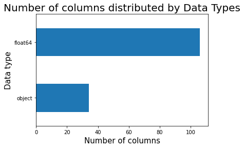
    


### Categorical Variable Exploration & Understanding

#### Loan Distribution by Amount & Issue Date


```python
fig, ax = plt.subplots(1, 3, figsize=(16,5))


loan_amount = df["loan_amnt"].values
funded_amount = df["funded_amnt"].values
investor_funds = df["funded_amnt_inv"].values

sns.distplot(loan_amount, ax=ax[0], color="#F7522F")
ax[0].set_title("Loan Applied by the Borrower", fontsize=14)
sns.distplot(funded_amount, ax=ax[1], color="#2F8FF7")
ax[1].set_title("Amount Funded by the Lender", fontsize=14)
sns.distplot(investor_funds, ax=ax[2], color="#2EAD46")
ax[2].set_title("Total committed by Investors", fontsize=14)
```

    /usr/local/lib/python3.6/dist-packages/seaborn/distributions.py:2551: FutureWarning: `distplot` is a deprecated function and will be removed in a future version. Please adapt your code to use either `displot` (a figure-level function with similar flexibility) or `histplot` (an axes-level function for histograms).
      warnings.warn(msg, FutureWarning)
    /usr/local/lib/python3.6/dist-packages/seaborn/distributions.py:2551: FutureWarning: `distplot` is a deprecated function and will be removed in a future version. Please adapt your code to use either `displot` (a figure-level function with similar flexibility) or `histplot` (an axes-level function for histograms).
      warnings.warn(msg, FutureWarning)
    /usr/local/lib/python3.6/dist-packages/seaborn/distributions.py:2551: FutureWarning: `distplot` is a deprecated function and will be removed in a future version. Please adapt your code to use either `displot` (a figure-level function with similar flexibility) or `histplot` (an axes-level function for histograms).
      warnings.warn(msg, FutureWarning)


    Text(0.5, 1.0, 'Total committed by Investors')


    
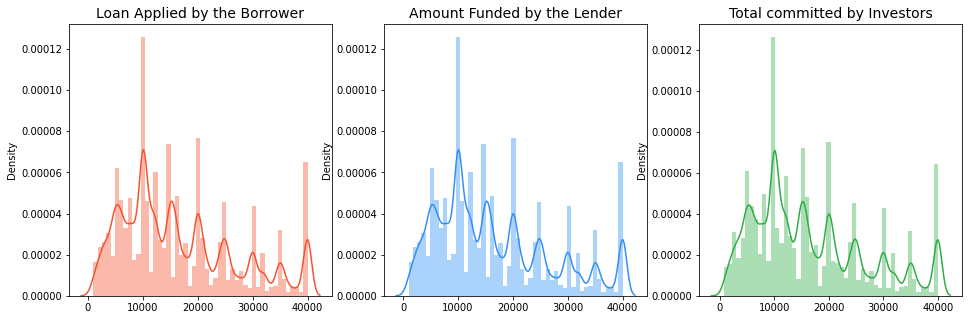
    


```python
df['loan_amnt'].sum()
```


    8533442875.0


```python
df['loan_amnt'].describe()
```


    count    518107.000000
    mean      16470.425752
    std       10355.586089
    min        1000.000000
    25%        8500.000000
    50%       14400.000000
    75%       23000.000000
    max       40000.000000
    Name: loan_amnt, dtype: float64


```python
# Transforming the loan issue dates by year
dt_series = pd.to_datetime(df['issue_d'])
df['month'] = dt_series.dt.month
```


```python
# Plotting the above to acquire the distribution of loans
plt.figure(figsize=(12,8))
sns.barplot('month', 'loan_amnt', data=df, palette='tab10', estimator = sum)
plt.title('Issuance of Loans', fontsize=16)
plt.xlabel('Month', fontsize=14)
plt.ylabel('Total Loan Amount Issued by Month', fontsize=14);
```

    /usr/local/lib/python3.6/dist-packages/seaborn/_decorators.py:43: FutureWarning: Pass the following variables as keyword args: x, y. From version 0.12, the only valid positional argument will be `data`, and passing other arguments without an explicit keyword will result in an error or misinterpretation.
      FutureWarning


    
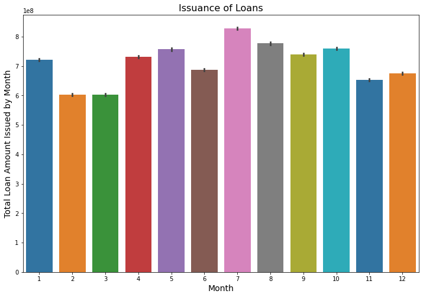
    


```python
plt.figure(figsize=(12,8))
sns.barplot('month', 'loan_amnt', data=df, palette='tab10')
plt.title('Issuance of Loans', fontsize=16)
plt.xlabel('Month', fontsize=14)
plt.ylabel('Average Loan Amount Issued by Month', fontsize=14);
```

    /usr/local/lib/python3.6/dist-packages/seaborn/_decorators.py:43: FutureWarning: Pass the following variables as keyword args: x, y. From version 0.12, the only valid positional argument will be `data`, and passing other arguments without an explicit keyword will result in an error or misinterpretation.
      FutureWarning


    
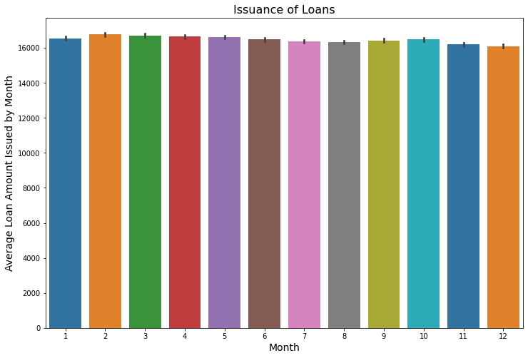
    


#### Distinguishing between Performing & Non-Peforming Loans

In order to predict whether a loan will be good or bad, it is important to make a definition based on the available loan status in our dataset. 


```python
df['loan_status'].value_counts()
```


    Current               431764
    Fully Paid             61840
    Charged Off            13487
    Late (31-120 days)      6228
    In Grace Period         3695
    Late (16-30 days)       1015
    Default                   78
    Name: loan_status, dtype: int64


```python
total = len(df)

plt.figure(figsize = (14,6))

g = sns.countplot(x="loan_status", data=df, 
                  color='green')
g.set_xticklabels(g.get_xticklabels(),rotation= 90)
g.set_xlabel("Loan Status Categories", fontsize=12)
g.set_ylabel("Count of Loans", fontsize=15)
g.set_title("Loan Status Types Distribution", fontsize=20)
sizes=[]
for p in g.patches:
    height = p.get_height()
    sizes.append(height)
    g.text(p.get_x()+p.get_width()/2.,
            height + 3,
            '{:1.2f}%'.format(height/total*100),
            ha="center", fontsize=12) 
g.set_ylim(0, max(sizes) * 1.10)

plt.show()
```


    
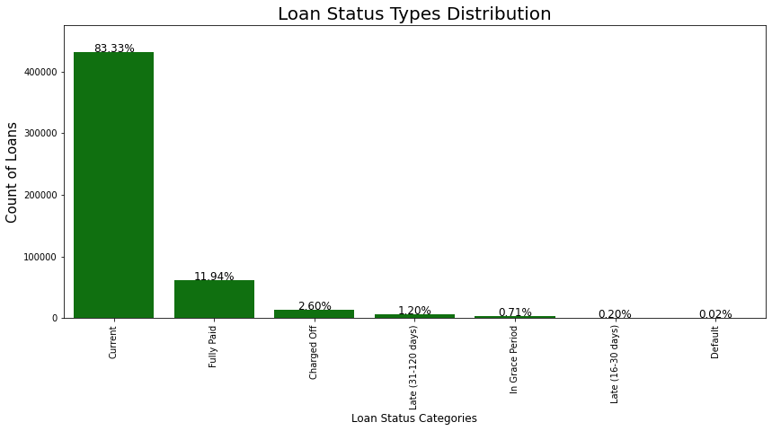
    


```python
# Determining the loans that are bad from loan_status column

# Creating a list with the statuses that shall be considered defaulted

defaulted_loan = ['Charged Off', 'Late (31-120 days)', 'In Grace Period', 'Late (16-30 days)', 'Default']

df['loan_condition'] = np.nan

# Labeling the dataset for visualization
def loan_condition(status):
    if status in defaulted_loan:
        return 'NPL'
    else:
        return 'PL'
    
    
df['loan_condition'] = df['loan_status'].apply(loan_condition)
```


```python
f, ax = plt.subplots(1,2, figsize=(16,8))

colors = ["#3791D7", "#D72626"]
labels ="PL", "NPL"

plt.suptitle('Information on Loan Conditions', fontsize=20)

df["loan_condition"].value_counts().plot.pie(explode=[0,0.25], autopct='%1.2f%%', ax=ax[0], shadow=True, colors=colors, 
                                             labels=labels, fontsize=12, startangle=70)


# ax[0].set_title('State of Loan', fontsize=16)
ax[0].set_ylabel('% of Condition of Loans', fontsize=14)

# sns.countplot('loan_condition', data=df, ax=ax[1], palette=colors)
# ax[1].set_title('Condition of Loans', fontsize=20)
# ax[1].set_xticklabels(['Good', 'Bad'], rotation='horizontal')
palette = ["#3791D7", "#E01E1B"]

sns.barplot(x="month", y="loan_amnt", hue="loan_condition", data=df, palette=palette, estimator=lambda x: len(x) / len(df) * 100)
ax[1].set(ylabel="(%)")
```


    [Text(0, 0.5, '(%)')]


    
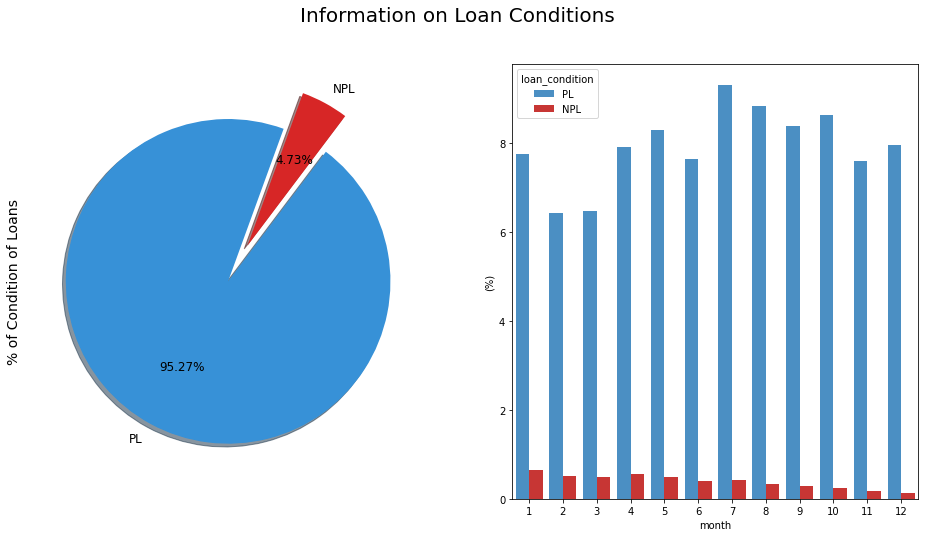
    


#### Evaluating the reasons behind credit applications


```python
plt.figure(figsize=(14,6))

g = sns.countplot(x='purpose', data=df, 
                  color='blue')
g.set_title("Client Purposes for Loan Credit", fontsize=22)
g.set_xlabel("Purpose Titles", fontsize=18)
g.set_ylabel('Loan Count', fontsize=18)

sizes=[]

for p in g.patches:
    height = p.get_height()
    sizes.append(height)
    g.text(p.get_x()+p.get_width()/2.,
            height + 3,
            '{:1.2f}%'.format(height/total*100),
            ha="center", fontsize=14) 
    
g.set_ylim(0, max(sizes) * 1.10)
g.set_xticklabels(g.get_xticklabels(),
                  rotation=45)

plt.show()
```


    
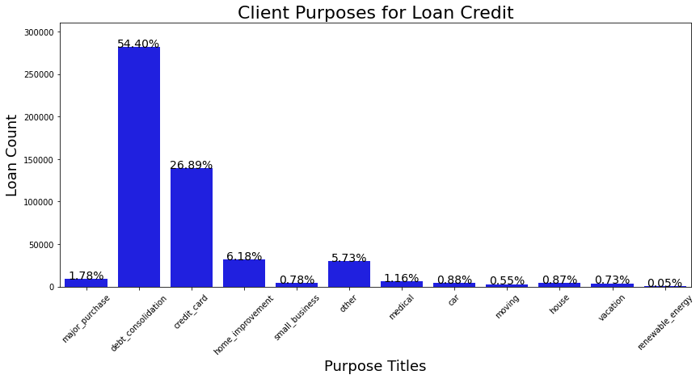
    


#### Loan Amount & Interest Rate Distributions


```python
# Converting the interest rate to an integer and assigning it to a new variable
df['int_round'] = df['int_rate'].str.replace('%', '').astype(float).round(0)

plt.figure(figsize=(14,10))

# Loan Amt plot
plt.subplot(211)
g = sns.distplot(df["loan_amnt"])
g.set_xlabel("Loan Amount Value", fontsize=16)
g.set_ylabel("Frequency", fontsize=16)
g.set_title("Loan Amount Distribuition", fontsize=20)

## Interest plot
plt.subplot(212)
g1 = sns.countplot(x="int_round", data=df, 
                  color='blue')
g1.set_xlabel("Loan Interest Rate", fontsize=16)
g1.set_ylabel("Count", fontsize=16)
g1.set_title("Interest Rate Distribuition", fontsize=20)
sizes=[] # Get highest values in y
for p in g1.patches:
    height = p.get_height()
    sizes.append(height)
    g1.text(p.get_x()+p.get_width()/2.,
            height + 3,
            '{:1.2f}%'.format(height/total*100),
            ha="center", fontsize=12) 
g1.set_ylim(0, max(sizes) * 1.10) # set y limit based on highest heights

plt.subplots_adjust(hspace = 0.4,top = 0.9)

plt.show()
```

    /usr/local/lib/python3.6/dist-packages/seaborn/distributions.py:2551: FutureWarning: `distplot` is a deprecated function and will be removed in a future version. Please adapt your code to use either `displot` (a figure-level function with similar flexibility) or `histplot` (an axes-level function for histograms).
      warnings.warn(msg, FutureWarning)


    
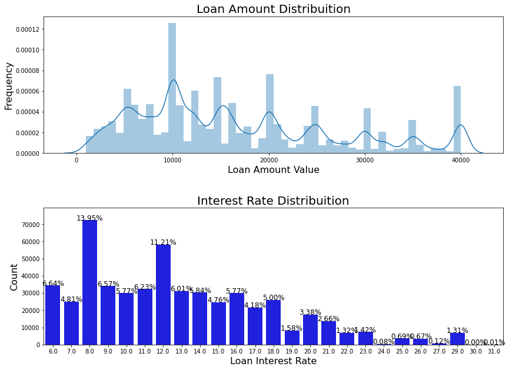
    


#### Breakdown of Default with Loan Tenor & Loan Size


```python
df['int_rate'].describe()
```


    count      518107
    unique         62
    top         8.19%
    freq        48628
    Name: int_rate, dtype: object


```python
plt.figure(figsize = (12,16))

plt.subplot(311)
g = sns.countplot(x="loan_condition", data=df, 
                  color='blue')
g.set_xticklabels(g.get_xticklabels(),rotation=45)
g.set_xlabel("Loan Status Categories", fontsize=12)
g.set_ylabel("Count", fontsize=15)
g.set_title("Loan Status Types Distribution", fontsize=20)
sizes=[]
for p in g.patches:
    height = p.get_height()
    sizes.append(height)
    g.text(p.get_x()+p.get_width()/2.,
            height + 3,
            '{:1.2f}%'.format(height/total*100),
            ha="center", fontsize=12) 
g.set_ylim(0, max(sizes) * 1.10)

plt.subplot(312)
g1 = sns.boxplot(x="loan_condition", y="int_round", data=df, 
                 color='blue')
g1.set_xticklabels(g1.get_xticklabels(),rotation=45)
g1.set_xlabel("Loan Status Categories", fontsize=12)
g1.set_ylabel("Interest Rate Distribution", fontsize=15)
g1.set_title("Loan Status by Interest Rate", fontsize=20)

plt.subplot(313)
g2 = sns.boxplot(x="loan_condition", y="loan_amnt", data=df, 
                 color='blue')
g2.set_xticklabels(g2.get_xticklabels(),rotation=45)
g2.set_xlabel("Loan Status Categories", fontsize=15)
g2.set_ylabel("Loan Amount Distribution", fontsize=15)
g2.set_title("Loan Status by Loan Amount", fontsize=20)

plt.subplots_adjust(hspace = 0.7,top = 0.9)

plt.show()
```


    
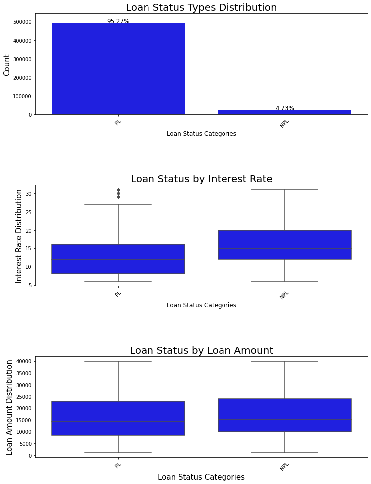
    


#### Loan Purpose vs. Loan Condition


```python
#Exploring the loan_status x purpose
purp_loan= ['purpose', 'loan_condition']
cm = sns.light_palette("green", as_cmap=True)
(round(pd.crosstab(df[purp_loan[0]], df[purp_loan[1]], 
                   normalize='columns') * 100,2)).style.background_gradient(cmap = cm)
```


<style  type="text/css" >
#T_beb4701c_517b_11eb_be4c_0242ac1c0002row0_col0,#T_beb4701c_517b_11eb_be4c_0242ac1c0002row7_col0,#T_beb4701c_517b_11eb_be4c_0242ac1c0002row7_col1,#T_beb4701c_517b_11eb_be4c_0242ac1c0002row11_col0{
            background-color:  #e9f2e9;
            color:  #000000;
        }#T_beb4701c_517b_11eb_be4c_0242ac1c0002row0_col1,#T_beb4701c_517b_11eb_be4c_0242ac1c0002row4_col1,#T_beb4701c_517b_11eb_be4c_0242ac1c0002row10_col1,#T_beb4701c_517b_11eb_be4c_0242ac1c0002row11_col1{
            background-color:  #e8f2e8;
            color:  #000000;
        }#T_beb4701c_517b_11eb_be4c_0242ac1c0002row1_col0{
            background-color:  #8fc68f;
            color:  #000000;
        }#T_beb4701c_517b_11eb_be4c_0242ac1c0002row1_col1{
            background-color:  #76ba76;
            color:  #000000;
        }#T_beb4701c_517b_11eb_be4c_0242ac1c0002row2_col0,#T_beb4701c_517b_11eb_be4c_0242ac1c0002row2_col1{
            background-color:  #008000;
            color:  #f1f1f1;
        }#T_beb4701c_517b_11eb_be4c_0242ac1c0002row3_col0,#T_beb4701c_517b_11eb_be4c_0242ac1c0002row8_col0{
            background-color:  #d4e8d4;
            color:  #000000;
        }#T_beb4701c_517b_11eb_be4c_0242ac1c0002row3_col1{
            background-color:  #d0e6d0;
            color:  #000000;
        }#T_beb4701c_517b_11eb_be4c_0242ac1c0002row4_col0{
            background-color:  #e7f1e7;
            color:  #000000;
        }#T_beb4701c_517b_11eb_be4c_0242ac1c0002row5_col0,#T_beb4701c_517b_11eb_be4c_0242ac1c0002row5_col1{
            background-color:  #e3efe3;
            color:  #000000;
        }#T_beb4701c_517b_11eb_be4c_0242ac1c0002row6_col0,#T_beb4701c_517b_11eb_be4c_0242ac1c0002row6_col1,#T_beb4701c_517b_11eb_be4c_0242ac1c0002row10_col0{
            background-color:  #e6f1e6;
            color:  #000000;
        }#T_beb4701c_517b_11eb_be4c_0242ac1c0002row8_col1{
            background-color:  #d3e7d3;
            color:  #000000;
        }#T_beb4701c_517b_11eb_be4c_0242ac1c0002row9_col0,#T_beb4701c_517b_11eb_be4c_0242ac1c0002row9_col1{
            background-color:  #ebf3eb;
            color:  #000000;
        }</style><table id="T_beb4701c_517b_11eb_be4c_0242ac1c0002" ><thead>    <tr>        <th class="index_name level0" >loan_condition</th>        <th class="col_heading level0 col0" >NPL</th>        <th class="col_heading level0 col1" >PL</th>    </tr>    <tr>        <th class="index_name level0" >purpose</th>        <th class="blank" ></th>        <th class="blank" ></th>    </tr></thead><tbody>
                <tr>
                        <th id="T_beb4701c_517b_11eb_be4c_0242ac1c0002level0_row0" class="row_heading level0 row0" >car</th>
                        <td id="T_beb4701c_517b_11eb_be4c_0242ac1c0002row0_col0" class="data row0 col0" >0.670000</td>
                        <td id="T_beb4701c_517b_11eb_be4c_0242ac1c0002row0_col1" class="data row0 col1" >0.890000</td>
            </tr>
            <tr>
                        <th id="T_beb4701c_517b_11eb_be4c_0242ac1c0002level0_row1" class="row_heading level0 row1" >credit_card</th>
                        <td id="T_beb4701c_517b_11eb_be4c_0242ac1c0002row1_col0" class="data row1 col0" >22.830000</td>
                        <td id="T_beb4701c_517b_11eb_be4c_0242ac1c0002row1_col1" class="data row1 col1" >27.090000</td>
            </tr>
            <tr>
                        <th id="T_beb4701c_517b_11eb_be4c_0242ac1c0002level0_row2" class="row_heading level0 row2" >debt_consolidation</th>
                        <td id="T_beb4701c_517b_11eb_be4c_0242ac1c0002row2_col0" class="data row2 col0" >57.940000</td>
                        <td id="T_beb4701c_517b_11eb_be4c_0242ac1c0002row2_col1" class="data row2 col1" >54.230000</td>
            </tr>
            <tr>
                        <th id="T_beb4701c_517b_11eb_be4c_0242ac1c0002level0_row3" class="row_heading level0 row3" >home_improvement</th>
                        <td id="T_beb4701c_517b_11eb_be4c_0242ac1c0002row3_col0" class="data row3 col0" >5.840000</td>
                        <td id="T_beb4701c_517b_11eb_be4c_0242ac1c0002row3_col1" class="data row3 col1" >6.200000</td>
            </tr>
            <tr>
                        <th id="T_beb4701c_517b_11eb_be4c_0242ac1c0002level0_row4" class="row_heading level0 row4" >house</th>
                        <td id="T_beb4701c_517b_11eb_be4c_0242ac1c0002row4_col0" class="data row4 col0" >1.050000</td>
                        <td id="T_beb4701c_517b_11eb_be4c_0242ac1c0002row4_col1" class="data row4 col1" >0.870000</td>
            </tr>
            <tr>
                        <th id="T_beb4701c_517b_11eb_be4c_0242ac1c0002level0_row5" class="row_heading level0 row5" >major_purchase</th>
                        <td id="T_beb4701c_517b_11eb_be4c_0242ac1c0002row5_col0" class="data row5 col0" >1.890000</td>
                        <td id="T_beb4701c_517b_11eb_be4c_0242ac1c0002row5_col1" class="data row5 col1" >1.780000</td>
            </tr>
            <tr>
                        <th id="T_beb4701c_517b_11eb_be4c_0242ac1c0002level0_row6" class="row_heading level0 row6" >medical</th>
                        <td id="T_beb4701c_517b_11eb_be4c_0242ac1c0002row6_col0" class="data row6 col0" >1.350000</td>
                        <td id="T_beb4701c_517b_11eb_be4c_0242ac1c0002row6_col1" class="data row6 col1" >1.150000</td>
            </tr>
            <tr>
                        <th id="T_beb4701c_517b_11eb_be4c_0242ac1c0002level0_row7" class="row_heading level0 row7" >moving</th>
                        <td id="T_beb4701c_517b_11eb_be4c_0242ac1c0002row7_col0" class="data row7 col0" >0.730000</td>
                        <td id="T_beb4701c_517b_11eb_be4c_0242ac1c0002row7_col1" class="data row7 col1" >0.540000</td>
            </tr>
            <tr>
                        <th id="T_beb4701c_517b_11eb_be4c_0242ac1c0002level0_row8" class="row_heading level0 row8" >other</th>
                        <td id="T_beb4701c_517b_11eb_be4c_0242ac1c0002row8_col0" class="data row8 col0" >5.740000</td>
                        <td id="T_beb4701c_517b_11eb_be4c_0242ac1c0002row8_col1" class="data row8 col1" >5.730000</td>
            </tr>
            <tr>
                        <th id="T_beb4701c_517b_11eb_be4c_0242ac1c0002level0_row9" class="row_heading level0 row9" >renewable_energy</th>
                        <td id="T_beb4701c_517b_11eb_be4c_0242ac1c0002row9_col0" class="data row9 col0" >0.070000</td>
                        <td id="T_beb4701c_517b_11eb_be4c_0242ac1c0002row9_col1" class="data row9 col1" >0.050000</td>
            </tr>
            <tr>
                        <th id="T_beb4701c_517b_11eb_be4c_0242ac1c0002level0_row10" class="row_heading level0 row10" >small_business</th>
                        <td id="T_beb4701c_517b_11eb_be4c_0242ac1c0002row10_col0" class="data row10 col0" >1.240000</td>
                        <td id="T_beb4701c_517b_11eb_be4c_0242ac1c0002row10_col1" class="data row10 col1" >0.760000</td>
            </tr>
            <tr>
                        <th id="T_beb4701c_517b_11eb_be4c_0242ac1c0002level0_row11" class="row_heading level0 row11" >vacation</th>
                        <td id="T_beb4701c_517b_11eb_be4c_0242ac1c0002row11_col0" class="data row11 col0" >0.660000</td>
                        <td id="T_beb4701c_517b_11eb_be4c_0242ac1c0002row11_col1" class="data row11 col1" >0.740000</td>
            </tr>
    </tbody></table>


```python
#Exploring the loan_status x purpose
purp_loan= ['purpose', 'loan_status']
cm = sns.light_palette("green", as_cmap=True)
(round(pd.crosstab(df[purp_loan[0]], df[purp_loan[1]], 
                   normalize='columns') * 100,2)).style.background_gradient(cmap = cm)
```


<style  type="text/css" >
#T_bec9a54a_517b_11eb_be4c_0242ac1c0002row0_col0,#T_bec9a54a_517b_11eb_be4c_0242ac1c0002row0_col1,#T_bec9a54a_517b_11eb_be4c_0242ac1c0002row4_col0,#T_bec9a54a_517b_11eb_be4c_0242ac1c0002row4_col1,#T_bec9a54a_517b_11eb_be4c_0242ac1c0002row7_col0,#T_bec9a54a_517b_11eb_be4c_0242ac1c0002row7_col3,#T_bec9a54a_517b_11eb_be4c_0242ac1c0002row7_col5,#T_bec9a54a_517b_11eb_be4c_0242ac1c0002row10_col1,#T_bec9a54a_517b_11eb_be4c_0242ac1c0002row10_col3,#T_bec9a54a_517b_11eb_be4c_0242ac1c0002row11_col0,#T_bec9a54a_517b_11eb_be4c_0242ac1c0002row11_col1{
            background-color:  #e8f2e8;
            color:  #000000;
        }#T_bec9a54a_517b_11eb_be4c_0242ac1c0002row0_col2,#T_bec9a54a_517b_11eb_be4c_0242ac1c0002row0_col3,#T_bec9a54a_517b_11eb_be4c_0242ac1c0002row4_col3,#T_bec9a54a_517b_11eb_be4c_0242ac1c0002row4_col5,#T_bec9a54a_517b_11eb_be4c_0242ac1c0002row10_col0{
            background-color:  #e6f1e6;
            color:  #000000;
        }#T_bec9a54a_517b_11eb_be4c_0242ac1c0002row0_col4,#T_bec9a54a_517b_11eb_be4c_0242ac1c0002row7_col4,#T_bec9a54a_517b_11eb_be4c_0242ac1c0002row11_col4{
            background-color:  #eaf2ea;
            color:  #000000;
        }#T_bec9a54a_517b_11eb_be4c_0242ac1c0002row0_col5,#T_bec9a54a_517b_11eb_be4c_0242ac1c0002row4_col4,#T_bec9a54a_517b_11eb_be4c_0242ac1c0002row4_col6,#T_bec9a54a_517b_11eb_be4c_0242ac1c0002row6_col1,#T_bec9a54a_517b_11eb_be4c_0242ac1c0002row6_col4,#T_bec9a54a_517b_11eb_be4c_0242ac1c0002row6_col6,#T_bec9a54a_517b_11eb_be4c_0242ac1c0002row10_col4,#T_bec9a54a_517b_11eb_be4c_0242ac1c0002row10_col5,#T_bec9a54a_517b_11eb_be4c_0242ac1c0002row10_col6,#T_bec9a54a_517b_11eb_be4c_0242ac1c0002row11_col3{
            background-color:  #e7f1e7;
            color:  #000000;
        }#T_bec9a54a_517b_11eb_be4c_0242ac1c0002row0_col6,#T_bec9a54a_517b_11eb_be4c_0242ac1c0002row7_col1,#T_bec9a54a_517b_11eb_be4c_0242ac1c0002row7_col6,#T_bec9a54a_517b_11eb_be4c_0242ac1c0002row11_col5,#T_bec9a54a_517b_11eb_be4c_0242ac1c0002row11_col6{
            background-color:  #e9f2e9;
            color:  #000000;
        }#T_bec9a54a_517b_11eb_be4c_0242ac1c0002row1_col0{
            background-color:  #91c791;
            color:  #000000;
        }#T_bec9a54a_517b_11eb_be4c_0242ac1c0002row1_col1{
            background-color:  #73b873;
            color:  #000000;
        }#T_bec9a54a_517b_11eb_be4c_0242ac1c0002row1_col2{
            background-color:  #7abc7a;
            color:  #000000;
        }#T_bec9a54a_517b_11eb_be4c_0242ac1c0002row1_col3{
            background-color:  #86c286;
            color:  #000000;
        }#T_bec9a54a_517b_11eb_be4c_0242ac1c0002row1_col4{
            background-color:  #8cc58c;
            color:  #000000;
        }#T_bec9a54a_517b_11eb_be4c_0242ac1c0002row1_col5,#T_bec9a54a_517b_11eb_be4c_0242ac1c0002row1_col6{
            background-color:  #8bc48b;
            color:  #000000;
        }#T_bec9a54a_517b_11eb_be4c_0242ac1c0002row2_col0,#T_bec9a54a_517b_11eb_be4c_0242ac1c0002row2_col1,#T_bec9a54a_517b_11eb_be4c_0242ac1c0002row2_col2,#T_bec9a54a_517b_11eb_be4c_0242ac1c0002row2_col3,#T_bec9a54a_517b_11eb_be4c_0242ac1c0002row2_col4,#T_bec9a54a_517b_11eb_be4c_0242ac1c0002row2_col5,#T_bec9a54a_517b_11eb_be4c_0242ac1c0002row2_col6{
            background-color:  #008000;
            color:  #f1f1f1;
        }#T_bec9a54a_517b_11eb_be4c_0242ac1c0002row3_col0{
            background-color:  #d2e7d2;
            color:  #000000;
        }#T_bec9a54a_517b_11eb_be4c_0242ac1c0002row3_col1{
            background-color:  #d1e6d1;
            color:  #000000;
        }#T_bec9a54a_517b_11eb_be4c_0242ac1c0002row3_col2,#T_bec9a54a_517b_11eb_be4c_0242ac1c0002row6_col2,#T_bec9a54a_517b_11eb_be4c_0242ac1c0002row7_col2,#T_bec9a54a_517b_11eb_be4c_0242ac1c0002row9_col0,#T_bec9a54a_517b_11eb_be4c_0242ac1c0002row9_col1,#T_bec9a54a_517b_11eb_be4c_0242ac1c0002row9_col2,#T_bec9a54a_517b_11eb_be4c_0242ac1c0002row9_col3,#T_bec9a54a_517b_11eb_be4c_0242ac1c0002row9_col4,#T_bec9a54a_517b_11eb_be4c_0242ac1c0002row9_col5,#T_bec9a54a_517b_11eb_be4c_0242ac1c0002row9_col6,#T_bec9a54a_517b_11eb_be4c_0242ac1c0002row10_col2,#T_bec9a54a_517b_11eb_be4c_0242ac1c0002row11_col2{
            background-color:  #ebf3eb;
            color:  #000000;
        }#T_bec9a54a_517b_11eb_be4c_0242ac1c0002row3_col3{
            background-color:  #c9e3c9;
            color:  #000000;
        }#T_bec9a54a_517b_11eb_be4c_0242ac1c0002row3_col4,#T_bec9a54a_517b_11eb_be4c_0242ac1c0002row3_col5,#T_bec9a54a_517b_11eb_be4c_0242ac1c0002row8_col1,#T_bec9a54a_517b_11eb_be4c_0242ac1c0002row8_col5{
            background-color:  #d4e8d4;
            color:  #000000;
        }#T_bec9a54a_517b_11eb_be4c_0242ac1c0002row3_col6,#T_bec9a54a_517b_11eb_be4c_0242ac1c0002row8_col6{
            background-color:  #d6e9d6;
            color:  #000000;
        }#T_bec9a54a_517b_11eb_be4c_0242ac1c0002row4_col2{
            background-color:  #dbebdb;
            color:  #000000;
        }#T_bec9a54a_517b_11eb_be4c_0242ac1c0002row5_col0{
            background-color:  #e2efe2;
            color:  #000000;
        }#T_bec9a54a_517b_11eb_be4c_0242ac1c0002row5_col1,#T_bec9a54a_517b_11eb_be4c_0242ac1c0002row5_col4,#T_bec9a54a_517b_11eb_be4c_0242ac1c0002row5_col5{
            background-color:  #e4f0e4;
            color:  #000000;
        }#T_bec9a54a_517b_11eb_be4c_0242ac1c0002row5_col2,#T_bec9a54a_517b_11eb_be4c_0242ac1c0002row8_col4{
            background-color:  #d5e9d5;
            color:  #000000;
        }#T_bec9a54a_517b_11eb_be4c_0242ac1c0002row5_col3{
            background-color:  #e0eee0;
            color:  #000000;
        }#T_bec9a54a_517b_11eb_be4c_0242ac1c0002row5_col6,#T_bec9a54a_517b_11eb_be4c_0242ac1c0002row6_col0,#T_bec9a54a_517b_11eb_be4c_0242ac1c0002row6_col3,#T_bec9a54a_517b_11eb_be4c_0242ac1c0002row6_col5{
            background-color:  #e5f0e5;
            color:  #000000;
        }#T_bec9a54a_517b_11eb_be4c_0242ac1c0002row8_col0{
            background-color:  #d3e7d3;
            color:  #000000;
        }#T_bec9a54a_517b_11eb_be4c_0242ac1c0002row8_col2{
            background-color:  #d0e6d0;
            color:  #000000;
        }#T_bec9a54a_517b_11eb_be4c_0242ac1c0002row8_col3{
            background-color:  #cbe4cb;
            color:  #000000;
        }</style><table id="T_bec9a54a_517b_11eb_be4c_0242ac1c0002" ><thead>    <tr>        <th class="index_name level0" >loan_status</th>        <th class="col_heading level0 col0" >Charged Off</th>        <th class="col_heading level0 col1" >Current</th>        <th class="col_heading level0 col2" >Default</th>        <th class="col_heading level0 col3" >Fully Paid</th>        <th class="col_heading level0 col4" >In Grace Period</th>        <th class="col_heading level0 col5" >Late (16-30 days)</th>        <th class="col_heading level0 col6" >Late (31-120 days)</th>    </tr>    <tr>        <th class="index_name level0" >purpose</th>        <th class="blank" ></th>        <th class="blank" ></th>        <th class="blank" ></th>        <th class="blank" ></th>        <th class="blank" ></th>        <th class="blank" ></th>        <th class="blank" ></th>    </tr></thead><tbody>
                <tr>
                        <th id="T_bec9a54a_517b_11eb_be4c_0242ac1c0002level0_row0" class="row_heading level0 row0" >car</th>
                        <td id="T_bec9a54a_517b_11eb_be4c_0242ac1c0002row0_col0" class="data row0 col0" >0.730000</td>
                        <td id="T_bec9a54a_517b_11eb_be4c_0242ac1c0002row0_col1" class="data row0 col1" >0.840000</td>
                        <td id="T_bec9a54a_517b_11eb_be4c_0242ac1c0002row0_col2" class="data row0 col2" >1.280000</td>
                        <td id="T_bec9a54a_517b_11eb_be4c_0242ac1c0002row0_col3" class="data row0 col3" >1.230000</td>
                        <td id="T_bec9a54a_517b_11eb_be4c_0242ac1c0002row0_col4" class="data row0 col4" >0.430000</td>
                        <td id="T_bec9a54a_517b_11eb_be4c_0242ac1c0002row0_col5" class="data row0 col5" >0.990000</td>
                        <td id="T_bec9a54a_517b_11eb_be4c_0242ac1c0002row0_col6" class="data row0 col6" >0.640000</td>
            </tr>
            <tr>
                        <th id="T_bec9a54a_517b_11eb_be4c_0242ac1c0002level0_row1" class="row_heading level0 row1" >credit_card</th>
                        <td id="T_bec9a54a_517b_11eb_be4c_0242ac1c0002row1_col0" class="data row1 col0" >22.010000</td>
                        <td id="T_bec9a54a_517b_11eb_be4c_0242ac1c0002row1_col1" class="data row1 col1" >27.690000</td>
                        <td id="T_bec9a54a_517b_11eb_be4c_0242ac1c0002row1_col2" class="data row1 col2" >26.920000</td>
                        <td id="T_bec9a54a_517b_11eb_be4c_0242ac1c0002row1_col3" class="data row1 col3" >22.900000</td>
                        <td id="T_bec9a54a_517b_11eb_be4c_0242ac1c0002row1_col4" class="data row1 col4" >23.710000</td>
                        <td id="T_bec9a54a_517b_11eb_be4c_0242ac1c0002row1_col5" class="data row1 col5" >23.450000</td>
                        <td id="T_bec9a54a_517b_11eb_be4c_0242ac1c0002row1_col6" class="data row1 col6" >23.920000</td>
            </tr>
            <tr>
                        <th id="T_bec9a54a_517b_11eb_be4c_0242ac1c0002level0_row2" class="row_heading level0 row2" >debt_consolidation</th>
                        <td id="T_bec9a54a_517b_11eb_be4c_0242ac1c0002row2_col0" class="data row2 col0" >57.600000</td>
                        <td id="T_bec9a54a_517b_11eb_be4c_0242ac1c0002row2_col1" class="data row2 col1" >54.350000</td>
                        <td id="T_bec9a54a_517b_11eb_be4c_0242ac1c0002row2_col2" class="data row2 col2" >56.410000</td>
                        <td id="T_bec9a54a_517b_11eb_be4c_0242ac1c0002row2_col3" class="data row2 col3" >53.360000</td>
                        <td id="T_bec9a54a_517b_11eb_be4c_0242ac1c0002row2_col4" class="data row2 col4" >58.810000</td>
                        <td id="T_bec9a54a_517b_11eb_be4c_0242ac1c0002row2_col5" class="data row2 col5" >57.540000</td>
                        <td id="T_bec9a54a_517b_11eb_be4c_0242ac1c0002row2_col6" class="data row2 col6" >58.250000</td>
            </tr>
            <tr>
                        <th id="T_bec9a54a_517b_11eb_be4c_0242ac1c0002level0_row3" class="row_heading level0 row3" >home_improvement</th>
                        <td id="T_bec9a54a_517b_11eb_be4c_0242ac1c0002row3_col0" class="data row3 col0" >6.190000</td>
                        <td id="T_bec9a54a_517b_11eb_be4c_0242ac1c0002row3_col1" class="data row3 col1" >5.990000</td>
                        <td id="T_bec9a54a_517b_11eb_be4c_0242ac1c0002row3_col2" class="data row3 col2" >0.000000</td>
                        <td id="T_bec9a54a_517b_11eb_be4c_0242ac1c0002row3_col3" class="data row3 col3" >7.680000</td>
                        <td id="T_bec9a54a_517b_11eb_be4c_0242ac1c0002row3_col4" class="data row3 col4" >5.760000</td>
                        <td id="T_bec9a54a_517b_11eb_be4c_0242ac1c0002row3_col5" class="data row3 col5" >5.710000</td>
                        <td id="T_bec9a54a_517b_11eb_be4c_0242ac1c0002row3_col6" class="data row3 col6" >5.200000</td>
            </tr>
            <tr>
                        <th id="T_bec9a54a_517b_11eb_be4c_0242ac1c0002level0_row4" class="row_heading level0 row4" >house</th>
                        <td id="T_bec9a54a_517b_11eb_be4c_0242ac1c0002row4_col0" class="data row4 col0" >0.900000</td>
                        <td id="T_bec9a54a_517b_11eb_be4c_0242ac1c0002row4_col1" class="data row4 col1" >0.820000</td>
                        <td id="T_bec9a54a_517b_11eb_be4c_0242ac1c0002row4_col2" class="data row4 col2" >3.850000</td>
                        <td id="T_bec9a54a_517b_11eb_be4c_0242ac1c0002row4_col3" class="data row4 col3" >1.210000</td>
                        <td id="T_bec9a54a_517b_11eb_be4c_0242ac1c0002row4_col4" class="data row4 col4" >1.110000</td>
                        <td id="T_bec9a54a_517b_11eb_be4c_0242ac1c0002row4_col5" class="data row4 col5" >1.280000</td>
                        <td id="T_bec9a54a_517b_11eb_be4c_0242ac1c0002row4_col6" class="data row4 col6" >1.270000</td>
            </tr>
            <tr>
                        <th id="T_bec9a54a_517b_11eb_be4c_0242ac1c0002level0_row5" class="row_heading level0 row5" >major_purchase</th>
                        <td id="T_bec9a54a_517b_11eb_be4c_0242ac1c0002row5_col0" class="data row5 col0" >2.070000</td>
                        <td id="T_bec9a54a_517b_11eb_be4c_0242ac1c0002row5_col1" class="data row5 col1" >1.690000</td>
                        <td id="T_bec9a54a_517b_11eb_be4c_0242ac1c0002row5_col2" class="data row5 col2" >5.130000</td>
                        <td id="T_bec9a54a_517b_11eb_be4c_0242ac1c0002row5_col3" class="data row5 col3" >2.390000</td>
                        <td id="T_bec9a54a_517b_11eb_be4c_0242ac1c0002row5_col4" class="data row5 col4" >1.680000</td>
                        <td id="T_bec9a54a_517b_11eb_be4c_0242ac1c0002row5_col5" class="data row5 col5" >1.580000</td>
                        <td id="T_bec9a54a_517b_11eb_be4c_0242ac1c0002row5_col6" class="data row5 col6" >1.620000</td>
            </tr>
            <tr>
                        <th id="T_bec9a54a_517b_11eb_be4c_0242ac1c0002level0_row6" class="row_heading level0 row6" >medical</th>
                        <td id="T_bec9a54a_517b_11eb_be4c_0242ac1c0002row6_col0" class="data row6 col0" >1.490000</td>
                        <td id="T_bec9a54a_517b_11eb_be4c_0242ac1c0002row6_col1" class="data row6 col1" >1.110000</td>
                        <td id="T_bec9a54a_517b_11eb_be4c_0242ac1c0002row6_col2" class="data row6 col2" >0.000000</td>
                        <td id="T_bec9a54a_517b_11eb_be4c_0242ac1c0002row6_col3" class="data row6 col3" >1.440000</td>
                        <td id="T_bec9a54a_517b_11eb_be4c_0242ac1c0002row6_col4" class="data row6 col4" >1.080000</td>
                        <td id="T_bec9a54a_517b_11eb_be4c_0242ac1c0002row6_col5" class="data row6 col5" >1.480000</td>
                        <td id="T_bec9a54a_517b_11eb_be4c_0242ac1c0002row6_col6" class="data row6 col6" >1.200000</td>
            </tr>
            <tr>
                        <th id="T_bec9a54a_517b_11eb_be4c_0242ac1c0002level0_row7" class="row_heading level0 row7" >moving</th>
                        <td id="T_bec9a54a_517b_11eb_be4c_0242ac1c0002row7_col0" class="data row7 col0" >0.850000</td>
                        <td id="T_bec9a54a_517b_11eb_be4c_0242ac1c0002row7_col1" class="data row7 col1" >0.500000</td>
                        <td id="T_bec9a54a_517b_11eb_be4c_0242ac1c0002row7_col2" class="data row7 col2" >0.000000</td>
                        <td id="T_bec9a54a_517b_11eb_be4c_0242ac1c0002row7_col3" class="data row7 col3" >0.780000</td>
                        <td id="T_bec9a54a_517b_11eb_be4c_0242ac1c0002row7_col4" class="data row7 col4" >0.430000</td>
                        <td id="T_bec9a54a_517b_11eb_be4c_0242ac1c0002row7_col5" class="data row7 col5" >0.790000</td>
                        <td id="T_bec9a54a_517b_11eb_be4c_0242ac1c0002row7_col6" class="data row7 col6" >0.640000</td>
            </tr>
            <tr>
                        <th id="T_bec9a54a_517b_11eb_be4c_0242ac1c0002level0_row8" class="row_heading level0 row8" >other</th>
                        <td id="T_bec9a54a_517b_11eb_be4c_0242ac1c0002row8_col0" class="data row8 col0" >6.070000</td>
                        <td id="T_bec9a54a_517b_11eb_be4c_0242ac1c0002row8_col1" class="data row8 col1" >5.510000</td>
                        <td id="T_bec9a54a_517b_11eb_be4c_0242ac1c0002row8_col2" class="data row8 col2" >6.410000</td>
                        <td id="T_bec9a54a_517b_11eb_be4c_0242ac1c0002row8_col3" class="data row8 col3" >7.230000</td>
                        <td id="T_bec9a54a_517b_11eb_be4c_0242ac1c0002row8_col4" class="data row8 col4" >5.330000</td>
                        <td id="T_bec9a54a_517b_11eb_be4c_0242ac1c0002row8_col5" class="data row8 col5" >5.620000</td>
                        <td id="T_bec9a54a_517b_11eb_be4c_0242ac1c0002row8_col6" class="data row8 col6" >5.280000</td>
            </tr>
            <tr>
                        <th id="T_bec9a54a_517b_11eb_be4c_0242ac1c0002level0_row9" class="row_heading level0 row9" >renewable_energy</th>
                        <td id="T_bec9a54a_517b_11eb_be4c_0242ac1c0002row9_col0" class="data row9 col0" >0.040000</td>
                        <td id="T_bec9a54a_517b_11eb_be4c_0242ac1c0002row9_col1" class="data row9 col1" >0.050000</td>
                        <td id="T_bec9a54a_517b_11eb_be4c_0242ac1c0002row9_col2" class="data row9 col2" >0.000000</td>
                        <td id="T_bec9a54a_517b_11eb_be4c_0242ac1c0002row9_col3" class="data row9 col3" >0.060000</td>
                        <td id="T_bec9a54a_517b_11eb_be4c_0242ac1c0002row9_col4" class="data row9 col4" >0.050000</td>
                        <td id="T_bec9a54a_517b_11eb_be4c_0242ac1c0002row9_col5" class="data row9 col5" >0.000000</td>
                        <td id="T_bec9a54a_517b_11eb_be4c_0242ac1c0002row9_col6" class="data row9 col6" >0.140000</td>
            </tr>
            <tr>
                        <th id="T_bec9a54a_517b_11eb_be4c_0242ac1c0002level0_row10" class="row_heading level0 row10" >small_business</th>
                        <td id="T_bec9a54a_517b_11eb_be4c_0242ac1c0002row10_col0" class="data row10 col0" >1.330000</td>
                        <td id="T_bec9a54a_517b_11eb_be4c_0242ac1c0002row10_col1" class="data row10 col1" >0.770000</td>
                        <td id="T_bec9a54a_517b_11eb_be4c_0242ac1c0002row10_col2" class="data row10 col2" >0.000000</td>
                        <td id="T_bec9a54a_517b_11eb_be4c_0242ac1c0002row10_col3" class="data row10 col3" >0.700000</td>
                        <td id="T_bec9a54a_517b_11eb_be4c_0242ac1c0002row10_col4" class="data row10 col4" >1.160000</td>
                        <td id="T_bec9a54a_517b_11eb_be4c_0242ac1c0002row10_col5" class="data row10 col5" >0.990000</td>
                        <td id="T_bec9a54a_517b_11eb_be4c_0242ac1c0002row10_col6" class="data row10 col6" >1.170000</td>
            </tr>
            <tr>
                        <th id="T_bec9a54a_517b_11eb_be4c_0242ac1c0002level0_row11" class="row_heading level0 row11" >vacation</th>
                        <td id="T_bec9a54a_517b_11eb_be4c_0242ac1c0002row11_col0" class="data row11 col0" >0.730000</td>
                        <td id="T_bec9a54a_517b_11eb_be4c_0242ac1c0002row11_col1" class="data row11 col1" >0.700000</td>
                        <td id="T_bec9a54a_517b_11eb_be4c_0242ac1c0002row11_col2" class="data row11 col2" >0.000000</td>
                        <td id="T_bec9a54a_517b_11eb_be4c_0242ac1c0002row11_col3" class="data row11 col3" >1.020000</td>
                        <td id="T_bec9a54a_517b_11eb_be4c_0242ac1c0002row11_col4" class="data row11 col4" >0.430000</td>
                        <td id="T_bec9a54a_517b_11eb_be4c_0242ac1c0002row11_col5" class="data row11 col5" >0.590000</td>
                        <td id="T_bec9a54a_517b_11eb_be4c_0242ac1c0002row11_col6" class="data row11 col6" >0.640000</td>
            </tr>
    </tbody></table>


#### Portfolio Quality by Grade


```python
loan_grade = ['loan_condition', 'grade']
cm = sns.light_palette("green", as_cmap=True)
pd.crosstab(df[loan_grade[0]], df[loan_grade[1]]).style.background_gradient(cmap = cm)
```


<style  type="text/css" >
#T_bedc26a2_517b_11eb_be4c_0242ac1c0002row0_col0,#T_bedc26a2_517b_11eb_be4c_0242ac1c0002row0_col1,#T_bedc26a2_517b_11eb_be4c_0242ac1c0002row0_col2,#T_bedc26a2_517b_11eb_be4c_0242ac1c0002row0_col3,#T_bedc26a2_517b_11eb_be4c_0242ac1c0002row0_col4,#T_bedc26a2_517b_11eb_be4c_0242ac1c0002row0_col5,#T_bedc26a2_517b_11eb_be4c_0242ac1c0002row0_col6{
            background-color:  #ebf3eb;
            color:  #000000;
        }#T_bedc26a2_517b_11eb_be4c_0242ac1c0002row1_col0,#T_bedc26a2_517b_11eb_be4c_0242ac1c0002row1_col1,#T_bedc26a2_517b_11eb_be4c_0242ac1c0002row1_col2,#T_bedc26a2_517b_11eb_be4c_0242ac1c0002row1_col3,#T_bedc26a2_517b_11eb_be4c_0242ac1c0002row1_col4,#T_bedc26a2_517b_11eb_be4c_0242ac1c0002row1_col5,#T_bedc26a2_517b_11eb_be4c_0242ac1c0002row1_col6{
            background-color:  #008000;
            color:  #f1f1f1;
        }</style><table id="T_bedc26a2_517b_11eb_be4c_0242ac1c0002" ><thead>    <tr>        <th class="index_name level0" >grade</th>        <th class="col_heading level0 col0" >A</th>        <th class="col_heading level0 col1" >B</th>        <th class="col_heading level0 col2" >C</th>        <th class="col_heading level0 col3" >D</th>        <th class="col_heading level0 col4" >E</th>        <th class="col_heading level0 col5" >F</th>        <th class="col_heading level0 col6" >G</th>    </tr>    <tr>        <th class="index_name level0" >loan_condition</th>        <th class="blank" ></th>        <th class="blank" ></th>        <th class="blank" ></th>        <th class="blank" ></th>        <th class="blank" ></th>        <th class="blank" ></th>        <th class="blank" ></th>    </tr></thead><tbody>
                <tr>
                        <th id="T_bedc26a2_517b_11eb_be4c_0242ac1c0002level0_row0" class="row_heading level0 row0" >NPL</th>
                        <td id="T_bedc26a2_517b_11eb_be4c_0242ac1c0002row0_col0" class="data row0 col0" >3288</td>
                        <td id="T_bedc26a2_517b_11eb_be4c_0242ac1c0002row0_col1" class="data row0 col1" >5746</td>
                        <td id="T_bedc26a2_517b_11eb_be4c_0242ac1c0002row0_col2" class="data row0 col2" >7783</td>
                        <td id="T_bedc26a2_517b_11eb_be4c_0242ac1c0002row0_col3" class="data row0 col3" >7054</td>
                        <td id="T_bedc26a2_517b_11eb_be4c_0242ac1c0002row0_col4" class="data row0 col4" >624</td>
                        <td id="T_bedc26a2_517b_11eb_be4c_0242ac1c0002row0_col5" class="data row0 col5" >7</td>
                        <td id="T_bedc26a2_517b_11eb_be4c_0242ac1c0002row0_col6" class="data row0 col6" >1</td>
            </tr>
            <tr>
                        <th id="T_bedc26a2_517b_11eb_be4c_0242ac1c0002level0_row1" class="row_heading level0 row1" >PL</th>
                        <td id="T_bedc26a2_517b_11eb_be4c_0242ac1c0002row1_col0" class="data row1 col0" >162349</td>
                        <td id="T_bedc26a2_517b_11eb_be4c_0242ac1c0002row1_col1" class="data row1 col1" >145690</td>
                        <td id="T_bedc26a2_517b_11eb_be4c_0242ac1c0002row1_col2" class="data row1 col2" >114612</td>
                        <td id="T_bedc26a2_517b_11eb_be4c_0242ac1c0002row1_col3" class="data row1 col3" >68135</td>
                        <td id="T_bedc26a2_517b_11eb_be4c_0242ac1c0002row1_col4" class="data row1 col4" >2773</td>
                        <td id="T_bedc26a2_517b_11eb_be4c_0242ac1c0002row1_col5" class="data row1 col5" >29</td>
                        <td id="T_bedc26a2_517b_11eb_be4c_0242ac1c0002row1_col6" class="data row1 col6" >16</td>
            </tr>
    </tbody></table>


#### Evaluating Interest Rate by Loan Grade & Condition


```python
# Converting the interest rate to an integer and reassign it to the same variable
df['int_rate'] = df['int_rate'].str.replace('%', '').astype(float)
```


```python
loan_grade = ['loan_condition', 'grade']
cm = sns.light_palette("green", as_cmap=True)
round(pd.crosstab(df[loan_grade[0]], df[loan_grade[1]], 
            values=df['int_rate'], aggfunc='mean'),2).fillna(0).style.background_gradient(cmap = cm)
```


<style  type="text/css" >
#T_bf206d44_517b_11eb_be4c_0242ac1c0002row0_col0,#T_bf206d44_517b_11eb_be4c_0242ac1c0002row0_col1,#T_bf206d44_517b_11eb_be4c_0242ac1c0002row0_col2,#T_bf206d44_517b_11eb_be4c_0242ac1c0002row0_col3,#T_bf206d44_517b_11eb_be4c_0242ac1c0002row0_col4,#T_bf206d44_517b_11eb_be4c_0242ac1c0002row0_col5,#T_bf206d44_517b_11eb_be4c_0242ac1c0002row0_col6{
            background-color:  #008000;
            color:  #f1f1f1;
        }#T_bf206d44_517b_11eb_be4c_0242ac1c0002row1_col0,#T_bf206d44_517b_11eb_be4c_0242ac1c0002row1_col1,#T_bf206d44_517b_11eb_be4c_0242ac1c0002row1_col2,#T_bf206d44_517b_11eb_be4c_0242ac1c0002row1_col3,#T_bf206d44_517b_11eb_be4c_0242ac1c0002row1_col4,#T_bf206d44_517b_11eb_be4c_0242ac1c0002row1_col5,#T_bf206d44_517b_11eb_be4c_0242ac1c0002row1_col6{
            background-color:  #ebf3eb;
            color:  #000000;
        }</style><table id="T_bf206d44_517b_11eb_be4c_0242ac1c0002" ><thead>    <tr>        <th class="index_name level0" >grade</th>        <th class="col_heading level0 col0" >A</th>        <th class="col_heading level0 col1" >B</th>        <th class="col_heading level0 col2" >C</th>        <th class="col_heading level0 col3" >D</th>        <th class="col_heading level0 col4" >E</th>        <th class="col_heading level0 col5" >F</th>        <th class="col_heading level0 col6" >G</th>    </tr>    <tr>        <th class="index_name level0" >loan_condition</th>        <th class="blank" ></th>        <th class="blank" ></th>        <th class="blank" ></th>        <th class="blank" ></th>        <th class="blank" ></th>        <th class="blank" ></th>        <th class="blank" ></th>    </tr></thead><tbody>
                <tr>
                        <th id="T_bf206d44_517b_11eb_be4c_0242ac1c0002level0_row0" class="row_heading level0 row0" >NPL</th>
                        <td id="T_bf206d44_517b_11eb_be4c_0242ac1c0002row0_col0" class="data row0 col0" >7.850000</td>
                        <td id="T_bf206d44_517b_11eb_be4c_0242ac1c0002row0_col1" class="data row0 col1" >11.830000</td>
                        <td id="T_bf206d44_517b_11eb_be4c_0242ac1c0002row0_col2" class="data row0 col2" >15.800000</td>
                        <td id="T_bf206d44_517b_11eb_be4c_0242ac1c0002row0_col3" class="data row0 col3" >21.640000</td>
                        <td id="T_bf206d44_517b_11eb_be4c_0242ac1c0002row0_col4" class="data row0 col4" >25.360000</td>
                        <td id="T_bf206d44_517b_11eb_be4c_0242ac1c0002row0_col5" class="data row0 col5" >30.000000</td>
                        <td id="T_bf206d44_517b_11eb_be4c_0242ac1c0002row0_col6" class="data row0 col6" >30.840000</td>
            </tr>
            <tr>
                        <th id="T_bf206d44_517b_11eb_be4c_0242ac1c0002level0_row1" class="row_heading level0 row1" >PL</th>
                        <td id="T_bf206d44_517b_11eb_be4c_0242ac1c0002row1_col0" class="data row1 col0" >7.690000</td>
                        <td id="T_bf206d44_517b_11eb_be4c_0242ac1c0002row1_col1" class="data row1 col1" >11.710000</td>
                        <td id="T_bf206d44_517b_11eb_be4c_0242ac1c0002row1_col2" class="data row1 col2" >15.760000</td>
                        <td id="T_bf206d44_517b_11eb_be4c_0242ac1c0002row1_col3" class="data row1 col3" >21.330000</td>
                        <td id="T_bf206d44_517b_11eb_be4c_0242ac1c0002row1_col4" class="data row1 col4" >25.260000</td>
                        <td id="T_bf206d44_517b_11eb_be4c_0242ac1c0002row1_col5" class="data row1 col5" >29.900000</td>
                        <td id="T_bf206d44_517b_11eb_be4c_0242ac1c0002row1_col6" class="data row1 col6" >30.820000</td>
            </tr>
    </tbody></table>


#### Evaluating Lending Club's KYC Protocols & Income Verification


```python
plt.figure(figsize = (13,6))

g = sns.countplot(x="verification_status", data=df, 
                  color='blue')
g.set_xlabel("Loan Status Categories", fontsize=15)
g.set_ylabel("Count", fontsize=15)
g.set_title("Loan Status Types Distribution", fontsize=20)
sizes=[]
for p in g.patches:
    height = p.get_height()
    sizes.append(height)
    g.text(p.get_x()+p.get_width()/2.,
            height + 3,
            '{:1.2f}%'.format(height/total*100),
            ha="center", fontsize=14) 
g.set_ylim(0, max(sizes) * 1.10)

plt.show()
```


    
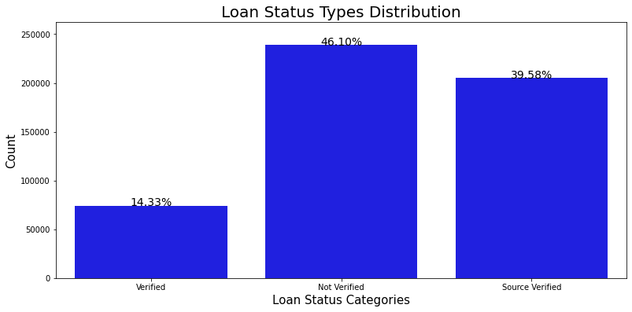
    


#### Loan Performance vs. Income Verification


```python
loan_verification = ['loan_condition', 'verification_status']
cm = sns.light_palette("green", as_cmap=True)
pd.crosstab(df[loan_verification[0]], df[loan_verification[1]], 
            normalize='index').style.background_gradient(cmap = cm)
```


<style  type="text/css" >
#T_c210a47e_517b_11eb_be4c_0242ac1c0002row0_col0,#T_c210a47e_517b_11eb_be4c_0242ac1c0002row0_col1,#T_c210a47e_517b_11eb_be4c_0242ac1c0002row1_col2{
            background-color:  #ebf3eb;
            color:  #000000;
        }#T_c210a47e_517b_11eb_be4c_0242ac1c0002row0_col2,#T_c210a47e_517b_11eb_be4c_0242ac1c0002row1_col0,#T_c210a47e_517b_11eb_be4c_0242ac1c0002row1_col1{
            background-color:  #008000;
            color:  #f1f1f1;
        }</style><table id="T_c210a47e_517b_11eb_be4c_0242ac1c0002" ><thead>    <tr>        <th class="index_name level0" >verification_status</th>        <th class="col_heading level0 col0" >Not Verified</th>        <th class="col_heading level0 col1" >Source Verified</th>        <th class="col_heading level0 col2" >Verified</th>    </tr>    <tr>        <th class="index_name level0" >loan_condition</th>        <th class="blank" ></th>        <th class="blank" ></th>        <th class="blank" ></th>    </tr></thead><tbody>
                <tr>
                        <th id="T_c210a47e_517b_11eb_be4c_0242ac1c0002level0_row0" class="row_heading level0 row0" >NPL</th>
                        <td id="T_c210a47e_517b_11eb_be4c_0242ac1c0002row0_col0" class="data row0 col0" >0.410888</td>
                        <td id="T_c210a47e_517b_11eb_be4c_0242ac1c0002row0_col1" class="data row0 col1" >0.392034</td>
                        <td id="T_c210a47e_517b_11eb_be4c_0242ac1c0002row0_col2" class="data row0 col2" >0.197078</td>
            </tr>
            <tr>
                        <th id="T_c210a47e_517b_11eb_be4c_0242ac1c0002level0_row1" class="row_heading level0 row1" >PL</th>
                        <td id="T_c210a47e_517b_11eb_be4c_0242ac1c0002row1_col0" class="data row1 col0" >0.463477</td>
                        <td id="T_c210a47e_517b_11eb_be4c_0242ac1c0002row1_col1" class="data row1 col1" >0.395935</td>
                        <td id="T_c210a47e_517b_11eb_be4c_0242ac1c0002row1_col2" class="data row1 col2" >0.140588</td>
            </tr>
    </tbody></table>


```python
loan_verification = ['loan_status', 'verification_status']
cm = sns.light_palette("green", as_cmap=True)
pd.crosstab(df[loan_verification[0]], df[loan_verification[1]], 
            normalize='index').style.background_gradient(cmap = cm)
```


<style  type="text/css" >
#T_c2236064_517b_11eb_be4c_0242ac1c0002row0_col0{
            background-color:  #cbe4cb;
            color:  #000000;
        }#T_c2236064_517b_11eb_be4c_0242ac1c0002row0_col1{
            background-color:  #2a952a;
            color:  #000000;
        }#T_c2236064_517b_11eb_be4c_0242ac1c0002row0_col2{
            background-color:  #69b369;
            color:  #000000;
        }#T_c2236064_517b_11eb_be4c_0242ac1c0002row1_col0{
            background-color:  #028102;
            color:  #f1f1f1;
        }#T_c2236064_517b_11eb_be4c_0242ac1c0002row1_col1{
            background-color:  #1c8e1c;
            color:  #000000;
        }#T_c2236064_517b_11eb_be4c_0242ac1c0002row1_col2,#T_c2236064_517b_11eb_be4c_0242ac1c0002row2_col1,#T_c2236064_517b_11eb_be4c_0242ac1c0002row4_col0{
            background-color:  #ebf3eb;
            color:  #000000;
        }#T_c2236064_517b_11eb_be4c_0242ac1c0002row2_col0{
            background-color:  #8fc68f;
            color:  #000000;
        }#T_c2236064_517b_11eb_be4c_0242ac1c0002row2_col2,#T_c2236064_517b_11eb_be4c_0242ac1c0002row4_col1,#T_c2236064_517b_11eb_be4c_0242ac1c0002row5_col0{
            background-color:  #008000;
            color:  #f1f1f1;
        }#T_c2236064_517b_11eb_be4c_0242ac1c0002row3_col0{
            background-color:  #1b8d1b;
            color:  #000000;
        }#T_c2236064_517b_11eb_be4c_0242ac1c0002row3_col1{
            background-color:  #108810;
            color:  #f1f1f1;
        }#T_c2236064_517b_11eb_be4c_0242ac1c0002row3_col2{
            background-color:  #e5f0e5;
            color:  #000000;
        }#T_c2236064_517b_11eb_be4c_0242ac1c0002row4_col2{
            background-color:  #75b975;
            color:  #000000;
        }#T_c2236064_517b_11eb_be4c_0242ac1c0002row5_col1{
            background-color:  #63b163;
            color:  #000000;
        }#T_c2236064_517b_11eb_be4c_0242ac1c0002row5_col2{
            background-color:  #b8dab8;
            color:  #000000;
        }#T_c2236064_517b_11eb_be4c_0242ac1c0002row6_col0{
            background-color:  #8ec58e;
            color:  #000000;
        }#T_c2236064_517b_11eb_be4c_0242ac1c0002row6_col1{
            background-color:  #259225;
            color:  #000000;
        }#T_c2236064_517b_11eb_be4c_0242ac1c0002row6_col2{
            background-color:  #91c791;
            color:  #000000;
        }</style><table id="T_c2236064_517b_11eb_be4c_0242ac1c0002" ><thead>    <tr>        <th class="index_name level0" >verification_status</th>        <th class="col_heading level0 col0" >Not Verified</th>        <th class="col_heading level0 col1" >Source Verified</th>        <th class="col_heading level0 col2" >Verified</th>    </tr>    <tr>        <th class="index_name level0" >loan_status</th>        <th class="blank" ></th>        <th class="blank" ></th>        <th class="blank" ></th>    </tr></thead><tbody>
                <tr>
                        <th id="T_c2236064_517b_11eb_be4c_0242ac1c0002level0_row0" class="row_heading level0 row0" >Charged Off</th>
                        <td id="T_c2236064_517b_11eb_be4c_0242ac1c0002row0_col0" class="data row0 col0" >0.405131</td>
                        <td id="T_c2236064_517b_11eb_be4c_0242ac1c0002row0_col1" class="data row0 col1" >0.390376</td>
                        <td id="T_c2236064_517b_11eb_be4c_0242ac1c0002row0_col2" class="data row0 col2" >0.204493</td>
            </tr>
            <tr>
                        <th id="T_c2236064_517b_11eb_be4c_0242ac1c0002level0_row1" class="row_heading level0 row1" >Current</th>
                        <td id="T_c2236064_517b_11eb_be4c_0242ac1c0002row1_col0" class="data row1 col0" >0.464383</td>
                        <td id="T_c2236064_517b_11eb_be4c_0242ac1c0002row1_col1" class="data row1 col1" >0.395385</td>
                        <td id="T_c2236064_517b_11eb_be4c_0242ac1c0002row1_col2" class="data row1 col2" >0.140232</td>
            </tr>
            <tr>
                        <th id="T_c2236064_517b_11eb_be4c_0242ac1c0002level0_row2" class="row_heading level0 row2" >Default</th>
                        <td id="T_c2236064_517b_11eb_be4c_0242ac1c0002row2_col0" class="data row2 col0" >0.423077</td>
                        <td id="T_c2236064_517b_11eb_be4c_0242ac1c0002row2_col1" class="data row2 col1" >0.320513</td>
                        <td id="T_c2236064_517b_11eb_be4c_0242ac1c0002row2_col2" class="data row2 col2" >0.256410</td>
            </tr>
            <tr>
                        <th id="T_c2236064_517b_11eb_be4c_0242ac1c0002level0_row3" class="row_heading level0 row3" >Fully Paid</th>
                        <td id="T_c2236064_517b_11eb_be4c_0242ac1c0002row3_col0" class="data row3 col0" >0.457147</td>
                        <td id="T_c2236064_517b_11eb_be4c_0242ac1c0002row3_col1" class="data row3 col1" >0.399774</td>
                        <td id="T_c2236064_517b_11eb_be4c_0242ac1c0002row3_col2" class="data row3 col2" >0.143079</td>
            </tr>
            <tr>
                        <th id="T_c2236064_517b_11eb_be4c_0242ac1c0002level0_row4" class="row_heading level0 row4" >In Grace Period</th>
                        <td id="T_c2236064_517b_11eb_be4c_0242ac1c0002row4_col0" class="data row4 col0" >0.395940</td>
                        <td id="T_c2236064_517b_11eb_be4c_0242ac1c0002row4_col1" class="data row4 col1" >0.405683</td>
                        <td id="T_c2236064_517b_11eb_be4c_0242ac1c0002row4_col2" class="data row4 col2" >0.198376</td>
            </tr>
            <tr>
                        <th id="T_c2236064_517b_11eb_be4c_0242ac1c0002level0_row5" class="row_heading level0 row5" >Late (16-30 days)</th>
                        <td id="T_c2236064_517b_11eb_be4c_0242ac1c0002row5_col0" class="data row5 col0" >0.465025</td>
                        <td id="T_c2236064_517b_11eb_be4c_0242ac1c0002row5_col1" class="data row5 col1" >0.369458</td>
                        <td id="T_c2236064_517b_11eb_be4c_0242ac1c0002row5_col2" class="data row5 col2" >0.165517</td>
            </tr>
            <tr>
                        <th id="T_c2236064_517b_11eb_be4c_0242ac1c0002level0_row6" class="row_heading level0 row6" >Late (31-120 days)</th>
                        <td id="T_c2236064_517b_11eb_be4c_0242ac1c0002row6_col0" class="data row6 col0" >0.423250</td>
                        <td id="T_c2236064_517b_11eb_be4c_0242ac1c0002row6_col1" class="data row6 col1" >0.392100</td>
                        <td id="T_c2236064_517b_11eb_be4c_0242ac1c0002row6_col2" class="data row6 col2" >0.184650</td>
            </tr>
    </tbody></table>


#### Loan Performance vs Application Type (Joint vs Individual)


```python
loan_application = ['loan_condition', 'application_type']
cm = sns.light_palette("green", as_cmap=True)
pd.crosstab(df[loan_application[0]], df[loan_application[1]]).style.background_gradient(cmap = cm)
```


<style  type="text/css" >
#T_c234516c_517b_11eb_be4c_0242ac1c0002row0_col0,#T_c234516c_517b_11eb_be4c_0242ac1c0002row0_col1{
            background-color:  #ebf3eb;
            color:  #000000;
        }#T_c234516c_517b_11eb_be4c_0242ac1c0002row1_col0,#T_c234516c_517b_11eb_be4c_0242ac1c0002row1_col1{
            background-color:  #008000;
            color:  #f1f1f1;
        }</style><table id="T_c234516c_517b_11eb_be4c_0242ac1c0002" ><thead>    <tr>        <th class="index_name level0" >application_type</th>        <th class="col_heading level0 col0" >Individual</th>        <th class="col_heading level0 col1" >Joint App</th>    </tr>    <tr>        <th class="index_name level0" >loan_condition</th>        <th class="blank" ></th>        <th class="blank" ></th>    </tr></thead><tbody>
                <tr>
                        <th id="T_c234516c_517b_11eb_be4c_0242ac1c0002level0_row0" class="row_heading level0 row0" >NPL</th>
                        <td id="T_c234516c_517b_11eb_be4c_0242ac1c0002row0_col0" class="data row0 col0" >20753</td>
                        <td id="T_c234516c_517b_11eb_be4c_0242ac1c0002row0_col1" class="data row0 col1" >3750</td>
            </tr>
            <tr>
                        <th id="T_c234516c_517b_11eb_be4c_0242ac1c0002level0_row1" class="row_heading level0 row1" >PL</th>
                        <td id="T_c234516c_517b_11eb_be4c_0242ac1c0002row1_col0" class="data row1 col0" >425460</td>
                        <td id="T_c234516c_517b_11eb_be4c_0242ac1c0002row1_col1" class="data row1 col1" >68144</td>
            </tr>
    </tbody></table>


```python
loan_application = ['loan_status', 'application_type']
cm = sns.light_palette("green", as_cmap=True)
pd.crosstab(df[loan_application[0]], df[loan_application[1]]).style.background_gradient(cmap = cm)
```


<style  type="text/css" >
#T_c24716e4_517b_11eb_be4c_0242ac1c0002row0_col0{
            background-color:  #e4f0e4;
            color:  #000000;
        }#T_c24716e4_517b_11eb_be4c_0242ac1c0002row0_col1{
            background-color:  #e3efe3;
            color:  #000000;
        }#T_c24716e4_517b_11eb_be4c_0242ac1c0002row1_col0,#T_c24716e4_517b_11eb_be4c_0242ac1c0002row1_col1{
            background-color:  #008000;
            color:  #f1f1f1;
        }#T_c24716e4_517b_11eb_be4c_0242ac1c0002row2_col0,#T_c24716e4_517b_11eb_be4c_0242ac1c0002row2_col1,#T_c24716e4_517b_11eb_be4c_0242ac1c0002row5_col0,#T_c24716e4_517b_11eb_be4c_0242ac1c0002row5_col1{
            background-color:  #ebf3eb;
            color:  #000000;
        }#T_c24716e4_517b_11eb_be4c_0242ac1c0002row3_col0{
            background-color:  #c9e2c8;
            color:  #000000;
        }#T_c24716e4_517b_11eb_be4c_0242ac1c0002row3_col1{
            background-color:  #cde5cd;
            color:  #000000;
        }#T_c24716e4_517b_11eb_be4c_0242ac1c0002row4_col0,#T_c24716e4_517b_11eb_be4c_0242ac1c0002row4_col1{
            background-color:  #e9f2e9;
            color:  #000000;
        }#T_c24716e4_517b_11eb_be4c_0242ac1c0002row6_col0,#T_c24716e4_517b_11eb_be4c_0242ac1c0002row6_col1{
            background-color:  #e8f2e8;
            color:  #000000;
        }</style><table id="T_c24716e4_517b_11eb_be4c_0242ac1c0002" ><thead>    <tr>        <th class="index_name level0" >application_type</th>        <th class="col_heading level0 col0" >Individual</th>        <th class="col_heading level0 col1" >Joint App</th>    </tr>    <tr>        <th class="index_name level0" >loan_status</th>        <th class="blank" ></th>        <th class="blank" ></th>    </tr></thead><tbody>
                <tr>
                        <th id="T_c24716e4_517b_11eb_be4c_0242ac1c0002level0_row0" class="row_heading level0 row0" >Charged Off</th>
                        <td id="T_c24716e4_517b_11eb_be4c_0242ac1c0002row0_col0" class="data row0 col0" >11489</td>
                        <td id="T_c24716e4_517b_11eb_be4c_0242ac1c0002row0_col1" class="data row0 col1" >1998</td>
            </tr>
            <tr>
                        <th id="T_c24716e4_517b_11eb_be4c_0242ac1c0002level0_row1" class="row_heading level0 row1" >Current</th>
                        <td id="T_c24716e4_517b_11eb_be4c_0242ac1c0002row1_col0" class="data row1 col0" >371205</td>
                        <td id="T_c24716e4_517b_11eb_be4c_0242ac1c0002row1_col1" class="data row1 col1" >60559</td>
            </tr>
            <tr>
                        <th id="T_c24716e4_517b_11eb_be4c_0242ac1c0002level0_row2" class="row_heading level0 row2" >Default</th>
                        <td id="T_c24716e4_517b_11eb_be4c_0242ac1c0002row2_col0" class="data row2 col0" >70</td>
                        <td id="T_c24716e4_517b_11eb_be4c_0242ac1c0002row2_col1" class="data row2 col1" >8</td>
            </tr>
            <tr>
                        <th id="T_c24716e4_517b_11eb_be4c_0242ac1c0002level0_row3" class="row_heading level0 row3" >Fully Paid</th>
                        <td id="T_c24716e4_517b_11eb_be4c_0242ac1c0002row3_col0" class="data row3 col0" >54255</td>
                        <td id="T_c24716e4_517b_11eb_be4c_0242ac1c0002row3_col1" class="data row3 col1" >7585</td>
            </tr>
            <tr>
                        <th id="T_c24716e4_517b_11eb_be4c_0242ac1c0002level0_row4" class="row_heading level0 row4" >In Grace Period</th>
                        <td id="T_c24716e4_517b_11eb_be4c_0242ac1c0002row4_col0" class="data row4 col0" >3012</td>
                        <td id="T_c24716e4_517b_11eb_be4c_0242ac1c0002row4_col1" class="data row4 col1" >683</td>
            </tr>
            <tr>
                        <th id="T_c24716e4_517b_11eb_be4c_0242ac1c0002level0_row5" class="row_heading level0 row5" >Late (16-30 days)</th>
                        <td id="T_c24716e4_517b_11eb_be4c_0242ac1c0002row5_col0" class="data row5 col0" >868</td>
                        <td id="T_c24716e4_517b_11eb_be4c_0242ac1c0002row5_col1" class="data row5 col1" >147</td>
            </tr>
            <tr>
                        <th id="T_c24716e4_517b_11eb_be4c_0242ac1c0002level0_row6" class="row_heading level0 row6" >Late (31-120 days)</th>
                        <td id="T_c24716e4_517b_11eb_be4c_0242ac1c0002row6_col0" class="data row6 col0" >5314</td>
                        <td id="T_c24716e4_517b_11eb_be4c_0242ac1c0002row6_col1" class="data row6 col1" >914</td>
            </tr>
    </tbody></table>


#### Bi-Variate Analyis of Application Type vs Interest Rate & Loan Amount


```python
plt.figure(figsize = (12,14))
#The amount and int rate x application_type 
plt.subplot(211)
g = sns.violinplot(x="application_type", y="loan_amnt",data=df, 
            palette="hls")
g.set_title("Application Type - Loan Amount", fontsize=20)
g.set_xlabel("", fontsize=15)
g.set_ylabel("Loan Amount", fontsize=15)

plt.subplot(212)
g1 = sns.violinplot(x="application_type", y="int_rate",data=df,
               palette="hls")
g1.set_title("Application Type - Interest Rate", fontsize=20)
g1.set_xlabel("", fontsize=15)
g1.set_ylabel("Int Rate", fontsize=15)

plt.subplots_adjust(wspace = 0.4, hspace = 0.4,top = 0.9)

plt.show()
```


    
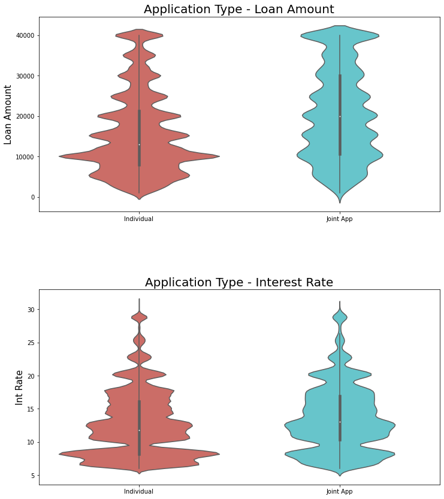
    


#### Evaluating Home Ownership by Loan Status


```python
plt.figure(figsize=(14,6))

g = sns.countplot(x='home_ownership', data=df, 
                  color='green')
g.set_title("Home Ownership Status Distribution", fontsize=22)
g.set_xlabel("Home Ownership Status", fontsize=18)
g.set_ylabel('Count of Loans', fontsize=18)

sizes=[]

for p in g.patches:
    height = p.get_height()
    sizes.append(height)
    g.text(p.get_x()+p.get_width()/2.,
            height + 3,
            '{:1.2f}%'.format(height/total*100),
            ha="center", fontsize=14) 
    
g.set_ylim(0, max(sizes) * 1.10)
g.set_xticklabels(g.get_xticklabels(),
                  rotation=45)

plt.show()
```


    
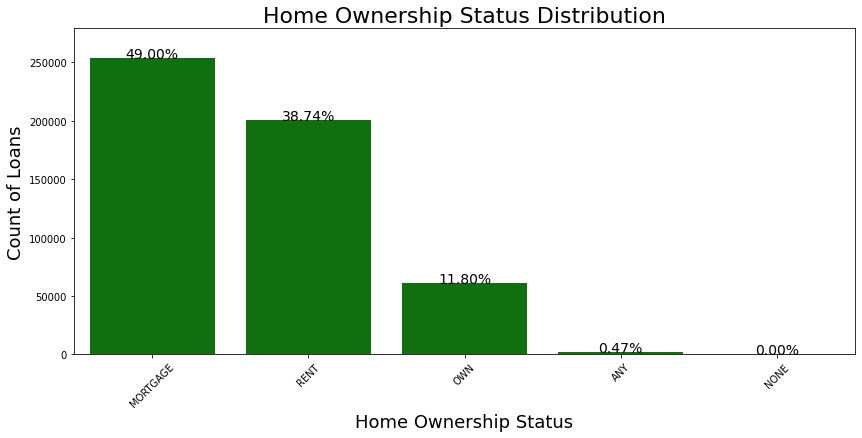
    


```python
loan_home = ['loan_condition', 'home_ownership']
cm = sns.light_palette("green", as_cmap=True)
round(pd.crosstab(df[loan_home[0]], df[loan_home[1]], 
            normalize='index'),2).fillna(0).style.background_gradient(cmap = cm)
```


<style  type="text/css" >
#T_cba0ff8e_517b_11eb_be4c_0242ac1c0002row0_col0,#T_cba0ff8e_517b_11eb_be4c_0242ac1c0002row0_col3,#T_cba0ff8e_517b_11eb_be4c_0242ac1c0002row0_col4,#T_cba0ff8e_517b_11eb_be4c_0242ac1c0002row1_col1{
            background-color:  #008000;
            color:  #f1f1f1;
        }#T_cba0ff8e_517b_11eb_be4c_0242ac1c0002row0_col1,#T_cba0ff8e_517b_11eb_be4c_0242ac1c0002row0_col2,#T_cba0ff8e_517b_11eb_be4c_0242ac1c0002row1_col0,#T_cba0ff8e_517b_11eb_be4c_0242ac1c0002row1_col2,#T_cba0ff8e_517b_11eb_be4c_0242ac1c0002row1_col3,#T_cba0ff8e_517b_11eb_be4c_0242ac1c0002row1_col4{
            background-color:  #ebf3eb;
            color:  #000000;
        }</style><table id="T_cba0ff8e_517b_11eb_be4c_0242ac1c0002" ><thead>    <tr>        <th class="index_name level0" >home_ownership</th>        <th class="col_heading level0 col0" >ANY</th>        <th class="col_heading level0 col1" >MORTGAGE</th>        <th class="col_heading level0 col2" >NONE</th>        <th class="col_heading level0 col3" >OWN</th>        <th class="col_heading level0 col4" >RENT</th>    </tr>    <tr>        <th class="index_name level0" >loan_condition</th>        <th class="blank" ></th>        <th class="blank" ></th>        <th class="blank" ></th>        <th class="blank" ></th>        <th class="blank" ></th>    </tr></thead><tbody>
                <tr>
                        <th id="T_cba0ff8e_517b_11eb_be4c_0242ac1c0002level0_row0" class="row_heading level0 row0" >NPL</th>
                        <td id="T_cba0ff8e_517b_11eb_be4c_0242ac1c0002row0_col0" class="data row0 col0" >0.010000</td>
                        <td id="T_cba0ff8e_517b_11eb_be4c_0242ac1c0002row0_col1" class="data row0 col1" >0.430000</td>
                        <td id="T_cba0ff8e_517b_11eb_be4c_0242ac1c0002row0_col2" class="data row0 col2" >0.000000</td>
                        <td id="T_cba0ff8e_517b_11eb_be4c_0242ac1c0002row0_col3" class="data row0 col3" >0.130000</td>
                        <td id="T_cba0ff8e_517b_11eb_be4c_0242ac1c0002row0_col4" class="data row0 col4" >0.430000</td>
            </tr>
            <tr>
                        <th id="T_cba0ff8e_517b_11eb_be4c_0242ac1c0002level0_row1" class="row_heading level0 row1" >PL</th>
                        <td id="T_cba0ff8e_517b_11eb_be4c_0242ac1c0002row1_col0" class="data row1 col0" >0.000000</td>
                        <td id="T_cba0ff8e_517b_11eb_be4c_0242ac1c0002row1_col1" class="data row1 col1" >0.490000</td>
                        <td id="T_cba0ff8e_517b_11eb_be4c_0242ac1c0002row1_col2" class="data row1 col2" >0.000000</td>
                        <td id="T_cba0ff8e_517b_11eb_be4c_0242ac1c0002row1_col3" class="data row1 col3" >0.120000</td>
                        <td id="T_cba0ff8e_517b_11eb_be4c_0242ac1c0002row1_col4" class="data row1 col4" >0.390000</td>
            </tr>
    </tbody></table>


```python
loan_home = ['loan_status', 'home_ownership']
cm = sns.light_palette("green", as_cmap=True)
round(pd.crosstab(df[loan_home[0]], df[loan_home[1]], 
            normalize='index'),2).fillna(0).style.background_gradient(cmap = cm)
```


<style  type="text/css" >
#T_cbb485a4_517b_11eb_be4c_0242ac1c0002row0_col0,#T_cbb485a4_517b_11eb_be4c_0242ac1c0002row0_col3,#T_cbb485a4_517b_11eb_be4c_0242ac1c0002row2_col0,#T_cbb485a4_517b_11eb_be4c_0242ac1c0002row3_col0,#T_cbb485a4_517b_11eb_be4c_0242ac1c0002row3_col1,#T_cbb485a4_517b_11eb_be4c_0242ac1c0002row4_col3,#T_cbb485a4_517b_11eb_be4c_0242ac1c0002row5_col0,#T_cbb485a4_517b_11eb_be4c_0242ac1c0002row6_col0,#T_cbb485a4_517b_11eb_be4c_0242ac1c0002row6_col3,#T_cbb485a4_517b_11eb_be4c_0242ac1c0002row6_col4{
            background-color:  #008000;
            color:  #f1f1f1;
        }#T_cbb485a4_517b_11eb_be4c_0242ac1c0002row0_col1{
            background-color:  #d9ead9;
            color:  #000000;
        }#T_cbb485a4_517b_11eb_be4c_0242ac1c0002row0_col2,#T_cbb485a4_517b_11eb_be4c_0242ac1c0002row1_col0,#T_cbb485a4_517b_11eb_be4c_0242ac1c0002row1_col2,#T_cbb485a4_517b_11eb_be4c_0242ac1c0002row2_col2,#T_cbb485a4_517b_11eb_be4c_0242ac1c0002row3_col2,#T_cbb485a4_517b_11eb_be4c_0242ac1c0002row3_col4,#T_cbb485a4_517b_11eb_be4c_0242ac1c0002row4_col0,#T_cbb485a4_517b_11eb_be4c_0242ac1c0002row4_col2,#T_cbb485a4_517b_11eb_be4c_0242ac1c0002row5_col2,#T_cbb485a4_517b_11eb_be4c_0242ac1c0002row5_col3,#T_cbb485a4_517b_11eb_be4c_0242ac1c0002row6_col1,#T_cbb485a4_517b_11eb_be4c_0242ac1c0002row6_col2{
            background-color:  #ebf3eb;
            color:  #000000;
        }#T_cbb485a4_517b_11eb_be4c_0242ac1c0002row0_col4{
            background-color:  #369b36;
            color:  #000000;
        }#T_cbb485a4_517b_11eb_be4c_0242ac1c0002row1_col1,#T_cbb485a4_517b_11eb_be4c_0242ac1c0002row5_col4{
            background-color:  #5aac5a;
            color:  #000000;
        }#T_cbb485a4_517b_11eb_be4c_0242ac1c0002row1_col3,#T_cbb485a4_517b_11eb_be4c_0242ac1c0002row2_col3,#T_cbb485a4_517b_11eb_be4c_0242ac1c0002row3_col3{
            background-color:  #76ba76;
            color:  #000000;
        }#T_cbb485a4_517b_11eb_be4c_0242ac1c0002row1_col4,#T_cbb485a4_517b_11eb_be4c_0242ac1c0002row2_col1,#T_cbb485a4_517b_11eb_be4c_0242ac1c0002row5_col1{
            background-color:  #7ebe7e;
            color:  #000000;
        }#T_cbb485a4_517b_11eb_be4c_0242ac1c0002row2_col4{
            background-color:  #6db56d;
            color:  #000000;
        }#T_cbb485a4_517b_11eb_be4c_0242ac1c0002row4_col1{
            background-color:  #48a348;
            color:  #000000;
        }#T_cbb485a4_517b_11eb_be4c_0242ac1c0002row4_col4{
            background-color:  #a3d0a3;
            color:  #000000;
        }</style><table id="T_cbb485a4_517b_11eb_be4c_0242ac1c0002" ><thead>    <tr>        <th class="index_name level0" >home_ownership</th>        <th class="col_heading level0 col0" >ANY</th>        <th class="col_heading level0 col1" >MORTGAGE</th>        <th class="col_heading level0 col2" >NONE</th>        <th class="col_heading level0 col3" >OWN</th>        <th class="col_heading level0 col4" >RENT</th>    </tr>    <tr>        <th class="index_name level0" >loan_status</th>        <th class="blank" ></th>        <th class="blank" ></th>        <th class="blank" ></th>        <th class="blank" ></th>        <th class="blank" ></th>    </tr></thead><tbody>
                <tr>
                        <th id="T_cbb485a4_517b_11eb_be4c_0242ac1c0002level0_row0" class="row_heading level0 row0" >Charged Off</th>
                        <td id="T_cbb485a4_517b_11eb_be4c_0242ac1c0002row0_col0" class="data row0 col0" >0.010000</td>
                        <td id="T_cbb485a4_517b_11eb_be4c_0242ac1c0002row0_col1" class="data row0 col1" >0.420000</td>
                        <td id="T_cbb485a4_517b_11eb_be4c_0242ac1c0002row0_col2" class="data row0 col2" >0.000000</td>
                        <td id="T_cbb485a4_517b_11eb_be4c_0242ac1c0002row0_col3" class="data row0 col3" >0.130000</td>
                        <td id="T_cbb485a4_517b_11eb_be4c_0242ac1c0002row0_col4" class="data row0 col4" >0.430000</td>
            </tr>
            <tr>
                        <th id="T_cbb485a4_517b_11eb_be4c_0242ac1c0002level0_row1" class="row_heading level0 row1" >Current</th>
                        <td id="T_cbb485a4_517b_11eb_be4c_0242ac1c0002row1_col0" class="data row1 col0" >0.000000</td>
                        <td id="T_cbb485a4_517b_11eb_be4c_0242ac1c0002row1_col1" class="data row1 col1" >0.490000</td>
                        <td id="T_cbb485a4_517b_11eb_be4c_0242ac1c0002row1_col2" class="data row1 col2" >0.000000</td>
                        <td id="T_cbb485a4_517b_11eb_be4c_0242ac1c0002row1_col3" class="data row1 col3" >0.120000</td>
                        <td id="T_cbb485a4_517b_11eb_be4c_0242ac1c0002row1_col4" class="data row1 col4" >0.390000</td>
            </tr>
            <tr>
                        <th id="T_cbb485a4_517b_11eb_be4c_0242ac1c0002level0_row2" class="row_heading level0 row2" >Default</th>
                        <td id="T_cbb485a4_517b_11eb_be4c_0242ac1c0002row2_col0" class="data row2 col0" >0.010000</td>
                        <td id="T_cbb485a4_517b_11eb_be4c_0242ac1c0002row2_col1" class="data row2 col1" >0.470000</td>
                        <td id="T_cbb485a4_517b_11eb_be4c_0242ac1c0002row2_col2" class="data row2 col2" >0.000000</td>
                        <td id="T_cbb485a4_517b_11eb_be4c_0242ac1c0002row2_col3" class="data row2 col3" >0.120000</td>
                        <td id="T_cbb485a4_517b_11eb_be4c_0242ac1c0002row2_col4" class="data row2 col4" >0.400000</td>
            </tr>
            <tr>
                        <th id="T_cbb485a4_517b_11eb_be4c_0242ac1c0002level0_row3" class="row_heading level0 row3" >Fully Paid</th>
                        <td id="T_cbb485a4_517b_11eb_be4c_0242ac1c0002row3_col0" class="data row3 col0" >0.010000</td>
                        <td id="T_cbb485a4_517b_11eb_be4c_0242ac1c0002row3_col1" class="data row3 col1" >0.540000</td>
                        <td id="T_cbb485a4_517b_11eb_be4c_0242ac1c0002row3_col2" class="data row3 col2" >0.000000</td>
                        <td id="T_cbb485a4_517b_11eb_be4c_0242ac1c0002row3_col3" class="data row3 col3" >0.120000</td>
                        <td id="T_cbb485a4_517b_11eb_be4c_0242ac1c0002row3_col4" class="data row3 col4" >0.330000</td>
            </tr>
            <tr>
                        <th id="T_cbb485a4_517b_11eb_be4c_0242ac1c0002level0_row4" class="row_heading level0 row4" >In Grace Period</th>
                        <td id="T_cbb485a4_517b_11eb_be4c_0242ac1c0002row4_col0" class="data row4 col0" >0.000000</td>
                        <td id="T_cbb485a4_517b_11eb_be4c_0242ac1c0002row4_col1" class="data row4 col1" >0.500000</td>
                        <td id="T_cbb485a4_517b_11eb_be4c_0242ac1c0002row4_col2" class="data row4 col2" >0.000000</td>
                        <td id="T_cbb485a4_517b_11eb_be4c_0242ac1c0002row4_col3" class="data row4 col3" >0.130000</td>
                        <td id="T_cbb485a4_517b_11eb_be4c_0242ac1c0002row4_col4" class="data row4 col4" >0.370000</td>
            </tr>
            <tr>
                        <th id="T_cbb485a4_517b_11eb_be4c_0242ac1c0002level0_row5" class="row_heading level0 row5" >Late (16-30 days)</th>
                        <td id="T_cbb485a4_517b_11eb_be4c_0242ac1c0002row5_col0" class="data row5 col0" >0.010000</td>
                        <td id="T_cbb485a4_517b_11eb_be4c_0242ac1c0002row5_col1" class="data row5 col1" >0.470000</td>
                        <td id="T_cbb485a4_517b_11eb_be4c_0242ac1c0002row5_col2" class="data row5 col2" >0.000000</td>
                        <td id="T_cbb485a4_517b_11eb_be4c_0242ac1c0002row5_col3" class="data row5 col3" >0.110000</td>
                        <td id="T_cbb485a4_517b_11eb_be4c_0242ac1c0002row5_col4" class="data row5 col4" >0.410000</td>
            </tr>
            <tr>
                        <th id="T_cbb485a4_517b_11eb_be4c_0242ac1c0002level0_row6" class="row_heading level0 row6" >Late (31-120 days)</th>
                        <td id="T_cbb485a4_517b_11eb_be4c_0242ac1c0002row6_col0" class="data row6 col0" >0.010000</td>
                        <td id="T_cbb485a4_517b_11eb_be4c_0242ac1c0002row6_col1" class="data row6 col1" >0.410000</td>
                        <td id="T_cbb485a4_517b_11eb_be4c_0242ac1c0002row6_col2" class="data row6 col2" >0.000000</td>
                        <td id="T_cbb485a4_517b_11eb_be4c_0242ac1c0002row6_col3" class="data row6 col3" >0.130000</td>
                        <td id="T_cbb485a4_517b_11eb_be4c_0242ac1c0002row6_col4" class="data row6 col4" >0.460000</td>
            </tr>
    </tbody></table>


#### Bi-Variate Analysis of Loan Purpose with Interest Rate & Loan Size


```python
plt.figure(figsize = (14,13))

plt.subplot(211)
g = sns.violinplot(x="purpose",y="int_rate",data=df,
                    hue="application_type", split=True)
g.set_xticklabels(g.get_xticklabels(),rotation=45)
g.set_title("Purposes - Interest Rate Distribution by Application Type", fontsize=20)
g.set_xlabel("Purpose Category's", fontsize=17)
g.set_ylabel("Interest Rate Distribution", fontsize=17)

plt.subplot(212)
g1 = sns.violinplot(x="purpose",y="loan_amnt",data=df,
                    hue="application_type", split=True)
g1.set_xticklabels(g1.get_xticklabels(),rotation=45)
g1.set_title("Purposes - Loan Amount Distribution by Application Type", fontsize=20)
g1.set_xlabel("Purpose Category's", fontsize=17)
g1.set_ylabel("Loan Amount Distribution", fontsize=17)

plt.subplots_adjust(hspace = 0.5,top = 0.9)

plt.show()
```


    
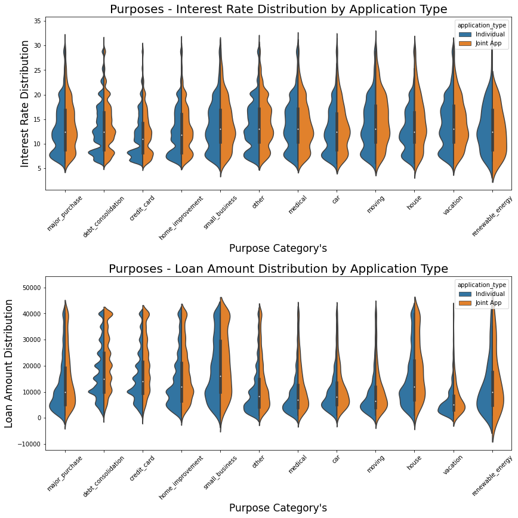
    


#### Evaluating Interest Rates & Loan Sizes by Loan Grades


```python
order_sub = df.groupby("sub_grade")['int_rate'].count().index

plt.figure(figsize=(14,16))

plt.suptitle('Grade and Sub-Grade Distributions \n# Interest Rate and Loan Amount #', fontsize=22)

plt.subplot(311)
g = sns.boxplot(x="grade", y="loan_amnt", data=df,
                palette="hls", hue="application_type", 
                order=["A",'B','C','D','E','F', 'G'])
g.set_xlabel("Grade Values", fontsize=17)
g.set_ylabel("Loan Amount", fontsize=17)
g.set_title("Lending Club Loan - Loan Amount Distribution by Grade", fontsize=20)
g.legend(loc='upper right')

plt.subplot(312)
g1 = sns.boxplot(x='grade', y="int_rate",data=df, 
               hue="application_type", palette = "hls",  
               order=["A",'B','C','D','E','F', 'G'])
g1.set_xlabel("Grade Values", fontsize=17)
g1.set_ylabel("Interest Rate", fontsize=17)
g1.set_title("Lending Club Loan - Interest Rate Distribution by Grade", fontsize=20)

plt.subplot(313)
g2 = sns.boxenplot(x="sub_grade", y="int_rate", data=df, 
                   palette="hls", order=order_sub)
g2.set_xlabel("Sub Grade Values", fontsize=15)
g2.set_ylabel("Interest Rate", fontsize=15)
g2.set_title("Lending Club Loan - Interest Rate Distribution by Sub-Grade", fontsize=20)

plt.subplots_adjust(hspace = 0.4,top = 0.9)

plt.show()
```


    
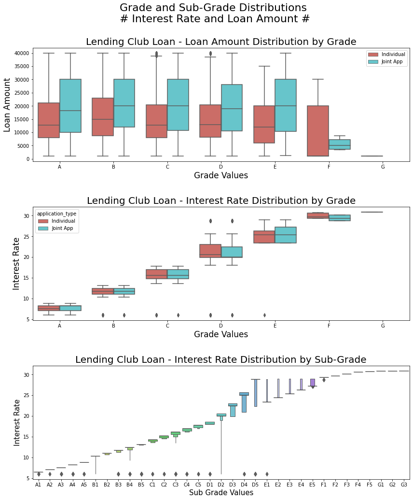
    


#### Evaluating Interest Rates by Lending Club Grades & Sub-Grades


```python
loan_grade = ['sub_grade', 'grade']
cm = sns.light_palette("green", as_cmap=True)
round(pd.crosstab(df[loan_grade[0]], df[loan_grade[1]], 
            values=df['int_rate'], aggfunc='mean'),2).fillna(0).style.background_gradient(cmap = cm)
```


<style  type="text/css" >
#T_e60329e2_517b_11eb_be4c_0242ac1c0002row0_col0{
            background-color:  #3f9f3f;
            color:  #000000;
        }#T_e60329e2_517b_11eb_be4c_0242ac1c0002row0_col1,#T_e60329e2_517b_11eb_be4c_0242ac1c0002row0_col2,#T_e60329e2_517b_11eb_be4c_0242ac1c0002row0_col3,#T_e60329e2_517b_11eb_be4c_0242ac1c0002row0_col4,#T_e60329e2_517b_11eb_be4c_0242ac1c0002row0_col5,#T_e60329e2_517b_11eb_be4c_0242ac1c0002row0_col6,#T_e60329e2_517b_11eb_be4c_0242ac1c0002row1_col1,#T_e60329e2_517b_11eb_be4c_0242ac1c0002row1_col2,#T_e60329e2_517b_11eb_be4c_0242ac1c0002row1_col3,#T_e60329e2_517b_11eb_be4c_0242ac1c0002row1_col4,#T_e60329e2_517b_11eb_be4c_0242ac1c0002row1_col5,#T_e60329e2_517b_11eb_be4c_0242ac1c0002row1_col6,#T_e60329e2_517b_11eb_be4c_0242ac1c0002row2_col1,#T_e60329e2_517b_11eb_be4c_0242ac1c0002row2_col2,#T_e60329e2_517b_11eb_be4c_0242ac1c0002row2_col3,#T_e60329e2_517b_11eb_be4c_0242ac1c0002row2_col4,#T_e60329e2_517b_11eb_be4c_0242ac1c0002row2_col5,#T_e60329e2_517b_11eb_be4c_0242ac1c0002row2_col6,#T_e60329e2_517b_11eb_be4c_0242ac1c0002row3_col1,#T_e60329e2_517b_11eb_be4c_0242ac1c0002row3_col2,#T_e60329e2_517b_11eb_be4c_0242ac1c0002row3_col3,#T_e60329e2_517b_11eb_be4c_0242ac1c0002row3_col4,#T_e60329e2_517b_11eb_be4c_0242ac1c0002row3_col5,#T_e60329e2_517b_11eb_be4c_0242ac1c0002row3_col6,#T_e60329e2_517b_11eb_be4c_0242ac1c0002row4_col1,#T_e60329e2_517b_11eb_be4c_0242ac1c0002row4_col2,#T_e60329e2_517b_11eb_be4c_0242ac1c0002row4_col3,#T_e60329e2_517b_11eb_be4c_0242ac1c0002row4_col4,#T_e60329e2_517b_11eb_be4c_0242ac1c0002row4_col5,#T_e60329e2_517b_11eb_be4c_0242ac1c0002row4_col6,#T_e60329e2_517b_11eb_be4c_0242ac1c0002row5_col0,#T_e60329e2_517b_11eb_be4c_0242ac1c0002row5_col2,#T_e60329e2_517b_11eb_be4c_0242ac1c0002row5_col3,#T_e60329e2_517b_11eb_be4c_0242ac1c0002row5_col4,#T_e60329e2_517b_11eb_be4c_0242ac1c0002row5_col5,#T_e60329e2_517b_11eb_be4c_0242ac1c0002row5_col6,#T_e60329e2_517b_11eb_be4c_0242ac1c0002row6_col0,#T_e60329e2_517b_11eb_be4c_0242ac1c0002row6_col2,#T_e60329e2_517b_11eb_be4c_0242ac1c0002row6_col3,#T_e60329e2_517b_11eb_be4c_0242ac1c0002row6_col4,#T_e60329e2_517b_11eb_be4c_0242ac1c0002row6_col5,#T_e60329e2_517b_11eb_be4c_0242ac1c0002row6_col6,#T_e60329e2_517b_11eb_be4c_0242ac1c0002row7_col0,#T_e60329e2_517b_11eb_be4c_0242ac1c0002row7_col2,#T_e60329e2_517b_11eb_be4c_0242ac1c0002row7_col3,#T_e60329e2_517b_11eb_be4c_0242ac1c0002row7_col4,#T_e60329e2_517b_11eb_be4c_0242ac1c0002row7_col5,#T_e60329e2_517b_11eb_be4c_0242ac1c0002row7_col6,#T_e60329e2_517b_11eb_be4c_0242ac1c0002row8_col0,#T_e60329e2_517b_11eb_be4c_0242ac1c0002row8_col2,#T_e60329e2_517b_11eb_be4c_0242ac1c0002row8_col3,#T_e60329e2_517b_11eb_be4c_0242ac1c0002row8_col4,#T_e60329e2_517b_11eb_be4c_0242ac1c0002row8_col5,#T_e60329e2_517b_11eb_be4c_0242ac1c0002row8_col6,#T_e60329e2_517b_11eb_be4c_0242ac1c0002row9_col0,#T_e60329e2_517b_11eb_be4c_0242ac1c0002row9_col2,#T_e60329e2_517b_11eb_be4c_0242ac1c0002row9_col3,#T_e60329e2_517b_11eb_be4c_0242ac1c0002row9_col4,#T_e60329e2_517b_11eb_be4c_0242ac1c0002row9_col5,#T_e60329e2_517b_11eb_be4c_0242ac1c0002row9_col6,#T_e60329e2_517b_11eb_be4c_0242ac1c0002row10_col0,#T_e60329e2_517b_11eb_be4c_0242ac1c0002row10_col1,#T_e60329e2_517b_11eb_be4c_0242ac1c0002row10_col3,#T_e60329e2_517b_11eb_be4c_0242ac1c0002row10_col4,#T_e60329e2_517b_11eb_be4c_0242ac1c0002row10_col5,#T_e60329e2_517b_11eb_be4c_0242ac1c0002row10_col6,#T_e60329e2_517b_11eb_be4c_0242ac1c0002row11_col0,#T_e60329e2_517b_11eb_be4c_0242ac1c0002row11_col1,#T_e60329e2_517b_11eb_be4c_0242ac1c0002row11_col3,#T_e60329e2_517b_11eb_be4c_0242ac1c0002row11_col4,#T_e60329e2_517b_11eb_be4c_0242ac1c0002row11_col5,#T_e60329e2_517b_11eb_be4c_0242ac1c0002row11_col6,#T_e60329e2_517b_11eb_be4c_0242ac1c0002row12_col0,#T_e60329e2_517b_11eb_be4c_0242ac1c0002row12_col1,#T_e60329e2_517b_11eb_be4c_0242ac1c0002row12_col3,#T_e60329e2_517b_11eb_be4c_0242ac1c0002row12_col4,#T_e60329e2_517b_11eb_be4c_0242ac1c0002row12_col5,#T_e60329e2_517b_11eb_be4c_0242ac1c0002row12_col6,#T_e60329e2_517b_11eb_be4c_0242ac1c0002row13_col0,#T_e60329e2_517b_11eb_be4c_0242ac1c0002row13_col1,#T_e60329e2_517b_11eb_be4c_0242ac1c0002row13_col3,#T_e60329e2_517b_11eb_be4c_0242ac1c0002row13_col4,#T_e60329e2_517b_11eb_be4c_0242ac1c0002row13_col5,#T_e60329e2_517b_11eb_be4c_0242ac1c0002row13_col6,#T_e60329e2_517b_11eb_be4c_0242ac1c0002row14_col0,#T_e60329e2_517b_11eb_be4c_0242ac1c0002row14_col1,#T_e60329e2_517b_11eb_be4c_0242ac1c0002row14_col3,#T_e60329e2_517b_11eb_be4c_0242ac1c0002row14_col4,#T_e60329e2_517b_11eb_be4c_0242ac1c0002row14_col5,#T_e60329e2_517b_11eb_be4c_0242ac1c0002row14_col6,#T_e60329e2_517b_11eb_be4c_0242ac1c0002row15_col0,#T_e60329e2_517b_11eb_be4c_0242ac1c0002row15_col1,#T_e60329e2_517b_11eb_be4c_0242ac1c0002row15_col2,#T_e60329e2_517b_11eb_be4c_0242ac1c0002row15_col4,#T_e60329e2_517b_11eb_be4c_0242ac1c0002row15_col5,#T_e60329e2_517b_11eb_be4c_0242ac1c0002row15_col6,#T_e60329e2_517b_11eb_be4c_0242ac1c0002row16_col0,#T_e60329e2_517b_11eb_be4c_0242ac1c0002row16_col1,#T_e60329e2_517b_11eb_be4c_0242ac1c0002row16_col2,#T_e60329e2_517b_11eb_be4c_0242ac1c0002row16_col4,#T_e60329e2_517b_11eb_be4c_0242ac1c0002row16_col5,#T_e60329e2_517b_11eb_be4c_0242ac1c0002row16_col6,#T_e60329e2_517b_11eb_be4c_0242ac1c0002row17_col0,#T_e60329e2_517b_11eb_be4c_0242ac1c0002row17_col1,#T_e60329e2_517b_11eb_be4c_0242ac1c0002row17_col2,#T_e60329e2_517b_11eb_be4c_0242ac1c0002row17_col4,#T_e60329e2_517b_11eb_be4c_0242ac1c0002row17_col5,#T_e60329e2_517b_11eb_be4c_0242ac1c0002row17_col6,#T_e60329e2_517b_11eb_be4c_0242ac1c0002row18_col0,#T_e60329e2_517b_11eb_be4c_0242ac1c0002row18_col1,#T_e60329e2_517b_11eb_be4c_0242ac1c0002row18_col2,#T_e60329e2_517b_11eb_be4c_0242ac1c0002row18_col4,#T_e60329e2_517b_11eb_be4c_0242ac1c0002row18_col5,#T_e60329e2_517b_11eb_be4c_0242ac1c0002row18_col6,#T_e60329e2_517b_11eb_be4c_0242ac1c0002row19_col0,#T_e60329e2_517b_11eb_be4c_0242ac1c0002row19_col1,#T_e60329e2_517b_11eb_be4c_0242ac1c0002row19_col2,#T_e60329e2_517b_11eb_be4c_0242ac1c0002row19_col4,#T_e60329e2_517b_11eb_be4c_0242ac1c0002row19_col5,#T_e60329e2_517b_11eb_be4c_0242ac1c0002row19_col6,#T_e60329e2_517b_11eb_be4c_0242ac1c0002row20_col0,#T_e60329e2_517b_11eb_be4c_0242ac1c0002row20_col1,#T_e60329e2_517b_11eb_be4c_0242ac1c0002row20_col2,#T_e60329e2_517b_11eb_be4c_0242ac1c0002row20_col3,#T_e60329e2_517b_11eb_be4c_0242ac1c0002row20_col5,#T_e60329e2_517b_11eb_be4c_0242ac1c0002row20_col6,#T_e60329e2_517b_11eb_be4c_0242ac1c0002row21_col0,#T_e60329e2_517b_11eb_be4c_0242ac1c0002row21_col1,#T_e60329e2_517b_11eb_be4c_0242ac1c0002row21_col2,#T_e60329e2_517b_11eb_be4c_0242ac1c0002row21_col3,#T_e60329e2_517b_11eb_be4c_0242ac1c0002row21_col5,#T_e60329e2_517b_11eb_be4c_0242ac1c0002row21_col6,#T_e60329e2_517b_11eb_be4c_0242ac1c0002row22_col0,#T_e60329e2_517b_11eb_be4c_0242ac1c0002row22_col1,#T_e60329e2_517b_11eb_be4c_0242ac1c0002row22_col2,#T_e60329e2_517b_11eb_be4c_0242ac1c0002row22_col3,#T_e60329e2_517b_11eb_be4c_0242ac1c0002row22_col5,#T_e60329e2_517b_11eb_be4c_0242ac1c0002row22_col6,#T_e60329e2_517b_11eb_be4c_0242ac1c0002row23_col0,#T_e60329e2_517b_11eb_be4c_0242ac1c0002row23_col1,#T_e60329e2_517b_11eb_be4c_0242ac1c0002row23_col2,#T_e60329e2_517b_11eb_be4c_0242ac1c0002row23_col3,#T_e60329e2_517b_11eb_be4c_0242ac1c0002row23_col5,#T_e60329e2_517b_11eb_be4c_0242ac1c0002row23_col6,#T_e60329e2_517b_11eb_be4c_0242ac1c0002row24_col0,#T_e60329e2_517b_11eb_be4c_0242ac1c0002row24_col1,#T_e60329e2_517b_11eb_be4c_0242ac1c0002row24_col2,#T_e60329e2_517b_11eb_be4c_0242ac1c0002row24_col3,#T_e60329e2_517b_11eb_be4c_0242ac1c0002row24_col5,#T_e60329e2_517b_11eb_be4c_0242ac1c0002row24_col6,#T_e60329e2_517b_11eb_be4c_0242ac1c0002row25_col0,#T_e60329e2_517b_11eb_be4c_0242ac1c0002row25_col1,#T_e60329e2_517b_11eb_be4c_0242ac1c0002row25_col2,#T_e60329e2_517b_11eb_be4c_0242ac1c0002row25_col3,#T_e60329e2_517b_11eb_be4c_0242ac1c0002row25_col4,#T_e60329e2_517b_11eb_be4c_0242ac1c0002row25_col6,#T_e60329e2_517b_11eb_be4c_0242ac1c0002row26_col0,#T_e60329e2_517b_11eb_be4c_0242ac1c0002row26_col1,#T_e60329e2_517b_11eb_be4c_0242ac1c0002row26_col2,#T_e60329e2_517b_11eb_be4c_0242ac1c0002row26_col3,#T_e60329e2_517b_11eb_be4c_0242ac1c0002row26_col4,#T_e60329e2_517b_11eb_be4c_0242ac1c0002row26_col6,#T_e60329e2_517b_11eb_be4c_0242ac1c0002row27_col0,#T_e60329e2_517b_11eb_be4c_0242ac1c0002row27_col1,#T_e60329e2_517b_11eb_be4c_0242ac1c0002row27_col2,#T_e60329e2_517b_11eb_be4c_0242ac1c0002row27_col3,#T_e60329e2_517b_11eb_be4c_0242ac1c0002row27_col4,#T_e60329e2_517b_11eb_be4c_0242ac1c0002row27_col6,#T_e60329e2_517b_11eb_be4c_0242ac1c0002row28_col0,#T_e60329e2_517b_11eb_be4c_0242ac1c0002row28_col1,#T_e60329e2_517b_11eb_be4c_0242ac1c0002row28_col2,#T_e60329e2_517b_11eb_be4c_0242ac1c0002row28_col3,#T_e60329e2_517b_11eb_be4c_0242ac1c0002row28_col4,#T_e60329e2_517b_11eb_be4c_0242ac1c0002row28_col6,#T_e60329e2_517b_11eb_be4c_0242ac1c0002row29_col0,#T_e60329e2_517b_11eb_be4c_0242ac1c0002row29_col1,#T_e60329e2_517b_11eb_be4c_0242ac1c0002row29_col2,#T_e60329e2_517b_11eb_be4c_0242ac1c0002row29_col3,#T_e60329e2_517b_11eb_be4c_0242ac1c0002row29_col4,#T_e60329e2_517b_11eb_be4c_0242ac1c0002row29_col6,#T_e60329e2_517b_11eb_be4c_0242ac1c0002row30_col0,#T_e60329e2_517b_11eb_be4c_0242ac1c0002row30_col1,#T_e60329e2_517b_11eb_be4c_0242ac1c0002row30_col2,#T_e60329e2_517b_11eb_be4c_0242ac1c0002row30_col3,#T_e60329e2_517b_11eb_be4c_0242ac1c0002row30_col4,#T_e60329e2_517b_11eb_be4c_0242ac1c0002row30_col5,#T_e60329e2_517b_11eb_be4c_0242ac1c0002row31_col0,#T_e60329e2_517b_11eb_be4c_0242ac1c0002row31_col1,#T_e60329e2_517b_11eb_be4c_0242ac1c0002row31_col2,#T_e60329e2_517b_11eb_be4c_0242ac1c0002row31_col3,#T_e60329e2_517b_11eb_be4c_0242ac1c0002row31_col4,#T_e60329e2_517b_11eb_be4c_0242ac1c0002row31_col5,#T_e60329e2_517b_11eb_be4c_0242ac1c0002row32_col0,#T_e60329e2_517b_11eb_be4c_0242ac1c0002row32_col1,#T_e60329e2_517b_11eb_be4c_0242ac1c0002row32_col2,#T_e60329e2_517b_11eb_be4c_0242ac1c0002row32_col3,#T_e60329e2_517b_11eb_be4c_0242ac1c0002row32_col4,#T_e60329e2_517b_11eb_be4c_0242ac1c0002row32_col5{
            background-color:  #ebf3eb;
            color:  #000000;
        }#T_e60329e2_517b_11eb_be4c_0242ac1c0002row1_col0,#T_e60329e2_517b_11eb_be4c_0242ac1c0002row17_col3{
            background-color:  #309730;
            color:  #000000;
        }#T_e60329e2_517b_11eb_be4c_0242ac1c0002row2_col0,#T_e60329e2_517b_11eb_be4c_0242ac1c0002row11_col2,#T_e60329e2_517b_11eb_be4c_0242ac1c0002row20_col4{
            background-color:  #219021;
            color:  #000000;
        }#T_e60329e2_517b_11eb_be4c_0242ac1c0002row3_col0,#T_e60329e2_517b_11eb_be4c_0242ac1c0002row22_col4{
            background-color:  #118811;
            color:  #f1f1f1;
        }#T_e60329e2_517b_11eb_be4c_0242ac1c0002row4_col0,#T_e60329e2_517b_11eb_be4c_0242ac1c0002row9_col1,#T_e60329e2_517b_11eb_be4c_0242ac1c0002row14_col2,#T_e60329e2_517b_11eb_be4c_0242ac1c0002row19_col3,#T_e60329e2_517b_11eb_be4c_0242ac1c0002row24_col4,#T_e60329e2_517b_11eb_be4c_0242ac1c0002row28_col5,#T_e60329e2_517b_11eb_be4c_0242ac1c0002row29_col5,#T_e60329e2_517b_11eb_be4c_0242ac1c0002row30_col6,#T_e60329e2_517b_11eb_be4c_0242ac1c0002row31_col6,#T_e60329e2_517b_11eb_be4c_0242ac1c0002row32_col6{
            background-color:  #008000;
            color:  #f1f1f1;
        }#T_e60329e2_517b_11eb_be4c_0242ac1c0002row5_col1{
            background-color:  #319831;
            color:  #000000;
        }#T_e60329e2_517b_11eb_be4c_0242ac1c0002row6_col1{
            background-color:  #259225;
            color:  #000000;
        }#T_e60329e2_517b_11eb_be4c_0242ac1c0002row7_col1,#T_e60329e2_517b_11eb_be4c_0242ac1c0002row21_col4{
            background-color:  #198c19;
            color:  #000000;
        }#T_e60329e2_517b_11eb_be4c_0242ac1c0002row8_col1{
            background-color:  #0d860d;
            color:  #f1f1f1;
        }#T_e60329e2_517b_11eb_be4c_0242ac1c0002row10_col2{
            background-color:  #2e972e;
            color:  #000000;
        }#T_e60329e2_517b_11eb_be4c_0242ac1c0002row12_col2{
            background-color:  #178b17;
            color:  #000000;
        }#T_e60329e2_517b_11eb_be4c_0242ac1c0002row13_col2,#T_e60329e2_517b_11eb_be4c_0242ac1c0002row25_col5{
            background-color:  #0b850b;
            color:  #f1f1f1;
        }#T_e60329e2_517b_11eb_be4c_0242ac1c0002row15_col3{
            background-color:  #53a953;
            color:  #000000;
        }#T_e60329e2_517b_11eb_be4c_0242ac1c0002row16_col3{
            background-color:  #42a042;
            color:  #000000;
        }#T_e60329e2_517b_11eb_be4c_0242ac1c0002row18_col3{
            background-color:  #1e8f1e;
            color:  #000000;
        }#T_e60329e2_517b_11eb_be4c_0242ac1c0002row23_col4{
            background-color:  #088408;
            color:  #f1f1f1;
        }#T_e60329e2_517b_11eb_be4c_0242ac1c0002row26_col5{
            background-color:  #078407;
            color:  #f1f1f1;
        }#T_e60329e2_517b_11eb_be4c_0242ac1c0002row27_col5{
            background-color:  #048204;
            color:  #f1f1f1;
        }</style><table id="T_e60329e2_517b_11eb_be4c_0242ac1c0002" ><thead>    <tr>        <th class="index_name level0" >grade</th>        <th class="col_heading level0 col0" >A</th>        <th class="col_heading level0 col1" >B</th>        <th class="col_heading level0 col2" >C</th>        <th class="col_heading level0 col3" >D</th>        <th class="col_heading level0 col4" >E</th>        <th class="col_heading level0 col5" >F</th>        <th class="col_heading level0 col6" >G</th>    </tr>    <tr>        <th class="index_name level0" >sub_grade</th>        <th class="blank" ></th>        <th class="blank" ></th>        <th class="blank" ></th>        <th class="blank" ></th>        <th class="blank" ></th>        <th class="blank" ></th>        <th class="blank" ></th>    </tr></thead><tbody>
                <tr>
                        <th id="T_e60329e2_517b_11eb_be4c_0242ac1c0002level0_row0" class="row_heading level0 row0" >A1</th>
                        <td id="T_e60329e2_517b_11eb_be4c_0242ac1c0002row0_col0" class="data row0 col0" >6.460000</td>
                        <td id="T_e60329e2_517b_11eb_be4c_0242ac1c0002row0_col1" class="data row0 col1" >0.000000</td>
                        <td id="T_e60329e2_517b_11eb_be4c_0242ac1c0002row0_col2" class="data row0 col2" >0.000000</td>
                        <td id="T_e60329e2_517b_11eb_be4c_0242ac1c0002row0_col3" class="data row0 col3" >0.000000</td>
                        <td id="T_e60329e2_517b_11eb_be4c_0242ac1c0002row0_col4" class="data row0 col4" >0.000000</td>
                        <td id="T_e60329e2_517b_11eb_be4c_0242ac1c0002row0_col5" class="data row0 col5" >0.000000</td>
                        <td id="T_e60329e2_517b_11eb_be4c_0242ac1c0002row0_col6" class="data row0 col6" >0.000000</td>
            </tr>
            <tr>
                        <th id="T_e60329e2_517b_11eb_be4c_0242ac1c0002level0_row1" class="row_heading level0 row1" >A2</th>
                        <td id="T_e60329e2_517b_11eb_be4c_0242ac1c0002row1_col0" class="data row1 col0" >7.020000</td>
                        <td id="T_e60329e2_517b_11eb_be4c_0242ac1c0002row1_col1" class="data row1 col1" >0.000000</td>
                        <td id="T_e60329e2_517b_11eb_be4c_0242ac1c0002row1_col2" class="data row1 col2" >0.000000</td>
                        <td id="T_e60329e2_517b_11eb_be4c_0242ac1c0002row1_col3" class="data row1 col3" >0.000000</td>
                        <td id="T_e60329e2_517b_11eb_be4c_0242ac1c0002row1_col4" class="data row1 col4" >0.000000</td>
                        <td id="T_e60329e2_517b_11eb_be4c_0242ac1c0002row1_col5" class="data row1 col5" >0.000000</td>
                        <td id="T_e60329e2_517b_11eb_be4c_0242ac1c0002row1_col6" class="data row1 col6" >0.000000</td>
            </tr>
            <tr>
                        <th id="T_e60329e2_517b_11eb_be4c_0242ac1c0002level0_row2" class="row_heading level0 row2" >A3</th>
                        <td id="T_e60329e2_517b_11eb_be4c_0242ac1c0002row2_col0" class="data row2 col0" >7.560000</td>
                        <td id="T_e60329e2_517b_11eb_be4c_0242ac1c0002row2_col1" class="data row2 col1" >0.000000</td>
                        <td id="T_e60329e2_517b_11eb_be4c_0242ac1c0002row2_col2" class="data row2 col2" >0.000000</td>
                        <td id="T_e60329e2_517b_11eb_be4c_0242ac1c0002row2_col3" class="data row2 col3" >0.000000</td>
                        <td id="T_e60329e2_517b_11eb_be4c_0242ac1c0002row2_col4" class="data row2 col4" >0.000000</td>
                        <td id="T_e60329e2_517b_11eb_be4c_0242ac1c0002row2_col5" class="data row2 col5" >0.000000</td>
                        <td id="T_e60329e2_517b_11eb_be4c_0242ac1c0002row2_col6" class="data row2 col6" >0.000000</td>
            </tr>
            <tr>
                        <th id="T_e60329e2_517b_11eb_be4c_0242ac1c0002level0_row3" class="row_heading level0 row3" >A4</th>
                        <td id="T_e60329e2_517b_11eb_be4c_0242ac1c0002row3_col0" class="data row3 col0" >8.190000</td>
                        <td id="T_e60329e2_517b_11eb_be4c_0242ac1c0002row3_col1" class="data row3 col1" >0.000000</td>
                        <td id="T_e60329e2_517b_11eb_be4c_0242ac1c0002row3_col2" class="data row3 col2" >0.000000</td>
                        <td id="T_e60329e2_517b_11eb_be4c_0242ac1c0002row3_col3" class="data row3 col3" >0.000000</td>
                        <td id="T_e60329e2_517b_11eb_be4c_0242ac1c0002row3_col4" class="data row3 col4" >0.000000</td>
                        <td id="T_e60329e2_517b_11eb_be4c_0242ac1c0002row3_col5" class="data row3 col5" >0.000000</td>
                        <td id="T_e60329e2_517b_11eb_be4c_0242ac1c0002row3_col6" class="data row3 col6" >0.000000</td>
            </tr>
            <tr>
                        <th id="T_e60329e2_517b_11eb_be4c_0242ac1c0002level0_row4" class="row_heading level0 row4" >A5</th>
                        <td id="T_e60329e2_517b_11eb_be4c_0242ac1c0002row4_col0" class="data row4 col0" >8.810000</td>
                        <td id="T_e60329e2_517b_11eb_be4c_0242ac1c0002row4_col1" class="data row4 col1" >0.000000</td>
                        <td id="T_e60329e2_517b_11eb_be4c_0242ac1c0002row4_col2" class="data row4 col2" >0.000000</td>
                        <td id="T_e60329e2_517b_11eb_be4c_0242ac1c0002row4_col3" class="data row4 col3" >0.000000</td>
                        <td id="T_e60329e2_517b_11eb_be4c_0242ac1c0002row4_col4" class="data row4 col4" >0.000000</td>
                        <td id="T_e60329e2_517b_11eb_be4c_0242ac1c0002row4_col5" class="data row4 col5" >0.000000</td>
                        <td id="T_e60329e2_517b_11eb_be4c_0242ac1c0002row4_col6" class="data row4 col6" >0.000000</td>
            </tr>
            <tr>
                        <th id="T_e60329e2_517b_11eb_be4c_0242ac1c0002level0_row5" class="row_heading level0 row5" >B1</th>
                        <td id="T_e60329e2_517b_11eb_be4c_0242ac1c0002row5_col0" class="data row5 col0" >0.000000</td>
                        <td id="T_e60329e2_517b_11eb_be4c_0242ac1c0002row5_col1" class="data row5 col1" >10.330000</td>
                        <td id="T_e60329e2_517b_11eb_be4c_0242ac1c0002row5_col2" class="data row5 col2" >0.000000</td>
                        <td id="T_e60329e2_517b_11eb_be4c_0242ac1c0002row5_col3" class="data row5 col3" >0.000000</td>
                        <td id="T_e60329e2_517b_11eb_be4c_0242ac1c0002row5_col4" class="data row5 col4" >0.000000</td>
                        <td id="T_e60329e2_517b_11eb_be4c_0242ac1c0002row5_col5" class="data row5 col5" >0.000000</td>
                        <td id="T_e60329e2_517b_11eb_be4c_0242ac1c0002row5_col6" class="data row5 col6" >0.000000</td>
            </tr>
            <tr>
                        <th id="T_e60329e2_517b_11eb_be4c_0242ac1c0002level0_row6" class="row_heading level0 row6" >B2</th>
                        <td id="T_e60329e2_517b_11eb_be4c_0242ac1c0002row6_col0" class="data row6 col0" >0.000000</td>
                        <td id="T_e60329e2_517b_11eb_be4c_0242ac1c0002row6_col1" class="data row6 col1" >10.980000</td>
                        <td id="T_e60329e2_517b_11eb_be4c_0242ac1c0002row6_col2" class="data row6 col2" >0.000000</td>
                        <td id="T_e60329e2_517b_11eb_be4c_0242ac1c0002row6_col3" class="data row6 col3" >0.000000</td>
                        <td id="T_e60329e2_517b_11eb_be4c_0242ac1c0002row6_col4" class="data row6 col4" >0.000000</td>
                        <td id="T_e60329e2_517b_11eb_be4c_0242ac1c0002row6_col5" class="data row6 col5" >0.000000</td>
                        <td id="T_e60329e2_517b_11eb_be4c_0242ac1c0002row6_col6" class="data row6 col6" >0.000000</td>
            </tr>
            <tr>
                        <th id="T_e60329e2_517b_11eb_be4c_0242ac1c0002level0_row7" class="row_heading level0 row7" >B3</th>
                        <td id="T_e60329e2_517b_11eb_be4c_0242ac1c0002row7_col0" class="data row7 col0" >0.000000</td>
                        <td id="T_e60329e2_517b_11eb_be4c_0242ac1c0002row7_col1" class="data row7 col1" >11.650000</td>
                        <td id="T_e60329e2_517b_11eb_be4c_0242ac1c0002row7_col2" class="data row7 col2" >0.000000</td>
                        <td id="T_e60329e2_517b_11eb_be4c_0242ac1c0002row7_col3" class="data row7 col3" >0.000000</td>
                        <td id="T_e60329e2_517b_11eb_be4c_0242ac1c0002row7_col4" class="data row7 col4" >0.000000</td>
                        <td id="T_e60329e2_517b_11eb_be4c_0242ac1c0002row7_col5" class="data row7 col5" >0.000000</td>
                        <td id="T_e60329e2_517b_11eb_be4c_0242ac1c0002row7_col6" class="data row7 col6" >0.000000</td>
            </tr>
            <tr>
                        <th id="T_e60329e2_517b_11eb_be4c_0242ac1c0002level0_row8" class="row_heading level0 row8" >B4</th>
                        <td id="T_e60329e2_517b_11eb_be4c_0242ac1c0002row8_col0" class="data row8 col0" >0.000000</td>
                        <td id="T_e60329e2_517b_11eb_be4c_0242ac1c0002row8_col1" class="data row8 col1" >12.310000</td>
                        <td id="T_e60329e2_517b_11eb_be4c_0242ac1c0002row8_col2" class="data row8 col2" >0.000000</td>
                        <td id="T_e60329e2_517b_11eb_be4c_0242ac1c0002row8_col3" class="data row8 col3" >0.000000</td>
                        <td id="T_e60329e2_517b_11eb_be4c_0242ac1c0002row8_col4" class="data row8 col4" >0.000000</td>
                        <td id="T_e60329e2_517b_11eb_be4c_0242ac1c0002row8_col5" class="data row8 col5" >0.000000</td>
                        <td id="T_e60329e2_517b_11eb_be4c_0242ac1c0002row8_col6" class="data row8 col6" >0.000000</td>
            </tr>
            <tr>
                        <th id="T_e60329e2_517b_11eb_be4c_0242ac1c0002level0_row9" class="row_heading level0 row9" >B5</th>
                        <td id="T_e60329e2_517b_11eb_be4c_0242ac1c0002row9_col0" class="data row9 col0" >0.000000</td>
                        <td id="T_e60329e2_517b_11eb_be4c_0242ac1c0002row9_col1" class="data row9 col1" >13.070000</td>
                        <td id="T_e60329e2_517b_11eb_be4c_0242ac1c0002row9_col2" class="data row9 col2" >0.000000</td>
                        <td id="T_e60329e2_517b_11eb_be4c_0242ac1c0002row9_col3" class="data row9 col3" >0.000000</td>
                        <td id="T_e60329e2_517b_11eb_be4c_0242ac1c0002row9_col4" class="data row9 col4" >0.000000</td>
                        <td id="T_e60329e2_517b_11eb_be4c_0242ac1c0002row9_col5" class="data row9 col5" >0.000000</td>
                        <td id="T_e60329e2_517b_11eb_be4c_0242ac1c0002row9_col6" class="data row9 col6" >0.000000</td>
            </tr>
            <tr>
                        <th id="T_e60329e2_517b_11eb_be4c_0242ac1c0002level0_row10" class="row_heading level0 row10" >C1</th>
                        <td id="T_e60329e2_517b_11eb_be4c_0242ac1c0002row10_col0" class="data row10 col0" >0.000000</td>
                        <td id="T_e60329e2_517b_11eb_be4c_0242ac1c0002row10_col1" class="data row10 col1" >0.000000</td>
                        <td id="T_e60329e2_517b_11eb_be4c_0242ac1c0002row10_col2" class="data row10 col2" >14.070000</td>
                        <td id="T_e60329e2_517b_11eb_be4c_0242ac1c0002row10_col3" class="data row10 col3" >0.000000</td>
                        <td id="T_e60329e2_517b_11eb_be4c_0242ac1c0002row10_col4" class="data row10 col4" >0.000000</td>
                        <td id="T_e60329e2_517b_11eb_be4c_0242ac1c0002row10_col5" class="data row10 col5" >0.000000</td>
                        <td id="T_e60329e2_517b_11eb_be4c_0242ac1c0002row10_col6" class="data row10 col6" >0.000000</td>
            </tr>
            <tr>
                        <th id="T_e60329e2_517b_11eb_be4c_0242ac1c0002level0_row11" class="row_heading level0 row11" >C2</th>
                        <td id="T_e60329e2_517b_11eb_be4c_0242ac1c0002row11_col0" class="data row11 col0" >0.000000</td>
                        <td id="T_e60329e2_517b_11eb_be4c_0242ac1c0002row11_col1" class="data row11 col1" >0.000000</td>
                        <td id="T_e60329e2_517b_11eb_be4c_0242ac1c0002row11_col2" class="data row11 col2" >14.980000</td>
                        <td id="T_e60329e2_517b_11eb_be4c_0242ac1c0002row11_col3" class="data row11 col3" >0.000000</td>
                        <td id="T_e60329e2_517b_11eb_be4c_0242ac1c0002row11_col4" class="data row11 col4" >0.000000</td>
                        <td id="T_e60329e2_517b_11eb_be4c_0242ac1c0002row11_col5" class="data row11 col5" >0.000000</td>
                        <td id="T_e60329e2_517b_11eb_be4c_0242ac1c0002row11_col6" class="data row11 col6" >0.000000</td>
            </tr>
            <tr>
                        <th id="T_e60329e2_517b_11eb_be4c_0242ac1c0002level0_row12" class="row_heading level0 row12" >C3</th>
                        <td id="T_e60329e2_517b_11eb_be4c_0242ac1c0002row12_col0" class="data row12 col0" >0.000000</td>
                        <td id="T_e60329e2_517b_11eb_be4c_0242ac1c0002row12_col1" class="data row12 col1" >0.000000</td>
                        <td id="T_e60329e2_517b_11eb_be4c_0242ac1c0002row12_col2" class="data row12 col2" >15.790000</td>
                        <td id="T_e60329e2_517b_11eb_be4c_0242ac1c0002row12_col3" class="data row12 col3" >0.000000</td>
                        <td id="T_e60329e2_517b_11eb_be4c_0242ac1c0002row12_col4" class="data row12 col4" >0.000000</td>
                        <td id="T_e60329e2_517b_11eb_be4c_0242ac1c0002row12_col5" class="data row12 col5" >0.000000</td>
                        <td id="T_e60329e2_517b_11eb_be4c_0242ac1c0002row12_col6" class="data row12 col6" >0.000000</td>
            </tr>
            <tr>
                        <th id="T_e60329e2_517b_11eb_be4c_0242ac1c0002level0_row13" class="row_heading level0 row13" >C4</th>
                        <td id="T_e60329e2_517b_11eb_be4c_0242ac1c0002row13_col0" class="data row13 col0" >0.000000</td>
                        <td id="T_e60329e2_517b_11eb_be4c_0242ac1c0002row13_col1" class="data row13 col1" >0.000000</td>
                        <td id="T_e60329e2_517b_11eb_be4c_0242ac1c0002row13_col2" class="data row13 col2" >16.660000</td>
                        <td id="T_e60329e2_517b_11eb_be4c_0242ac1c0002row13_col3" class="data row13 col3" >0.000000</td>
                        <td id="T_e60329e2_517b_11eb_be4c_0242ac1c0002row13_col4" class="data row13 col4" >0.000000</td>
                        <td id="T_e60329e2_517b_11eb_be4c_0242ac1c0002row13_col5" class="data row13 col5" >0.000000</td>
                        <td id="T_e60329e2_517b_11eb_be4c_0242ac1c0002row13_col6" class="data row13 col6" >0.000000</td>
            </tr>
            <tr>
                        <th id="T_e60329e2_517b_11eb_be4c_0242ac1c0002level0_row14" class="row_heading level0 row14" >C5</th>
                        <td id="T_e60329e2_517b_11eb_be4c_0242ac1c0002row14_col0" class="data row14 col0" >0.000000</td>
                        <td id="T_e60329e2_517b_11eb_be4c_0242ac1c0002row14_col1" class="data row14 col1" >0.000000</td>
                        <td id="T_e60329e2_517b_11eb_be4c_0242ac1c0002row14_col2" class="data row14 col2" >17.500000</td>
                        <td id="T_e60329e2_517b_11eb_be4c_0242ac1c0002row14_col3" class="data row14 col3" >0.000000</td>
                        <td id="T_e60329e2_517b_11eb_be4c_0242ac1c0002row14_col4" class="data row14 col4" >0.000000</td>
                        <td id="T_e60329e2_517b_11eb_be4c_0242ac1c0002row14_col5" class="data row14 col5" >0.000000</td>
                        <td id="T_e60329e2_517b_11eb_be4c_0242ac1c0002row14_col6" class="data row14 col6" >0.000000</td>
            </tr>
            <tr>
                        <th id="T_e60329e2_517b_11eb_be4c_0242ac1c0002level0_row15" class="row_heading level0 row15" >D1</th>
                        <td id="T_e60329e2_517b_11eb_be4c_0242ac1c0002row15_col0" class="data row15 col0" >0.000000</td>
                        <td id="T_e60329e2_517b_11eb_be4c_0242ac1c0002row15_col1" class="data row15 col1" >0.000000</td>
                        <td id="T_e60329e2_517b_11eb_be4c_0242ac1c0002row15_col2" class="data row15 col2" >0.000000</td>
                        <td id="T_e60329e2_517b_11eb_be4c_0242ac1c0002row15_col3" class="data row15 col3" >18.210000</td>
                        <td id="T_e60329e2_517b_11eb_be4c_0242ac1c0002row15_col4" class="data row15 col4" >0.000000</td>
                        <td id="T_e60329e2_517b_11eb_be4c_0242ac1c0002row15_col5" class="data row15 col5" >0.000000</td>
                        <td id="T_e60329e2_517b_11eb_be4c_0242ac1c0002row15_col6" class="data row15 col6" >0.000000</td>
            </tr>
            <tr>
                        <th id="T_e60329e2_517b_11eb_be4c_0242ac1c0002level0_row16" class="row_heading level0 row16" >D2</th>
                        <td id="T_e60329e2_517b_11eb_be4c_0242ac1c0002row16_col0" class="data row16 col0" >0.000000</td>
                        <td id="T_e60329e2_517b_11eb_be4c_0242ac1c0002row16_col1" class="data row16 col1" >0.000000</td>
                        <td id="T_e60329e2_517b_11eb_be4c_0242ac1c0002row16_col2" class="data row16 col2" >0.000000</td>
                        <td id="T_e60329e2_517b_11eb_be4c_0242ac1c0002row16_col3" class="data row16 col3" >20.150000</td>
                        <td id="T_e60329e2_517b_11eb_be4c_0242ac1c0002row16_col4" class="data row16 col4" >0.000000</td>
                        <td id="T_e60329e2_517b_11eb_be4c_0242ac1c0002row16_col5" class="data row16 col5" >0.000000</td>
                        <td id="T_e60329e2_517b_11eb_be4c_0242ac1c0002row16_col6" class="data row16 col6" >0.000000</td>
            </tr>
            <tr>
                        <th id="T_e60329e2_517b_11eb_be4c_0242ac1c0002level0_row17" class="row_heading level0 row17" >D3</th>
                        <td id="T_e60329e2_517b_11eb_be4c_0242ac1c0002row17_col0" class="data row17 col0" >0.000000</td>
                        <td id="T_e60329e2_517b_11eb_be4c_0242ac1c0002row17_col1" class="data row17 col1" >0.000000</td>
                        <td id="T_e60329e2_517b_11eb_be4c_0242ac1c0002row17_col2" class="data row17 col2" >0.000000</td>
                        <td id="T_e60329e2_517b_11eb_be4c_0242ac1c0002row17_col3" class="data row17 col3" >22.400000</td>
                        <td id="T_e60329e2_517b_11eb_be4c_0242ac1c0002row17_col4" class="data row17 col4" >0.000000</td>
                        <td id="T_e60329e2_517b_11eb_be4c_0242ac1c0002row17_col5" class="data row17 col5" >0.000000</td>
                        <td id="T_e60329e2_517b_11eb_be4c_0242ac1c0002row17_col6" class="data row17 col6" >0.000000</td>
            </tr>
            <tr>
                        <th id="T_e60329e2_517b_11eb_be4c_0242ac1c0002level0_row18" class="row_heading level0 row18" >D4</th>
                        <td id="T_e60329e2_517b_11eb_be4c_0242ac1c0002row18_col0" class="data row18 col0" >0.000000</td>
                        <td id="T_e60329e2_517b_11eb_be4c_0242ac1c0002row18_col1" class="data row18 col1" >0.000000</td>
                        <td id="T_e60329e2_517b_11eb_be4c_0242ac1c0002row18_col2" class="data row18 col2" >0.000000</td>
                        <td id="T_e60329e2_517b_11eb_be4c_0242ac1c0002row18_col3" class="data row18 col3" >24.440000</td>
                        <td id="T_e60329e2_517b_11eb_be4c_0242ac1c0002row18_col4" class="data row18 col4" >0.000000</td>
                        <td id="T_e60329e2_517b_11eb_be4c_0242ac1c0002row18_col5" class="data row18 col5" >0.000000</td>
                        <td id="T_e60329e2_517b_11eb_be4c_0242ac1c0002row18_col6" class="data row18 col6" >0.000000</td>
            </tr>
            <tr>
                        <th id="T_e60329e2_517b_11eb_be4c_0242ac1c0002level0_row19" class="row_heading level0 row19" >D5</th>
                        <td id="T_e60329e2_517b_11eb_be4c_0242ac1c0002row19_col0" class="data row19 col0" >0.000000</td>
                        <td id="T_e60329e2_517b_11eb_be4c_0242ac1c0002row19_col1" class="data row19 col1" >0.000000</td>
                        <td id="T_e60329e2_517b_11eb_be4c_0242ac1c0002row19_col2" class="data row19 col2" >0.000000</td>
                        <td id="T_e60329e2_517b_11eb_be4c_0242ac1c0002row19_col3" class="data row19 col3" >28.120000</td>
                        <td id="T_e60329e2_517b_11eb_be4c_0242ac1c0002row19_col4" class="data row19 col4" >0.000000</td>
                        <td id="T_e60329e2_517b_11eb_be4c_0242ac1c0002row19_col5" class="data row19 col5" >0.000000</td>
                        <td id="T_e60329e2_517b_11eb_be4c_0242ac1c0002row19_col6" class="data row19 col6" >0.000000</td>
            </tr>
            <tr>
                        <th id="T_e60329e2_517b_11eb_be4c_0242ac1c0002level0_row20" class="row_heading level0 row20" >E1</th>
                        <td id="T_e60329e2_517b_11eb_be4c_0242ac1c0002row20_col0" class="data row20 col0" >0.000000</td>
                        <td id="T_e60329e2_517b_11eb_be4c_0242ac1c0002row20_col1" class="data row20 col1" >0.000000</td>
                        <td id="T_e60329e2_517b_11eb_be4c_0242ac1c0002row20_col2" class="data row20 col2" >0.000000</td>
                        <td id="T_e60329e2_517b_11eb_be4c_0242ac1c0002row20_col3" class="data row20 col3" >0.000000</td>
                        <td id="T_e60329e2_517b_11eb_be4c_0242ac1c0002row20_col4" class="data row20 col4" >23.620000</td>
                        <td id="T_e60329e2_517b_11eb_be4c_0242ac1c0002row20_col5" class="data row20 col5" >0.000000</td>
                        <td id="T_e60329e2_517b_11eb_be4c_0242ac1c0002row20_col6" class="data row20 col6" >0.000000</td>
            </tr>
            <tr>
                        <th id="T_e60329e2_517b_11eb_be4c_0242ac1c0002level0_row21" class="row_heading level0 row21" >E2</th>
                        <td id="T_e60329e2_517b_11eb_be4c_0242ac1c0002row21_col0" class="data row21 col0" >0.000000</td>
                        <td id="T_e60329e2_517b_11eb_be4c_0242ac1c0002row21_col1" class="data row21 col1" >0.000000</td>
                        <td id="T_e60329e2_517b_11eb_be4c_0242ac1c0002row21_col2" class="data row21 col2" >0.000000</td>
                        <td id="T_e60329e2_517b_11eb_be4c_0242ac1c0002row21_col3" class="data row21 col3" >0.000000</td>
                        <td id="T_e60329e2_517b_11eb_be4c_0242ac1c0002row21_col4" class="data row21 col4" >24.620000</td>
                        <td id="T_e60329e2_517b_11eb_be4c_0242ac1c0002row21_col5" class="data row21 col5" >0.000000</td>
                        <td id="T_e60329e2_517b_11eb_be4c_0242ac1c0002row21_col6" class="data row21 col6" >0.000000</td>
            </tr>
            <tr>
                        <th id="T_e60329e2_517b_11eb_be4c_0242ac1c0002level0_row22" class="row_heading level0 row22" >E3</th>
                        <td id="T_e60329e2_517b_11eb_be4c_0242ac1c0002row22_col0" class="data row22 col0" >0.000000</td>
                        <td id="T_e60329e2_517b_11eb_be4c_0242ac1c0002row22_col1" class="data row22 col1" >0.000000</td>
                        <td id="T_e60329e2_517b_11eb_be4c_0242ac1c0002row22_col2" class="data row22 col2" >0.000000</td>
                        <td id="T_e60329e2_517b_11eb_be4c_0242ac1c0002row22_col3" class="data row22 col3" >0.000000</td>
                        <td id="T_e60329e2_517b_11eb_be4c_0242ac1c0002row22_col4" class="data row22 col4" >25.550000</td>
                        <td id="T_e60329e2_517b_11eb_be4c_0242ac1c0002row22_col5" class="data row22 col5" >0.000000</td>
                        <td id="T_e60329e2_517b_11eb_be4c_0242ac1c0002row22_col6" class="data row22 col6" >0.000000</td>
            </tr>
            <tr>
                        <th id="T_e60329e2_517b_11eb_be4c_0242ac1c0002level0_row23" class="row_heading level0 row23" >E4</th>
                        <td id="T_e60329e2_517b_11eb_be4c_0242ac1c0002row23_col0" class="data row23 col0" >0.000000</td>
                        <td id="T_e60329e2_517b_11eb_be4c_0242ac1c0002row23_col1" class="data row23 col1" >0.000000</td>
                        <td id="T_e60329e2_517b_11eb_be4c_0242ac1c0002row23_col2" class="data row23 col2" >0.000000</td>
                        <td id="T_e60329e2_517b_11eb_be4c_0242ac1c0002row23_col3" class="data row23 col3" >0.000000</td>
                        <td id="T_e60329e2_517b_11eb_be4c_0242ac1c0002row23_col4" class="data row23 col4" >26.520000</td>
                        <td id="T_e60329e2_517b_11eb_be4c_0242ac1c0002row23_col5" class="data row23 col5" >0.000000</td>
                        <td id="T_e60329e2_517b_11eb_be4c_0242ac1c0002row23_col6" class="data row23 col6" >0.000000</td>
            </tr>
            <tr>
                        <th id="T_e60329e2_517b_11eb_be4c_0242ac1c0002level0_row24" class="row_heading level0 row24" >E5</th>
                        <td id="T_e60329e2_517b_11eb_be4c_0242ac1c0002row24_col0" class="data row24 col0" >0.000000</td>
                        <td id="T_e60329e2_517b_11eb_be4c_0242ac1c0002row24_col1" class="data row24 col1" >0.000000</td>
                        <td id="T_e60329e2_517b_11eb_be4c_0242ac1c0002row24_col2" class="data row24 col2" >0.000000</td>
                        <td id="T_e60329e2_517b_11eb_be4c_0242ac1c0002row24_col3" class="data row24 col3" >0.000000</td>
                        <td id="T_e60329e2_517b_11eb_be4c_0242ac1c0002row24_col4" class="data row24 col4" >27.540000</td>
                        <td id="T_e60329e2_517b_11eb_be4c_0242ac1c0002row24_col5" class="data row24 col5" >0.000000</td>
                        <td id="T_e60329e2_517b_11eb_be4c_0242ac1c0002row24_col6" class="data row24 col6" >0.000000</td>
            </tr>
            <tr>
                        <th id="T_e60329e2_517b_11eb_be4c_0242ac1c0002level0_row25" class="row_heading level0 row25" >F1</th>
                        <td id="T_e60329e2_517b_11eb_be4c_0242ac1c0002row25_col0" class="data row25 col0" >0.000000</td>
                        <td id="T_e60329e2_517b_11eb_be4c_0242ac1c0002row25_col1" class="data row25 col1" >0.000000</td>
                        <td id="T_e60329e2_517b_11eb_be4c_0242ac1c0002row25_col2" class="data row25 col2" >0.000000</td>
                        <td id="T_e60329e2_517b_11eb_be4c_0242ac1c0002row25_col3" class="data row25 col3" >0.000000</td>
                        <td id="T_e60329e2_517b_11eb_be4c_0242ac1c0002row25_col4" class="data row25 col4" >0.000000</td>
                        <td id="T_e60329e2_517b_11eb_be4c_0242ac1c0002row25_col5" class="data row25 col5" >29.250000</td>
                        <td id="T_e60329e2_517b_11eb_be4c_0242ac1c0002row25_col6" class="data row25 col6" >0.000000</td>
            </tr>
            <tr>
                        <th id="T_e60329e2_517b_11eb_be4c_0242ac1c0002level0_row26" class="row_heading level0 row26" >F2</th>
                        <td id="T_e60329e2_517b_11eb_be4c_0242ac1c0002row26_col0" class="data row26 col0" >0.000000</td>
                        <td id="T_e60329e2_517b_11eb_be4c_0242ac1c0002row26_col1" class="data row26 col1" >0.000000</td>
                        <td id="T_e60329e2_517b_11eb_be4c_0242ac1c0002row26_col2" class="data row26 col2" >0.000000</td>
                        <td id="T_e60329e2_517b_11eb_be4c_0242ac1c0002row26_col3" class="data row26 col3" >0.000000</td>
                        <td id="T_e60329e2_517b_11eb_be4c_0242ac1c0002row26_col4" class="data row26 col4" >0.000000</td>
                        <td id="T_e60329e2_517b_11eb_be4c_0242ac1c0002row26_col5" class="data row26 col5" >29.690000</td>
                        <td id="T_e60329e2_517b_11eb_be4c_0242ac1c0002row26_col6" class="data row26 col6" >0.000000</td>
            </tr>
            <tr>
                        <th id="T_e60329e2_517b_11eb_be4c_0242ac1c0002level0_row27" class="row_heading level0 row27" >F3</th>
                        <td id="T_e60329e2_517b_11eb_be4c_0242ac1c0002row27_col0" class="data row27 col0" >0.000000</td>
                        <td id="T_e60329e2_517b_11eb_be4c_0242ac1c0002row27_col1" class="data row27 col1" >0.000000</td>
                        <td id="T_e60329e2_517b_11eb_be4c_0242ac1c0002row27_col2" class="data row27 col2" >0.000000</td>
                        <td id="T_e60329e2_517b_11eb_be4c_0242ac1c0002row27_col3" class="data row27 col3" >0.000000</td>
                        <td id="T_e60329e2_517b_11eb_be4c_0242ac1c0002row27_col4" class="data row27 col4" >0.000000</td>
                        <td id="T_e60329e2_517b_11eb_be4c_0242ac1c0002row27_col5" class="data row27 col5" >30.170000</td>
                        <td id="T_e60329e2_517b_11eb_be4c_0242ac1c0002row27_col6" class="data row27 col6" >0.000000</td>
            </tr>
            <tr>
                        <th id="T_e60329e2_517b_11eb_be4c_0242ac1c0002level0_row28" class="row_heading level0 row28" >F4</th>
                        <td id="T_e60329e2_517b_11eb_be4c_0242ac1c0002row28_col0" class="data row28 col0" >0.000000</td>
                        <td id="T_e60329e2_517b_11eb_be4c_0242ac1c0002row28_col1" class="data row28 col1" >0.000000</td>
                        <td id="T_e60329e2_517b_11eb_be4c_0242ac1c0002row28_col2" class="data row28 col2" >0.000000</td>
                        <td id="T_e60329e2_517b_11eb_be4c_0242ac1c0002row28_col3" class="data row28 col3" >0.000000</td>
                        <td id="T_e60329e2_517b_11eb_be4c_0242ac1c0002row28_col4" class="data row28 col4" >0.000000</td>
                        <td id="T_e60329e2_517b_11eb_be4c_0242ac1c0002row28_col5" class="data row28 col5" >30.650000</td>
                        <td id="T_e60329e2_517b_11eb_be4c_0242ac1c0002row28_col6" class="data row28 col6" >0.000000</td>
            </tr>
            <tr>
                        <th id="T_e60329e2_517b_11eb_be4c_0242ac1c0002level0_row29" class="row_heading level0 row29" >F5</th>
                        <td id="T_e60329e2_517b_11eb_be4c_0242ac1c0002row29_col0" class="data row29 col0" >0.000000</td>
                        <td id="T_e60329e2_517b_11eb_be4c_0242ac1c0002row29_col1" class="data row29 col1" >0.000000</td>
                        <td id="T_e60329e2_517b_11eb_be4c_0242ac1c0002row29_col2" class="data row29 col2" >0.000000</td>
                        <td id="T_e60329e2_517b_11eb_be4c_0242ac1c0002row29_col3" class="data row29 col3" >0.000000</td>
                        <td id="T_e60329e2_517b_11eb_be4c_0242ac1c0002row29_col4" class="data row29 col4" >0.000000</td>
                        <td id="T_e60329e2_517b_11eb_be4c_0242ac1c0002row29_col5" class="data row29 col5" >30.750000</td>
                        <td id="T_e60329e2_517b_11eb_be4c_0242ac1c0002row29_col6" class="data row29 col6" >0.000000</td>
            </tr>
            <tr>
                        <th id="T_e60329e2_517b_11eb_be4c_0242ac1c0002level0_row30" class="row_heading level0 row30" >G1</th>
                        <td id="T_e60329e2_517b_11eb_be4c_0242ac1c0002row30_col0" class="data row30 col0" >0.000000</td>
                        <td id="T_e60329e2_517b_11eb_be4c_0242ac1c0002row30_col1" class="data row30 col1" >0.000000</td>
                        <td id="T_e60329e2_517b_11eb_be4c_0242ac1c0002row30_col2" class="data row30 col2" >0.000000</td>
                        <td id="T_e60329e2_517b_11eb_be4c_0242ac1c0002row30_col3" class="data row30 col3" >0.000000</td>
                        <td id="T_e60329e2_517b_11eb_be4c_0242ac1c0002row30_col4" class="data row30 col4" >0.000000</td>
                        <td id="T_e60329e2_517b_11eb_be4c_0242ac1c0002row30_col5" class="data row30 col5" >0.000000</td>
                        <td id="T_e60329e2_517b_11eb_be4c_0242ac1c0002row30_col6" class="data row30 col6" >30.790000</td>
            </tr>
            <tr>
                        <th id="T_e60329e2_517b_11eb_be4c_0242ac1c0002level0_row31" class="row_heading level0 row31" >G2</th>
                        <td id="T_e60329e2_517b_11eb_be4c_0242ac1c0002row31_col0" class="data row31 col0" >0.000000</td>
                        <td id="T_e60329e2_517b_11eb_be4c_0242ac1c0002row31_col1" class="data row31 col1" >0.000000</td>
                        <td id="T_e60329e2_517b_11eb_be4c_0242ac1c0002row31_col2" class="data row31 col2" >0.000000</td>
                        <td id="T_e60329e2_517b_11eb_be4c_0242ac1c0002row31_col3" class="data row31 col3" >0.000000</td>
                        <td id="T_e60329e2_517b_11eb_be4c_0242ac1c0002row31_col4" class="data row31 col4" >0.000000</td>
                        <td id="T_e60329e2_517b_11eb_be4c_0242ac1c0002row31_col5" class="data row31 col5" >0.000000</td>
                        <td id="T_e60329e2_517b_11eb_be4c_0242ac1c0002row31_col6" class="data row31 col6" >30.840000</td>
            </tr>
            <tr>
                        <th id="T_e60329e2_517b_11eb_be4c_0242ac1c0002level0_row32" class="row_heading level0 row32" >G3</th>
                        <td id="T_e60329e2_517b_11eb_be4c_0242ac1c0002row32_col0" class="data row32 col0" >0.000000</td>
                        <td id="T_e60329e2_517b_11eb_be4c_0242ac1c0002row32_col1" class="data row32 col1" >0.000000</td>
                        <td id="T_e60329e2_517b_11eb_be4c_0242ac1c0002row32_col2" class="data row32 col2" >0.000000</td>
                        <td id="T_e60329e2_517b_11eb_be4c_0242ac1c0002row32_col3" class="data row32 col3" >0.000000</td>
                        <td id="T_e60329e2_517b_11eb_be4c_0242ac1c0002row32_col4" class="data row32 col4" >0.000000</td>
                        <td id="T_e60329e2_517b_11eb_be4c_0242ac1c0002row32_col5" class="data row32 col5" >0.000000</td>
                        <td id="T_e60329e2_517b_11eb_be4c_0242ac1c0002row32_col6" class="data row32 col6" >30.890000</td>
            </tr>
    </tbody></table>


#### Evaluating Employment Metrics


```python
# emp_length description: 
# Employment length in years. Possible values are between 0 and 10 where 0 means 
# less than one year and 10 means ten or more years. 

emp_ord = ['< 1 year', '1 year', '2 years', '3 years',
           '4 years', '5 years', '6 years', '7 years',
           '8 years', '9 years', '10+ years']

fig, ax = plt.subplots(2,1, figsize=(14,11))
g = sns.boxplot(x="emp_length", y="int_rate", data=df,
                ax=ax[0], color='blue',
                order=emp_ord)

z = sns.violinplot(x="emp_length", y="loan_amnt",data=df, 
                   ax=ax[1], color='blue',
                   order=emp_ord)
               
plt.legend(loc='upper left')
plt.show()
```

    No handles with labels found to put in legend.


    
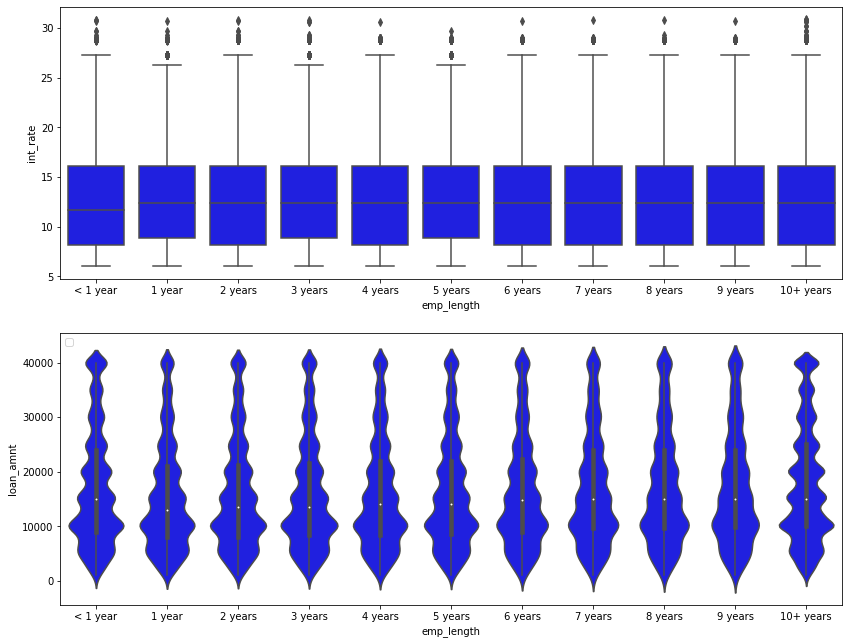
    


```python
# Emp Length interest rate mean
df.groupby(["emp_length"])['int_rate'].mean().reset_index().T
```


<div>
<style scoped>
    .dataframe tbody tr th:only-of-type {
        vertical-align: middle;
    }

    .dataframe tbody tr th {
        vertical-align: top;
    }

    .dataframe thead th {
        text-align: right;
    }
</style>
<table border="1" class="dataframe">
  <thead>
    <tr style="text-align: right;">
      <th></th>
      <th>0</th>
      <th>1</th>
      <th>2</th>
      <th>3</th>
      <th>4</th>
      <th>5</th>
      <th>6</th>
      <th>7</th>
      <th>8</th>
      <th>9</th>
      <th>10</th>
    </tr>
  </thead>
  <tbody>
    <tr>
      <th>emp_length</th>
      <td>1 year</td>
      <td>10+ years</td>
      <td>2 years</td>
      <td>3 years</td>
      <td>4 years</td>
      <td>5 years</td>
      <td>6 years</td>
      <td>7 years</td>
      <td>8 years</td>
      <td>9 years</td>
      <td>&lt; 1 year</td>
    </tr>
    <tr>
      <th>int_rate</th>
      <td>13.0099</td>
      <td>12.8238</td>
      <td>12.8528</td>
      <td>12.9331</td>
      <td>12.9344</td>
      <td>12.9694</td>
      <td>12.9206</td>
      <td>12.8534</td>
      <td>12.7822</td>
      <td>12.8322</td>
      <td>12.6281</td>
    </tr>
  </tbody>
</table>
</div>


#### Debt to Income Ratio Explorations


```python
cm = sns.light_palette("green", as_cmap=True)

round((pd.crosstab(df['loan_status'], df['purpose'],
            values=df['dti'], aggfunc='mean')).fillna(0),
      2).style.background_gradient(cmap = cm)
```


<style  type="text/css" >
#T_ec05baa8_517b_11eb_be4c_0242ac1c0002row0_col0{
            background-color:  #59ac59;
            color:  #000000;
        }#T_ec05baa8_517b_11eb_be4c_0242ac1c0002row0_col1{
            background-color:  #81bf81;
            color:  #000000;
        }#T_ec05baa8_517b_11eb_be4c_0242ac1c0002row0_col2,#T_ec05baa8_517b_11eb_be4c_0242ac1c0002row1_col2{
            background-color:  #51a851;
            color:  #000000;
        }#T_ec05baa8_517b_11eb_be4c_0242ac1c0002row0_col3,#T_ec05baa8_517b_11eb_be4c_0242ac1c0002row0_col7,#T_ec05baa8_517b_11eb_be4c_0242ac1c0002row0_col10,#T_ec05baa8_517b_11eb_be4c_0242ac1c0002row2_col0,#T_ec05baa8_517b_11eb_be4c_0242ac1c0002row4_col4,#T_ec05baa8_517b_11eb_be4c_0242ac1c0002row4_col5,#T_ec05baa8_517b_11eb_be4c_0242ac1c0002row5_col1,#T_ec05baa8_517b_11eb_be4c_0242ac1c0002row5_col8,#T_ec05baa8_517b_11eb_be4c_0242ac1c0002row5_col11,#T_ec05baa8_517b_11eb_be4c_0242ac1c0002row6_col2,#T_ec05baa8_517b_11eb_be4c_0242ac1c0002row6_col6,#T_ec05baa8_517b_11eb_be4c_0242ac1c0002row6_col9{
            background-color:  #008000;
            color:  #f1f1f1;
        }#T_ec05baa8_517b_11eb_be4c_0242ac1c0002row0_col4{
            background-color:  #249224;
            color:  #000000;
        }#T_ec05baa8_517b_11eb_be4c_0242ac1c0002row0_col5,#T_ec05baa8_517b_11eb_be4c_0242ac1c0002row2_col3,#T_ec05baa8_517b_11eb_be4c_0242ac1c0002row2_col4,#T_ec05baa8_517b_11eb_be4c_0242ac1c0002row2_col6,#T_ec05baa8_517b_11eb_be4c_0242ac1c0002row2_col7,#T_ec05baa8_517b_11eb_be4c_0242ac1c0002row2_col8,#T_ec05baa8_517b_11eb_be4c_0242ac1c0002row2_col9,#T_ec05baa8_517b_11eb_be4c_0242ac1c0002row2_col10,#T_ec05baa8_517b_11eb_be4c_0242ac1c0002row2_col11,#T_ec05baa8_517b_11eb_be4c_0242ac1c0002row3_col0,#T_ec05baa8_517b_11eb_be4c_0242ac1c0002row3_col1,#T_ec05baa8_517b_11eb_be4c_0242ac1c0002row3_col2,#T_ec05baa8_517b_11eb_be4c_0242ac1c0002row5_col9{
            background-color:  #ebf3eb;
            color:  #000000;
        }#T_ec05baa8_517b_11eb_be4c_0242ac1c0002row0_col6{
            background-color:  #168b16;
            color:  #000000;
        }#T_ec05baa8_517b_11eb_be4c_0242ac1c0002row0_col8{
            background-color:  #78bb78;
            color:  #000000;
        }#T_ec05baa8_517b_11eb_be4c_0242ac1c0002row0_col9,#T_ec05baa8_517b_11eb_be4c_0242ac1c0002row6_col0{
            background-color:  #56aa56;
            color:  #000000;
        }#T_ec05baa8_517b_11eb_be4c_0242ac1c0002row0_col11{
            background-color:  #3f9f3f;
            color:  #000000;
        }#T_ec05baa8_517b_11eb_be4c_0242ac1c0002row1_col0{
            background-color:  #76ba76;
            color:  #000000;
        }#T_ec05baa8_517b_11eb_be4c_0242ac1c0002row1_col1{
            background-color:  #a3d0a3;
            color:  #000000;
        }#T_ec05baa8_517b_11eb_be4c_0242ac1c0002row1_col3{
            background-color:  #038103;
            color:  #f1f1f1;
        }#T_ec05baa8_517b_11eb_be4c_0242ac1c0002row1_col4{
            background-color:  #098509;
            color:  #f1f1f1;
        }#T_ec05baa8_517b_11eb_be4c_0242ac1c0002row1_col5,#T_ec05baa8_517b_11eb_be4c_0242ac1c0002row3_col10{
            background-color:  #57ab57;
            color:  #000000;
        }#T_ec05baa8_517b_11eb_be4c_0242ac1c0002row1_col6{
            background-color:  #299429;
            color:  #000000;
        }#T_ec05baa8_517b_11eb_be4c_0242ac1c0002row1_col7{
            background-color:  #188c18;
            color:  #000000;
        }#T_ec05baa8_517b_11eb_be4c_0242ac1c0002row1_col8{
            background-color:  #75b975;
            color:  #000000;
        }#T_ec05baa8_517b_11eb_be4c_0242ac1c0002row1_col9{
            background-color:  #359a35;
            color:  #000000;
        }#T_ec05baa8_517b_11eb_be4c_0242ac1c0002row1_col10,#T_ec05baa8_517b_11eb_be4c_0242ac1c0002row4_col6{
            background-color:  #4aa44a;
            color:  #000000;
        }#T_ec05baa8_517b_11eb_be4c_0242ac1c0002row1_col11{
            background-color:  #41a041;
            color:  #000000;
        }#T_ec05baa8_517b_11eb_be4c_0242ac1c0002row2_col1{
            background-color:  #7bbc7b;
            color:  #000000;
        }#T_ec05baa8_517b_11eb_be4c_0242ac1c0002row2_col2{
            background-color:  #73b873;
            color:  #000000;
        }#T_ec05baa8_517b_11eb_be4c_0242ac1c0002row2_col5{
            background-color:  #b3d8b3;
            color:  #000000;
        }#T_ec05baa8_517b_11eb_be4c_0242ac1c0002row3_col3{
            background-color:  #1a8d1a;
            color:  #000000;
        }#T_ec05baa8_517b_11eb_be4c_0242ac1c0002row3_col4{
            background-color:  #2d962d;
            color:  #000000;
        }#T_ec05baa8_517b_11eb_be4c_0242ac1c0002row3_col5{
            background-color:  #a6d1a6;
            color:  #000000;
        }#T_ec05baa8_517b_11eb_be4c_0242ac1c0002row3_col6{
            background-color:  #3c9d3c;
            color:  #000000;
        }#T_ec05baa8_517b_11eb_be4c_0242ac1c0002row3_col7,#T_ec05baa8_517b_11eb_be4c_0242ac1c0002row4_col10{
            background-color:  #259225;
            color:  #000000;
        }#T_ec05baa8_517b_11eb_be4c_0242ac1c0002row3_col8{
            background-color:  #a8d2a8;
            color:  #000000;
        }#T_ec05baa8_517b_11eb_be4c_0242ac1c0002row3_col9{
            background-color:  #4ca54c;
            color:  #000000;
        }#T_ec05baa8_517b_11eb_be4c_0242ac1c0002row3_col11{
            background-color:  #54a954;
            color:  #000000;
        }#T_ec05baa8_517b_11eb_be4c_0242ac1c0002row4_col0{
            background-color:  #c5e0c5;
            color:  #000000;
        }#T_ec05baa8_517b_11eb_be4c_0242ac1c0002row4_col1{
            background-color:  #69b369;
            color:  #000000;
        }#T_ec05baa8_517b_11eb_be4c_0242ac1c0002row4_col2{
            background-color:  #209020;
            color:  #000000;
        }#T_ec05baa8_517b_11eb_be4c_0242ac1c0002row4_col3{
            background-color:  #128912;
            color:  #f1f1f1;
        }#T_ec05baa8_517b_11eb_be4c_0242ac1c0002row4_col7{
            background-color:  #0f870f;
            color:  #f1f1f1;
        }#T_ec05baa8_517b_11eb_be4c_0242ac1c0002row4_col8{
            background-color:  #40a040;
            color:  #000000;
        }#T_ec05baa8_517b_11eb_be4c_0242ac1c0002row4_col9{
            background-color:  #71b771;
            color:  #000000;
        }#T_ec05baa8_517b_11eb_be4c_0242ac1c0002row4_col11{
            background-color:  #379b37;
            color:  #000000;
        }#T_ec05baa8_517b_11eb_be4c_0242ac1c0002row5_col0{
            background-color:  #5eae5e;
            color:  #000000;
        }#T_ec05baa8_517b_11eb_be4c_0242ac1c0002row5_col2{
            background-color:  #c2dfc2;
            color:  #000000;
        }#T_ec05baa8_517b_11eb_be4c_0242ac1c0002row5_col3{
            background-color:  #1e8f1e;
            color:  #000000;
        }#T_ec05baa8_517b_11eb_be4c_0242ac1c0002row5_col4{
            background-color:  #42a042;
            color:  #000000;
        }#T_ec05baa8_517b_11eb_be4c_0242ac1c0002row5_col5{
            background-color:  #e4f0e4;
            color:  #000000;
        }#T_ec05baa8_517b_11eb_be4c_0242ac1c0002row5_col6{
            background-color:  #52a852;
            color:  #000000;
        }#T_ec05baa8_517b_11eb_be4c_0242ac1c0002row5_col7{
            background-color:  #5dae5d;
            color:  #000000;
        }#T_ec05baa8_517b_11eb_be4c_0242ac1c0002row5_col10{
            background-color:  #62b062;
            color:  #000000;
        }#T_ec05baa8_517b_11eb_be4c_0242ac1c0002row6_col1{
            background-color:  #7ebe7e;
            color:  #000000;
        }#T_ec05baa8_517b_11eb_be4c_0242ac1c0002row6_col3{
            background-color:  #058205;
            color:  #f1f1f1;
        }#T_ec05baa8_517b_11eb_be4c_0242ac1c0002row6_col4{
            background-color:  #3b9d3b;
            color:  #000000;
        }#T_ec05baa8_517b_11eb_be4c_0242ac1c0002row6_col5{
            background-color:  #49a449;
            color:  #000000;
        }#T_ec05baa8_517b_11eb_be4c_0242ac1c0002row6_col7{
            background-color:  #219021;
            color:  #000000;
        }#T_ec05baa8_517b_11eb_be4c_0242ac1c0002row6_col8{
            background-color:  #399c39;
            color:  #000000;
        }#T_ec05baa8_517b_11eb_be4c_0242ac1c0002row6_col10{
            background-color:  #369b36;
            color:  #000000;
        }#T_ec05baa8_517b_11eb_be4c_0242ac1c0002row6_col11{
            background-color:  #068306;
            color:  #f1f1f1;
        }</style><table id="T_ec05baa8_517b_11eb_be4c_0242ac1c0002" ><thead>    <tr>        <th class="index_name level0" >purpose</th>        <th class="col_heading level0 col0" >car</th>        <th class="col_heading level0 col1" >credit_card</th>        <th class="col_heading level0 col2" >debt_consolidation</th>        <th class="col_heading level0 col3" >home_improvement</th>        <th class="col_heading level0 col4" >house</th>        <th class="col_heading level0 col5" >major_purchase</th>        <th class="col_heading level0 col6" >medical</th>        <th class="col_heading level0 col7" >moving</th>        <th class="col_heading level0 col8" >other</th>        <th class="col_heading level0 col9" >renewable_energy</th>        <th class="col_heading level0 col10" >small_business</th>        <th class="col_heading level0 col11" >vacation</th>    </tr>    <tr>        <th class="index_name level0" >loan_status</th>        <th class="blank" ></th>        <th class="blank" ></th>        <th class="blank" ></th>        <th class="blank" ></th>        <th class="blank" ></th>        <th class="blank" ></th>        <th class="blank" ></th>        <th class="blank" ></th>        <th class="blank" ></th>        <th class="blank" ></th>        <th class="blank" ></th>        <th class="blank" ></th>    </tr></thead><tbody>
                <tr>
                        <th id="T_ec05baa8_517b_11eb_be4c_0242ac1c0002level0_row0" class="row_heading level0 row0" >Charged Off</th>
                        <td id="T_ec05baa8_517b_11eb_be4c_0242ac1c0002row0_col0" class="data row0 col0" >20.200000</td>
                        <td id="T_ec05baa8_517b_11eb_be4c_0242ac1c0002row0_col1" class="data row0 col1" >21.290000</td>
                        <td id="T_ec05baa8_517b_11eb_be4c_0242ac1c0002row0_col2" class="data row0 col2" >21.420000</td>
                        <td id="T_ec05baa8_517b_11eb_be4c_0242ac1c0002row0_col3" class="data row0 col3" >20.700000</td>
                        <td id="T_ec05baa8_517b_11eb_be4c_0242ac1c0002row0_col4" class="data row0 col4" >16.970000</td>
                        <td id="T_ec05baa8_517b_11eb_be4c_0242ac1c0002row0_col5" class="data row0 col5" >16.230000</td>
                        <td id="T_ec05baa8_517b_11eb_be4c_0242ac1c0002row0_col6" class="data row0 col6" >23.160000</td>
                        <td id="T_ec05baa8_517b_11eb_be4c_0242ac1c0002row0_col7" class="data row0 col7" >21.380000</td>
                        <td id="T_ec05baa8_517b_11eb_be4c_0242ac1c0002row0_col8" class="data row0 col8" >19.920000</td>
                        <td id="T_ec05baa8_517b_11eb_be4c_0242ac1c0002row0_col9" class="data row0 col9" >16.120000</td>
                        <td id="T_ec05baa8_517b_11eb_be4c_0242ac1c0002row0_col10" class="data row0 col10" >24.950000</td>
                        <td id="T_ec05baa8_517b_11eb_be4c_0242ac1c0002row0_col11" class="data row0 col11" >20.670000</td>
            </tr>
            <tr>
                        <th id="T_ec05baa8_517b_11eb_be4c_0242ac1c0002level0_row1" class="row_heading level0 row1" >Current</th>
                        <td id="T_ec05baa8_517b_11eb_be4c_0242ac1c0002row1_col0" class="data row1 col0" >19.250000</td>
                        <td id="T_ec05baa8_517b_11eb_be4c_0242ac1c0002row1_col1" class="data row1 col1" >20.710000</td>
                        <td id="T_ec05baa8_517b_11eb_be4c_0242ac1c0002row1_col2" class="data row1 col2" >21.420000</td>
                        <td id="T_ec05baa8_517b_11eb_be4c_0242ac1c0002row1_col3" class="data row1 col3" >20.440000</td>
                        <td id="T_ec05baa8_517b_11eb_be4c_0242ac1c0002row1_col4" class="data row1 col4" >18.020000</td>
                        <td id="T_ec05baa8_517b_11eb_be4c_0242ac1c0002row1_col5" class="data row1 col5" >18.900000</td>
                        <td id="T_ec05baa8_517b_11eb_be4c_0242ac1c0002row1_col6" class="data row1 col6" >21.000000</td>
                        <td id="T_ec05baa8_517b_11eb_be4c_0242ac1c0002row1_col7" class="data row1 col7" >19.130000</td>
                        <td id="T_ec05baa8_517b_11eb_be4c_0242ac1c0002row1_col8" class="data row1 col8" >20.020000</td>
                        <td id="T_ec05baa8_517b_11eb_be4c_0242ac1c0002row1_col9" class="data row1 col9" >19.680000</td>
                        <td id="T_ec05baa8_517b_11eb_be4c_0242ac1c0002row1_col10" class="data row1 col10" >17.140000</td>
                        <td id="T_ec05baa8_517b_11eb_be4c_0242ac1c0002row1_col11" class="data row1 col11" >20.370000</td>
            </tr>
            <tr>
                        <th id="T_ec05baa8_517b_11eb_be4c_0242ac1c0002level0_row2" class="row_heading level0 row2" >Default</th>
                        <td id="T_ec05baa8_517b_11eb_be4c_0242ac1c0002row2_col0" class="data row2 col0" >23.150000</td>
                        <td id="T_ec05baa8_517b_11eb_be4c_0242ac1c0002row2_col1" class="data row2 col1" >21.380000</td>
                        <td id="T_ec05baa8_517b_11eb_be4c_0242ac1c0002row2_col2" class="data row2 col2" >21.060000</td>
                        <td id="T_ec05baa8_517b_11eb_be4c_0242ac1c0002row2_col3" class="data row2 col3" >0.000000</td>
                        <td id="T_ec05baa8_517b_11eb_be4c_0242ac1c0002row2_col4" class="data row2 col4" >9.190000</td>
                        <td id="T_ec05baa8_517b_11eb_be4c_0242ac1c0002row2_col5" class="data row2 col5" >17.230000</td>
                        <td id="T_ec05baa8_517b_11eb_be4c_0242ac1c0002row2_col6" class="data row2 col6" >0.000000</td>
                        <td id="T_ec05baa8_517b_11eb_be4c_0242ac1c0002row2_col7" class="data row2 col7" >0.000000</td>
                        <td id="T_ec05baa8_517b_11eb_be4c_0242ac1c0002row2_col8" class="data row2 col8" >15.170000</td>
                        <td id="T_ec05baa8_517b_11eb_be4c_0242ac1c0002row2_col9" class="data row2 col9" >0.000000</td>
                        <td id="T_ec05baa8_517b_11eb_be4c_0242ac1c0002row2_col10" class="data row2 col10" >0.000000</td>
                        <td id="T_ec05baa8_517b_11eb_be4c_0242ac1c0002row2_col11" class="data row2 col11" >0.000000</td>
            </tr>
            <tr>
                        <th id="T_ec05baa8_517b_11eb_be4c_0242ac1c0002level0_row3" class="row_heading level0 row3" >Fully Paid</th>
                        <td id="T_ec05baa8_517b_11eb_be4c_0242ac1c0002row3_col0" class="data row3 col0" >15.390000</td>
                        <td id="T_ec05baa8_517b_11eb_be4c_0242ac1c0002row3_col1" class="data row3 col1" >19.510000</td>
                        <td id="T_ec05baa8_517b_11eb_be4c_0242ac1c0002row3_col2" class="data row3 col2" >19.780000</td>
                        <td id="T_ec05baa8_517b_11eb_be4c_0242ac1c0002row3_col3" class="data row3 col3" >18.430000</td>
                        <td id="T_ec05baa8_517b_11eb_be4c_0242ac1c0002row3_col4" class="data row3 col4" >16.600000</td>
                        <td id="T_ec05baa8_517b_11eb_be4c_0242ac1c0002row3_col5" class="data row3 col5" >17.490000</td>
                        <td id="T_ec05baa8_517b_11eb_be4c_0242ac1c0002row3_col6" class="data row3 col6" >19.010000</td>
                        <td id="T_ec05baa8_517b_11eb_be4c_0242ac1c0002row3_col7" class="data row3 col7" >18.010000</td>
                        <td id="T_ec05baa8_517b_11eb_be4c_0242ac1c0002row3_col8" class="data row3 col8" >17.910000</td>
                        <td id="T_ec05baa8_517b_11eb_be4c_0242ac1c0002row3_col9" class="data row3 col9" >17.150000</td>
                        <td id="T_ec05baa8_517b_11eb_be4c_0242ac1c0002row3_col10" class="data row3 col10" >15.610000</td>
                        <td id="T_ec05baa8_517b_11eb_be4c_0242ac1c0002row3_col11" class="data row3 col11" >18.160000</td>
            </tr>
            <tr>
                        <th id="T_ec05baa8_517b_11eb_be4c_0242ac1c0002level0_row4" class="row_heading level0 row4" >In Grace Period</th>
                        <td id="T_ec05baa8_517b_11eb_be4c_0242ac1c0002row4_col0" class="data row4 col0" >16.650000</td>
                        <td id="T_ec05baa8_517b_11eb_be4c_0242ac1c0002row4_col1" class="data row4 col1" >21.680000</td>
                        <td id="T_ec05baa8_517b_11eb_be4c_0242ac1c0002row4_col2" class="data row4 col2" >21.940000</td>
                        <td id="T_ec05baa8_517b_11eb_be4c_0242ac1c0002row4_col3" class="data row4 col3" >19.040000</td>
                        <td id="T_ec05baa8_517b_11eb_be4c_0242ac1c0002row4_col4" class="data row4 col4" >18.390000</td>
                        <td id="T_ec05baa8_517b_11eb_be4c_0242ac1c0002row4_col5" class="data row4 col5" >20.490000</td>
                        <td id="T_ec05baa8_517b_11eb_be4c_0242ac1c0002row4_col6" class="data row4 col6" >17.580000</td>
                        <td id="T_ec05baa8_517b_11eb_be4c_0242ac1c0002row4_col7" class="data row4 col7" >19.970000</td>
                        <td id="T_ec05baa8_517b_11eb_be4c_0242ac1c0002row4_col8" class="data row4 col8" >22.170000</td>
                        <td id="T_ec05baa8_517b_11eb_be4c_0242ac1c0002row4_col9" class="data row4 col9" >13.240000</td>
                        <td id="T_ec05baa8_517b_11eb_be4c_0242ac1c0002row4_col10" class="data row4 col10" >20.970000</td>
                        <td id="T_ec05baa8_517b_11eb_be4c_0242ac1c0002row4_col11" class="data row4 col11" >21.540000</td>
            </tr>
            <tr>
                        <th id="T_ec05baa8_517b_11eb_be4c_0242ac1c0002level0_row5" class="row_heading level0 row5" >Late (16-30 days)</th>
                        <td id="T_ec05baa8_517b_11eb_be4c_0242ac1c0002row5_col0" class="data row5 col0" >20.050000</td>
                        <td id="T_ec05baa8_517b_11eb_be4c_0242ac1c0002row5_col1" class="data row5 col1" >23.440000</td>
                        <td id="T_ec05baa8_517b_11eb_be4c_0242ac1c0002row5_col2" class="data row5 col2" >20.220000</td>
                        <td id="T_ec05baa8_517b_11eb_be4c_0242ac1c0002row5_col3" class="data row5 col3" >17.960000</td>
                        <td id="T_ec05baa8_517b_11eb_be4c_0242ac1c0002row5_col4" class="data row5 col4" >15.800000</td>
                        <td id="T_ec05baa8_517b_11eb_be4c_0242ac1c0002row5_col5" class="data row5 col5" >16.350000</td>
                        <td id="T_ec05baa8_517b_11eb_be4c_0242ac1c0002row5_col6" class="data row5 col6" >16.690000</td>
                        <td id="T_ec05baa8_517b_11eb_be4c_0242ac1c0002row5_col7" class="data row5 col7" >12.900000</td>
                        <td id="T_ec05baa8_517b_11eb_be4c_0242ac1c0002row5_col8" class="data row5 col8" >24.850000</td>
                        <td id="T_ec05baa8_517b_11eb_be4c_0242ac1c0002row5_col9" class="data row5 col9" >0.000000</td>
                        <td id="T_ec05baa8_517b_11eb_be4c_0242ac1c0002row5_col10" class="data row5 col10" >14.450000</td>
                        <td id="T_ec05baa8_517b_11eb_be4c_0242ac1c0002row5_col11" class="data row5 col11" >28.200000</td>
            </tr>
            <tr>
                        <th id="T_ec05baa8_517b_11eb_be4c_0242ac1c0002level0_row6" class="row_heading level0 row6" >Late (31-120 days)</th>
                        <td id="T_ec05baa8_517b_11eb_be4c_0242ac1c0002row6_col0" class="data row6 col0" >20.290000</td>
                        <td id="T_ec05baa8_517b_11eb_be4c_0242ac1c0002row6_col1" class="data row6 col1" >21.330000</td>
                        <td id="T_ec05baa8_517b_11eb_be4c_0242ac1c0002row6_col2" class="data row6 col2" >22.290000</td>
                        <td id="T_ec05baa8_517b_11eb_be4c_0242ac1c0002row6_col3" class="data row6 col3" >20.280000</td>
                        <td id="T_ec05baa8_517b_11eb_be4c_0242ac1c0002row6_col4" class="data row6 col4" >16.070000</td>
                        <td id="T_ec05baa8_517b_11eb_be4c_0242ac1c0002row6_col5" class="data row6 col5" >19.160000</td>
                        <td id="T_ec05baa8_517b_11eb_be4c_0242ac1c0002row6_col6" class="data row6 col6" >25.590000</td>
                        <td id="T_ec05baa8_517b_11eb_be4c_0242ac1c0002row6_col7" class="data row6 col7" >18.300000</td>
                        <td id="T_ec05baa8_517b_11eb_be4c_0242ac1c0002row6_col8" class="data row6 col8" >22.470000</td>
                        <td id="T_ec05baa8_517b_11eb_be4c_0242ac1c0002row6_col9" class="data row6 col9" >25.520000</td>
                        <td id="T_ec05baa8_517b_11eb_be4c_0242ac1c0002row6_col10" class="data row6 col10" >19.140000</td>
                        <td id="T_ec05baa8_517b_11eb_be4c_0242ac1c0002row6_col11" class="data row6 col11" >27.430000</td>
            </tr>
    </tbody></table>


```python
cm = sns.light_palette("green", as_cmap=True)

round((pd.crosstab(df['loan_condition'], df['purpose'],
            values=df['dti'], aggfunc='mean')).fillna(0),
      2).style.background_gradient(cmap = cm)
```


<style  type="text/css" >
#T_ec1a5882_517b_11eb_be4c_0242ac1c0002row0_col0,#T_ec1a5882_517b_11eb_be4c_0242ac1c0002row0_col1,#T_ec1a5882_517b_11eb_be4c_0242ac1c0002row0_col2,#T_ec1a5882_517b_11eb_be4c_0242ac1c0002row0_col3,#T_ec1a5882_517b_11eb_be4c_0242ac1c0002row0_col6,#T_ec1a5882_517b_11eb_be4c_0242ac1c0002row0_col7,#T_ec1a5882_517b_11eb_be4c_0242ac1c0002row0_col8,#T_ec1a5882_517b_11eb_be4c_0242ac1c0002row0_col9,#T_ec1a5882_517b_11eb_be4c_0242ac1c0002row0_col10,#T_ec1a5882_517b_11eb_be4c_0242ac1c0002row0_col11,#T_ec1a5882_517b_11eb_be4c_0242ac1c0002row1_col4,#T_ec1a5882_517b_11eb_be4c_0242ac1c0002row1_col5{
            background-color:  #008000;
            color:  #f1f1f1;
        }#T_ec1a5882_517b_11eb_be4c_0242ac1c0002row0_col4,#T_ec1a5882_517b_11eb_be4c_0242ac1c0002row0_col5,#T_ec1a5882_517b_11eb_be4c_0242ac1c0002row1_col0,#T_ec1a5882_517b_11eb_be4c_0242ac1c0002row1_col1,#T_ec1a5882_517b_11eb_be4c_0242ac1c0002row1_col2,#T_ec1a5882_517b_11eb_be4c_0242ac1c0002row1_col3,#T_ec1a5882_517b_11eb_be4c_0242ac1c0002row1_col6,#T_ec1a5882_517b_11eb_be4c_0242ac1c0002row1_col7,#T_ec1a5882_517b_11eb_be4c_0242ac1c0002row1_col8,#T_ec1a5882_517b_11eb_be4c_0242ac1c0002row1_col9,#T_ec1a5882_517b_11eb_be4c_0242ac1c0002row1_col10,#T_ec1a5882_517b_11eb_be4c_0242ac1c0002row1_col11{
            background-color:  #ebf3eb;
            color:  #000000;
        }</style><table id="T_ec1a5882_517b_11eb_be4c_0242ac1c0002" ><thead>    <tr>        <th class="index_name level0" >purpose</th>        <th class="col_heading level0 col0" >car</th>        <th class="col_heading level0 col1" >credit_card</th>        <th class="col_heading level0 col2" >debt_consolidation</th>        <th class="col_heading level0 col3" >home_improvement</th>        <th class="col_heading level0 col4" >house</th>        <th class="col_heading level0 col5" >major_purchase</th>        <th class="col_heading level0 col6" >medical</th>        <th class="col_heading level0 col7" >moving</th>        <th class="col_heading level0 col8" >other</th>        <th class="col_heading level0 col9" >renewable_energy</th>        <th class="col_heading level0 col10" >small_business</th>        <th class="col_heading level0 col11" >vacation</th>    </tr>    <tr>        <th class="index_name level0" >loan_condition</th>        <th class="blank" ></th>        <th class="blank" ></th>        <th class="blank" ></th>        <th class="blank" ></th>        <th class="blank" ></th>        <th class="blank" ></th>        <th class="blank" ></th>        <th class="blank" ></th>        <th class="blank" ></th>        <th class="blank" ></th>        <th class="blank" ></th>        <th class="blank" ></th>    </tr></thead><tbody>
                <tr>
                        <th id="T_ec1a5882_517b_11eb_be4c_0242ac1c0002level0_row0" class="row_heading level0 row0" >NPL</th>
                        <td id="T_ec1a5882_517b_11eb_be4c_0242ac1c0002row0_col0" class="data row0 col0" >19.890000</td>
                        <td id="T_ec1a5882_517b_11eb_be4c_0242ac1c0002row0_col1" class="data row0 col1" >21.450000</td>
                        <td id="T_ec1a5882_517b_11eb_be4c_0242ac1c0002row0_col2" class="data row0 col2" >21.670000</td>
                        <td id="T_ec1a5882_517b_11eb_be4c_0242ac1c0002row0_col3" class="data row0 col3" >20.240000</td>
                        <td id="T_ec1a5882_517b_11eb_be4c_0242ac1c0002row0_col4" class="data row0 col4" >16.780000</td>
                        <td id="T_ec1a5882_517b_11eb_be4c_0242ac1c0002row0_col5" class="data row0 col5" >17.460000</td>
                        <td id="T_ec1a5882_517b_11eb_be4c_0242ac1c0002row0_col6" class="data row0 col6" >22.740000</td>
                        <td id="T_ec1a5882_517b_11eb_be4c_0242ac1c0002row0_col7" class="data row0 col7" >20.200000</td>
                        <td id="T_ec1a5882_517b_11eb_be4c_0242ac1c0002row0_col8" class="data row0 col8" >21.010000</td>
                        <td id="T_ec1a5882_517b_11eb_be4c_0242ac1c0002row0_col9" class="data row0 col9" >21.050000</td>
                        <td id="T_ec1a5882_517b_11eb_be4c_0242ac1c0002row0_col10" class="data row0 col10" >22.650000</td>
                        <td id="T_ec1a5882_517b_11eb_be4c_0242ac1c0002row0_col11" class="data row0 col11" >22.720000</td>
            </tr>
            <tr>
                        <th id="T_ec1a5882_517b_11eb_be4c_0242ac1c0002level0_row1" class="row_heading level0 row1" >PL</th>
                        <td id="T_ec1a5882_517b_11eb_be4c_0242ac1c0002row1_col0" class="data row1 col0" >18.570000</td>
                        <td id="T_ec1a5882_517b_11eb_be4c_0242ac1c0002row1_col1" class="data row1 col1" >20.590000</td>
                        <td id="T_ec1a5882_517b_11eb_be4c_0242ac1c0002row1_col2" class="data row1 col2" >21.220000</td>
                        <td id="T_ec1a5882_517b_11eb_be4c_0242ac1c0002row1_col3" class="data row1 col3" >20.120000</td>
                        <td id="T_ec1a5882_517b_11eb_be4c_0242ac1c0002row1_col4" class="data row1 col4" >17.770000</td>
                        <td id="T_ec1a5882_517b_11eb_be4c_0242ac1c0002row1_col5" class="data row1 col5" >18.660000</td>
                        <td id="T_ec1a5882_517b_11eb_be4c_0242ac1c0002row1_col6" class="data row1 col6" >20.690000</td>
                        <td id="T_ec1a5882_517b_11eb_be4c_0242ac1c0002row1_col7" class="data row1 col7" >18.920000</td>
                        <td id="T_ec1a5882_517b_11eb_be4c_0242ac1c0002row1_col8" class="data row1 col8" >19.690000</td>
                        <td id="T_ec1a5882_517b_11eb_be4c_0242ac1c0002row1_col9" class="data row1 col9" >19.270000</td>
                        <td id="T_ec1a5882_517b_11eb_be4c_0242ac1c0002row1_col10" class="data row1 col10" >16.970000</td>
                        <td id="T_ec1a5882_517b_11eb_be4c_0242ac1c0002row1_col11" class="data row1 col11" >19.990000</td>
            </tr>
    </tbody></table>


#### Evaluating Credit Utilization


```python
# Converting the interest rate to an integer and reassign it to the same variable
df['revol_util'] = df['revol_util'].str.replace('%', '').astype(float)

cm = sns.light_palette("green", as_cmap=True)

round((pd.crosstab(df['loan_condition'], df['purpose'],
            values=df['revol_util'], aggfunc='mean')).fillna(0),
      2).style.background_gradient(cmap = cm)
```


<style  type="text/css" >
#T_ec60a0bc_517b_11eb_be4c_0242ac1c0002row0_col0,#T_ec60a0bc_517b_11eb_be4c_0242ac1c0002row0_col1,#T_ec60a0bc_517b_11eb_be4c_0242ac1c0002row0_col2,#T_ec60a0bc_517b_11eb_be4c_0242ac1c0002row0_col3,#T_ec60a0bc_517b_11eb_be4c_0242ac1c0002row0_col4,#T_ec60a0bc_517b_11eb_be4c_0242ac1c0002row0_col6,#T_ec60a0bc_517b_11eb_be4c_0242ac1c0002row0_col7,#T_ec60a0bc_517b_11eb_be4c_0242ac1c0002row0_col8,#T_ec60a0bc_517b_11eb_be4c_0242ac1c0002row0_col10,#T_ec60a0bc_517b_11eb_be4c_0242ac1c0002row1_col5,#T_ec60a0bc_517b_11eb_be4c_0242ac1c0002row1_col9,#T_ec60a0bc_517b_11eb_be4c_0242ac1c0002row1_col11{
            background-color:  #008000;
            color:  #f1f1f1;
        }#T_ec60a0bc_517b_11eb_be4c_0242ac1c0002row0_col5,#T_ec60a0bc_517b_11eb_be4c_0242ac1c0002row0_col9,#T_ec60a0bc_517b_11eb_be4c_0242ac1c0002row0_col11,#T_ec60a0bc_517b_11eb_be4c_0242ac1c0002row1_col0,#T_ec60a0bc_517b_11eb_be4c_0242ac1c0002row1_col1,#T_ec60a0bc_517b_11eb_be4c_0242ac1c0002row1_col2,#T_ec60a0bc_517b_11eb_be4c_0242ac1c0002row1_col3,#T_ec60a0bc_517b_11eb_be4c_0242ac1c0002row1_col4,#T_ec60a0bc_517b_11eb_be4c_0242ac1c0002row1_col6,#T_ec60a0bc_517b_11eb_be4c_0242ac1c0002row1_col7,#T_ec60a0bc_517b_11eb_be4c_0242ac1c0002row1_col8,#T_ec60a0bc_517b_11eb_be4c_0242ac1c0002row1_col10{
            background-color:  #ebf3eb;
            color:  #000000;
        }</style><table id="T_ec60a0bc_517b_11eb_be4c_0242ac1c0002" ><thead>    <tr>        <th class="index_name level0" >purpose</th>        <th class="col_heading level0 col0" >car</th>        <th class="col_heading level0 col1" >credit_card</th>        <th class="col_heading level0 col2" >debt_consolidation</th>        <th class="col_heading level0 col3" >home_improvement</th>        <th class="col_heading level0 col4" >house</th>        <th class="col_heading level0 col5" >major_purchase</th>        <th class="col_heading level0 col6" >medical</th>        <th class="col_heading level0 col7" >moving</th>        <th class="col_heading level0 col8" >other</th>        <th class="col_heading level0 col9" >renewable_energy</th>        <th class="col_heading level0 col10" >small_business</th>        <th class="col_heading level0 col11" >vacation</th>    </tr>    <tr>        <th class="index_name level0" >loan_condition</th>        <th class="blank" ></th>        <th class="blank" ></th>        <th class="blank" ></th>        <th class="blank" ></th>        <th class="blank" ></th>        <th class="blank" ></th>        <th class="blank" ></th>        <th class="blank" ></th>        <th class="blank" ></th>        <th class="blank" ></th>        <th class="blank" ></th>        <th class="blank" ></th>    </tr></thead><tbody>
                <tr>
                        <th id="T_ec60a0bc_517b_11eb_be4c_0242ac1c0002level0_row0" class="row_heading level0 row0" >NPL</th>
                        <td id="T_ec60a0bc_517b_11eb_be4c_0242ac1c0002row0_col0" class="data row0 col0" >39.820000</td>
                        <td id="T_ec60a0bc_517b_11eb_be4c_0242ac1c0002row0_col1" class="data row0 col1" >49.630000</td>
                        <td id="T_ec60a0bc_517b_11eb_be4c_0242ac1c0002row0_col2" class="data row0 col2" >46.360000</td>
                        <td id="T_ec60a0bc_517b_11eb_be4c_0242ac1c0002row0_col3" class="data row0 col3" >38.810000</td>
                        <td id="T_ec60a0bc_517b_11eb_be4c_0242ac1c0002row0_col4" class="data row0 col4" >34.360000</td>
                        <td id="T_ec60a0bc_517b_11eb_be4c_0242ac1c0002row0_col5" class="data row0 col5" >33.700000</td>
                        <td id="T_ec60a0bc_517b_11eb_be4c_0242ac1c0002row0_col6" class="data row0 col6" >41.440000</td>
                        <td id="T_ec60a0bc_517b_11eb_be4c_0242ac1c0002row0_col7" class="data row0 col7" >43.570000</td>
                        <td id="T_ec60a0bc_517b_11eb_be4c_0242ac1c0002row0_col8" class="data row0 col8" >41.270000</td>
                        <td id="T_ec60a0bc_517b_11eb_be4c_0242ac1c0002row0_col9" class="data row0 col9" >31.760000</td>
                        <td id="T_ec60a0bc_517b_11eb_be4c_0242ac1c0002row0_col10" class="data row0 col10" >40.000000</td>
                        <td id="T_ec60a0bc_517b_11eb_be4c_0242ac1c0002row0_col11" class="data row0 col11" >39.420000</td>
            </tr>
            <tr>
                        <th id="T_ec60a0bc_517b_11eb_be4c_0242ac1c0002level0_row1" class="row_heading level0 row1" >PL</th>
                        <td id="T_ec60a0bc_517b_11eb_be4c_0242ac1c0002row1_col0" class="data row1 col0" >34.980000</td>
                        <td id="T_ec60a0bc_517b_11eb_be4c_0242ac1c0002row1_col1" class="data row1 col1" >48.700000</td>
                        <td id="T_ec60a0bc_517b_11eb_be4c_0242ac1c0002row1_col2" class="data row1 col2" >44.930000</td>
                        <td id="T_ec60a0bc_517b_11eb_be4c_0242ac1c0002row1_col3" class="data row1 col3" >36.990000</td>
                        <td id="T_ec60a0bc_517b_11eb_be4c_0242ac1c0002row1_col4" class="data row1 col4" >32.440000</td>
                        <td id="T_ec60a0bc_517b_11eb_be4c_0242ac1c0002row1_col5" class="data row1 col5" >34.120000</td>
                        <td id="T_ec60a0bc_517b_11eb_be4c_0242ac1c0002row1_col6" class="data row1 col6" >39.420000</td>
                        <td id="T_ec60a0bc_517b_11eb_be4c_0242ac1c0002row1_col7" class="data row1 col7" >38.350000</td>
                        <td id="T_ec60a0bc_517b_11eb_be4c_0242ac1c0002row1_col8" class="data row1 col8" >38.790000</td>
                        <td id="T_ec60a0bc_517b_11eb_be4c_0242ac1c0002row1_col9" class="data row1 col9" >35.840000</td>
                        <td id="T_ec60a0bc_517b_11eb_be4c_0242ac1c0002row1_col10" class="data row1 col10" >37.780000</td>
                        <td id="T_ec60a0bc_517b_11eb_be4c_0242ac1c0002row1_col11" class="data row1 col11" >40.000000</td>
            </tr>
    </tbody></table>


## Feature Selection

In order to predict default accurately, we need to reduce the high-dimensionality in our dataset. To do this, we first eliminate the variables consisting of more than 30% in missing values.


```python
df.shape
```


    (518107, 143)


```python
# Once again displaying the dataframe that consists of all our variables with missing values
missing_value_df
```


<div>
<style scoped>
    .dataframe tbody tr th:only-of-type {
        vertical-align: middle;
    }

    .dataframe tbody tr th {
        vertical-align: top;
    }

    .dataframe thead th {
        text-align: right;
    }
</style>
<table border="1" class="dataframe">
  <thead>
    <tr style="text-align: right;">
      <th></th>
      <th>column_name</th>
      <th>percentage_missing</th>
    </tr>
  </thead>
  <tbody>
    <tr>
      <th>loan_amnt</th>
      <td>loan_amnt</td>
      <td>0.000000</td>
    </tr>
    <tr>
      <th>delinq_amnt</th>
      <td>delinq_amnt</td>
      <td>0.000000</td>
    </tr>
    <tr>
      <th>chargeoff_within_12_mths</th>
      <td>chargeoff_within_12_mths</td>
      <td>0.000000</td>
    </tr>
    <tr>
      <th>acc_open_past_24mths</th>
      <td>acc_open_past_24mths</td>
      <td>0.000000</td>
    </tr>
    <tr>
      <th>inq_last_12m</th>
      <td>inq_last_12m</td>
      <td>0.000000</td>
    </tr>
    <tr>
      <th>total_cu_tl</th>
      <td>total_cu_tl</td>
      <td>0.000000</td>
    </tr>
    <tr>
      <th>inq_fi</th>
      <td>inq_fi</td>
      <td>0.000000</td>
    </tr>
    <tr>
      <th>total_rev_hi_lim</th>
      <td>total_rev_hi_lim</td>
      <td>0.000000</td>
    </tr>
    <tr>
      <th>open_rv_24m</th>
      <td>open_rv_24m</td>
      <td>0.000000</td>
    </tr>
    <tr>
      <th>open_rv_12m</th>
      <td>open_rv_12m</td>
      <td>0.000000</td>
    </tr>
    <tr>
      <th>mo_sin_old_rev_tl_op</th>
      <td>mo_sin_old_rev_tl_op</td>
      <td>0.000000</td>
    </tr>
    <tr>
      <th>total_bal_il</th>
      <td>total_bal_il</td>
      <td>0.000000</td>
    </tr>
    <tr>
      <th>open_il_12m</th>
      <td>open_il_12m</td>
      <td>0.000000</td>
    </tr>
    <tr>
      <th>open_act_il</th>
      <td>open_act_il</td>
      <td>0.000000</td>
    </tr>
    <tr>
      <th>open_acc_6m</th>
      <td>open_acc_6m</td>
      <td>0.000000</td>
    </tr>
    <tr>
      <th>tot_cur_bal</th>
      <td>tot_cur_bal</td>
      <td>0.000000</td>
    </tr>
    <tr>
      <th>tot_coll_amt</th>
      <td>tot_coll_amt</td>
      <td>0.000000</td>
    </tr>
    <tr>
      <th>acc_now_delinq</th>
      <td>acc_now_delinq</td>
      <td>0.000000</td>
    </tr>
    <tr>
      <th>application_type</th>
      <td>application_type</td>
      <td>0.000000</td>
    </tr>
    <tr>
      <th>policy_code</th>
      <td>policy_code</td>
      <td>0.000000</td>
    </tr>
    <tr>
      <th>collections_12_mths_ex_med</th>
      <td>collections_12_mths_ex_med</td>
      <td>0.000000</td>
    </tr>
    <tr>
      <th>open_il_24m</th>
      <td>open_il_24m</td>
      <td>0.000000</td>
    </tr>
    <tr>
      <th>last_fico_range_low</th>
      <td>last_fico_range_low</td>
      <td>0.000000</td>
    </tr>
    <tr>
      <th>mo_sin_rcnt_rev_tl_op</th>
      <td>mo_sin_rcnt_rev_tl_op</td>
      <td>0.000000</td>
    </tr>
    <tr>
      <th>mort_acc</th>
      <td>mort_acc</td>
      <td>0.000000</td>
    </tr>
    <tr>
      <th>total_il_high_credit_limit</th>
      <td>total_il_high_credit_limit</td>
      <td>0.000000</td>
    </tr>
    <tr>
      <th>total_bc_limit</th>
      <td>total_bc_limit</td>
      <td>0.000000</td>
    </tr>
    <tr>
      <th>total_bal_ex_mort</th>
      <td>total_bal_ex_mort</td>
      <td>0.000000</td>
    </tr>
    <tr>
      <th>tot_hi_cred_lim</th>
      <td>tot_hi_cred_lim</td>
      <td>0.000000</td>
    </tr>
    <tr>
      <th>tax_liens</th>
      <td>tax_liens</td>
      <td>0.000000</td>
    </tr>
    <tr>
      <th>pub_rec_bankruptcies</th>
      <td>pub_rec_bankruptcies</td>
      <td>0.000000</td>
    </tr>
    <tr>
      <th>pct_tl_nvr_dlq</th>
      <td>pct_tl_nvr_dlq</td>
      <td>0.000000</td>
    </tr>
    <tr>
      <th>num_tl_op_past_12m</th>
      <td>num_tl_op_past_12m</td>
      <td>0.000000</td>
    </tr>
    <tr>
      <th>num_tl_90g_dpd_24m</th>
      <td>num_tl_90g_dpd_24m</td>
      <td>0.000000</td>
    </tr>
    <tr>
      <th>mo_sin_rcnt_tl</th>
      <td>mo_sin_rcnt_tl</td>
      <td>0.000000</td>
    </tr>
    <tr>
      <th>num_tl_30dpd</th>
      <td>num_tl_30dpd</td>
      <td>0.000000</td>
    </tr>
    <tr>
      <th>num_rev_tl_bal_gt_0</th>
      <td>num_rev_tl_bal_gt_0</td>
      <td>0.000000</td>
    </tr>
    <tr>
      <th>num_rev_accts</th>
      <td>num_rev_accts</td>
      <td>0.000000</td>
    </tr>
    <tr>
      <th>num_op_rev_tl</th>
      <td>num_op_rev_tl</td>
      <td>0.000000</td>
    </tr>
    <tr>
      <th>num_il_tl</th>
      <td>num_il_tl</td>
      <td>0.000000</td>
    </tr>
    <tr>
      <th>num_bc_tl</th>
      <td>num_bc_tl</td>
      <td>0.000000</td>
    </tr>
    <tr>
      <th>num_bc_sats</th>
      <td>num_bc_sats</td>
      <td>0.000000</td>
    </tr>
    <tr>
      <th>num_actv_rev_tl</th>
      <td>num_actv_rev_tl</td>
      <td>0.000000</td>
    </tr>
    <tr>
      <th>num_actv_bc_tl</th>
      <td>num_actv_bc_tl</td>
      <td>0.000000</td>
    </tr>
    <tr>
      <th>num_accts_ever_120_pd</th>
      <td>num_accts_ever_120_pd</td>
      <td>0.000000</td>
    </tr>
    <tr>
      <th>num_sats</th>
      <td>num_sats</td>
      <td>0.000000</td>
    </tr>
    <tr>
      <th>last_fico_range_high</th>
      <td>last_fico_range_high</td>
      <td>0.000000</td>
    </tr>
    <tr>
      <th>max_bal_bc</th>
      <td>max_bal_bc</td>
      <td>0.000000</td>
    </tr>
    <tr>
      <th>purpose</th>
      <td>purpose</td>
      <td>0.000000</td>
    </tr>
    <tr>
      <th>fico_range_high</th>
      <td>fico_range_high</td>
      <td>0.000000</td>
    </tr>
    <tr>
      <th>fico_range_low</th>
      <td>fico_range_low</td>
      <td>0.000000</td>
    </tr>
    <tr>
      <th>earliest_cr_line</th>
      <td>earliest_cr_line</td>
      <td>0.000000</td>
    </tr>
    <tr>
      <th>delinq_2yrs</th>
      <td>delinq_2yrs</td>
      <td>0.000000</td>
    </tr>
    <tr>
      <th>addr_state</th>
      <td>addr_state</td>
      <td>0.000000</td>
    </tr>
    <tr>
      <th>zip_code</th>
      <td>zip_code</td>
      <td>0.000000</td>
    </tr>
    <tr>
      <th>title</th>
      <td>title</td>
      <td>0.000000</td>
    </tr>
    <tr>
      <th>url</th>
      <td>url</td>
      <td>0.000000</td>
    </tr>
    <tr>
      <th>pymnt_plan</th>
      <td>pymnt_plan</td>
      <td>0.000000</td>
    </tr>
    <tr>
      <th>loan_status</th>
      <td>loan_status</td>
      <td>0.000000</td>
    </tr>
    <tr>
      <th>issue_d</th>
      <td>issue_d</td>
      <td>0.000000</td>
    </tr>
    <tr>
      <th>verification_status</th>
      <td>verification_status</td>
      <td>0.000000</td>
    </tr>
    <tr>
      <th>annual_inc</th>
      <td>annual_inc</td>
      <td>0.000000</td>
    </tr>
    <tr>
      <th>home_ownership</th>
      <td>home_ownership</td>
      <td>0.000000</td>
    </tr>
    <tr>
      <th>sub_grade</th>
      <td>sub_grade</td>
      <td>0.000000</td>
    </tr>
    <tr>
      <th>grade</th>
      <td>grade</td>
      <td>0.000000</td>
    </tr>
    <tr>
      <th>installment</th>
      <td>installment</td>
      <td>0.000000</td>
    </tr>
    <tr>
      <th>int_rate</th>
      <td>int_rate</td>
      <td>0.000000</td>
    </tr>
    <tr>
      <th>term</th>
      <td>term</td>
      <td>0.000000</td>
    </tr>
    <tr>
      <th>funded_amnt_inv</th>
      <td>funded_amnt_inv</td>
      <td>0.000000</td>
    </tr>
    <tr>
      <th>funded_amnt</th>
      <td>funded_amnt</td>
      <td>0.000000</td>
    </tr>
    <tr>
      <th>inq_last_6mths</th>
      <td>inq_last_6mths</td>
      <td>0.000000</td>
    </tr>
    <tr>
      <th>open_acc</th>
      <td>open_acc</td>
      <td>0.000000</td>
    </tr>
    <tr>
      <th>debt_settlement_flag</th>
      <td>debt_settlement_flag</td>
      <td>0.000000</td>
    </tr>
    <tr>
      <th>revol_bal</th>
      <td>revol_bal</td>
      <td>0.000000</td>
    </tr>
    <tr>
      <th>out_prncp</th>
      <td>out_prncp</td>
      <td>0.000000</td>
    </tr>
    <tr>
      <th>total_pymnt</th>
      <td>total_pymnt</td>
      <td>0.000000</td>
    </tr>
    <tr>
      <th>initial_list_status</th>
      <td>initial_list_status</td>
      <td>0.000000</td>
    </tr>
    <tr>
      <th>recoveries</th>
      <td>recoveries</td>
      <td>0.000000</td>
    </tr>
    <tr>
      <th>total_pymnt_inv</th>
      <td>total_pymnt_inv</td>
      <td>0.000000</td>
    </tr>
    <tr>
      <th>collection_recovery_fee</th>
      <td>collection_recovery_fee</td>
      <td>0.000000</td>
    </tr>
    <tr>
      <th>total_rec_prncp</th>
      <td>total_rec_prncp</td>
      <td>0.000000</td>
    </tr>
    <tr>
      <th>total_acc</th>
      <td>total_acc</td>
      <td>0.000000</td>
    </tr>
    <tr>
      <th>total_rec_late_fee</th>
      <td>total_rec_late_fee</td>
      <td>0.000000</td>
    </tr>
    <tr>
      <th>last_pymnt_amnt</th>
      <td>last_pymnt_amnt</td>
      <td>0.000000</td>
    </tr>
    <tr>
      <th>pub_rec</th>
      <td>pub_rec</td>
      <td>0.000000</td>
    </tr>
    <tr>
      <th>total_rec_int</th>
      <td>total_rec_int</td>
      <td>0.000000</td>
    </tr>
    <tr>
      <th>out_prncp_inv</th>
      <td>out_prncp_inv</td>
      <td>0.000000</td>
    </tr>
    <tr>
      <th>last_credit_pull_d</th>
      <td>last_credit_pull_d</td>
      <td>0.000579</td>
    </tr>
    <tr>
      <th>avg_cur_bal</th>
      <td>avg_cur_bal</td>
      <td>0.006176</td>
    </tr>
    <tr>
      <th>all_util</th>
      <td>all_util</td>
      <td>0.022582</td>
    </tr>
    <tr>
      <th>revol_util</th>
      <td>revol_util</td>
      <td>0.130089</td>
    </tr>
    <tr>
      <th>last_pymnt_d</th>
      <td>last_pymnt_d</td>
      <td>0.166568</td>
    </tr>
    <tr>
      <th>dti</th>
      <td>dti</td>
      <td>0.220997</td>
    </tr>
    <tr>
      <th>mths_since_recent_bc</th>
      <td>mths_since_recent_bc</td>
      <td>1.142814</td>
    </tr>
    <tr>
      <th>bc_open_to_buy</th>
      <td>bc_open_to_buy</td>
      <td>1.209982</td>
    </tr>
    <tr>
      <th>percent_bc_gt_75</th>
      <td>percent_bc_gt_75</td>
      <td>1.216737</td>
    </tr>
    <tr>
      <th>bc_util</th>
      <td>bc_util</td>
      <td>1.259778</td>
    </tr>
    <tr>
      <th>num_tl_120dpd_2m</th>
      <td>num_tl_120dpd_2m</td>
      <td>1.371531</td>
    </tr>
    <tr>
      <th>hardship_flag</th>
      <td>hardship_flag</td>
      <td>2.566072</td>
    </tr>
    <tr>
      <th>mo_sin_old_il_acct</th>
      <td>mo_sin_old_il_acct</td>
      <td>2.721253</td>
    </tr>
    <tr>
      <th>mths_since_rcnt_il</th>
      <td>mths_since_rcnt_il</td>
      <td>2.721253</td>
    </tr>
    <tr>
      <th>emp_length</th>
      <td>emp_length</td>
      <td>8.926921</td>
    </tr>
    <tr>
      <th>mths_since_recent_inq</th>
      <td>mths_since_recent_inq</td>
      <td>12.009295</td>
    </tr>
    <tr>
      <th>il_util</th>
      <td>il_util</td>
      <td>13.955998</td>
    </tr>
    <tr>
      <th>next_pymnt_d</th>
      <td>next_pymnt_d</td>
      <td>14.538889</td>
    </tr>
    <tr>
      <th>emp_title</th>
      <td>emp_title</td>
      <td>14.963704</td>
    </tr>
    <tr>
      <th>mths_since_last_delinq</th>
      <td>mths_since_last_delinq</td>
      <td>56.465749</td>
    </tr>
    <tr>
      <th>mths_since_recent_revol_delinq</th>
      <td>mths_since_recent_revol_delinq</td>
      <td>71.148624</td>
    </tr>
    <tr>
      <th>mths_since_last_major_derog</th>
      <td>mths_since_last_major_derog</td>
      <td>78.217627</td>
    </tr>
    <tr>
      <th>mths_since_recent_bc_dlq</th>
      <td>mths_since_recent_bc_dlq</td>
      <td>80.205247</td>
    </tr>
    <tr>
      <th>hardship_payoff_balance_amount</th>
      <td>hardship_payoff_balance_amount</td>
      <td>85.865854</td>
    </tr>
    <tr>
      <th>hardship_last_payment_amount</th>
      <td>hardship_last_payment_amount</td>
      <td>85.865854</td>
    </tr>
    <tr>
      <th>hardship_amount</th>
      <td>hardship_amount</td>
      <td>85.865854</td>
    </tr>
    <tr>
      <th>orig_projected_additional_accrued_interest</th>
      <td>orig_projected_additional_accrued_interest</td>
      <td>85.866047</td>
    </tr>
    <tr>
      <th>sec_app_collections_12_mths_ex_med</th>
      <td>sec_app_collections_12_mths_ex_med</td>
      <td>86.123716</td>
    </tr>
    <tr>
      <th>dti_joint</th>
      <td>dti_joint</td>
      <td>86.123716</td>
    </tr>
    <tr>
      <th>sec_app_num_rev_accts</th>
      <td>sec_app_num_rev_accts</td>
      <td>86.123716</td>
    </tr>
    <tr>
      <th>sec_app_open_act_il</th>
      <td>sec_app_open_act_il</td>
      <td>86.123716</td>
    </tr>
    <tr>
      <th>sec_app_chargeoff_within_12_mths</th>
      <td>sec_app_chargeoff_within_12_mths</td>
      <td>86.123716</td>
    </tr>
    <tr>
      <th>sec_app_fico_range_low</th>
      <td>sec_app_fico_range_low</td>
      <td>86.123716</td>
    </tr>
    <tr>
      <th>revol_bal_joint</th>
      <td>revol_bal_joint</td>
      <td>86.123716</td>
    </tr>
    <tr>
      <th>sec_app_open_acc</th>
      <td>sec_app_open_acc</td>
      <td>86.123716</td>
    </tr>
    <tr>
      <th>sec_app_fico_range_high</th>
      <td>sec_app_fico_range_high</td>
      <td>86.123716</td>
    </tr>
    <tr>
      <th>annual_inc_joint</th>
      <td>annual_inc_joint</td>
      <td>86.123716</td>
    </tr>
    <tr>
      <th>sec_app_inq_last_6mths</th>
      <td>sec_app_inq_last_6mths</td>
      <td>86.123716</td>
    </tr>
    <tr>
      <th>sec_app_mort_acc</th>
      <td>sec_app_mort_acc</td>
      <td>86.123716</td>
    </tr>
    <tr>
      <th>sec_app_earliest_cr_line</th>
      <td>sec_app_earliest_cr_line</td>
      <td>86.123716</td>
    </tr>
    <tr>
      <th>sec_app_revol_util</th>
      <td>sec_app_revol_util</td>
      <td>86.347415</td>
    </tr>
    <tr>
      <th>verification_status_joint</th>
      <td>verification_status_joint</td>
      <td>87.772024</td>
    </tr>
    <tr>
      <th>hardship_type</th>
      <td>hardship_type</td>
      <td>88.432119</td>
    </tr>
    <tr>
      <th>hardship_status</th>
      <td>hardship_status</td>
      <td>88.432119</td>
    </tr>
    <tr>
      <th>deferral_term</th>
      <td>deferral_term</td>
      <td>88.432119</td>
    </tr>
    <tr>
      <th>hardship_start_date</th>
      <td>hardship_start_date</td>
      <td>88.432119</td>
    </tr>
    <tr>
      <th>hardship_end_date</th>
      <td>hardship_end_date</td>
      <td>88.432119</td>
    </tr>
    <tr>
      <th>payment_plan_start_date</th>
      <td>payment_plan_start_date</td>
      <td>88.432119</td>
    </tr>
    <tr>
      <th>hardship_length</th>
      <td>hardship_length</td>
      <td>88.432119</td>
    </tr>
    <tr>
      <th>hardship_dpd</th>
      <td>hardship_dpd</td>
      <td>88.432119</td>
    </tr>
    <tr>
      <th>hardship_reason</th>
      <td>hardship_reason</td>
      <td>88.432312</td>
    </tr>
    <tr>
      <th>hardship_loan_status</th>
      <td>hardship_loan_status</td>
      <td>88.437524</td>
    </tr>
    <tr>
      <th>mths_since_last_record</th>
      <td>mths_since_last_record</td>
      <td>89.361078</td>
    </tr>
  </tbody>
</table>
</div>


```python
columns_to_drop = missing_value_df[missing_value_df['percentage_missing'] >= 30]
```


```python
# As displayed in the output below, we are going to drop 34 values from our dataset
len(columns_to_drop['column_name'])
```


    34


```python
df.drop(columns = columns_to_drop['column_name'].values, inplace = True)
```


```python
df.columns
```


    Index(['loan_amnt', 'funded_amnt', 'funded_amnt_inv', 'term', 'int_rate',
           'installment', 'grade', 'sub_grade', 'emp_title', 'emp_length',
           ...
           'tax_liens', 'tot_hi_cred_lim', 'total_bal_ex_mort', 'total_bc_limit',
           'total_il_high_credit_limit', 'hardship_flag', 'debt_settlement_flag',
           'month', 'loan_condition', 'int_round'],
          dtype='object', length=109)


It is important to remember that we are trying to predict the probability of loan default prior to origination thus all features that are generated post disbursement should be removed. 


```python
 # We thereby isolate our desired variables
 desired_variables = ['loan_amnt', 'int_rate','installment', 'annual_inc','dti','open_acc','pub_rec',
                      'revol_bal','revol_util','total_acc','mort_acc','home_ownership','pub_rec_bankruptcies',
                      'purpose', 'verification_status','sub_grade','loan_condition','avg_cur_bal',
                      'fico_range_high','fico_range_low']
```


```python
# creating a new dataframe with our desired variables
df_new = df[desired_variables]
```


```python
# visualizing the correlations between the variables
corr = df_new.corr()

plt.figure(figsize = (15, 15))
sns.heatmap(corr, annot = True, cmap = 'coolwarm')
plt.show()
```


    
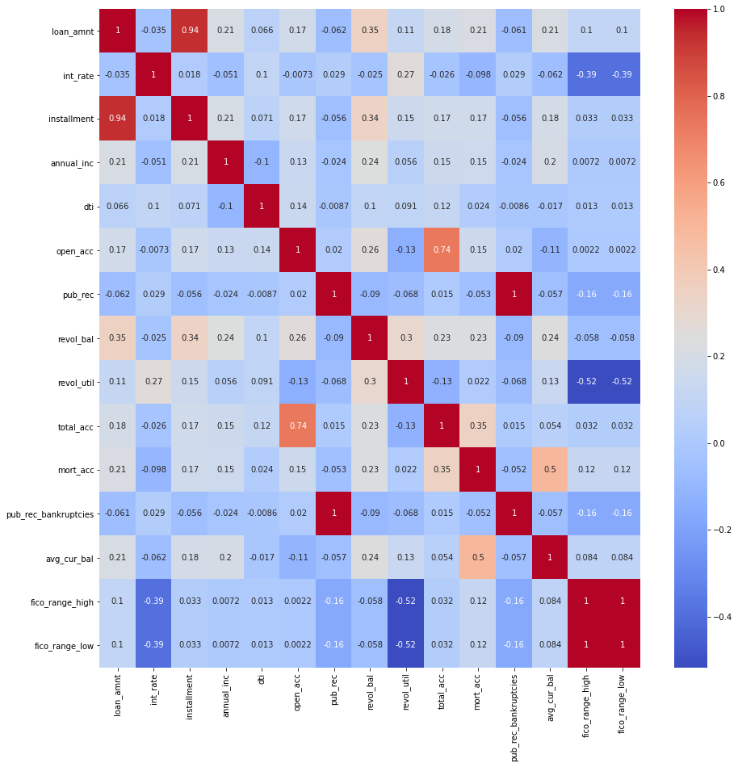
    


```python
# getting the inverse correlation matrix
vif_df = pd.DataFrame(np.linalg.inv(corr.values), index = corr.index, columns=corr.columns)

# plotting the heatmap with the VIF scores and specifying size
plt.figure(figsize=[15,15])

sns.heatmap(vif_df, annot = True, cmap = 'coolwarm');
```


    
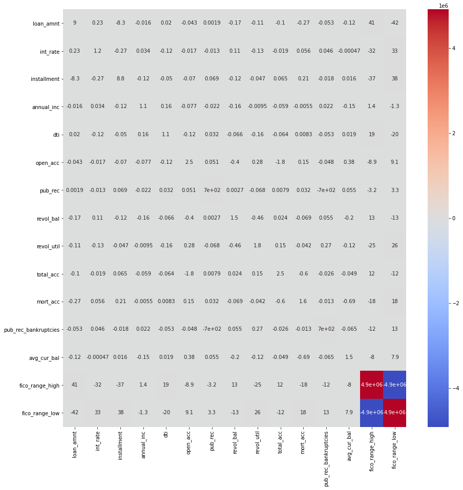
    


It is apparent that the Fico Scores are comparable, thus we must drop one of the variables.


```python
df_new.drop(columns = 'fico_range_low', inplace = True)
```

    /usr/local/lib/python3.6/dist-packages/pandas/core/frame.py:4174: SettingWithCopyWarning: 
    A value is trying to be set on a copy of a slice from a DataFrame
    
    See the caveats in the documentation: https://pandas.pydata.org/pandas-docs/stable/user_guide/indexing.html#returning-a-view-versus-a-copy
      errors=errors,


```python
df_new.dtypes
```


    loan_amnt               float64
    int_rate                float64
    installment             float64
    annual_inc              float64
    dti                     float64
    open_acc                float64
    pub_rec                 float64
    revol_bal               float64
    revol_util              float64
    total_acc               float64
    mort_acc                float64
    home_ownership           object
    pub_rec_bankruptcies    float64
    purpose                  object
    verification_status      object
    sub_grade                object
    loan_condition           object
    avg_cur_bal             float64
    fico_range_high         float64
    dtype: object


## Predicting Loan Default Probability

### Regression Techniques

#### En-coding Categorical Values


```python
# Changing the dtype from object to category to prepare for catcodes
df_new['home_ownership'] = df_new['home_ownership'].astype('category')
df_new['purpose'] = df_new['purpose'].astype('category')
df_new['verification_status'] = df_new['verification_status'].astype('category')
df_new['sub_grade'] = df_new['sub_grade'].astype('category')
df_new['loan_condition'] = df_new['loan_condition'].astype('category')
```

    /usr/local/lib/python3.6/dist-packages/ipykernel_launcher.py:2: SettingWithCopyWarning: 
    A value is trying to be set on a copy of a slice from a DataFrame.
    Try using .loc[row_indexer,col_indexer] = value instead
    
    See the caveats in the documentation: https://pandas.pydata.org/pandas-docs/stable/user_guide/indexing.html#returning-a-view-versus-a-copy
      
    /usr/local/lib/python3.6/dist-packages/ipykernel_launcher.py:3: SettingWithCopyWarning: 
    A value is trying to be set on a copy of a slice from a DataFrame.
    Try using .loc[row_indexer,col_indexer] = value instead
    
    See the caveats in the documentation: https://pandas.pydata.org/pandas-docs/stable/user_guide/indexing.html#returning-a-view-versus-a-copy
      This is separate from the ipykernel package so we can avoid doing imports until
    /usr/local/lib/python3.6/dist-packages/ipykernel_launcher.py:4: SettingWithCopyWarning: 
    A value is trying to be set on a copy of a slice from a DataFrame.
    Try using .loc[row_indexer,col_indexer] = value instead
    
    See the caveats in the documentation: https://pandas.pydata.org/pandas-docs/stable/user_guide/indexing.html#returning-a-view-versus-a-copy
      after removing the cwd from sys.path.
    /usr/local/lib/python3.6/dist-packages/ipykernel_launcher.py:5: SettingWithCopyWarning: 
    A value is trying to be set on a copy of a slice from a DataFrame.
    Try using .loc[row_indexer,col_indexer] = value instead
    
    See the caveats in the documentation: https://pandas.pydata.org/pandas-docs/stable/user_guide/indexing.html#returning-a-view-versus-a-copy
      """
    /usr/local/lib/python3.6/dist-packages/ipykernel_launcher.py:6: SettingWithCopyWarning: 
    A value is trying to be set on a copy of a slice from a DataFrame.
    Try using .loc[row_indexer,col_indexer] = value instead
    
    See the caveats in the documentation: https://pandas.pydata.org/pandas-docs/stable/user_guide/indexing.html#returning-a-view-versus-a-copy
      


```python
df_new.dtypes
```


    loan_amnt                float64
    int_rate                 float64
    installment              float64
    annual_inc               float64
    dti                      float64
    open_acc                 float64
    pub_rec                  float64
    revol_bal                float64
    revol_util               float64
    total_acc                float64
    mort_acc                 float64
    home_ownership          category
    pub_rec_bankruptcies     float64
    purpose                 category
    verification_status     category
    sub_grade               category
    loan_condition          category
    avg_cur_bal              float64
    fico_range_high          float64
    dtype: object


```python
df_new["home_ownership_cat"] = df_new["home_ownership"].cat.codes
df_new["purpose_cat"] = df_new["purpose"].cat.codes
df_new["verification_status_cat"] = df_new["verification_status"].cat.codes
df_new['sub_grade_cat'] = df_new['sub_grade'].cat.codes
df_new['loan_condition_cat'] = df_new['loan_condition'].cat.codes
```

    /usr/local/lib/python3.6/dist-packages/ipykernel_launcher.py:1: SettingWithCopyWarning: 
    A value is trying to be set on a copy of a slice from a DataFrame.
    Try using .loc[row_indexer,col_indexer] = value instead
    
    See the caveats in the documentation: https://pandas.pydata.org/pandas-docs/stable/user_guide/indexing.html#returning-a-view-versus-a-copy
      """Entry point for launching an IPython kernel.
    /usr/local/lib/python3.6/dist-packages/ipykernel_launcher.py:2: SettingWithCopyWarning: 
    A value is trying to be set on a copy of a slice from a DataFrame.
    Try using .loc[row_indexer,col_indexer] = value instead
    
    See the caveats in the documentation: https://pandas.pydata.org/pandas-docs/stable/user_guide/indexing.html#returning-a-view-versus-a-copy
      
    /usr/local/lib/python3.6/dist-packages/ipykernel_launcher.py:3: SettingWithCopyWarning: 
    A value is trying to be set on a copy of a slice from a DataFrame.
    Try using .loc[row_indexer,col_indexer] = value instead
    
    See the caveats in the documentation: https://pandas.pydata.org/pandas-docs/stable/user_guide/indexing.html#returning-a-view-versus-a-copy
      This is separate from the ipykernel package so we can avoid doing imports until
    /usr/local/lib/python3.6/dist-packages/ipykernel_launcher.py:4: SettingWithCopyWarning: 
    A value is trying to be set on a copy of a slice from a DataFrame.
    Try using .loc[row_indexer,col_indexer] = value instead
    
    See the caveats in the documentation: https://pandas.pydata.org/pandas-docs/stable/user_guide/indexing.html#returning-a-view-versus-a-copy
      after removing the cwd from sys.path.
    /usr/local/lib/python3.6/dist-packages/ipykernel_launcher.py:5: SettingWithCopyWarning: 
    A value is trying to be set on a copy of a slice from a DataFrame.
    Try using .loc[row_indexer,col_indexer] = value instead
    
    See the caveats in the documentation: https://pandas.pydata.org/pandas-docs/stable/user_guide/indexing.html#returning-a-view-versus-a-copy
      """


```python
encoded_variables = ['home_ownership_cat', 'purpose_cat', 'verification_status_cat', 'sub_grade_cat', 'loan_condition_cat']
categrocial_variables = ['home_ownership', 'purpose', 'verification_status', 'sub_grade', 'loan_condition']
```


```python
df_test = df_new.copy()
```


```python
df_test['home_ownership'] = df_test['home_ownership'].astype('category')
df_test.dtypes
```


    loan_amnt                   float64
    int_rate                    float64
    installment                 float64
    annual_inc                  float64
    dti                         float64
    open_acc                    float64
    pub_rec                     float64
    revol_bal                   float64
    revol_util                  float64
    total_acc                   float64
    mort_acc                    float64
    home_ownership             category
    pub_rec_bankruptcies        float64
    purpose                    category
    verification_status        category
    sub_grade                  category
    loan_condition             category
    avg_cur_bal                 float64
    fico_range_high             float64
    home_ownership_cat             int8
    purpose_cat                    int8
    verification_status_cat        int8
    sub_grade_cat                  int8
    loan_condition_cat             int8
    dtype: object


```python
df_test['home_ownership'] = df_test['home_ownership'].cat.codes
df_test['home_ownership'].value_counts()
```


    1    253871
    4    200702
    3     61111
    0      2422
    2         1
    Name: home_ownership, dtype: int64


```python
df_new.isnull().sum()
```


    loan_amnt                     0
    int_rate                      0
    installment                   0
    annual_inc                    0
    dti                        1145
    open_acc                      0
    pub_rec                       0
    revol_bal                     0
    revol_util                  674
    total_acc                     0
    mort_acc                      0
    home_ownership                0
    pub_rec_bankruptcies          0
    purpose                       0
    verification_status           0
    sub_grade                     0
    loan_condition                0
    avg_cur_bal                  32
    fico_range_high               0
    home_ownership_cat            0
    purpose_cat                   0
    verification_status_cat       0
    sub_grade_cat                 0
    loan_condition_cat            0
    dtype: int64


```python
df_new.dropna(how = 'any', inplace = True)
```

    /usr/local/lib/python3.6/dist-packages/ipykernel_launcher.py:1: SettingWithCopyWarning: 
    A value is trying to be set on a copy of a slice from a DataFrame
    
    See the caveats in the documentation: https://pandas.pydata.org/pandas-docs/stable/user_guide/indexing.html#returning-a-view-versus-a-copy
      """Entry point for launching an IPython kernel.


```python
df_new.isnull().sum()
```


    loan_amnt                  0
    int_rate                   0
    installment                0
    annual_inc                 0
    dti                        0
    open_acc                   0
    pub_rec                    0
    revol_bal                  0
    revol_util                 0
    total_acc                  0
    mort_acc                   0
    home_ownership             0
    pub_rec_bankruptcies       0
    purpose                    0
    verification_status        0
    sub_grade                  0
    loan_condition             0
    avg_cur_bal                0
    fico_range_high            0
    home_ownership_cat         0
    purpose_cat                0
    verification_status_cat    0
    sub_grade_cat              0
    loan_condition_cat         0
    dtype: int64


```python
df_new.shape
```


    (516293, 24)


#### Specifying the Dependent & Independent Variables


```python
num_var = ['loan_amnt', 'int_rate', 'installment', 'annual_inc', 'dti', 'open_acc',
       'pub_rec', 'revol_bal', 'revol_util', 'total_acc', 'mort_acc','pub_rec_bankruptcies', 'avg_cur_bal',
       'fico_range_high', 'home_ownership_cat', 'purpose_cat','verification_status_cat', 'sub_grade_cat']
```


```python
# Specifying the predicting variables
X = df_new[num_var]

# Specifying the target variable       
y = df_new['loan_condition_cat']
```


```python
from sklearn.model_selection import train_test_split

# specifying our train and test data - We shall use the train:test ratio of 0.75:0.25
X_train, X_test, y_train, y_test = train_test_split(X, y, test_size = 0.25, random_state = 0)
```

#### Library Importation


```python
# performing feature scaling on our dataset
from sklearn.preprocessing import StandardScaler

sc_X = StandardScaler()

# fitting and transforming our training data
X_train = sc_X.fit_transform(X_train)

# transforming our test data
X_test = sc_X.transform(X_test)
```

#### Logisitic Regression Model


```python
# Logistic Regression
from sklearn.linear_model import LogisticRegression
logistic_classifier = LogisticRegression(random_state = 0, solver = 'saga')
logistic_classifier.fit(X_train, y_train)
logistic_y_prediction = logistic_classifier.predict(X_test)
```

#### Decision Tree Model


```python
# Decision Tree 
from sklearn.tree import DecisionTreeClassifier
decision_classifier = DecisionTreeClassifier()
decision_classifier.fit(X_train, y_train)
decision_y_prediction = decision_classifier.predict(X_test)
```

#### Random Forest Model


```python
# Random Forest
from sklearn.ensemble import RandomForestClassifier
random_forest_classifier = RandomForestClassifier()
random_forest_classifier.fit(X_train, y_train)
random_forest_y_prediction = random_forest_classifier.predict(X_test)
```

### Model Evaluation & Performance


```python
# evaluating the classification reports and confusion matrices of each classifier
from sklearn.metrics import classification_report, confusion_matrix
```


```python
# Logistic Regression
print('Logistic Classifier:')
print(classification_report(y_test, logistic_y_prediction))
print(confusion_matrix(y_test, logistic_y_prediction))
```

    Logistic Classifier:
                  precision    recall  f1-score   support
    
               0       0.00      0.00      0.00      6080
               1       0.95      1.00      0.98    122994
    
        accuracy                           0.95    129074
       macro avg       0.48      0.50      0.49    129074
    weighted avg       0.91      0.95      0.93    129074
    
    [[     0   6080]
     [     1 122993]]


```python
# Decision Tree
print('Decision Tree Classifier:')
print(classification_report(y_test, decision_y_prediction))
print(confusion_matrix(y_test, decision_y_prediction))
```

    Decision Tree Classifier:
                  precision    recall  f1-score   support
    
               0       0.08      0.10      0.08      6080
               1       0.95      0.94      0.95    122994
    
        accuracy                           0.90    129074
       macro avg       0.52      0.52      0.52    129074
    weighted avg       0.91      0.90      0.91    129074
    
    [[   589   5491]
     [  7223 115771]]


```python
# Random Forest
print('Random Forest Classifier:')
print(classification_report(y_test, random_forest_y_prediction))
print(confusion_matrix(y_test, random_forest_y_prediction))
```

    Random Forest Classifier:
                  precision    recall  f1-score   support
    
               0       0.78      0.00      0.00      6080
               1       0.95      1.00      0.98    122994
    
        accuracy                           0.95    129074
       macro avg       0.87      0.50      0.49    129074
    weighted avg       0.94      0.95      0.93    129074
    
    [[     7   6073]
     [     2 122992]]

