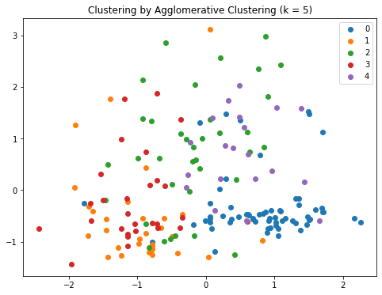

## <font color='#2F4F4F'>1. Defining the Question</font>

### a) Specifying the Data Analysis Question

Perform wine segmentation.

### b) Defining the Metric for Success

The project will be a success when we are able to create clusters with clear boundaries.

### c) Understanding the Context 

Champagne Company is a leading wine company that specialises in the importation and
distribution of premium and super-premium wines, champagnes and spirits within the
East African region. The main goal of the company is to make the most exclusive brands
of wine more accessible at an affordable price. The company wants to satisfy the
growing local demand for specialised products and the ever-increasing tourism industry
where guests don ́t want to settle for less.

### d) Recording the Experimental Design

- Define the Research Question
- Data Importation
- Data Exploration
- Data Cleaning
- Data Analysis (Univariate and Bivariate)
- Data Preparation
- Data Modeling
- Model Evaluation
- Recommendations / Conclusion
- Challenging your Solution

### e) Data Relevance

The dataset is appropriate to answering the research question.

## <font color='#2F4F4F'>2. Data Cleaning & Preparation</font>


```python
import pandas as pd
import numpy as np
import matplotlib.pyplot as plt
import seaborn as sns

pd.set_option('display.max.columns', None)
```

    /usr/local/lib/python3.6/dist-packages/statsmodels/tools/_testing.py:19: FutureWarning: pandas.util.testing is deprecated. Use the functions in the public API at pandas.testing instead.
      import pandas.util.testing as tm


```python
df = pd.read_csv('datasets_626341_1116242_wine-clustering.csv')
df.head()
```


<div>
<style scoped>
    .dataframe tbody tr th:only-of-type {
        vertical-align: middle;
    }

    .dataframe tbody tr th {
        vertical-align: top;
    }

    .dataframe thead th {
        text-align: right;
    }
</style>
<table border="1" class="dataframe">
  <thead>
    <tr style="text-align: right;">
      <th></th>
      <th>Alcohol</th>
      <th>Malic_Acid</th>
      <th>Ash</th>
      <th>Ash_Alcanity</th>
      <th>Magnesium</th>
      <th>Total_Phenols</th>
      <th>Flavanoids</th>
      <th>Nonflavanoid_Phenols</th>
      <th>Proanthocyanins</th>
      <th>Color_Intensity</th>
      <th>Hue</th>
      <th>OD280</th>
      <th>Proline</th>
    </tr>
  </thead>
  <tbody>
    <tr>
      <th>0</th>
      <td>14.23</td>
      <td>1.71</td>
      <td>2.43</td>
      <td>15.6</td>
      <td>127</td>
      <td>2.80</td>
      <td>3.06</td>
      <td>0.28</td>
      <td>2.29</td>
      <td>5.64</td>
      <td>1.04</td>
      <td>3.92</td>
      <td>1065</td>
    </tr>
    <tr>
      <th>1</th>
      <td>13.20</td>
      <td>1.78</td>
      <td>2.14</td>
      <td>11.2</td>
      <td>100</td>
      <td>2.65</td>
      <td>2.76</td>
      <td>0.26</td>
      <td>1.28</td>
      <td>4.38</td>
      <td>1.05</td>
      <td>3.40</td>
      <td>1050</td>
    </tr>
    <tr>
      <th>2</th>
      <td>13.16</td>
      <td>2.36</td>
      <td>2.67</td>
      <td>18.6</td>
      <td>101</td>
      <td>2.80</td>
      <td>3.24</td>
      <td>0.30</td>
      <td>2.81</td>
      <td>5.68</td>
      <td>1.03</td>
      <td>3.17</td>
      <td>1185</td>
    </tr>
    <tr>
      <th>3</th>
      <td>14.37</td>
      <td>1.95</td>
      <td>2.50</td>
      <td>16.8</td>
      <td>113</td>
      <td>3.85</td>
      <td>3.49</td>
      <td>0.24</td>
      <td>2.18</td>
      <td>7.80</td>
      <td>0.86</td>
      <td>3.45</td>
      <td>1480</td>
    </tr>
    <tr>
      <th>4</th>
      <td>13.24</td>
      <td>2.59</td>
      <td>2.87</td>
      <td>21.0</td>
      <td>118</td>
      <td>2.80</td>
      <td>2.69</td>
      <td>0.39</td>
      <td>1.82</td>
      <td>4.32</td>
      <td>1.04</td>
      <td>2.93</td>
      <td>735</td>
    </tr>
  </tbody>
</table>
</div>


```python
# check dataset shape
df.shape
```


    (178, 13)


```python
# chekc data types
df.dtypes
```


    Alcohol                 float64
    Malic_Acid              float64
    Ash                     float64
    Ash_Alcanity            float64
    Magnesium                 int64
    Total_Phenols           float64
    Flavanoids              float64
    Nonflavanoid_Phenols    float64
    Proanthocyanins         float64
    Color_Intensity         float64
    Hue                     float64
    OD280                   float64
    Proline                   int64
    dtype: object


```python
# dropping duplicates, if any
df.drop_duplicates(inplace = True)
df.shape
```


    (178, 13)


```python
# check for missing data
df.isna().sum()
```


    Alcohol                 0
    Malic_Acid              0
    Ash                     0
    Ash_Alcanity            0
    Magnesium               0
    Total_Phenols           0
    Flavanoids              0
    Nonflavanoid_Phenols    0
    Proanthocyanins         0
    Color_Intensity         0
    Hue                     0
    OD280                   0
    Proline                 0
    dtype: int64


## <font color='#2F4F4F'>3. Data Analysis</font>


```python
# get descriptive statistics
df.describe()
```


<div>
<style scoped>
    .dataframe tbody tr th:only-of-type {
        vertical-align: middle;
    }

    .dataframe tbody tr th {
        vertical-align: top;
    }

    .dataframe thead th {
        text-align: right;
    }
</style>
<table border="1" class="dataframe">
  <thead>
    <tr style="text-align: right;">
      <th></th>
      <th>Alcohol</th>
      <th>Malic_Acid</th>
      <th>Ash</th>
      <th>Ash_Alcanity</th>
      <th>Magnesium</th>
      <th>Total_Phenols</th>
      <th>Flavanoids</th>
      <th>Nonflavanoid_Phenols</th>
      <th>Proanthocyanins</th>
      <th>Color_Intensity</th>
      <th>Hue</th>
      <th>OD280</th>
      <th>Proline</th>
    </tr>
  </thead>
  <tbody>
    <tr>
      <th>count</th>
      <td>178.000000</td>
      <td>178.000000</td>
      <td>178.000000</td>
      <td>178.000000</td>
      <td>178.000000</td>
      <td>178.000000</td>
      <td>178.000000</td>
      <td>178.000000</td>
      <td>178.000000</td>
      <td>178.000000</td>
      <td>178.000000</td>
      <td>178.000000</td>
      <td>178.000000</td>
    </tr>
    <tr>
      <th>mean</th>
      <td>13.000618</td>
      <td>2.336348</td>
      <td>2.366517</td>
      <td>19.494944</td>
      <td>99.741573</td>
      <td>2.295112</td>
      <td>2.029270</td>
      <td>0.361854</td>
      <td>1.590899</td>
      <td>5.058090</td>
      <td>0.957449</td>
      <td>2.611685</td>
      <td>746.893258</td>
    </tr>
    <tr>
      <th>std</th>
      <td>0.811827</td>
      <td>1.117146</td>
      <td>0.274344</td>
      <td>3.339564</td>
      <td>14.282484</td>
      <td>0.625851</td>
      <td>0.998859</td>
      <td>0.124453</td>
      <td>0.572359</td>
      <td>2.318286</td>
      <td>0.228572</td>
      <td>0.709990</td>
      <td>314.907474</td>
    </tr>
    <tr>
      <th>min</th>
      <td>11.030000</td>
      <td>0.740000</td>
      <td>1.360000</td>
      <td>10.600000</td>
      <td>70.000000</td>
      <td>0.980000</td>
      <td>0.340000</td>
      <td>0.130000</td>
      <td>0.410000</td>
      <td>1.280000</td>
      <td>0.480000</td>
      <td>1.270000</td>
      <td>278.000000</td>
    </tr>
    <tr>
      <th>25%</th>
      <td>12.362500</td>
      <td>1.602500</td>
      <td>2.210000</td>
      <td>17.200000</td>
      <td>88.000000</td>
      <td>1.742500</td>
      <td>1.205000</td>
      <td>0.270000</td>
      <td>1.250000</td>
      <td>3.220000</td>
      <td>0.782500</td>
      <td>1.937500</td>
      <td>500.500000</td>
    </tr>
    <tr>
      <th>50%</th>
      <td>13.050000</td>
      <td>1.865000</td>
      <td>2.360000</td>
      <td>19.500000</td>
      <td>98.000000</td>
      <td>2.355000</td>
      <td>2.135000</td>
      <td>0.340000</td>
      <td>1.555000</td>
      <td>4.690000</td>
      <td>0.965000</td>
      <td>2.780000</td>
      <td>673.500000</td>
    </tr>
    <tr>
      <th>75%</th>
      <td>13.677500</td>
      <td>3.082500</td>
      <td>2.557500</td>
      <td>21.500000</td>
      <td>107.000000</td>
      <td>2.800000</td>
      <td>2.875000</td>
      <td>0.437500</td>
      <td>1.950000</td>
      <td>6.200000</td>
      <td>1.120000</td>
      <td>3.170000</td>
      <td>985.000000</td>
    </tr>
    <tr>
      <th>max</th>
      <td>14.830000</td>
      <td>5.800000</td>
      <td>3.230000</td>
      <td>30.000000</td>
      <td>162.000000</td>
      <td>3.880000</td>
      <td>5.080000</td>
      <td>0.660000</td>
      <td>3.580000</td>
      <td>13.000000</td>
      <td>1.710000</td>
      <td>4.000000</td>
      <td>1680.000000</td>
    </tr>
  </tbody>
</table>
</div>


What do you notice about the descriptive statistics, particularly the ranges? What does this tell you?

Data Transformation will need to be performed given the wide ranges between the features in our datset.


```python
# previewing the histograms of each variable
fig, axes = plt.subplots(nrows = 7, ncols = 2, figsize = (10, 20))

cols = df.columns.to_list()
colors = ['#00FF7F', '#8B0000', '#0000FF', '#DB7093', '#FFFF00', '#FF4500', '#7B68EE', '#FF00FF',
          '#ADFF2F', '#FFD700', '#A52A2A', '#C71585', '#8B008B']

for col, color, ax in zip(cols, colors, axes.flatten()):
    sns.distplot(df[col], ax = ax, color = color, hist_kws = dict(alpha = 0.6))
    plt.title(col)
    
plt.tight_layout()
```


    

    


```python
# previewing the boxplots of each variable
fig, axes = plt.subplots(nrows = 7, ncols = 2, figsize = (10, 20))

cols = df.columns.to_list()
colors = ['#00FF7F', '#8B0000', '#0000FF', '#DB7093', '#FFFF00', '#FF4500', '#7B68EE', '#FF00FF',
          '#ADFF2F', '#FFD700', '#A52A2A', '#C71585', '#8B008B']

for col, color, ax in zip(cols, colors, axes.flatten()):
    sns.boxplot(df[col], ax = ax, color = color)
    plt.title(col)
    
plt.tight_layout()
```


    

    


6 of the wine samples appear to have a normal distribution. 
The box plots also reveal the presence of outliers in the variables which shall have to be dealt with. 


```python
# previewing the correlations between the variables
corr = df.corr()

plt.figure(figsize = (10, 10))
sns.heatmap(corr, annot = True, cmap = 'coolwarm')
plt.show()
```


    

    


The dataset does not contain multicollinearility thus we can proceed without dropping any of the variables.

## <font color='#2F4F4F'>4. Data Modeling</font>


```python
# set all the features into X
X = df.iloc[:,].values
```


```python
# scale our features
from sklearn.preprocessing import StandardScaler
sc = StandardScaler()

# fit and transform our features
X = sc.fit_transform(X)
```

### 4.1 KMeans Clustering


```python
# fitting KMeans with 5 clusters
from sklearn.cluster import KMeans

clusterer = KMeans(n_clusters = 5, random_state = 0)
clusterer.fit(X)

# getting the cluster labels
clusterer.labels_
```


    array([3, 3, 3, 3, 3, 3, 3, 3, 3, 3, 3, 3, 3, 3, 3, 3, 3, 3, 3, 3, 3, 2,
           3, 3, 3, 3, 3, 3, 3, 3, 3, 3, 3, 3, 3, 3, 3, 3, 0, 3, 3, 2, 3, 2,
           3, 3, 3, 3, 3, 3, 3, 3, 3, 3, 3, 3, 3, 3, 3, 0, 4, 4, 0, 2, 4, 2,
           0, 0, 4, 0, 4, 2, 4, 3, 2, 0, 0, 4, 0, 2, 0, 0, 4, 1, 2, 0, 4, 4,
           4, 4, 4, 4, 4, 2, 2, 3, 4, 0, 2, 2, 0, 0, 2, 0, 0, 4, 0, 4, 0, 2,
           2, 2, 4, 4, 4, 4, 0, 4, 1, 0, 2, 2, 4, 2, 2, 2, 2, 4, 4, 4, 1, 1,
           1, 1, 1, 1, 1, 1, 1, 1, 1, 1, 1, 1, 1, 1, 1, 1, 1, 1, 1, 1, 1, 1,
           1, 1, 1, 1, 1, 1, 1, 1, 1, 1, 1, 1, 1, 1, 1, 1, 1, 1, 1, 1, 1, 1,
           1, 1], dtype=int32)


```python
# getting the KMeans scatter plot
kmeans_pred = clusterer.labels_
kmeans_clust = np.unique(kmeans_pred)

plt.figure(figsize = (8, 6))
for cluster in kmeans_clust:
    row_ix = np.where(kmeans_pred == cluster)
    plt.scatter(X[row_ix, 0], X[row_ix, 1], label = cluster)
    
plt.title("Clustering by K-Means Clustering (k = 5)")
plt.legend()
plt.show()
```


    

    


```python
# getting the optimum value of k for our KMeans model using the Elbow Method

# defining an empty list to store our errors
Error = []

# Using a for loop to run KNN several times and append values the sum of squared error
for i in range(1, 11):
    kmeans = KMeans(n_clusters = i).fit(X)
    kmeans.fit(X)
    Error.append(kmeans.inertia_)
```


```python
# visualizing the distribution of errors per number of clusters
plt.plot(range(1, 11), Error, 'bx-')
plt.title('Elbow method')
plt.xlabel('No of clusters')
plt.ylabel('Error')
plt.grid(True);
```


    

    


##### The optimum number of clusters is three as this is where the elbow is formed.


```python
# if needed, improve your model here and visualize it
clusterer_improved = KMeans(n_clusters = 3, random_state = 0)
clusterer_improved.fit(X)

# getting the cluster labels
clusterer_improved.labels_

# getting the KMeans scatter plot
kmeans_pred = clusterer_improved.labels_
kmeans_clust = np.unique(kmeans_pred)

plt.figure(figsize = (8, 6))
for cluster in kmeans_clust:
    row_ix = np.where(kmeans_pred == cluster)
    plt.scatter(X[row_ix, 0], X[row_ix, 1], label = cluster)
    
plt.title("Clustering by K-Means Clustering (k = 5)")
plt.legend()
plt.show()
```


    

    


Does the visualization of your model with the new value of k look better than the original one? Yes, the different clusters are more evident with this solution.


```python
# add these cluster labels to our dataset
df['kmeans_cluster_group'] = clusterer_improved.predict(X)

# previewing a sample of our dataset
df.sample(10)
```


<div>
<style scoped>
    .dataframe tbody tr th:only-of-type {
        vertical-align: middle;
    }

    .dataframe tbody tr th {
        vertical-align: top;
    }

    .dataframe thead th {
        text-align: right;
    }
</style>
<table border="1" class="dataframe">
  <thead>
    <tr style="text-align: right;">
      <th></th>
      <th>Alcohol</th>
      <th>Malic_Acid</th>
      <th>Ash</th>
      <th>Ash_Alcanity</th>
      <th>Magnesium</th>
      <th>Total_Phenols</th>
      <th>Flavanoids</th>
      <th>Nonflavanoid_Phenols</th>
      <th>Proanthocyanins</th>
      <th>Color_Intensity</th>
      <th>Hue</th>
      <th>OD280</th>
      <th>Proline</th>
      <th>kmeans_cluster_group</th>
    </tr>
  </thead>
  <tbody>
    <tr>
      <th>1</th>
      <td>13.20</td>
      <td>1.78</td>
      <td>2.14</td>
      <td>11.2</td>
      <td>100</td>
      <td>2.65</td>
      <td>2.76</td>
      <td>0.26</td>
      <td>1.28</td>
      <td>4.38</td>
      <td>1.05</td>
      <td>3.40</td>
      <td>1050</td>
      <td>0</td>
    </tr>
    <tr>
      <th>134</th>
      <td>12.51</td>
      <td>1.24</td>
      <td>2.25</td>
      <td>17.5</td>
      <td>85</td>
      <td>2.00</td>
      <td>0.58</td>
      <td>0.60</td>
      <td>1.25</td>
      <td>5.45</td>
      <td>0.75</td>
      <td>1.51</td>
      <td>650</td>
      <td>2</td>
    </tr>
    <tr>
      <th>79</th>
      <td>12.70</td>
      <td>3.87</td>
      <td>2.40</td>
      <td>23.0</td>
      <td>101</td>
      <td>2.83</td>
      <td>2.55</td>
      <td>0.43</td>
      <td>1.95</td>
      <td>2.57</td>
      <td>1.19</td>
      <td>3.13</td>
      <td>463</td>
      <td>1</td>
    </tr>
    <tr>
      <th>39</th>
      <td>14.22</td>
      <td>3.99</td>
      <td>2.51</td>
      <td>13.2</td>
      <td>128</td>
      <td>3.00</td>
      <td>3.04</td>
      <td>0.20</td>
      <td>2.08</td>
      <td>5.10</td>
      <td>0.89</td>
      <td>3.53</td>
      <td>760</td>
      <td>0</td>
    </tr>
    <tr>
      <th>59</th>
      <td>12.37</td>
      <td>0.94</td>
      <td>1.36</td>
      <td>10.6</td>
      <td>88</td>
      <td>1.98</td>
      <td>0.57</td>
      <td>0.28</td>
      <td>0.42</td>
      <td>1.95</td>
      <td>1.05</td>
      <td>1.82</td>
      <td>520</td>
      <td>1</td>
    </tr>
    <tr>
      <th>73</th>
      <td>12.99</td>
      <td>1.67</td>
      <td>2.60</td>
      <td>30.0</td>
      <td>139</td>
      <td>3.30</td>
      <td>2.89</td>
      <td>0.21</td>
      <td>1.96</td>
      <td>3.35</td>
      <td>1.31</td>
      <td>3.50</td>
      <td>985</td>
      <td>0</td>
    </tr>
    <tr>
      <th>145</th>
      <td>13.16</td>
      <td>3.57</td>
      <td>2.15</td>
      <td>21.0</td>
      <td>102</td>
      <td>1.50</td>
      <td>0.55</td>
      <td>0.43</td>
      <td>1.30</td>
      <td>4.00</td>
      <td>0.60</td>
      <td>1.68</td>
      <td>830</td>
      <td>2</td>
    </tr>
    <tr>
      <th>36</th>
      <td>13.28</td>
      <td>1.64</td>
      <td>2.84</td>
      <td>15.5</td>
      <td>110</td>
      <td>2.60</td>
      <td>2.68</td>
      <td>0.34</td>
      <td>1.36</td>
      <td>4.60</td>
      <td>1.09</td>
      <td>2.78</td>
      <td>880</td>
      <td>0</td>
    </tr>
    <tr>
      <th>160</th>
      <td>12.36</td>
      <td>3.83</td>
      <td>2.38</td>
      <td>21.0</td>
      <td>88</td>
      <td>2.30</td>
      <td>0.92</td>
      <td>0.50</td>
      <td>1.04</td>
      <td>7.65</td>
      <td>0.56</td>
      <td>1.58</td>
      <td>520</td>
      <td>2</td>
    </tr>
    <tr>
      <th>167</th>
      <td>12.82</td>
      <td>3.37</td>
      <td>2.30</td>
      <td>19.5</td>
      <td>88</td>
      <td>1.48</td>
      <td>0.66</td>
      <td>0.40</td>
      <td>0.97</td>
      <td>10.26</td>
      <td>0.72</td>
      <td>1.75</td>
      <td>685</td>
      <td>2</td>
    </tr>
  </tbody>
</table>
</div>


### 4.2 Hierarchical Agglomerative Clustering


```python
# fitting agglomerative clustering with 5 clusters
from sklearn.cluster import AgglomerativeClustering as AC

agglo_clusterer = AC(n_clusters=5).fit(X)

# get the labels
agglo_clusterer.labels_
```


    array([0, 0, 0, 0, 0, 0, 0, 0, 0, 0, 0, 0, 0, 0, 0, 0, 0, 0, 0, 0, 0, 0,
           0, 0, 0, 0, 0, 0, 0, 0, 0, 0, 0, 0, 0, 0, 0, 0, 0, 0, 0, 0, 0, 0,
           0, 0, 0, 0, 0, 0, 0, 0, 0, 0, 0, 0, 0, 0, 0, 1, 2, 2, 1, 1, 3, 0,
           0, 1, 2, 1, 2, 0, 3, 0, 1, 1, 1, 2, 1, 3, 1, 1, 3, 2, 1, 1, 3, 3,
           3, 3, 3, 3, 3, 1, 1, 1, 2, 1, 1, 3, 1, 1, 3, 1, 1, 3, 1, 3, 1, 1,
           1, 3, 3, 3, 3, 3, 1, 3, 2, 3, 1, 0, 3, 1, 1, 3, 3, 3, 3, 3, 2, 2,
           2, 2, 2, 2, 2, 2, 2, 2, 2, 2, 2, 2, 2, 2, 2, 2, 4, 4, 4, 4, 4, 4,
           2, 2, 4, 2, 4, 4, 2, 2, 2, 2, 4, 2, 4, 4, 4, 4, 2, 4, 4, 2, 4, 4,
           4, 4])


```python
# Creating a scatter plot of the cluster analysis
ac_pred = agglo_clusterer.labels_
ac_clust = np.unique(ac_pred)

plt.figure(figsize = (8, 6))
for cluster in ac_clust:
    row_ix = np.where(ac_pred == cluster)
    plt.scatter(X[row_ix, 0], X[row_ix, 1], label = cluster)
    
plt.title("Clustering by Agglomerative Clustering (k = 5)")
plt.legend()
plt.show()
```


    

    


```python
# creating a dendrogram of our agglomerative clustering analysis
from scipy.cluster import hierarchy

plt.figure(figsize=(10, 7))
plt.title("Hierarchical Clustering Dendrogram")
dend = hierarchy.dendrogram(hierarchy.linkage(X, method='ward'))
```


    

    


What an you deduce from the dendrogram? The optimum number of clusters would be 3. 


```python
# improve your agglomerative clustering model
agglo_clusterer_r = AC(n_clusters=3).fit(X)

ac_pred = agglo_clusterer_r.labels_
ac_clust = np.unique(ac_pred)

plt.figure(figsize = (8, 6))
for cluster in ac_clust:
    row_ix = np.where(ac_pred == cluster)
    plt.scatter(X[row_ix, 0], X[row_ix, 1], label = cluster)
    
plt.title("Clustering by Agglomerative Clustering (k = 3)")
plt.legend()
plt.show()
```


    

    


Is your agglomerative model with a new value for k better than the first one? Yes, they form more coherent clusters. 


```python
# adding to our dataset
df['agglo_cluster_group'] = agglo_clusterer_r.labels_

# previewing a sample of our dataset
df.sample(10)
```


<div>
<style scoped>
    .dataframe tbody tr th:only-of-type {
        vertical-align: middle;
    }

    .dataframe tbody tr th {
        vertical-align: top;
    }

    .dataframe thead th {
        text-align: right;
    }
</style>
<table border="1" class="dataframe">
  <thead>
    <tr style="text-align: right;">
      <th></th>
      <th>Alcohol</th>
      <th>Malic_Acid</th>
      <th>Ash</th>
      <th>Ash_Alcanity</th>
      <th>Magnesium</th>
      <th>Total_Phenols</th>
      <th>Flavanoids</th>
      <th>Nonflavanoid_Phenols</th>
      <th>Proanthocyanins</th>
      <th>Color_Intensity</th>
      <th>Hue</th>
      <th>OD280</th>
      <th>Proline</th>
      <th>kmeans_cluster_group</th>
      <th>agglo_cluster_group</th>
    </tr>
  </thead>
  <tbody>
    <tr>
      <th>104</th>
      <td>12.51</td>
      <td>1.73</td>
      <td>1.98</td>
      <td>20.5</td>
      <td>85</td>
      <td>2.20</td>
      <td>1.92</td>
      <td>0.32</td>
      <td>1.48</td>
      <td>2.94</td>
      <td>1.040</td>
      <td>3.57</td>
      <td>672</td>
      <td>1</td>
      <td>0</td>
    </tr>
    <tr>
      <th>6</th>
      <td>14.39</td>
      <td>1.87</td>
      <td>2.45</td>
      <td>14.6</td>
      <td>96</td>
      <td>2.50</td>
      <td>2.52</td>
      <td>0.30</td>
      <td>1.98</td>
      <td>5.25</td>
      <td>1.020</td>
      <td>3.58</td>
      <td>1290</td>
      <td>0</td>
      <td>2</td>
    </tr>
    <tr>
      <th>113</th>
      <td>11.41</td>
      <td>0.74</td>
      <td>2.50</td>
      <td>21.0</td>
      <td>88</td>
      <td>2.48</td>
      <td>2.01</td>
      <td>0.42</td>
      <td>1.44</td>
      <td>3.08</td>
      <td>1.100</td>
      <td>2.31</td>
      <td>434</td>
      <td>1</td>
      <td>0</td>
    </tr>
    <tr>
      <th>70</th>
      <td>12.29</td>
      <td>1.61</td>
      <td>2.21</td>
      <td>20.4</td>
      <td>103</td>
      <td>1.10</td>
      <td>1.02</td>
      <td>0.37</td>
      <td>1.46</td>
      <td>3.05</td>
      <td>0.906</td>
      <td>1.82</td>
      <td>870</td>
      <td>1</td>
      <td>1</td>
    </tr>
    <tr>
      <th>164</th>
      <td>13.78</td>
      <td>2.76</td>
      <td>2.30</td>
      <td>22.0</td>
      <td>90</td>
      <td>1.35</td>
      <td>0.68</td>
      <td>0.41</td>
      <td>1.03</td>
      <td>9.58</td>
      <td>0.700</td>
      <td>1.68</td>
      <td>615</td>
      <td>2</td>
      <td>1</td>
    </tr>
    <tr>
      <th>74</th>
      <td>11.96</td>
      <td>1.09</td>
      <td>2.30</td>
      <td>21.0</td>
      <td>101</td>
      <td>3.38</td>
      <td>2.14</td>
      <td>0.13</td>
      <td>1.65</td>
      <td>3.21</td>
      <td>0.990</td>
      <td>3.13</td>
      <td>886</td>
      <td>1</td>
      <td>0</td>
    </tr>
    <tr>
      <th>115</th>
      <td>11.03</td>
      <td>1.51</td>
      <td>2.20</td>
      <td>21.5</td>
      <td>85</td>
      <td>2.46</td>
      <td>2.17</td>
      <td>0.52</td>
      <td>2.01</td>
      <td>1.90</td>
      <td>1.710</td>
      <td>2.87</td>
      <td>407</td>
      <td>1</td>
      <td>0</td>
    </tr>
    <tr>
      <th>21</th>
      <td>12.93</td>
      <td>3.80</td>
      <td>2.65</td>
      <td>18.6</td>
      <td>102</td>
      <td>2.41</td>
      <td>2.41</td>
      <td>0.25</td>
      <td>1.98</td>
      <td>4.50</td>
      <td>1.030</td>
      <td>3.52</td>
      <td>770</td>
      <td>0</td>
      <td>2</td>
    </tr>
    <tr>
      <th>50</th>
      <td>13.05</td>
      <td>1.73</td>
      <td>2.04</td>
      <td>12.4</td>
      <td>92</td>
      <td>2.72</td>
      <td>3.27</td>
      <td>0.17</td>
      <td>2.91</td>
      <td>7.20</td>
      <td>1.120</td>
      <td>2.91</td>
      <td>1150</td>
      <td>0</td>
      <td>2</td>
    </tr>
    <tr>
      <th>46</th>
      <td>14.38</td>
      <td>3.59</td>
      <td>2.28</td>
      <td>16.0</td>
      <td>102</td>
      <td>3.25</td>
      <td>3.17</td>
      <td>0.27</td>
      <td>2.19</td>
      <td>4.90</td>
      <td>1.040</td>
      <td>3.44</td>
      <td>1065</td>
      <td>0</td>
      <td>2</td>
    </tr>
  </tbody>
</table>
</div>


## <font color='#2F4F4F'>5. Summary of Findings</font>

Based on the chemical analysis of the wines, using unsupervised learning techniques, we are able to identify three distinct wine clusters from our dataset. 

## <font color='#2F4F4F'>6. Recommendations</font>

The three wine clusters obtained through unsupervised machine learning techniques could be indicative of the three different cultivars. Moving forward, the business should create it's wine brands from these three different clusters.

## <font color='#2F4F4F'>7. Challenging your Solution</font>

#### a) Did we have the right question? Yes


#### b) Did we have the right data? Yes


#### c) What can be done to improve the solution? Feature Engineering & Hyperparameter Tuning. 
