## Project Deliverables:


<ol>
<li> Perform exploratory data analysis of the Spotify dataset with relevant visualizations. </li>
<li> Build a machine learning model that predicts track popularity.</li>
<li> Build a machine learning model that segments the tracks in the Spotify datset</li>
</ol>

## Business Context: 


Spotify Technology is a Swedish music streaming and media services provider that provides an audio streaming platform, the "Spotify" platform, that offers DRM-restricted music and podcasts from record labels and media companies. 
The Spotify platform provides access to over 50 million tracks. Users can browse by parameters such as artist, album, or genre, and can create, edit, and share playlists. 
The service is available in most of Europe and the Americas, Australia, New Zealand, and parts of Africa and Asia, and on most modern devices, including Windows, macOS, and Linux computers, and iOS, and Android smartphones and tablets.

The model that predicts track popularity will help the organisation increase their revenue by identifying popularity early on thereby attracting more users on to their platform. 

The segmentation model will enable the Spotify team identify new upcoming music genres thereby enabling them to target new users appropriately. 

## Methodology:

The methodology that shall be followed to achieve our project deliverables are as follows: 

<li>Data Importation</li>
<li>Data Exploration</li>
<li>Data Cleaning</li>
<li>Data Analysis</li>
<li>Data Preparation</li>
<li>Data Modeling</li>
<li>Data Evaluation</li>
<li>Model Cross Validation/Feature Engineering/Hyperparameter Tuning</li>
<li>Conclusion</li>

## Data Importation & Cleaning


```python
# importing the relevant Python libraries
import pandas as pd                     # pandas for performing data manipulation
import numpy as np                      # numpy for performing scientific computations
import matplotlib.pyplot as plt         # matplotlib for performing data visualizations
import seaborn as sns                   # seaborn for performing additional data visualizations on top of matplotlib
```

    /usr/local/lib/python3.6/dist-packages/statsmodels/tools/_testing.py:19: FutureWarning: pandas.util.testing is deprecated. Use the functions in the public API at pandas.testing instead.
      import pandas.util.testing as tm


```python
# loading & previewing the first 5 rows of our dataset
df = pd.read_csv('https://bit.ly/SpotifySongsDs', parse_dates = True)
df.head()
```


<div>
<style scoped>
    .dataframe tbody tr th:only-of-type {
        vertical-align: middle;
    }

    .dataframe tbody tr th {
        vertical-align: top;
    }

    .dataframe thead th {
        text-align: right;
    }
</style>
<table border="1" class="dataframe">
  <thead>
    <tr style="text-align: right;">
      <th></th>
      <th>track_id</th>
      <th>track_name</th>
      <th>track_artist</th>
      <th>track_popularity</th>
      <th>track_album_id</th>
      <th>track_album_name</th>
      <th>track_album_release_date</th>
      <th>playlist_name</th>
      <th>playlist_id</th>
      <th>playlist_genre</th>
      <th>playlist_subgenre</th>
      <th>danceability</th>
      <th>energy</th>
      <th>key</th>
      <th>loudness</th>
      <th>mode</th>
      <th>speechiness</th>
      <th>acousticness</th>
      <th>instrumentalness</th>
      <th>liveness</th>
      <th>valence</th>
      <th>tempo</th>
      <th>duration_ms</th>
    </tr>
  </thead>
  <tbody>
    <tr>
      <th>0</th>
      <td>6f807x0ima9a1j3VPbc7VN</td>
      <td>I Don't Care (with Justin Bieber) - Loud Luxur...</td>
      <td>Ed Sheeran</td>
      <td>66</td>
      <td>2oCs0DGTsRO98Gh5ZSl2Cx</td>
      <td>I Don't Care (with Justin Bieber) [Loud Luxury...</td>
      <td>2019-06-14</td>
      <td>Pop Remix</td>
      <td>37i9dQZF1DXcZDD7cfEKhW</td>
      <td>pop</td>
      <td>dance pop</td>
      <td>0.748</td>
      <td>0.916</td>
      <td>6</td>
      <td>-2.634</td>
      <td>1</td>
      <td>0.0583</td>
      <td>0.1020</td>
      <td>0.000000</td>
      <td>0.0653</td>
      <td>0.518</td>
      <td>122.036</td>
      <td>194754</td>
    </tr>
    <tr>
      <th>1</th>
      <td>0r7CVbZTWZgbTCYdfa2P31</td>
      <td>Memories - Dillon Francis Remix</td>
      <td>Maroon 5</td>
      <td>67</td>
      <td>63rPSO264uRjW1X5E6cWv6</td>
      <td>Memories (Dillon Francis Remix)</td>
      <td>2019-12-13</td>
      <td>Pop Remix</td>
      <td>37i9dQZF1DXcZDD7cfEKhW</td>
      <td>pop</td>
      <td>dance pop</td>
      <td>0.726</td>
      <td>0.815</td>
      <td>11</td>
      <td>-4.969</td>
      <td>1</td>
      <td>0.0373</td>
      <td>0.0724</td>
      <td>0.004210</td>
      <td>0.3570</td>
      <td>0.693</td>
      <td>99.972</td>
      <td>162600</td>
    </tr>
    <tr>
      <th>2</th>
      <td>1z1Hg7Vb0AhHDiEmnDE79l</td>
      <td>All the Time - Don Diablo Remix</td>
      <td>Zara Larsson</td>
      <td>70</td>
      <td>1HoSmj2eLcsrR0vE9gThr4</td>
      <td>All the Time (Don Diablo Remix)</td>
      <td>2019-07-05</td>
      <td>Pop Remix</td>
      <td>37i9dQZF1DXcZDD7cfEKhW</td>
      <td>pop</td>
      <td>dance pop</td>
      <td>0.675</td>
      <td>0.931</td>
      <td>1</td>
      <td>-3.432</td>
      <td>0</td>
      <td>0.0742</td>
      <td>0.0794</td>
      <td>0.000023</td>
      <td>0.1100</td>
      <td>0.613</td>
      <td>124.008</td>
      <td>176616</td>
    </tr>
    <tr>
      <th>3</th>
      <td>75FpbthrwQmzHlBJLuGdC7</td>
      <td>Call You Mine - Keanu Silva Remix</td>
      <td>The Chainsmokers</td>
      <td>60</td>
      <td>1nqYsOef1yKKuGOVchbsk6</td>
      <td>Call You Mine - The Remixes</td>
      <td>2019-07-19</td>
      <td>Pop Remix</td>
      <td>37i9dQZF1DXcZDD7cfEKhW</td>
      <td>pop</td>
      <td>dance pop</td>
      <td>0.718</td>
      <td>0.930</td>
      <td>7</td>
      <td>-3.778</td>
      <td>1</td>
      <td>0.1020</td>
      <td>0.0287</td>
      <td>0.000009</td>
      <td>0.2040</td>
      <td>0.277</td>
      <td>121.956</td>
      <td>169093</td>
    </tr>
    <tr>
      <th>4</th>
      <td>1e8PAfcKUYoKkxPhrHqw4x</td>
      <td>Someone You Loved - Future Humans Remix</td>
      <td>Lewis Capaldi</td>
      <td>69</td>
      <td>7m7vv9wlQ4i0LFuJiE2zsQ</td>
      <td>Someone You Loved (Future Humans Remix)</td>
      <td>2019-03-05</td>
      <td>Pop Remix</td>
      <td>37i9dQZF1DXcZDD7cfEKhW</td>
      <td>pop</td>
      <td>dance pop</td>
      <td>0.650</td>
      <td>0.833</td>
      <td>1</td>
      <td>-4.672</td>
      <td>1</td>
      <td>0.0359</td>
      <td>0.0803</td>
      <td>0.000000</td>
      <td>0.0833</td>
      <td>0.725</td>
      <td>123.976</td>
      <td>189052</td>
    </tr>
  </tbody>
</table>
</div>


```python
# loading our glossary to understand the variables in the dataset
glossary = pd.read_csv('spotify_glossary.csv')
glossary
```


<div>
<style scoped>
    .dataframe tbody tr th:only-of-type {
        vertical-align: middle;
    }

    .dataframe tbody tr th {
        vertical-align: top;
    }

    .dataframe thead th {
        text-align: right;
    }
</style>
<table border="1" class="dataframe">
  <thead>
    <tr style="text-align: right;">
      <th></th>
      <th>Variable</th>
      <th>class</th>
      <th>description</th>
    </tr>
  </thead>
  <tbody>
    <tr>
      <th>0</th>
      <td>track_id</td>
      <td>str</td>
      <td>Song unique ID</td>
    </tr>
    <tr>
      <th>1</th>
      <td>track_name</td>
      <td>str</td>
      <td>Song Name</td>
    </tr>
    <tr>
      <th>2</th>
      <td>track_artist</td>
      <td>str</td>
      <td>Song Artist</td>
    </tr>
    <tr>
      <th>3</th>
      <td>track_popularity</td>
      <td>float</td>
      <td>Song Popularity (0-100) where higher is better</td>
    </tr>
    <tr>
      <th>4</th>
      <td>track_album_id</td>
      <td>str</td>
      <td>Album unique ID</td>
    </tr>
    <tr>
      <th>5</th>
      <td>track_album_name</td>
      <td>str</td>
      <td>Song album name</td>
    </tr>
    <tr>
      <th>6</th>
      <td>track_album_release_date</td>
      <td>str</td>
      <td>Date when album released</td>
    </tr>
    <tr>
      <th>7</th>
      <td>playlist_name</td>
      <td>str</td>
      <td>Name of playlist</td>
    </tr>
    <tr>
      <th>8</th>
      <td>playlist_id</td>
      <td>str</td>
      <td>Playlist ID</td>
    </tr>
    <tr>
      <th>9</th>
      <td>playlist_genre</td>
      <td>str</td>
      <td>Playlist genre</td>
    </tr>
    <tr>
      <th>10</th>
      <td>playlist_subgenre</td>
      <td>str</td>
      <td>Playlist subgenre</td>
    </tr>
    <tr>
      <th>11</th>
      <td>danceability</td>
      <td>float</td>
      <td>Danceability describes how suitable a track is...</td>
    </tr>
    <tr>
      <th>12</th>
      <td>Energy</td>
      <td>float</td>
      <td>Energy is a measure from 0.0 to 1.0 and repres...</td>
    </tr>
    <tr>
      <th>13</th>
      <td>Key</td>
      <td>float</td>
      <td>The estimated overall key of the track. Intege...</td>
    </tr>
    <tr>
      <th>14</th>
      <td>Loudness</td>
      <td>float</td>
      <td>The overall loudness of a track in decibels (d...</td>
    </tr>
    <tr>
      <th>15</th>
      <td>Mode</td>
      <td>float</td>
      <td>Mode indicates the modality (major or minor) o...</td>
    </tr>
    <tr>
      <th>16</th>
      <td>Speechiness</td>
      <td>float</td>
      <td>Speechiness detects the presence of spoken wor...</td>
    </tr>
    <tr>
      <th>17</th>
      <td>Acousticness</td>
      <td>float</td>
      <td>A confidence measure from 0.0 to 1.0 of whethe...</td>
    </tr>
    <tr>
      <th>18</th>
      <td>Instrumentalness</td>
      <td>float</td>
      <td>Predicts whether a track contains no vocals. “...</td>
    </tr>
    <tr>
      <th>19</th>
      <td>Liveness</td>
      <td>float</td>
      <td>Detects the presence of an audience in the rec...</td>
    </tr>
    <tr>
      <th>20</th>
      <td>Valence</td>
      <td>float</td>
      <td>A measure from 0.0 to 1.0 describing the music...</td>
    </tr>
    <tr>
      <th>21</th>
      <td>Tempo</td>
      <td>float</td>
      <td>The overall estimated tempo of a track in beat...</td>
    </tr>
    <tr>
      <th>22</th>
      <td>duration_ms</td>
      <td>float</td>
      <td>Duration of song in milliseconds</td>
    </tr>
  </tbody>
</table>
</div>


Our dataset consists of 23 columns/variables describing the details & quantitative audio qualities of the tracks in the dataset.


```python
# confirming the datatypes in our data
df.dtypes
```


    track_id                     object
    track_name                   object
    track_artist                 object
    track_popularity              int64
    track_album_id               object
    track_album_name             object
    track_album_release_date     object
    playlist_name                object
    playlist_id                  object
    playlist_genre               object
    playlist_subgenre            object
    danceability                float64
    energy                      float64
    key                           int64
    loudness                    float64
    mode                          int64
    speechiness                 float64
    acousticness                float64
    instrumentalness            float64
    liveness                    float64
    valence                     float64
    tempo                       float64
    duration_ms                   int64
    dtype: object


```python
# understanding the shape of our dataset i.e. how many rows and columns are present in our dataframe
df.shape
```


    (32833, 23)


Our dataset consists of 32,833 rows and 23 columns. At face value, our data does not exhibit high dimensionality thus we are not limited on the modeling techniques we can apply. 


```python
# getting a statistical summary of our dataset
df.describe()
```


<div>
<style scoped>
    .dataframe tbody tr th:only-of-type {
        vertical-align: middle;
    }

    .dataframe tbody tr th {
        vertical-align: top;
    }

    .dataframe thead th {
        text-align: right;
    }
</style>
<table border="1" class="dataframe">
  <thead>
    <tr style="text-align: right;">
      <th></th>
      <th>track_popularity</th>
      <th>danceability</th>
      <th>energy</th>
      <th>key</th>
      <th>loudness</th>
      <th>mode</th>
      <th>speechiness</th>
      <th>acousticness</th>
      <th>instrumentalness</th>
      <th>liveness</th>
      <th>valence</th>
      <th>tempo</th>
      <th>duration_ms</th>
    </tr>
  </thead>
  <tbody>
    <tr>
      <th>count</th>
      <td>32833.000000</td>
      <td>32833.000000</td>
      <td>32833.000000</td>
      <td>32833.000000</td>
      <td>32833.000000</td>
      <td>32833.000000</td>
      <td>32833.000000</td>
      <td>32833.000000</td>
      <td>32833.000000</td>
      <td>32833.000000</td>
      <td>32833.000000</td>
      <td>32833.000000</td>
      <td>32833.000000</td>
    </tr>
    <tr>
      <th>mean</th>
      <td>42.477081</td>
      <td>0.654850</td>
      <td>0.698619</td>
      <td>5.374471</td>
      <td>-6.719499</td>
      <td>0.565711</td>
      <td>0.107068</td>
      <td>0.175334</td>
      <td>0.084747</td>
      <td>0.190176</td>
      <td>0.510561</td>
      <td>120.881132</td>
      <td>225799.811622</td>
    </tr>
    <tr>
      <th>std</th>
      <td>24.984074</td>
      <td>0.145085</td>
      <td>0.180910</td>
      <td>3.611657</td>
      <td>2.988436</td>
      <td>0.495671</td>
      <td>0.101314</td>
      <td>0.219633</td>
      <td>0.224230</td>
      <td>0.154317</td>
      <td>0.233146</td>
      <td>26.903624</td>
      <td>59834.006182</td>
    </tr>
    <tr>
      <th>min</th>
      <td>0.000000</td>
      <td>0.000000</td>
      <td>0.000175</td>
      <td>0.000000</td>
      <td>-46.448000</td>
      <td>0.000000</td>
      <td>0.000000</td>
      <td>0.000000</td>
      <td>0.000000</td>
      <td>0.000000</td>
      <td>0.000000</td>
      <td>0.000000</td>
      <td>4000.000000</td>
    </tr>
    <tr>
      <th>25%</th>
      <td>24.000000</td>
      <td>0.563000</td>
      <td>0.581000</td>
      <td>2.000000</td>
      <td>-8.171000</td>
      <td>0.000000</td>
      <td>0.041000</td>
      <td>0.015100</td>
      <td>0.000000</td>
      <td>0.092700</td>
      <td>0.331000</td>
      <td>99.960000</td>
      <td>187819.000000</td>
    </tr>
    <tr>
      <th>50%</th>
      <td>45.000000</td>
      <td>0.672000</td>
      <td>0.721000</td>
      <td>6.000000</td>
      <td>-6.166000</td>
      <td>1.000000</td>
      <td>0.062500</td>
      <td>0.080400</td>
      <td>0.000016</td>
      <td>0.127000</td>
      <td>0.512000</td>
      <td>121.984000</td>
      <td>216000.000000</td>
    </tr>
    <tr>
      <th>75%</th>
      <td>62.000000</td>
      <td>0.761000</td>
      <td>0.840000</td>
      <td>9.000000</td>
      <td>-4.645000</td>
      <td>1.000000</td>
      <td>0.132000</td>
      <td>0.255000</td>
      <td>0.004830</td>
      <td>0.248000</td>
      <td>0.693000</td>
      <td>133.918000</td>
      <td>253585.000000</td>
    </tr>
    <tr>
      <th>max</th>
      <td>100.000000</td>
      <td>0.983000</td>
      <td>1.000000</td>
      <td>11.000000</td>
      <td>1.275000</td>
      <td>1.000000</td>
      <td>0.918000</td>
      <td>0.994000</td>
      <td>0.994000</td>
      <td>0.996000</td>
      <td>0.991000</td>
      <td>239.440000</td>
      <td>517810.000000</td>
    </tr>
  </tbody>
</table>
</div>


So far, so good. It appears all variables have the same count implying no missing values. However, some standardization and normalization shall have to be performed on the dataset as variables loudness, tempo and duration_ms appear to be on different numerical scales. 


```python
# checking our dataset for any missing or null values
df.isnull().sum()/df.count() * 100
```


    track_id                    0.000000
    track_name                  0.015231
    track_artist                0.015231
    track_popularity            0.000000
    track_album_id              0.000000
    track_album_name            0.015231
    track_album_release_date    0.000000
    playlist_name               0.000000
    playlist_id                 0.000000
    playlist_genre              0.000000
    playlist_subgenre           0.000000
    danceability                0.000000
    energy                      0.000000
    key                         0.000000
    loudness                    0.000000
    mode                        0.000000
    speechiness                 0.000000
    acousticness                0.000000
    instrumentalness            0.000000
    liveness                    0.000000
    valence                     0.000000
    tempo                       0.000000
    duration_ms                 0.000000
    dtype: float64


We have 5 missing values on the track_name, track_artist and track_album_name. This represents - 0.015% of the values in our dataframe thus dropping them at this point will not be detrimental to our analysis.


```python
# dropping the rows with missing values
df.dropna(how = 'any', inplace = True)
```


```python
# checking whether the relevant rows have been dropped
df.isnull().sum()
```


    track_id                    0
    track_name                  0
    track_artist                0
    track_popularity            0
    track_album_id              0
    track_album_name            0
    track_album_release_date    0
    playlist_name               0
    playlist_id                 0
    playlist_genre              0
    playlist_subgenre           0
    danceability                0
    energy                      0
    key                         0
    loudness                    0
    mode                        0
    speechiness                 0
    acousticness                0
    instrumentalness            0
    liveness                    0
    valence                     0
    tempo                       0
    duration_ms                 0
    dtype: int64


```python
# checking our dataset for duplicates
df.duplicated().sum()
```


    0


Our dataset is free of duplicates. We now proceed to check our distinct variables for outliers.


```python
# checking our data for outliers
# We shall do this by obtaining the boxplots of our distinct variables
fig, axes = plt.subplots(nrows = 7, ncols = 2, figsize = (10,20))

cols = ['track_popularity','danceability','energy','key','loudness',
        'mode','speechiness','acousticness','instrumentalness',
        'liveness','valence','tempo','duration_ms']

colors = ['#00FF7F', '#8B0000', '#0000FF', '#DB7093', '#FFFF00', '#FF4500', '#7B68EE', '#FF00FF',
          '#ADFF2F', '#FFD700', '#A52A2A', '#C71585', '#8B008B']

for col, color, ax in zip(cols, colors, axes.flatten()):
    sns.boxplot(df[col], ax = ax, color = color)
    plt.title(col)
    
plt.tight_layout()
```


    

    


```python
# Getting the outliers in our dataset
q1 = df.quantile(0.25)
q3 = df.quantile(0.75)
iqr = q3 - q1

outliers_df = df[((df < (q1 - 1.5 * iqr)) | (df > (q3 + 1.5 * iqr))).any(axis = 1)]
print(outliers_df.shape)
outliers_df.sample(3)
```

    (13605, 23)


<div>
<style scoped>
    .dataframe tbody tr th:only-of-type {
        vertical-align: middle;
    }

    .dataframe tbody tr th {
        vertical-align: top;
    }

    .dataframe thead th {
        text-align: right;
    }
</style>
<table border="1" class="dataframe">
  <thead>
    <tr style="text-align: right;">
      <th></th>
      <th>track_id</th>
      <th>track_name</th>
      <th>track_artist</th>
      <th>track_popularity</th>
      <th>track_album_id</th>
      <th>track_album_name</th>
      <th>track_album_release_date</th>
      <th>playlist_name</th>
      <th>playlist_id</th>
      <th>playlist_genre</th>
      <th>playlist_subgenre</th>
      <th>danceability</th>
      <th>energy</th>
      <th>key</th>
      <th>loudness</th>
      <th>mode</th>
      <th>speechiness</th>
      <th>acousticness</th>
      <th>instrumentalness</th>
      <th>liveness</th>
      <th>valence</th>
      <th>tempo</th>
      <th>duration_ms</th>
    </tr>
  </thead>
  <tbody>
    <tr>
      <th>8236</th>
      <td>1rbhZEID2UYfUxECEMefyM</td>
      <td>Quintessential</td>
      <td>Rick Ross</td>
      <td>21</td>
      <td>5fwdtSABKLaSOMT3UhpWa7</td>
      <td>Hood Billionaire (Deluxe)</td>
      <td>2014-11-24</td>
      <td>Contemporary Hip Hop</td>
      <td>68y3WoFJMMKDHUIpqCnoM3</td>
      <td>rap</td>
      <td>southern hip hop</td>
      <td>0.813</td>
      <td>0.6030</td>
      <td>6</td>
      <td>-5.454</td>
      <td>0</td>
      <td>0.321</td>
      <td>0.316</td>
      <td>0.000000</td>
      <td>0.360</td>
      <td>0.829</td>
      <td>123.172</td>
      <td>193933</td>
    </tr>
    <tr>
      <th>5738</th>
      <td>0FuBfmT5QuCZFBjGVpAyek</td>
      <td>night time</td>
      <td>Chill Children</td>
      <td>46</td>
      <td>5WTdFmfM3cbJ5W3R3ZdtMa</td>
      <td>bob le head</td>
      <td>2018-07-28</td>
      <td>Lush Lofi</td>
      <td>37i9dQZF1DXc8kgYqQLMfH</td>
      <td>rap</td>
      <td>hip hop</td>
      <td>0.723</td>
      <td>0.1110</td>
      <td>0</td>
      <td>-15.101</td>
      <td>0</td>
      <td>0.143</td>
      <td>0.902</td>
      <td>0.857000</td>
      <td>0.104</td>
      <td>0.733</td>
      <td>78.986</td>
      <td>59600</td>
    </tr>
    <tr>
      <th>14421</th>
      <td>3zksbXteOCeSusJ5Xltr3t</td>
      <td>Bubble Gum</td>
      <td>Clairo</td>
      <td>72</td>
      <td>4IlnBRDEsHcr9EWxmbgMC2</td>
      <td>Bubble Gum</td>
      <td>2019-02-22</td>
      <td>②⓪①⑨ mixed</td>
      <td>2bOjjgN1S3Gqd8vSMyafvJ</td>
      <td>rock</td>
      <td>permanent wave</td>
      <td>0.509</td>
      <td>0.0167</td>
      <td>9</td>
      <td>-24.639</td>
      <td>1</td>
      <td>0.115</td>
      <td>0.979</td>
      <td>0.000027</td>
      <td>0.387</td>
      <td>0.229</td>
      <td>207.970</td>
      <td>175961</td>
    </tr>
  </tbody>
</table>
</div>


```python
# calculating the percentage of the outliers in our dataframe
round((outliers_df.shape[0] / df.shape[0]) * 100, 2)
```


    41.44


```python
# removing the outliers in our dataframe
df = df[~((df < (q1 - 1.5 * iqr)) | (df > (q3 + 1.5 * iqr))).any(axis = 1)]
df.shape
```


    (19223, 23)


After eliminating our outliers, it is also important to understand what exactly constitutes our data i.e. how many unique variables are in each column and then display these unique values.


```python
# obtaining a deeper understanding of our variables & their constitution
columns = df.columns

for col in columns:
  print("Variable:", col)
  print("Number of Unique Variables:", df[col].nunique())
  print(df[col].unique())
  print()
```

    Variable: track_id
    Number of Unique Variables: 16136
    ['6f807x0ima9a1j3VPbc7VN' '0r7CVbZTWZgbTCYdfa2P31'
     '1z1Hg7Vb0AhHDiEmnDE79l' ... '1EavLSmwRWtmkKEmlCfFzT'
     '7bxnKAamR3snQ1VGLuVfC1' '7ImMqPP3Q1yfUHvsdn7wEo']
    
    Variable: track_name
    Number of Unique Variables: 13531
    ["I Don't Care (with Justin Bieber) - Loud Luxury Remix"
     'Memories - Dillon Francis Remix' 'All the Time - Don Diablo Remix' ...
     'Booyah - Radio Edit' 'City Of Lights - Official Radio Edit'
     'Sweet Surrender - Radio Edit']
    
    Variable: track_artist
    Number of Unique Variables: 6695
    ['Ed Sheeran' 'Maroon 5' 'Zara Larsson' ... 'Qubicon' 'Lush & Simon'
     'Starkillers']
    
    Variable: track_popularity
    Number of Unique Variables: 100
    [66 67 70 60 69 62 58 68 63 65 35  8 30 56 55 59 87 57 53 34 74 46 52 51
     39 83 71 81 85 76 75 73 79 16 84 72 64 77 82 41  5 24 80 96 86 61 19 27
     43 91 48 42 47  9 23 21 40  2 54 50 10 49  6 25  4 28 29 37 38 31 26 36
     32 12 44  7  1  0 45 13 78 88 17 94 22 95 90 93 18 98  3 33 20 89 15 11
     97 92 14 99]
    
    Variable: track_album_id
    Number of Unique Variables: 13461
    ['2oCs0DGTsRO98Gh5ZSl2Cx' '63rPSO264uRjW1X5E6cWv6'
     '1HoSmj2eLcsrR0vE9gThr4' ... '584m4QL0kmpG69zSpMKvv8'
     '2azRoBBWEEEYhqV6sb7JrT' '0ltWNSY9JgxoIZO4VzuCa6']
    
    Variable: track_album_name
    Number of Unique Variables: 12010
    ["I Don't Care (with Justin Bieber) [Loud Luxury Remix]"
     'Memories (Dillon Francis Remix)' 'All the Time (Don Diablo Remix)' ...
     'Atlantic Records Miami 2014' 'City Of Lights (Vocal Mix)'
     'Sweet Surrender (Radio Edit)']
    
    Variable: track_album_release_date
    Number of Unique Variables: 3364
    ['2019-06-14' '2019-12-13' '2019-07-05' ... '2012-11-11' '2013-10-28'
     '2014-04-21']
    
    Variable: playlist_name
    Number of Unique Variables: 443
    ['Pop Remix' 'Dance Pop' 'Dance Room' 'Cardio' 'Dance Pop Hits'
     'Pop Warmup 130 BPM' 'Dance Pop: Japan' 'K-Party Dance Mix'
     'Dance Pop Tunes' 'Pop / Dance' 'Todo Éxitos' '90s Dance Hits'
     'Christian Dance Party' 'Pop Dance Hits' 'Best of 2019 Dance Pop: Japan'
     'Ultimate Indie Presents... Best Indie Tracks of the 2010s'
     'TUNES DANCE AND POP' 'Pop Inglés (2020 - 2010s)💙 Música En Inglés 2010s'
     'ELETRIC POP & DANCE' 'Pop - Pop UK - 2019 - Canadian Pop - 2019 - Pop'
     'The Sound of Post-Teen Pop' 'Post teen pop'
     'post-teen alternative, indie, pop (large variety)'
     'Pop Punk | Post-Hardcore' 'Post pop teen' 'Intro to Post-Teen Pop'
     '\U0001f929\U0001f92aPost Teen Pop\U0001f92a\U0001f929'
     'Someone You Loved Lewis Capaldi (Pop Music Mix)'
     "Dr. Q's Prescription Playlist💊" 'a taste of the mainstream'
     'post teen pop' 'BALLARE - رقص' 'Post Teen Pop' 'Post-Teen Pop'
     'Post-teen pop' 'post-teen pop' 'Electro Pop | Electropop'
     'Electropop Hits  2017-2020' 'Electropop 2019' 'ELECTROPOP'
     'This Is: Javiera Mena' 'ElectroPop 2020' 'Electropop - Pop'
     'This Is Janelle Monáe' 'ELECTROPOP🐹' 'Electropop 80/90s' 'Electropop'
     'Electropop And Play' 'Mix ElectroPop//ElectroHouse// DeepHouse 2020'
     'ELECTROPOP EN ESPAÑOL'
     'Maxi Pop  GOLD (New Wave, Electropop, Synth Pop...)'
     'Gothic / Industrial / Mittelalter / EBM / Futurepop / Gothik / Electropop'
     "80's Songs | Top 💯 80s Music Hits" 'GTA V - Radio Mirror Park'
     'ElectroPop' '10er Playlist'
     'Indie Poptimism (PUBLIC, The Band CAMINO, lovelytheband)'
     'Chillout & Remixes 💜' 'POPTIMISM' 'The Sound of Indie Poptimism'
     'Indie/Jazz Poptimism' 'The Edge of Indie Poptimism'
     '2019 in Indie Poptimism' 'Indie Poptimism'
     'A Loose Definition of Indie Poptimism' 'Intro to Indie Poptimism'
     'indie poptimism🕺🏻' 'The Pulse of Indie Poptimism'
     "random playlist that can't decide its genre so go ahead jam along with these catchy tunes"
     'Indie Poptimism!' 'indie poptimism' 'Music&Other Drugs'
     'Deep-deep Bubble Pop' 'RapCaviar' 'Jazz Vibes' 'RAP 91'
     'Hip-Hop Central' 'Generacja Hip Hop' 'Hip-Hop Drive'
     'Hip Hop Controller' 'Hip-Hop Favourites' 'A1 Hip-Hop' 'Hip-Hop Mixtape'
     'DK rap' 'This Is Logic' 'Lofi Hip-Hop' 'Rap Workout'
     'Alternative Hip Hop' 'Modus Mio' 'Hip Te Hop' 'Arena Hip-Hop'
     'Southern Hip Hop' 'Southern California Hip Hop Primer'
     'Dirty South Rap Classics by DJ HOTSAUCE' "90's Southern Hip Hop"
     '90s-2000s Southern Hip Hop / Crunk' 'Viral Southern Hip Hop'
     '◤ Hip Hop Dance Music – Urban – Trap – Breaking Locking Popping Bopping – WOD – World of Dance'
     'Badass Rock' 'The Sound of Southern Hip Hop' 'Southern Soul BBQ Mix'
     "🔥💵 Hip Hop, Rap, Heavy 808's - New School" 'Minitruckin Playlist'
     "Hip-Hop 'n RnB" "90's Hip Hop Ultimate Collection" 'HIP&HOP'
     'Contemporary Hip Hop' '3rd Coast Classics' 'Southern soul & hip hop'
     'Gangster Rap' 'Gangster Rap Workout' 'Russian Gangster Rap'
     'Gangster Rap | 100 % Gangster' "Gangsta Rap/90's Hip-Hop"
     'Gangster Rap Deutsch' 'GTA San Andreas Radio Los Santos'
     '90s Hiphop / Gangsta Rap' 'Gangsta Rap 💎 Rap Party'
     'Oldschool Gangsta Rap 👑' 'GANGSTA Rap' "90's Gangster Rap" 'RAP Gangsta'
     'RUSSIAN Gangster Rap' 'GANGSTA RAP'
     '90s Gangsta Rap / Top Hip-hop Classics' 'Mexican Gangsta Rap'
     'Rap Party 24/7 Radio / Gangsta Rap' '< DARK TRAP >' 'Zona Trap'
     'Trapperz Brasil' 'Trap Land' 'Trap strefa' 'Trapperz' 'Trap Nation'
     'Flow Selecto' 'Trapperz Argentina' 'Trap Mojito' 'Trap Ouro' 'Trap Funk'
     'Trap Rewind' 'Arabic Trap' 'Sad Trap' 'Dose Trap' 'Trap Nation 🔊'
     'Trap Argentino - Trap Argentina' 'Trap Luv' 'Trap 2020 🔥'
     'Trap Americana' "This Is Guns N' Roses" 'Michael Learns To Rock album'
     'The Black Album' 'City Pop 1985 シティーポップ' 'The Cranberries Best Of'
     'Vault: Def Leppard Greatest Hits' '80s Pop & Rock Hits and Album Tracks'
     'Rock and Rios' 'Progressive Rock / Metal - Rock /Metal  Progresivo'
     'Mega Rock Ballads: The Best Slow Rock Compilation Ever !'
     'House Of The Rising Sun' 'Coldplay – Ghost Stories (Deluxe Edition)'
     '70s Pop & Rock Hits and Deep Tracks' "L' ALBUM ROCK"
     'ONE OK ROCK with Orchestra Japan Tour 2018 Setlist'
     'The Queen - La Discografia Completa' "Nikki Sixx's Top Pixx"
     'The Sound of Album Rock' 'Caifanes La Historia' 'Rock Classics'
     'Classic Rock' 'Classic Rock Drive' 'Classic Rock Workout'
     'Pinoy Classic Rock' 'Classic Rock Now' 'Soft Rock Drive'
     'Supernatural Classic Rock' 'Classic Rock Legends'
     'Classic Rock 70s 80s 90s, Rock Classics - 70s Rock, 80s Rock, 90s Rock Rock  Classicos'
     'Southern Rock/Classic Rock' '80s / Classic Rock' 'Afro Psychedelica'
     'Classic Rock Retrogamer' 'Workday: Rock Classics'
     'Classic Rock Greatest Hits' 'Blues Rock' "70's Classic Rock"
     'Classic Rock Radio' 'Classic Rock Playlist.'
     'The Sound of Permanent Wave' 'Permanent wave'
     'Muse Radio - (Uprising, Starlight, Supermassive Black Hole, Madness)'
     'Permanent Wave' 'Permanent wave 🌊' 'permanent wave' 'keg party jukebox'
     'Intro to Permanent Wave' 'Permanent Wave CHDB' '②⓪①⑨ mixed'
     'SNZB PERMANENT WAVE' 'I didn’t know perm stood for permanent (wave)'
     'Modern Indie Rock // Alternative Rock / Garage Rock / Pop Punk / Grunge / Britpop / Pop Rock'
     'Permanent Wave Cafe' '"Permanent Wave"' 'Rock Hard' 'Hard Rock'
     '’80s Hard Rock' 'Hard Rock Workout' 'This Is Scorpions' 'HARD ROCK CAFE'
     'Hard Rock Cafe Classics' 'Hard Rock Workout!' 'Classic Hard Rock'
     'Workout Hard Rock' 'Rock Hubspot' 'HARD ROCK Vibes' 'New Hard Rock'
     "Rock Ballads 80s 90s | Best Rock Love Songs 80's 90's Music Hits"
     '70s Hard Rock' 'Hard Rock Classics 1967-1991 (Party Edition)'
     "2000's hard rock" 'Tropical House' 'Paraiso Tropical' 'Vibra Tropical'
     'Tropical Vibes' 'Punto Tropical' 'Orgulho Tropical'
     'Tropical House 🏝 2020 Hits' 'Tropical House 🌴' 'TROPICAL🌴'
     'Tropical Rising' 'Sunny Beats' 'Tropical Beats'
     'Tropical House Remixes 🍍 Tropical Remixes & Tropical Covers'
     'Tropical House 2020' 'Tropical Morning' 'Paraíso Tropical'
     'EDM TROPICAL' 'Tropical House Run 190 BPM' 'Latin Pop Classics'
     'Latin Pop VIP' 'Global X' 'Latin Pop Rising'
     'LATIN POP 2020 🔥 Pop latino actual' 'MIX LATIN POP°'
     'This Is Gloria Estefan' 'Latin Pop antiguo' 'Unplugged Hits 📣'
     'Latin Pop Songs' 'F**KIN PERFECT'
     'Pop Latino 2019 - Mix Canciones Reggaeton & Pop Latino - Pop En Español 2019 Musica Para Bailar'
     '2020 Hits & 2019  Hits – Top Global Tracks 🔥🔥🔥' 'INDIE POP! TUNES'
     'RADIO POP CHARTS' 'LATIN POP- DJ GIAN' 'Fiesta Latina Mix 🎈🎉💃🏻🕺🏻☀️🏖'
     'Exitos 2020 - Latin Billboard' 'Latin Pop 2019' 'Great Pops'
     'Baila Reggaeton' 'Mansión Reggaetón' 'Reggaeton 2020 ☀'
     'Reggaeton Classics' 'Perreo City' 'De Fiesta' 'El Ritmo' '¡Viva Latino!'
     'Reggaeton De Ayer'
     'Tusa - Karol G | China - Anuel AA | Estrenos Reggaeton y Música Urbana 2019'
     'Verano Forever' 'Reggaeton Rewind' 'REGGAETON ANTIGUO 🔥'
     'Academia Reggaetón' 'REGGAETON VIEJO' 'Todo Reggaeton'
     'Reggaeton 2020 😍 🔥' 'Reggaeton viejito🔥' 'This Is: Don Omar'
     'latin hip hop' 'Latin Hip Hop/Freestyle' 'Chicano Rap'
     'Global Top 50 | 2020 Hits' 'Latin Village 2019' 'Urbano: Latino Vibes'
     'Latest Latin American Hits 2020' 'Latin Hip Hop & Rap Playlist 2019'
     'Pop 2009-2011' 'Latin/Hip Hop/Dancehall/Soca'
     "80's Freestyle/Disco Dance Party (Set Crossfade to 4-Seconds)"
     "Today's Hits 2000-Present" 'VidaLoca - Latin / Raggaeton / Hip Hop ©'
     '🔥🦁 GOOD VIBES ONLY 🦁🔥 // BROEDERLIEFDE || FRENNA || BROEDERS || HENKIE T  || BIZZEY || POKE \\\\'
     'LATIN FLOW MIX - Música Cristiana🎵'
     'Hot Latino Mix (Latin, Hip Hop, Rap, RnB, Dancehall, Reggeaton, Afro)'
     "HIP-HOP: Latin Rap ['89-present]" 'School Dance 2019 (Squeaky Clean)'
     'Los Cangri' 'New Hip Hop\u200f\u200f\u200b\u200b   \u200d'
     'Contemporary Urban' 'URBAN NATION' 'Most Popular 2020 TOP 50'
     'New R&B\u200f\u200f\u200b\u200b   \u200d' 'Top Urban Underground'
     'Urban Contemporary' 'The Sound of Urban Contemporary'
     'Chixtape 5 - Tory Lanez' 'urban contemporary' 'Urban contemporary'
     'PROJECT: Contemporary' 'Urban/Trap - Contemporary RAP'
     'urban CONTEMPORARY' 'Gospel' 'Cuban vibes only'
     'The 1950s/1960s/1970s/1980s/1990s/2000s/2010s with pop/r&b/soul/boogie/dance/jazz/hip hop/hop/rap.'
     'Brisa Pop' 'Pop Hits 2020'
     'Ultimate Indie Presents... Best Tracks of 2019' 'Feeling Accomplished'
     'Pop / Hip-Hop: Gas ⛽️'
     'Charts 2020 🔥Top 2020🔥Hits 2020🔥Summer 2020🔥Pop 2020🔥Popular Music🔥Clean Pop 2020🔥Sing Alongs'
     'Girl On Fire' 'Hip pop' 'Nidza Bleja - English HIP HOP/POP Songs'
     '90s/00s Hip Hop & RnB' 'TOP 50 GLOBAL 2020 UPDATED WEEKLY 🌍🎶 WORLDWIDE'
     'Hip Pop 2019' 'Bluegrass Covers' 'Latest Hits 2020 - Pop, Hip Hop & RnB'
     'Musica Italiana 2020 - Playlist Pop & Hip-Hop (Canzoni Italiane 2020)'
     "Today's Hits (Clean)" 'Smooth Hip Hop' 'Fresh Essentials'
     'New Jack Swing' 'New Jack Swing - 90s R&B fused w Hip Hop'
     'New Jack Swing/ R&B Hits: 1987 - 2002' "90's NEW JACK SWING"
     'Swingbeat (old skool), New Jack Swing, R&B, Hip Hop, Urban'
     'New Jack City' '90s R&B - The BET Planet Groove/Midnight Love Mix'
     'New Jack Swing | The Best 👌' 'Ultimate Throwbacks Collection'
     'Back in the day - R&B, New Jack Swing, Swingbeat, RNB..etc.'
     'CSR 103:9 (GTA: SA)' 'Best of New Jack Swing'
     "New Jack Swing -late 80's & early 90's Hip Hop and R&B"
     'The Sound of New Jack Swing' 'The New (Jack Swing) Testament'
     '80s-90s R&B / New Jack Swing / Funk / Dance / Soul'
     "Kenny B's Ultimate New Jack Swing Mix" "R&B 80's/90's/00's"
     '1987-1997 OLD SKOOL JAMZ' 'I Love My Neo-Soul' 'Neo Soul Music'
     'Neo-Soul' 'Neo-Soul Guitar' 'NEO SOUL GUITAR'
     'Neo Soul / Modern Jazz / Smooth Hiphop' 'NEO-soul'
     'Groovy // Funky // Neo-Soul' 'Christmas Soul' 'Neo-Soul / Soulful R&B'
     'Neo Soul 2019' 'NEO FUNK AND SOUL' 'Neo Soul'
     'Saxophone in Hip Hop - R&B Lounge - Jazz Rap'
     'Japanese Funk/Soul/NEO/Jazz/Acid' 'Neo-Jazz Soul RnB & Afro'
     'Gospel Neo Soul' 'Soul Coffee (The Best Neo-Soul Mixtape ever)'
     'Neo-Soul Essentials' 'Sexy Soul 2020' 'Electro House 2020'
     'Electro House Top Tracks' 'Nasty Bits' 'Electro Posé - Discoveries'
     'Techno House 2020 👽 Best Collection 👻 Top DJ’s Electronic Music - Deep House - Trance - Tech House - Dance - Electro Pop'
     'EDM 2020 House & Dance' 'Electro Vibes' 'Electro Swing Top 100'
     'Electro Swing' 'Electro House' 'ELECTRO HOUSE 2020' 'New House   \u200d'
     'Jeff Seid Electro House' 'Crossfit\u200f\u200f\u200b\u200b   \u200d'
     "Electro House - by Spinnin' Records" '💊ELECTRO-HOUSE-TECH💊'
     'Fitness Workout Electro | House | Dance | Progressive House'
     'Club Mix 2020 🍹' 'House Electro 2019'
     '🔊BASSBOOSTED🔊⚡ELECTRO HOUSE⚡🔥EDM CAR MUSIC2018/2019🔥' 'Big Room EDM'
     'Big Room Beast' 'Big Room House | Festival Bangers'
     'PAROOKAVILLE - Big Room' 'Big Room House / Bigroom'
     "Big Room EDM - by Spinnin' Records" 'BIG-ROOM NEVER DIES !'
     'Dancefloor Beats' 'Bounce United' 'Locker Room'
     'Sick Big Room House Drops | EZUMI'
     'big boom room — TOMORROWLAND EDC EDM BIG ROOM AMF ADE DANCE TRANCE HARDWELL TIESTO'
     'Trance Party 2019 by FUTURE TRANCE' 'SINULOG Festival 2020'
     '[EAS]: Festival Big Room' 'Big White Room-Jessie-J' 'Big Room House'
     'Epic Bass Drops' 'Big Room 2019' '@deniceemoberg EDM - POP REMIXES'
     'EDM House & Dance' 'Pop EDM Remixes' 'EDM 2019' 'Waves Pop and EDM'
     'Pop Hits 2000-2019' 'EDM - pop remixes'
     'Verão 2020 | Pop | Funk | Sertanejo | EDM | Top Hits 2019 - As Mais Tocadas'
     '2010 - 2011 - 2012 - 2013 - 2014 - 2015 - 2016 - 2017 - 2018 - 2019 - 2020 TOP HITS'
     'K-Crazy Michioso Tunes' 'EDM Trap' '2015 songs' 'Pop EDM'
     'Tastemakers Ball  -  EDM - POP and FUN' 'EDM Pop' 'Happy EDM' 'EDM/POP'
     'Selected House' 'Deep Electronic Music 2020 & Progressive House'
     'Female Vocal EDM' 'Vocal House'
     'Hands Up\u200f\u200f\u200b\u200b   \u200d'
     'House/Electro/Progressive/Disco/Lofi/Synthwave' 'Alex Workout'
     '2011-2014 House' 'Electro/Progressive/Club House'
     'CHRISTIAN ELECTRO / DANCE / EDM' 'Epic Bass Drops | Best House Mixes'
     'Brand New EDM' 'Electrónica, Progressive House, Electro House y más 🎧'
     'Gym (Melbourne Bounce/Progressive House)'
     'Fresh EDM | Progressive House | Electro House | Trap | Deep House | Electronic | Future House/Bass'
     'Festival Music 2019 - Warm Up Music (EDM, Big Room & Progressive House)'
     'Trending EDM by Nik Cooper' '♥ EDM LOVE 2020']
    
    Variable: playlist_id
    Number of Unique Variables: 465
    ['37i9dQZF1DXcZDD7cfEKhW' '37i9dQZF1DWZQaaqNMbbXa'
     '37i9dQZF1DX2ENAPP1Tyed' '37i9dQZF1DWSJHnPb1f0X3'
     '37i9dQZF1DX6pH08wMhkaI' '37i9dQZF1DX3PIAZMcbo2T'
     '37i9dQZF1DXahYFr91pFvG' '37i9dQZF1DX4RDXswvP6Mj'
     '0B2HdP15IucgE0vk3sluJR' '4SdfG4cPG3skmTiQLozZGh'
     '6mXh8CUBMBsBUu88a4eAQV' '2ji5tRQVfnhaX1w9FhmSzk'
     '50cXvxgMGrvoUeLhkzCyIO' '37i9dQZF1DWUUPO0Sbx2CM'
     '7eERKCkgNKCCx5GYdeMIZf' '37i9dQZF1DXdOtZGKonFlM'
     '37i9dQZF1DWTHM4kX49UKs' '3arpkhoRWXEYbdCpVAIrRR'
     '4QAzO1Z92yqqD6Mf3mOANu' '7316uT3vVzTidCI8cinBUv'
     '46Cl6dmeiylK6TRGXr7hHe' '10FCW9lj0NdeoYI5VVvVtY'
     '7jQHOrErpLMStcUUSavQWR' '1y42gwI5cuwjBslPyQNfqb'
     '1YgWQAs1s77NzieIH4ARKn' '222nc9tKxKhfZ2GBrOpwH3'
     '6o6MNYZqHSkMAKcCHPNu7K' '6IT8LGpwLw3Pt2XnVUBN7j'
     '6IErGHjBfhey8URq0mFnPi' '6jAPdgY9XmxC9cgkXAVmVv'
     '4gbXqmZDUFHqlaYjf4uVyS' '2ltt5ouiEO301o2jbxn30d'
     '1CMvQ4Yr5DlYvYzI0Vc2UE' '2Aud8PXoTGcyY5esHu4Aaz'
     '45AKTTGQEfYgAyidW5hucn' '6rjxP7GQKoqqgoakzxl3PY'
     '6HprqD6WZMx5peClrxaprN' '3kvwJXPULhSUalL6ykJbn5'
     '2KyjkYsSsC1UR75b0m98vd' '4TvZA7Pml7mHLgbwNomlnm'
     '2a5i2ZtEXGKwVGL16J8N0p' '7kyvBmlc1uSqsTL0EuNLrx'
     '4Bi8VLtaSu0JILliif8lH6' '2UsEj2GUukV0GLbsE3rldz'
     '37i9dQZF1DWSOvcBNdfJ87' '4frhr6RQM2fMOm2mpvOVo6'
     '5TiiHps0hNCyQ6ijVkNZQs' '37i9dQZF1DWVT93EW7kPT9'
     '44p8nNLe4fGfUeArS3MaIX' '3FBD3d5zl74LaoBMVC4IXq'
     '2Z5cPJ6Z4EVZAfF08amjvL' '7p30DzTAgW6OhspSXHTI88'
     '23swqzpOZwW1NhPiZ7iyFI' '3VfscqF7zq65IGKiYM3FS0'
     '2nRWtTI9a2LWjJ9Wy3JZs5' '53CmFroG6MWR5reOOXJX6B'
     '65HtIbyFkaQPflCa4oW8KO' '31R7Gd07KsDafqJEeL4Hqr'
     '0cuHKz65ZPqBX1brG8djlg' '1kEczIkZH8IgaWT2BiApxZ'
     '69yb02k0ZOmukYaxJXwp76' '4NlAd9NpIa92IjErMyAriM'
     '6lWMi4lPiiPwDqn8ZpeyAY' '7nHgmv7uyIA1KHj6qTttjH'
     '6OaTudLqBEuTyUMPxRNpZc' '5vIdb67lQcdFwoVkE4UMep'
     '16RNbqnNCCLlBJti7JU5nc' '1pZWCY50kMUhshcESknir8'
     '4ZO0wp9G8FA3X6oYNBzda6' '6Ylmweq4pT7j3ScIv5uq1c'
     '6MQeEHHDs6HQkN5Dlj3oKo' '5qFXOOxrQVyS4UCq3UilZN'
     '49qyKvg6UAQAvIMUIGMnP3' '7Ic1UwucK3ozdycPBIPVSR'
     '4hKPJNFIhdAg4pAksn78FJ' '1E5VdGGWkpDQ682gdvJAZH'
     '2QiMewRbSavfZ9MSAYz2h6' '5jROYSZSL7cO0jGAqkPx7C'
     '744VClUYfFnZCDPcOUkg5G' '21nxmipQe5xtXoHHPaYfnY'
     '37i9dQZF1DX0XUsuxWHRQd' '37i9dQZF1DX0SM0LYsmbMT'
     '37i9dQZF1DX1ct2TQrAvRf' '37i9dQZF1DWY6tYEFs22tT'
     '37i9dQZF1DWXJnyndhASBe' '37i9dQZF1DWUFmyho2wkQU'
     '37i9dQZF1DWT5MrZnPU1zD' '37i9dQZF1DX48TTZL62Yht'
     '37i9dQZF1DX0sDai2F5jCQ' '37i9dQZF1DWVdgXTbYm2r0'
     '37i9dQZF1DXdhDukKQ88Cc' '37i9dQZF1DWTIuAboZgTMf'
     '37i9dQZF1DX36Xw4IJIVKA' '37i9dQZF1DX76t638V6CA8'
     '37i9dQZF1DWTggY0yqBxES' '37i9dQZF1DX36edUJpD76c'
     '37i9dQZF1DWTqYqGLu7kTX' '37i9dQZF1DWVFZbCNivv6B'
     '4lcyWQDOzPfcbZrcBI3FOW' '206vi9Q0p3juAU73flxPsz'
     '0tLHH1C4HkWEUCXXSSjbOe' '2NMW1nwQYSVlXd26uLenX6'
     '5wsWBmQgDtKa8CEg7wTEMi' '0DdGqNa18DwYyfIR05OrW1'
     '0Hr2h94pKN8QAGVAgD6BsD' '44bkJI1QGkT2O0GYJSsbkp'
     '18jT9NMRZifv6cMtK2jWD4' '3nTS97zUqxJBQeiXNRs963'
     '3jPkaExIWXQWklcmmF5180' '0VVH2Nzj6kBVGK3WIUQMAw'
     '0275i1VNfBnsNbPl0QIBpG' '4IG024zoaGMurhTFBkMAv9'
     '5DyJsJZOpMJh34WvUrQzMV' '3R5c1OfJY7Rzl3p28pzGtL'
     '68y3WoFJMMKDHUIpqCnoM3' '1QJ66s6YBZgxMUaVUyrhbo'
     '57sYMLFXGD4ZqizzcMD7lz' '4xJULuV0P5PLcMe3xP8Pgj'
     '5joQabz9ys3XPGbSx5CaKv' '0ZRwrJ2EDGyKR6YgQPWXeO'
     '0u0qLLE8MZc679RZWCk1TT' '2e0d7otcM1oyecfi3zZPWk'
     '39IFMVQdRNdb7kVfyTvHjM' '1qXg9ck25tBRxeXsj8mbDG'
     '6m0BqpJfSP2m5xCOFjDRHw' '5yGuoOwRQF3o8NVRRlvCj7'
     '0BwUQpqHSlC2YfKwOp2dQV' '0t9TeyXE2mWe70JT3YwSoH'
     '5GA8GDo7RQC3JEanT81B3g' '1g3APxk2mLVNU2TuHCPli0'
     '1Z1gW89x4MSBjkvVjGg7DQ' '0Jw0HckkxCfIrOvpN081eV'
     '62spXXfUxBed8nbd5xvH2O' '3DUkl93JjPdOyX83SJr5ms'
     '0C2zyPdlkbWHrwVg9gqNdU' '28Ke4pXWqF2A5b2GfQ1pQt'
     '4sGnz2x5tbHE2YlW1nemfb' '19WuHd4MxWLzE1fpMmw4S4'
     '37i9dQZF1DWXU2naFUn37x' '37i9dQZF1DWWr5uieiPUVM'
     '37i9dQZF1DXde9tuMHuIsj' '37i9dQZF1DWY3UKS6jvnxr'
     '37i9dQZF1DWUmxBdWX3Pp4' '0NCspsyf0OS4BsPgGhkQXM'
     '37i9dQZF1DX4OjfOteYnH8' '37i9dQZF1DWXrVH01e3PIE'
     '37i9dQZF1DX1OIMC8iDi74' '37i9dQZF1DWYBXtbGSCurj'
     '37i9dQZF1DWTGaQ84g8alz' '37i9dQZF1DX0JcH25923HT'
     '37i9dQZF1DXcC6YLqj8ET8' '7kzKtw5vug3IIxKfLadi8A'
     '37i9dQZF1DWWlW7KLhEhCZ' '5aPwKjwNHr6dnCejLcPTVx'
     '6ltss0ThreZ3uIMn5mr4Tm' '37i9dQZF1DWTLxOkM7PwUb'
     '37DFLy7lqF3qiR99Ss2ZGR' '7tkgK1tm9hYkWp7EFyOcAr'
     '37i9dQZF1DX74DnfGTwugU' '22XKr7O6bzSA5bHiwRCPNK'
     '0KNLLunbFh9XgitPMOGmQg' '3j2osvmecEao5nmo9jZ5df'
     '4E3K9oQgvLcKEz0wgBBXxD' '6BKqPGcrFMy6TczW0R5Vsz'
     '0XOIK4m26aeYSD61E5nSVW' '2gpKfzXEi8QWvgBNPDPk5R'
     '7GhTpb4eOp6403Bmgqz3db' '6LJtRKgDpzM8ZbbwC0jLhe'
     '1bMYfBHYBCRHY5LGkjlpSy' '6h9DHd1pHHiK84cQqJZyIp'
     '1uKFRCQYci8kVgMy3xzTVH' '0jilq2XZP9F2fwzp2k6iXK'
     '2gt9IfM8ASNiDzqg5jKyR5' '3E88dLx4fgFYY70gdGzdnB'
     '5d1arTPDEr76KMg9geDinZ' '3yj9YnQGTdnFuKbDyXGDi6'
     '3kysJw7lvVwSoOaL0KyW94' '37i9dQZF1DWXRqgorJj26U'
     '5BygwTQ3OrbiwVsQhXFHMz' '37i9dQZF1DXdOEFt9ZX0dh'
     '37i9dQZF1DWYNSm3Z3MxiM' '37i9dQZF1DWYDQ8wBxd7xt'
     '37i9dQZF1DX0fWtUuB7bFE' '37i9dQZF1DX6TIU4D13lOY'
     '6oghIlByD49KFGNmNU8GSH' '3NcxM1LJJdua8AcRxtijNY'
     '3Ho3iO0iJykgEQNbjB2sic' '0QUlq0LMDVXSBtbyYLTyZh'
     '29dTrOurPDrMcrnio2q6hZ' '37i9dQZF1DWVyizF9BJ61m'
     '6gUFdcGzKAHyDXY9TKC6cP' '37i9dQZF1DX1lwxXvReaux'
     '6TeyryiZ2UEf3CbLXyztFA' '56dbowk1V5ycS5jW7DSvi5'
     '76lrxCrKrGDkDDf3SVPnl3' '4lIywN6kXl9KPm3OQ8u8G7'
     '7CESj1xKbxdArRzloygvkl' '4EYSGTuqe9cVfSVpX4gtGv'
     '0tOy7ZY4E2PadXIyj8zU43' '0dAbaJtkS9st5o0cBe1Zcu'
     '5Go0Jsxj1UnsU7Om841BEo' '2ExyzXAbukW7I8bDqdGvPB'
     '0QN4FeJQ1mpCygRg9r2JIK' '7rPsfDTqiZYIT4PVzQ4c0c'
     '4PjiT7SWnUsTTTvKOuR76f' '5glAD13obyL0G9SH9ukBz2'
     '3QGjcvI9hCZw81NqKq3ZGv' '6dqoVI7qwYLyNqbg0MPad3'
     '2foj4ZYVHRGqSd1aMqNPBj' '2bOjjgN1S3Gqd8vSMyafvJ'
     '6CgjYkPIWTxJi8RtPcki02' '3e6gYPyrTbaB8BWgSHCt5j'
     '3uFyGoayrP71xS6T6Y8Bh2' '1VnvyBDqoV5TCZAnXYferL'
     '0VS9w0NY4KXfLORkhY81s8' '3HjTMn6O6adW8vcSMnqmhw'
     '03qQtbNHoJuFezRu2CnLuF' '37i9dQZF1DWWJOmJ7nRx0C'
     '37i9dQZF1DX1X7WV84927n' '37i9dQZF1DX68H8ZujdnN7'
     '3YouF0u7waJnolytf9JCXf' '5nOO372uzpOM5rB2bRWfkp'
     '37i9dQZF1DWViGKI2U5P2K' '55ybnG2z8rpTIerRfnCsw6'
     '3sv5ViKoPDNnZRsklzEGMN' '6kXNv8J3HCYztxjOIUzApv'
     '5nQrMpkyWmxPX0gk74htMk' '1gAeQGQ7hr2q7IYmaejDW6'
     '4TG1lzMD9HFvZ9E1Bk6Gnu' '5hvf4yL105Rw6cvCP6AMjM'
     '28817h8FTrRI4V40DqHVaB' '64BvJcehegyvhqQtV82Ddz'
     '0y8MUle9Lf8VDNjPsskzJB' '6pZlZ20vt3aDjIKw98aBtQ'
     '1NIX36ZFWEtgXSbSNghoue' '0EmGNFBBgqLmvdQGPbgiMp'
     '37i9dQZF1DX0AMssoUKCz7' '37i9dQZF1DWYey22ryYM8U'
     '37i9dQZF1DX3fXJqxGjuEP' '37i9dQZF1DX6RA5ZrA5a23'
     '37i9dQZF1DXd8Gn5cSmvFy' '37i9dQZF1DWZ1FUX6sM67g'
     '37i9dQZF1DWZ8fJXMbebf9' '2SRbIs0eBQwHeTP7kErjwo'
     '06zrBJ5cts5aemZmqe80J7' '0TT57Pe3RZNGCy98G1UQpM'
     '37i9dQZF1DX07X8UDWKEwP' '37i9dQZF1DXbtuVQL4zoey'
     '37i9dQZF1DX1bDvyV0IkZ3' '3YdAwfgQLMS4AN2WjRfRlb'
     '2oivDYqm1dQK4KbwVJTaf6' '0vbtbmyihyvl2MVYrdKdGw'
     '2v41efarffe6iY8qpMK5Gj' '3pS63EDS40FVGYL41zAcU4'
     '37i9dQZF1DWSTc9FdySHtz' '37i9dQZF1DX6ThddIjWuGT'
     '37i9dQZF1DX1QnNyJOBQBv' '37i9dQZF1DWUxHPh2rEiHr'
     '37i9dQZF1DX8womvTyUjrN' '2kKzN3kRYDzBctlaWs7CP2'
     '6IS6XTdbS9qJZgfjNKgpB8' '37i9dQZF1DXarsfY89zXC6'
     '4BmnnqWEQAamNoVjtjrQJP' '5NTm3injIRkUMROsZr3C2O'
     '5uOMV7g6vp8WxoqXfkzKaw' '3CzQZEf6jmEjDmBIVO9rdR'
     '5ifDekrUt5lbSIMTSzNNqB' '4JkkvMpVl4lSioqQjeAL0q'
     '0HD4Pc1PK8fsyKQq9e2U2v' '6Hbd65HmEAxTJ3cHZNUz2h'
     '2v3I1zS56Y0cNHYsOAiCGV' '2kY6lVc5EcVfI5WNKmPQQG'
     '0k2IDDkcVyIpIgE6d1woDM' '5wONX0lVyQE5XTxqjTUiUd'
     '5SO7xYih5w8X5FEpKvU7Rt' '37i9dQZF1DWY7IeIP1cdjF'
     '37i9dQZF1DWZjqjZMudx9T' '7xWuNevFBmwnFEg6wzdCc7'
     '37i9dQZF1DX8SfyqmSFDwe' '37i9dQZF1DWUlCmB8llCTB'
     '37i9dQZF1DWVskFRGurTfg' '37i9dQZF1DWVOLXBOylBUZ'
     '37i9dQZF1DX10zKzsJ2jva' '37i9dQZF1DWWU6Rfto8Ppm'
     '0T47pLnihK4xB8Bk9IQ0Dv' '37i9dQZF1DXdnGF35OawbN'
     '37i9dQZF1DXco4ODkIraMD' '42E6uFhL4e2nXmbmeigwXb'
     '37i9dQZF1DXd8p9XRfIfUn' '31hG19URdBvLEpQWKFYfdD'
     '4csIMGPI3aGo3Xy7WG8jBi' '03sDEv7FN58Mb9CJOs1Tgn'
     '0si5tw70PIgPkY1Eva6V8f' '37i9dQZF1DWYBUdckfg1va'
     '3nH8aytdqNeRbcRCg3dw9q' '2MYEUjX0YAI9dxrBDzoCK7'
     '3o3xRXWMtBMezk0E3wmtGI' '1KNl4AYfgZtOVm9KHkhPTF'
     '3JcJCsvBnRsA6oc7eUYDSB' '0VsVywryrqLhHmsVFVcOAg'
     '51LvliKED7oZNJR8XCiPip' '6hIDPF658AhRbxr8HN7OeA'
     '3gV6KQYZKIuoWml0094vx6' '2rg9LCyvaMQvnCE2hVndpR'
     '1oReEujyWpQv2OX68BVPPA' '6a66cg3HcsjYkisYyQcov6'
     '7EPbNmUW9nkRplDLSN9te4' '1d0fonZHpN4LYHTKbmNRbm'
     '396llvvFOIB9jgPg0kqNDb' '3hR2R6szlkwZeGyclTgHcF'
     '5fWgI0IJ1el5NB1sZ0Egsx' '0SqaMfNsngZCpPw0UuelA7'
     '2hTs6GuPwhmg4ApNqxWXLE' '5WNUX6jisX0NRlVDTm6RDd'
     '6wyJ4bsjZaUKa9f6GeZlAO' '4EKXjB5zlv2DpTS84h407H'
     '1fqkbjEACMlekdddm5aobE' '4I6rTSxqKl1LRvES2O9owQ'
     '4Gc9TFxlqmoe50m9Yy78ei' '4Pbs84EQbuAblxlp6Chz0d'
     '07zF8MjQPsiYUXiAIGZ5TA' '0UXwwVDipbBQeEX7h4YuKU'
     '7en9i0JMyJlRFX4r4XrXXx' '1ZlL3IQS8eB0s0RMxz02yD'
     '0qOJuaqHeg4u1i6gjPKnxE' '6HaCi9bqaiuSZEDfCEmwyo'
     '5CK0fshHcik1vWyeCc0zat' '4WiB26kw0INKwbzfb5M6Tv'
     '1nFfDHtp8RY3obgen8KODl' '0pItJZBDZFvgAOdFnSITnJ'
     '4425cRh83Uzor4qCRfM9lb' '6VWXakL2ojgiVC01I271e2'
     '1S7BckuYIkEazeNKOSM0uA' '37i9dQZF1DX2vsux22VuNL'
     '5TDtuKDbOhrfW7C58XnriZ' '37i9dQZF1DWTc5QDlvD7t0'
     '37i9dQZF1DWTDafB3skWPN' '7ccXu2NL5YPa7PVgnQxR1j'
     '3xMQTDLOIGvj3lWH5e5x6F' '37i9dQZF1DX4F2k37fMTyn'
     '1Sc7bobknESH7SXQcnmoX5' '5XQopnmKZnE6RjR6NIzbPS'
     '0Ar0Ng9DlAWZtSPBvOQgOa' '2CJsD3fcYJWcliEKnwmovU'
     '3tmx4p5RGlOV1AapXOt1Ze' '37i9dQZF1DX56crgoe4TG3'
     '7FqZlaYKkQmVnguJbHuj2a' '6kVFIQBhLT4003iw2WWEv1'
     '7ENISpOJhocpMJVcGb0qcT' '7ozFIvz1bE1HPgQTUl5qfT'
     '4RFszTXlSMZFgpqIJS3754' '3ykXidKLz1eYPvuGoFlD1e'
     '79xd4wnVuKZK4rJMsL2wPa' '4sji14lrB5bgcr51lPALYH'
     '0dmInkymNnOTWvEFamSNzb' '3krpccUV68nBGAQbvHEZDC'
     '6RLvj5OnEuPzI1P02KwnzK' '7LjRWGUdOmBdPG1W1bga4i'
     '3m4z6komWDtKly3Q1FvFmN' '1dsaMvnC1hXPCNGC4aVtjj'
     '3a9y4eeCJRmG9p4YKfqYIx' '4nX6BscFtR1CozSCfv2cuR'
     '4sr2xEhXQR5VuZ0LZX8TQ8' '63Y9Sk7Twusm6ZNssHxKaa'
     '30z5uGyqurJn0NtkZ9e8BT' '0zn8nuASKC0PISqD9mxCSV'
     '4mciQwEuqaUMwIWKcDMFW0' '3X4HmijjKdwwLonCrOOEAZ'
     '7bdhfXlbfml9CuNn5c7372' '2Ey63yNQeC9Yto7JwX9BGJ'
     '0WicovBbxeB0nvQC6IfuaT' '37i9dQZF1DX44dZ4p5QLf4'
     '78RRvktrPMSqAoCI21mNOe' '1eqVgsNjaX6mxDPoefhocT'
     '0aS9YCNTNrDiMNa9tT49RG' '0r5ojPhjqGVq21oQR13UJy'
     '07SNJ4MwYba9wwmzrbjmYi' '3q3M4VCymcMoxJ3Tl7mRqN'
     '0JmBB9HfrzDiZoPVRdv8ns' '6FZYc2BvF7tColxO8PBShV'
     '4F3xAxHxeBwXhK6k6GPnrW' '44d7ppo4cggZJmzH2WOhAc'
     '2WbTrS5D0V2TW6DiDkJBru' '2YPP7fiYu5pIcp2yyHvw4A'
     '2ujrP2rPxu8ao7wNeG1ZOY' '4zNayWuATXCAA9gaXvnFnq'
     '48AzM7l4M02DBYd2N3IFLP' '2wP2UAYC4Nqb6oUXkMJlAz'
     '16iNEskDatG5KbDV16F6LR' '0DIwi1dMI59NItQtiNcevy'
     '5EMARioe9z9eKOeWIAC2JW' '317O0e8iWJLClLGDKtieRe'
     '1G0q0NK7g3C0XerNqq7GbL' '37i9dQZF1DX2VvACCrgjrt'
     '6nZaTh6K1SwhdELFTmA99C' '3QEYvCsVXZj8KuzE0bDmcI'
     '25ButZrVb1Zj1MJioMs09D' '0wHHL0TLztL3muzXLCDTQP'
     '5M7xLCQTYJL0lbKIrUn3a4' '3Dr4NKbsFQ2m7tmPxGRroO'
     '6k45gxiQhfVqACfIdqONsC' '1N5dPU0Ca9N9AwBbUeyzX5'
     '54XvQQsViMBwjO1ws2o2wx' '2Tisn6NZbeofpc57Oc6MGo'
     '5GiPRvTccToqwOzkoAcDrY' '4pVZ70y8vzzkn2GVwQbQw8'
     '0AFYmoSuoMQiGGjzvBwr6u' '6KnQDwp0syvhfHOR4lWP7x'
     '7sq6nuruoMyDhEWkX2oYOg' '72r6odw0Q3OWTCYMGA7Yiy'
     '4GSiiL8tcMgvoV7K1IADb8' '3S03NWbWkrR1e7DPH9rf9Z'
     '3PNyCpkY7NAXyhopBpj7vc' '5Bx5niVgi3qGQQw06C0RKq'
     '6vbHQdtfmexb0ptmBSpemm' '2EnVd4ugXUybVQoQrarICY'
     '7xWdFCrU5Gka6qp1ODrSdK' '4QtO2XySphMOJt7pX0yaVi'
     '6mMk6QCzEgT3QGaCV1R4S5' '08QTrfsYYouffgnPjmllAQ'
     '37i9dQZF1DX8SaiEt4OVJw' '4R4c3WdN1Any2Q1NSuec3r'
     '2oalsaFUockoPf1DU3wrL8' '2yofeyPwe0ZNmJHTrGz2Qt'
     '0COM4nZqdXC3sMjVdcaU7V' '71UHE27ayQs8ZDxQwY0cY1'
     '5FhhmunkvwTAsGaiXpRHkJ' '7vJOXFe40axY7qS39vGDyH'
     '49EXQVXh5k1t8SOhmUeyU7' '6SrHyxIxWfQx9ISEr6yowk'
     '2fbrY1tuoW8Uji14H7623k' '5CTzufLc0f6MufjKYrIaoO'
     '4aUEH3uhbofktrFkXOOaKj' '1T0ed6Mg0QIruHvcoWWIKy'
     '64k01l4j6QtnZ8jMaI84AA' '6mtYuOxzl58vSGnEDtZ9uB'
     '0cvVad4XizGbOS0vlwZYS5' '5HmZtuuIDMtIy21kylqhx6'
     '2DjIfVDXGYDgRxw7IJTKVb' '37i9dQZF1DWUXxc8Mc6MmJ'
     '7CEEEMKV41x0RlFCXWdvKF' '6UJw1egIcZVfrBmcKs5uHH'
     '5EgzhnSirHRvu1AqlFLllv' '67cpuBAXjwibm3LG333Oaq'
     '2d3oOPO0csDU40JyiGwFaF' '3d2JFEbvcx7p2CHkBaQeMZ'
     '6gHk5RFrnALbDNJdaXKivi' '2JPzPB9jnvJLAYtmCbvZy8'
     '5CMvAWTlDPdZnkleiTHyyo' '5QaPRbVgbEcCc9jC1UxgD1'
     '5PCAWKfUWAUj8VeY8G7xRQ' '1lSdljPk8zcAdXVMUduDia'
     '42jbIN5Zj0UUPdtmqxQRKF' '7fRlDx99wBg6i45OCvxwKY'
     '53Ga3Xt9fumdJfhNNSBvzU' '1HtnPDj2V126xB9tJP786P'
     '0MhTMIo1bgH6zzPh7BdChT' '4IS7o1utOzhimFEFnj9gmu'
     '2dNitDEHM9FpUGEHWc7zyW' '0o5gKmuET7F3lQnpFxvPO8'
     '5BqOZpVEqRDfZScvW1QUyA' '0FCHg9zJMNNiOokh3hVcxd'
     '73uj4YmsC7SJ6SbUMTvf07' '4N1ipiKR3xla8UXtE12XBm'
     '6jI1gFr6ANFtT8MmTvA2Ux']
    
    Variable: playlist_genre
    Number of Unique Variables: 6
    ['pop' 'rap' 'rock' 'latin' 'r&b' 'edm']
    
    Variable: playlist_subgenre
    Number of Unique Variables: 24
    ['dance pop' 'post-teen pop' 'electropop' 'indie poptimism' 'hip hop'
     'southern hip hop' 'gangster rap' 'trap' 'album rock' 'classic rock'
     'permanent wave' 'hard rock' 'tropical' 'latin pop' 'reggaeton'
     'latin hip hop' 'urban contemporary' 'hip pop' 'new jack swing'
     'neo soul' 'electro house' 'big room' 'pop edm'
     'progressive electro house']
    
    Variable: danceability
    Number of Unique Variables: 703
    [0.748 0.726 0.675 0.718 0.65  0.449 0.542 0.642 0.679 0.437 0.744 0.572
     0.69  0.805 0.694 0.678 0.746 0.467 0.684 0.732 0.62  0.682 0.663 0.625
     0.641 0.702 0.723 0.742 0.716 0.816 0.633 0.563 0.728 0.846 0.693 0.789
     0.64  0.609 0.75  0.535 0.766 0.649 0.588 0.355 0.735 0.752 0.607 0.714
     0.775 0.367 0.591 0.59  0.791 0.564 0.669 0.77  0.513 0.72  0.294 0.665
     0.46  0.686 0.618 0.661 0.571 0.652 0.706 0.404 0.876 0.802 0.906 0.753
     0.581 0.643 0.674 0.653 0.734 0.55  0.44  0.547 0.673 0.699 0.647 0.655
     0.611 0.575 0.768 0.767 0.466 0.434 0.837 0.842 0.509 0.737 0.584 0.743
     0.721 0.781 0.57  0.551 0.617 0.503 0.658 0.713 0.596 0.654 0.532 0.432
     0.638 0.759 0.614 0.851 0.738 0.67  0.765 0.627 0.598 0.825 0.795 0.529
     0.7   0.904 0.567 0.534 0.651 0.66  0.608 0.561 0.626 0.745 0.53  0.712
     0.517 0.818 0.639 0.784 0.809 0.578 0.733 0.63  0.845 0.657 0.493 0.687
     0.447 0.731 0.489 0.6   0.711 0.683 0.707 0.632 0.703 0.79  0.685 0.601
     0.762 0.448 0.739 0.792 0.645 0.662 0.516 0.382 0.708 0.636 0.815 0.696
     0.659 0.592 0.689 0.763 0.691 0.43  0.704 0.619 0.776 0.621 0.445 0.807
     0.717 0.677 0.715 0.527 0.814 0.724 0.747 0.813 0.719 0.414 0.594 0.465
     0.631 0.461 0.446 0.577 0.486 0.628 0.555 0.722 0.501 0.769 0.787 0.695
     0.705 0.736 0.826 0.604 0.836 0.847 0.549 0.697 0.866 0.554 0.392 0.729
     0.834 0.74  0.599 0.539 0.827 0.779 0.701 0.751 0.671 0.565 0.839 0.782
     0.785 0.76  0.566 0.613 0.786 0.616 0.709 0.725 0.605 0.615 0.764 0.832
     0.817 0.797 0.672 0.602 0.863 0.612 0.886 0.819 0.688 0.664 0.862 0.552
     0.518 0.413 0.634 0.568 0.667 0.749 0.796 0.629 0.822 0.424 0.68  0.585
     0.741 0.52  0.478 0.646 0.853 0.583 0.893 0.794 0.484 0.51  0.379 0.483
     0.84  0.61  0.773 0.497 0.88  0.681 0.727 0.758 0.543 0.71  0.772 0.512
     0.676 0.81  0.692 0.387 0.811 0.881 0.857 0.838 0.87  0.668 0.872 0.824
     0.755 0.624 0.531 0.756 0.505 0.393 0.459 0.344 0.856 0.812 0.793 0.848
     0.843 0.871 0.979 0.476 0.556 0.495 0.545 0.622 0.589 0.426 0.54  0.544
     0.637 0.537 0.528 0.338 0.582 0.399 0.48  0.559 0.494 0.557 0.656 0.595
     0.587 0.573 0.666 0.644 0.498 0.806 0.538 0.586 0.339 0.31  0.383 0.798
     0.803 0.562 0.558 0.771 0.868 0.917 0.316 0.925 0.373 0.526 0.443 0.324
     0.929 0.635 0.472 0.398 0.457 0.506 0.468 0.326 0.452 0.421 0.889 0.865
     0.799 0.462 0.878 0.508 0.482 0.774 0.778 0.376 0.603 0.515 0.386 0.477
     0.58  0.499 0.879 0.78  0.574 0.858 0.597 0.469 0.821 0.362 0.783 0.754
     0.875 0.777 0.698 0.353 0.351 0.463 0.377 0.429 0.829 0.548 0.41  0.38
     0.381 0.35  0.272 0.375 0.359 0.412 0.521 0.56  0.479 0.456 0.341 0.49
     0.455 0.303 0.423 0.47  0.444 0.39  0.524 0.606 0.525 0.283 0.364 0.485
     0.491 0.522 0.396 0.623 0.965 0.874 0.73  0.835 0.541 0.488 0.378 0.873
     0.471 0.439 0.882 0.576 0.473 0.861 0.504 0.496 0.442 0.918 0.394 0.407
     0.357 0.788 0.487 0.267 0.569 0.454 0.384 0.451 0.546 0.334 0.502 0.648
     0.859 0.411 0.804 0.292 0.808 0.909 0.757 0.519 0.336 0.268 0.8   0.761
     0.854 0.852 0.95  0.905 0.801 0.849 0.884 0.912 0.579 0.831 0.287 0.536
     0.356 0.833 0.867 0.926 0.365 0.894 0.523 0.877 0.408 0.507 0.453 0.458
     0.593 0.286 0.419 0.492 0.385 0.891 0.327 0.436 0.953 0.908 0.841 0.533
     0.915 0.401 0.282 0.951 0.514 0.425 0.37  0.416 0.93  0.869 0.475 0.553
     0.481 0.42  0.86  0.898 0.887 0.391 0.435 0.415 0.963 0.896 0.358 0.464
     0.474 0.417 0.427 0.281 0.405 0.944 0.342 0.892 0.828 0.885 0.3   0.85
     0.284 0.441 0.897 0.389 0.418 0.312 0.309 0.368 0.276 0.406 0.844 0.511
     0.938 0.919 0.331 0.372 0.278 0.323 0.422 0.823 0.945 0.395 0.431 0.45
     0.433 0.403 0.83  0.913 0.94  0.942 0.883 0.91  0.82  0.92  0.888 0.864
     0.934 0.901 0.921 0.943 0.967 0.959 0.855 0.974 0.966 0.907 0.936 0.946
     0.903 0.916 0.952 0.388 0.32  0.975 0.928 0.899 0.956 0.935 0.914 0.933
     0.397 0.957 0.924 0.937 0.932 0.402 0.941 0.922 0.923 0.964 0.428 0.931
     0.955 0.96  0.954 0.902 0.911 0.947 0.939 0.895 0.366 0.949 0.948 0.927
     0.299 0.89  0.9   0.971 0.962 0.5   0.315 0.301 0.438 0.34  0.369 0.4
     0.275 0.363 0.308 0.325 0.307 0.329 0.409 0.289 0.337 0.27  0.33  0.354
     0.36  0.279 0.332 0.333 0.28  0.273 0.298 0.266 0.311 0.347 0.371 0.29
     0.291 0.322 0.306 0.293 0.304 0.346 0.345 0.314 0.352 0.361 0.277 0.317
     0.374 0.348 0.335 0.305 0.296 0.343 0.285 0.302 0.321 0.328 0.274 0.297
     0.319 0.349 0.313 0.295 0.973 0.977 0.972]
    
    Variable: energy
    Number of Unique Variables: 730
    [0.916 0.815 0.931 0.93  0.833 0.919 0.856 0.903 0.818 0.923 0.774 0.726
     0.915 0.78  0.835 0.901 0.747 0.557 0.821 0.85  0.889 0.76  0.851 0.905
     0.938 0.909 0.869 0.814 0.837 0.864 0.831 0.854 0.81  0.773 0.678 0.928
     0.893 0.838 0.764 0.992 0.956 0.771 0.697 0.789 0.84  0.5   0.995 0.786
     0.801 0.862 0.867 0.783 0.83  0.702 0.642 0.565 0.882 0.788 0.858 0.505
     0.799 0.8   0.66  0.699 0.725 0.752 0.705 0.898 0.855 0.806 0.645 0.832
     0.657 0.674 0.594 0.881 0.758 0.69  0.693 0.696 0.899 0.635 0.707 0.719
     0.795 0.596 0.633 0.67  0.427 0.737 0.763 0.808 0.605 0.612 0.917 0.79
     0.622 0.524 0.781 0.636 0.54  0.733 0.716 0.768 0.828 0.651 0.748 0.533
     0.677 0.802 0.738 0.727 0.77  0.74  0.868 0.672 0.89  0.787 0.906 0.662
     0.526 0.841 0.717 0.872 0.541 0.745 0.547 0.797 0.946 0.757 0.779 0.765
     0.827 0.918 0.562 0.88  0.729 0.664 0.793 0.823 0.591 0.721 0.839 0.766
     0.866 0.706 0.874 0.684 0.888 0.724 0.575 0.785 0.574 0.879 0.746 0.718
     0.848 0.708 0.712 0.775 0.665 0.95  0.819 0.836 0.646 0.895 0.885 0.857
     0.613 0.754 0.698 0.825 0.63  0.647 0.907 0.617 0.873 0.585 0.687 0.924
     0.921 0.523 0.606 0.723 0.713 0.734 0.735 0.846 0.809 0.656 0.597 0.887
     0.497 0.741 0.794 0.834 0.761 0.704 0.486 0.471 0.689 0.722 0.739 0.939
     0.776 0.711 0.573 0.911 0.943 0.593 0.813 0.744 0.519 0.817 0.805 0.666
     0.569 0.714 0.961 0.993 0.588 0.673 0.512 0.847 0.782 0.934 0.891 0.728
     0.709 0.55  0.56  0.637 0.927 0.75  0.964 0.859 0.902 0.87  0.731 0.769
     0.842 0.853 0.979 0.543 0.96  0.913 0.91  0.804 0.94  0.894 0.904 0.883
     0.897 0.926 0.82  0.935 0.653 0.616 0.863 0.73  0.865 0.811 0.884 0.688
     0.583 0.86  0.668 0.607 0.643 0.7   0.812 0.772 0.503 0.509 0.429 0.454
     0.694 0.925 0.525 0.521 0.52  0.798 0.598 0.644 0.667 0.685 0.732 0.816
     0.625 0.567 0.477 0.661 0.784 0.753 0.564 0.71  0.792 0.751 0.742 0.861
     0.682 0.507 0.621 0.538 0.601 0.416 0.608 0.755 0.545 0.796 0.579 0.34
     0.517 0.969 0.955 0.944 0.981 0.908 0.875 0.671 0.951 0.953 0.937 0.933
     0.551 0.999 0.966 0.988 0.942 0.843 0.546 0.552 0.683 0.33  0.592 0.634
     0.759 0.762 0.686 0.791 0.777 0.962 0.844 0.756 0.536 0.892 0.948 0.877
     0.715 0.632 0.599 0.584 0.582 0.743 0.736 0.578 0.65  0.826 0.936 0.703
     0.975 0.803 0.72  0.767 0.609 0.528 0.459 0.57  0.676 0.437 0.675 0.824
     0.878 0.659 0.652 0.482 0.849 0.92  0.6   0.257 0.669 0.548 0.428 0.549
     0.463 0.695 0.386 0.559 0.572 0.522 0.455 0.339 0.807 0.629 0.626 0.345
     0.681 0.434 0.414 0.42  0.829 0.64  0.649 0.412 0.438 0.929 0.47  0.498
     0.663 0.963 0.648 0.451 0.631 0.289 0.62  0.391 0.619 0.466 0.555 0.448
     0.408 0.558 0.488 0.58  0.641 0.491 0.932 0.845 0.53  0.658 0.407 0.443
     0.922 0.458 0.945 0.495 0.941 0.871 0.822 0.305 0.464 0.496 0.627 0.553
     0.511 0.51  0.959 0.492 0.982 0.967 0.957 0.958 0.886 0.896 0.954 0.968
     0.61  0.506 0.425 0.479 0.485 0.489 0.379 0.615 0.493 0.343 0.388 0.461
     0.529 0.554 0.576 0.852 0.638 0.603 0.542 0.587 0.436 0.655 0.987 0.472
     0.514 0.435 0.478 0.504 0.439 0.475 0.351 0.581 0.68  0.778 0.456 0.399
     0.342 0.453 0.369 0.45  0.602 0.469 0.457 0.628 0.692 0.595 0.586 0.446
     0.544 0.604 0.539 0.614 0.48  0.535 0.364 0.977 0.611 0.589 0.445 0.431
     0.46  0.566 0.701 0.531 0.639 0.474 0.691 0.418 0.532 0.396 0.876 0.971
     0.59  0.516 0.571 0.373 0.518 0.749 0.679 0.623 0.291 0.413 0.433 0.465
     0.347 0.9   0.468 0.914 0.423 0.419 0.338 0.556 0.308 0.424 0.43  0.361
     0.483 0.949 0.976 0.331 0.99  0.989 0.986 0.947 0.499 0.985 0.271 0.387
     0.973 0.449 0.534 0.422 0.481 0.972 0.537 0.515 0.476 0.568 0.487 0.494
     0.654 0.527 0.398 0.363 0.276 0.415 0.563 0.352 0.275 0.406 0.383 0.501
     0.38  0.28  0.411 0.304 0.36  0.384 0.561 0.302 0.394 0.392 0.618 0.952
     0.261 0.426 0.624 0.49  0.502 0.362 0.912 0.462 0.382 0.508 0.417 0.467
     0.294 0.359 0.355 0.358 0.389 0.409 0.319 0.432 0.333 0.577 0.421 0.372
     0.336 0.301 0.513 0.329 0.356 0.44  0.405 0.978 0.253 0.314 0.452 0.994
     0.35  0.401 0.473 0.441 0.39  0.334 0.274 0.444 0.349 0.965 0.402 0.447
     0.337 0.385 0.374 0.368 0.353 0.365 0.381 0.484 0.252 0.221 0.327 0.354
     0.403 0.371 0.303 0.366 0.393 0.996 0.376 0.404 0.395 0.269 0.397 0.238
     0.375 0.322 0.41  0.357 0.983 0.4   0.328 0.344 0.974 0.272 0.278 0.263
     0.367 0.299 0.21  0.97  0.318 0.346 0.991 0.293 0.311 0.282 0.335 0.98
     0.997 0.984 0.285 0.306 0.316 0.442 0.378 0.321 0.326 0.231 0.37  0.348
     0.255 0.256 0.324 0.341 0.292 0.323 0.315 0.23  0.312 0.279 0.313 0.317
     0.325 0.309 0.307 0.298 0.332 0.268 0.296 0.273 0.295 0.199]
    
    Variable: key
    Number of Unique Variables: 12
    [ 6 11  1  7  8  5  4  2  0 10  3  9]
    
    Variable: loudness
    Number of Unique Variables: 7264
    [-2.634 -4.969 -3.432 ... -3.312 -0.378 -1.814]
    
    Variable: mode
    Number of Unique Variables: 2
    [1 0]
    
    Variable: speechiness
    Number of Unique Variables: 940
    [0.0583 0.0373 0.0742 0.102  0.0359 0.127  0.0623 0.0434 0.032  0.181
     0.0554 0.0463 0.0625 0.0594 0.0896 0.0948 0.165  0.0542 0.0934 0.128
     0.0444 0.0352 0.0363 0.0511 0.0517 0.105  0.0423 0.0841 0.0389 0.0976
     0.0533 0.115  0.0432 0.0522 0.046  0.0473 0.0324 0.0597 0.168  0.0416
     0.111  0.0585 0.0572 0.0343 0.0576 0.0472 0.0372 0.0419 0.0385 0.0487
     0.132  0.0301 0.0944 0.204  0.154  0.0793 0.0289 0.122  0.0439 0.0584
     0.136  0.0602 0.0364 0.208  0.0404 0.042  0.0617 0.05   0.0369 0.0578
     0.0563 0.0293 0.079  0.0361 0.215  0.0496 0.0486 0.0715 0.0718 0.0449
     0.0723 0.0406 0.0318 0.147  0.0864 0.0756 0.0349 0.0458 0.0326 0.0337
     0.0612 0.0489 0.0354 0.0362 0.0552 0.0799 0.0476 0.0882 0.0995 0.112
     0.188  0.0307 0.0633 0.0562 0.0622 0.0529 0.228  0.0338 0.072  0.0437
     0.0375 0.0657 0.0394 0.0396 0.0573 0.0317 0.11   0.0619 0.0706 0.0393
     0.0561 0.0411 0.167  0.0414 0.045  0.0523 0.149  0.062  0.049  0.0818
     0.0682 0.03   0.0786 0.0731 0.0502 0.0965 0.0401 0.0415 0.135  0.0685
     0.24   0.0666 0.054  0.0958 0.0303 0.026  0.0374 0.0748 0.0624 0.0541
     0.0555 0.0606 0.0789 0.0684 0.15   0.223  0.035  0.0376 0.0345 0.0367
     0.2    0.0344 0.0353 0.0506 0.101  0.13   0.0335 0.0978 0.0658 0.0566
     0.0456 0.157  0.0459 0.0543 0.09   0.0851 0.0328 0.106  0.0801 0.037
     0.175  0.053  0.177  0.185  0.0421 0.0894 0.0471 0.0809 0.0551 0.182
     0.0575 0.0971 0.0569 0.069  0.0424 0.0615 0.0716 0.0346 0.0477 0.218
     0.073  0.0649 0.0275 0.0309 0.0701 0.108  0.036  0.0621 0.0678 0.131
     0.0378 0.0488 0.0577 0.0863 0.0796 0.0431 0.038  0.0501 0.107  0.0445
     0.048  0.0581 0.0611 0.0933 0.0296 0.0428 0.0339 0.0433 0.0904 0.0382
     0.085  0.0635 0.0952 0.0311 0.0435 0.0719 0.174  0.0398 0.0648 0.0409
     0.0384 0.0539 0.0279 0.0497 0.0323 0.0645 0.0481 0.033  0.103  0.0395
     0.0683 0.158  0.0627 0.0417 0.0291 0.0553 0.124  0.0348 0.0862 0.16
     0.0587 0.081  0.0387 0.0483 0.0327 0.0847 0.0588 0.059  0.0452 0.0703
     0.0381 0.0873 0.0427 0.0644 0.163  0.123  0.0833 0.0536 0.0626 0.143
     0.0872 0.0947 0.0613 0.082  0.118  0.219  0.0732 0.0816 0.104  0.0448
     0.095  0.067  0.0545 0.0494 0.0312 0.0869 0.0656 0.221  0.0593 0.0908
     0.0689 0.144  0.0491 0.0568 0.0848 0.0516 0.194  0.0388 0.0875 0.061
     0.031  0.0441 0.0509 0.043  0.0599 0.0281 0.166  0.047  0.0357 0.0829
     0.142  0.0298 0.0808 0.0465 0.0366 0.0342 0.0422 0.0356 0.0397 0.0495
     0.186  0.0924 0.0788 0.0608 0.0526 0.0832 0.0839 0.264  0.245  0.052
     0.137  0.0386 0.0888 0.0675 0.0817 0.0391 0.226  0.0528 0.0524 0.0457
     0.065  0.0571 0.0322 0.0447 0.0426 0.0515 0.0912 0.0475 0.232  0.109
     0.0821 0.119  0.0507 0.0383 0.0379 0.058  0.0874 0.064  0.0582 0.224
     0.0358 0.0891 0.0984 0.139  0.152  0.0365 0.0711 0.0954 0.0643 0.0589
     0.0308 0.117  0.055  0.162  0.0567 0.0797 0.0277 0.0783 0.0453 0.0729
     0.0949 0.0735 0.126  0.0287 0.0713 0.0586 0.0629 0.113  0.0503 0.0402
     0.051  0.0484 0.0304 0.141  0.0674 0.0438 0.0961 0.0462 0.0548 0.0269
     0.0325 0.0822 0.0646 0.0333 0.0668 0.0329 0.0604 0.0425 0.0474 0.0828
     0.0518 0.0478 0.0314 0.0544 0.0807 0.0371 0.0334 0.0505 0.0258 0.029
     0.0708 0.0636 0.0407 0.0403 0.183  0.0557 0.0285 0.0942 0.0655 0.0741
     0.0464 0.0931 0.206  0.0521 0.0598 0.039  0.0659 0.19   0.099  0.0963
     0.0508 0.075  0.129  0.0897 0.0886 0.0778 0.0842 0.0925 0.0637 0.0923
     0.0436 0.0709 0.0248 0.0429 0.0286 0.205  0.138  0.0547 0.0956 0.0751
     0.0451 0.0938 0.173  0.0499 0.0306 0.0665 0.0413 0.212  0.0838 0.0546
     0.0446 0.0442 0.237  0.0331 0.23   0.0262 0.0461 0.0632 0.0336 0.0313
     0.0959 0.146  0.26   0.242  0.263  0.0392 0.0532 0.249  0.179  0.0722
     0.0377 0.0234 0.0341 0.151  0.0321 0.0791 0.0368 0.0514 0.153  0.0749
     0.0712 0.0802 0.262  0.0927 0.211  0.172  0.0824 0.0628 0.0609 0.0694
     0.0981 0.0316 0.0249 0.0671 0.0853 0.198  0.0565 0.0276 0.0534 0.0776
     0.0259 0.187  0.148  0.0745 0.0845 0.216  0.0747 0.0752 0.0753 0.225
     0.251  0.0405 0.0614 0.0295 0.244  0.0469 0.193  0.199  0.0468 0.0504
     0.0639 0.0519 0.121  0.0672 0.0408 0.0929 0.0253 0.0641 0.0267 0.086
     0.0479 0.164  0.0618 0.078  0.096  0.0836 0.0399 0.0794 0.0717 0.0902
     0.0878 0.0492 0.0556 0.0527 0.0669 0.0412 0.0319 0.0744 0.161  0.0823
     0.0868 0.0607 0.0652 0.0254 0.0777 0.134  0.0591 0.0268 0.209  0.0889
     0.0278 0.0558 0.087  0.0592 0.0686 0.0603 0.0692 0.0455 0.0763 0.0513
     0.0466 0.041  0.0261 0.0705 0.1    0.0454 0.253  0.0969 0.12   0.0673
     0.0835 0.0693 0.176  0.0988 0.04   0.243  0.18   0.222  0.233  0.0905
     0.0737 0.0559 0.0688 0.0294 0.0638 0.0805 0.0654 0.0255 0.0997 0.0535
     0.0525 0.0642 0.0734 0.0315 0.0299 0.0601 0.17   0.0782 0.202  0.0743
     0.068  0.21   0.0305 0.0351 0.057  0.0512 0.0906 0.145  0.0989 0.0759
     0.114  0.192  0.0273 0.0677 0.076  0.0787 0.0297 0.0738 0.0687 0.0859
     0.116  0.0966 0.0596 0.0418 0.0355 0.159  0.0767 0.265  0.0903 0.0977
     0.247  0.0943 0.0697 0.0957 0.0895 0.0994 0.0917 0.184  0.0852 0.0347
     0.0284 0.0663 0.236  0.201  0.0916 0.0292 0.156  0.0696 0.0595 0.0955
     0.0982 0.0564 0.0467 0.229  0.0779 0.254  0.0804 0.0762 0.0274 0.0245
     0.0664 0.0647 0.0792 0.0999 0.0681 0.213  0.0538 0.066  0.178  0.094
     0.125  0.203  0.0757 0.0283 0.0781 0.0443 0.133  0.171  0.0795 0.0482
     0.0785 0.0549 0.06   0.056  0.027  0.0332 0.0755 0.034  0.189  0.08
     0.0918 0.0676 0.0498 0.0867 0.0884 0.0921 0.259  0.0885 0.0806 0.231
     0.0493 0.0616 0.028  0.0769 0.0256 0.0282 0.0702 0.0244 0.0272 0.0251
     0.0271 0.0813 0.22   0.0724 0.0631 0.0579 0.0662 0.0266 0.0228 0.091
     0.0714 0.0239 0.0574 0.0754 0.0257 0.0263 0.0661 0.0893 0.0962 0.093
     0.0288 0.0993 0.0946 0.0909 0.0871 0.0815 0.0605 0.0866 0.0901 0.0698
     0.0707 0.063  0.088  0.195  0.0695 0.252  0.0849 0.0746 0.0651 0.14
     0.235  0.191  0.0854 0.0771 0.0765 0.0667 0.248  0.0837 0.0775 0.0252
     0.0736 0.044  0.0825 0.077  0.169  0.0774 0.261  0.0265 0.0302 0.207
     0.0653 0.0831 0.0739 0.0761 0.071  0.0264 0.0766 0.0972 0.0861 0.256
     0.255  0.266  0.239  0.0758 0.0827 0.238  0.234  0.197  0.0975 0.25
     0.0945 0.155  0.083  0.0941 0.0881 0.227  0.196  0.0803 0.0991 0.217
     0.214  0.0913 0.246  0.0679 0.0537 0.241  0.0834 0.268  0.0899 0.257
     0.267  0.0887 0.0953 0.0936 0.0846 0.074  0.0876 0.258  0.0764 0.0865
     0.089  0.0704 0.07   0.0768 0.0932 0.0485 0.0814 0.0915 0.0937 0.0819
     0.0911 0.0986 0.0691 0.0985 0.0699 0.0907 0.0812 0.0811 0.0992 0.0725
     0.0974 0.0968 0.0858 0.0883 0.0773 0.0856 0.0728 0.0987 0.0531 0.0964
     0.0922 0.0855 0.0996 0.0928 0.0772 0.0634 0.0979 0.0892 0.0983 0.0243
     0.098  0.0826 0.0798 0.0237 0.0242 0.0224 0.0247 0.0246 0.0784 0.0998
     0.024  0.0879 0.0733 0.0232 0.0236 0.0235 0.0857 0.0241 0.0726 0.092
     0.0967 0.0951 0.084  0.0926 0.0721 0.0914 0.0844 0.0939 0.0727 0.0843
     0.0877 0.0898 0.0919 0.025  0.023  0.0935 0.0233 0.097  0.0231 0.0973]
    
    Variable: acousticness
    Number of Unique Variables: 2780
    [1.02e-01 7.24e-02 7.94e-02 ... 6.26e-04 4.77e-05 4.44e-03]
    
    Variable: instrumentalness
    Number of Unique Variables: 2933
    [0.00e+00 4.21e-03 2.33e-05 ... 8.05e-04 4.67e-05 8.35e-03]
    
    Variable: liveness
    Number of Unique Variables: 1117
    [0.0653 0.357  0.11   ... 0.0367 0.0354 0.04  ]
    
    Variable: valence
    Number of Unique Variables: 1068
    [0.518  0.693  0.613  ... 0.0962 0.05   0.0927]
    
    Variable: tempo
    Number of Unique Variables: 11196
    [122.036  99.972 124.008 ... 127.021 112.028 128.17 ]
    
    Variable: duration_ms
    Number of Unique Variables: 11999
    [194754 162600 176616 ... 215295 188371 210112]
    


At this point, everything seems to be in order and we can proceed to visualize and understand our data better before modeling.

## Exploratory Data Analysis

### Univariate Analysis


```python
# selecting the columns that are numerical variables
num_var = df.select_dtypes(include = ['int64', 'float64']).columns.to_list()
```


```python
# plotting the distribution of our genres
plt.figure(figsize = (8, 4))
bar_plot = sns.countplot(df['playlist_genre'])
plt.show()
```


    
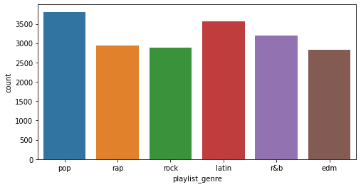
    


Our immediate observation is that our playlists consist of almost equal genres. The exact values are obtained below. It is observed that the order of popularity is pop, latin, r&b, rap, rock and edm. 


```python
df['playlist_genre'].value_counts()
```


    pop      3807
    latin    3565
    r&b      3204
    rap      2945
    rock     2881
    edm      2821
    Name: playlist_genre, dtype: int64


```python
# plotting the distribution of our sub_genres
plt.figure(figsize = (20, 4))
bar_plot = sns.countplot(df['playlist_subgenre'])
plt.show()
```


    
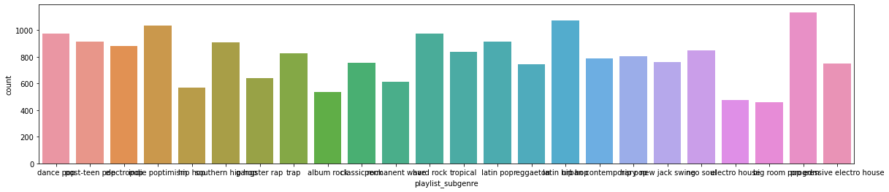
    


```python
# previewing the histograms of each variable
fig, axes = plt.subplots(nrows = 7, ncols = 2, figsize = (10, 20))

cols = num_var
colors = ['#00FF7F', '#8B0000', '#0000FF', '#DB7093', '#FFFF00', '#FF4500', '#7B68EE', '#FF00FF',
          '#ADFF2F', '#FFD700', '#A52A2A', '#C71585', '#8B008B']

for col, color, ax in zip(cols, colors, axes.flatten()):
    sns.distplot(df[col], ax = ax, color = color, hist_kws = dict(alpha = 0.6))
    plt.title(col)
    
plt.tight_layout()
```


    
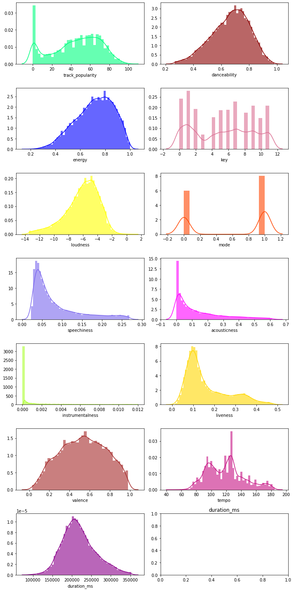
    


### Bivariate Analysis


```python
# previewing scatterplots of our numerical variable with our target variable
num_var.remove('track_popularity')

num_length = round(len(num_var) / 2)
colors = sns.color_palette("hsv", len(num_var))

fig, axes = plt.subplots(nrows = num_length, ncols = 2, figsize = (15, 30))

for var, color, ax in zip(num_var, colors, axes.flatten()):
    sns.scatterplot(x = df['track_popularity'], y = df[var], ax = ax, color = color)
    plt.title(var)
    
plt.tight_layout()
```


    
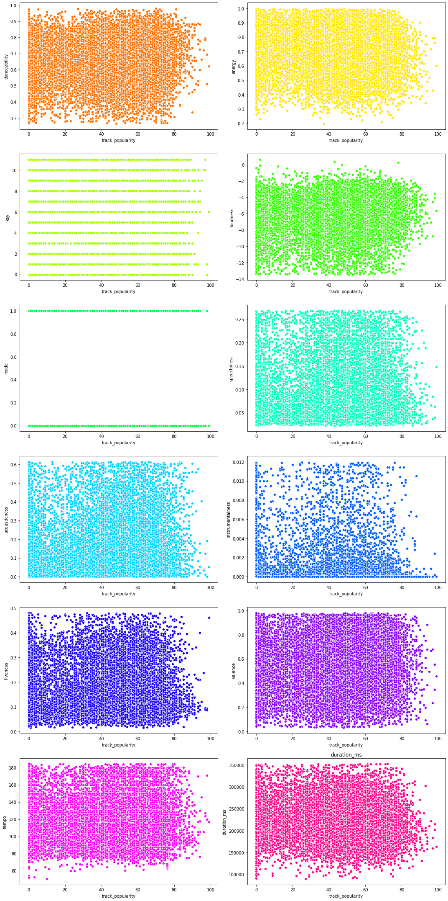
    


There does not appear to be a clear relationship between our target variable and the other variables.


```python
# visualizing the correlations between the variables
corr = df.corr()

plt.figure(figsize = (15, 15))
sns.heatmap(corr, annot = True, cmap = 'coolwarm')
plt.show()
```


    
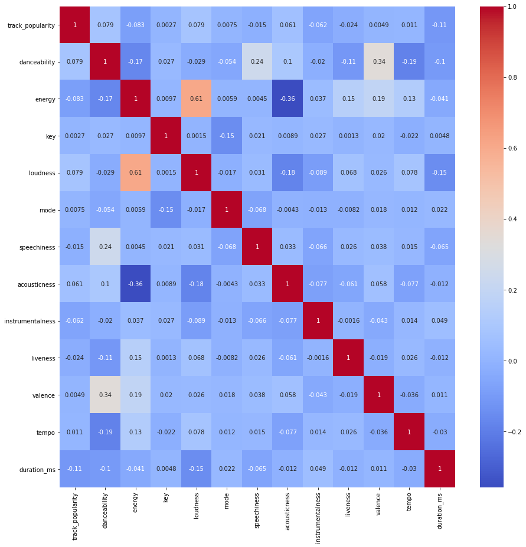
    


There appears to be no collinearity in our dataset but just to be sure we get the inverse of the correlation matrix to determine the VIF scores. 


```python
# getting the inverse correlation matrix
vif_df = pd.DataFrame(np.linalg.inv(corr.values), index = corr.index, columns=corr.columns)

# plotting the heatmap with the VIF scores and specifying size
plt.figure(figsize=[15,15])

sns.heatmap(vif_df, annot = True, cmap = 'coolwarm');
```


    
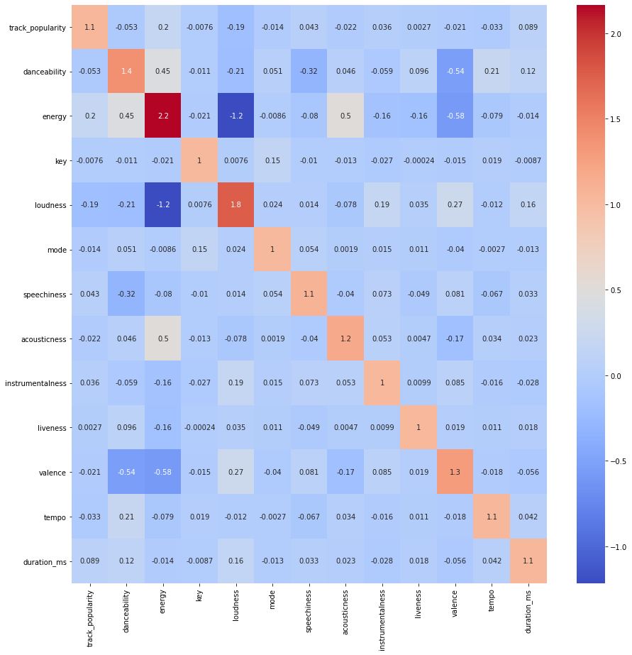
    


We note that there are no values exceeding 5 thus no need to drop any of our variables.

## Predicting Track Popularity

### Regression Techniques


```python
# specifiying our X & Y variables
# num_var is the list that we had previously created containing numerical variables (without the target variable)
X = df[num_var]
y = df['track_popularity']
```


```python
# specifying our train and test data - We shall use the train:test ratio of 0.75:0.25
from sklearn.model_selection import train_test_split

X_train, X_test, y_train, y_test = train_test_split(X, y, test_size = 0.25, random_state = 0)
```


```python
# performing feature scaling on our dataset
from sklearn.preprocessing import StandardScaler

sc_X = StandardScaler()

# fitting and transforming our training data
X_train = sc_X.fit_transform(X_train)

# transforming our test data
X_test = sc_X.transform(X_test)
```


```python
# Loading our regression models
from sklearn.linear_model import LinearRegression
from sklearn.neighbors import KNeighborsRegressor
from sklearn.tree import DecisionTreeRegressor
from sklearn.svm import SVR

# Setting up our regressors
linear_regressor = LinearRegression()
knn_regressor = KNeighborsRegressor(5)
decision_tree_regressor = DecisionTreeRegressor(random_state = 0)
svm_regressor = SVR(kernel = 'linear')

#fitting our regressors to our training data
linear_regressor.fit(X_train, y_train)
knn_regressor.fit(X_train, y_train)
decision_tree_regressor.fit(X_train, y_train)
svm_regressor.fit(X_train, y_train)

# making predictions with our data
linear_y_pred = linear_regressor.predict(X_test)
knn_y_pred = knn_regressor.predict(X_test)
decision_y_pred = decision_tree_regressor.predict(X_test)
svm_y_pred = svm_regressor.predict(X_test)
```


```python
# Evaluating our RMSE Scores and R2 Scores
from sklearn import metrics
print('Linear Regression RMSE:', np.sqrt(metrics.mean_squared_error(y_test, linear_y_pred)))
print('Linear Regression R-squared value:', metrics.r2_score(y_test, linear_y_pred))

print('KNN Regression RMSE:', np.sqrt(metrics.mean_squared_error(y_test, knn_y_pred)))
print('KNN R-squared value:', metrics.r2_score(y_test, knn_y_pred))

print('Decision Tree Regression RMSE:', np.sqrt(metrics.mean_squared_error(y_test, decision_y_pred)))
print('Decision Tree R-squared value:', metrics.r2_score(y_test, decision_y_pred))

print('SVM Regression RMSE:', np.sqrt(metrics.mean_squared_error(y_test, svm_y_pred)))
print('SVM R-squared value:', metrics.r2_score(y_test, svm_y_pred))
```

    Linear Regression RMSE: 24.51176925167957
    Linear Regression R-squared value: 0.048464428972878726
    KNN Regression RMSE: 25.373199133937966
    KNN R-squared value: -0.01959140230742551
    Decision Tree Regression RMSE: 28.969193038265797
    Decision Tree R-squared value: -0.329071986507951
    SVM Regression RMSE: 24.778573254066597
    SVM R-squared value: 0.02763727704839991


```python
# 10% of the mean of the target variable
print('10% of the mean of the target variable:', df[['track_popularity']].mean() * 0.1)
```

    10% of the mean of the target variable: track_popularity    4.544946
    dtype: float64


From the results of our regression, none of the RMSE values are less than 10% of the mean of the target variable indicating that regression may not be the best approach for this problem given the low collinearity with the target variable. 

### Classification Techniques


```python
# understanding the distribution of our popularity
sns.distplot(df['track_popularity']).set_title('Popularity Distribution');
```


    
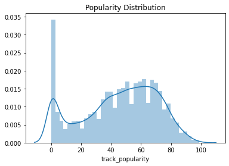
    


```python
# Getting a statistic description of our target variable
df['track_popularity'].describe()
```


    count    19223.000000
    mean        45.449462
    std         25.065336
    min          0.000000
    25%         28.000000
    50%         49.000000
    75%         65.000000
    max         99.000000
    Name: track_popularity, dtype: float64


```python
# creating a new target variable called categorical track popularity based on the distribution of the data
df.loc[df['track_popularity'] <= 45, 'cat_track_popularity'] = 0 # below average popularity
df.loc[df['track_popularity'] > 45, 'cat_track_popularity'] = 1 # above average popularity
```


```python
q1 = df[df['cat_track_popularity'] == 0].shape
q2 = df[df['cat_track_popularity'] == 1].shape

#confirming our ranges have encompassed the entire dataset
q1[0] + q2 [0] == df.shape[0]
```


    True


```python
# specifying our X & Y variables
X = df[num_var]
y = df['cat_track_popularity']

# splitting our data into test and train
X_train, X_test, y_train, y_test = train_test_split(X, y, test_size = 0.25, random_state = 0)
```


```python
# scaling our data once again
# sc_X = StandardScaler()

# fitting and transforming our training data
# X_train = sc_X.fit_transform(X_train)

# transforming our test data
# X_test = sc_X.transform(X_test)
```


```python
# fit the classifiers to the training data and make predictions on the test set

# Logistic Regression
from sklearn.linear_model import LogisticRegression
logistic_classifier = LogisticRegression(random_state = 0, solver = 'lbfgs')
logistic_classifier.fit(X_train, y_train)
logistic_y_prediction = logistic_classifier.predict(X_test)

# Decision Tree 
from sklearn.tree import DecisionTreeClassifier
decision_classifier = DecisionTreeClassifier()
decision_classifier.fit(X_train, y_train)
decision_y_prediction = decision_classifier.predict(X_test)

# Support Vector Machine
from sklearn.svm import SVC
svm_classifier = SVC()
svm_classifier.fit(X_train, y_train)
svm_y_prediction = svm_classifier.predict(X_test)

# Naive Bayes
from sklearn.naive_bayes import GaussianNB
naive_classifier = GaussianNB()
naive_classifier.fit(X_train, y_train)
naive_y_prediction = naive_classifier.predict(X_test)

# K-Neighbors
from sklearn.neighbors import KNeighborsClassifier
knn_classifier = KNeighborsClassifier(n_neighbors = 5)
knn_classifier.fit(X_train, y_train)
knn_y_prediction = knn_classifier.predict(X_test)

# Bagging
from sklearn.ensemble import BaggingClassifier
bagging_meta_classifier = BaggingClassifier()
bagging_meta_classifier.fit(X_train, y_train)
bagging_y_prediction = bagging_meta_classifier.predict(X_test)

# Random Forest
from sklearn.ensemble import RandomForestClassifier
random_forest_classifier = RandomForestClassifier()
random_forest_classifier.fit(X_train, y_train)
random_forest_y_prediction = random_forest_classifier.predict(X_test)

# Ada Boosting
from sklearn.ensemble import AdaBoostClassifier
ada_boost_classifier = AdaBoostClassifier()
ada_boost_classifier.fit(X_train, y_train)
ada_boost_y_prediction = ada_boost_classifier.predict(X_test)

# Gradient Boosting
from sklearn.ensemble import GradientBoostingClassifier
g_boost_classifier = GradientBoostingClassifier()
g_boost_classifier.fit(X_train, y_train)
g_boost_y_prediction = g_boost_classifier.predict(X_test)

# XG Boosting
from xgboost import XGBClassifier
xg_boost_classifier = XGBClassifier()
xg_boost_classifier.fit(X_train, y_train)
xg_boost_y_prediction = xg_boost_classifier.predict(X_test)
```


```python
# evaluating the classification reports and confusion matrices of each classifier
from sklearn.metrics import classification_report, confusion_matrix

# Logistic Regression
print('Logistic Classifier:')
print(classification_report(y_test, logistic_y_prediction))
print(confusion_matrix(y_test, logistic_y_prediction))

# Decision Tree
print('Decision Tree Classifier:')
print(classification_report(y_test, decision_y_prediction))
print(confusion_matrix(y_test, decision_y_prediction))

# Support Vector Machine
print('SVM Classifier:')
print(classification_report(y_test, svm_y_prediction))
print(confusion_matrix(y_test, svm_y_prediction))

# Naive Bayes
print('NB Classifier:')
print(classification_report(y_test, naive_y_prediction))
print(confusion_matrix(y_test, naive_y_prediction))

# K-Neighbors
print('KNN Classifier:')
print(classification_report(y_test, knn_y_prediction))
print(confusion_matrix(y_test, knn_y_prediction))

# Bagging
print('Bagging Meta Classifier:')
print(classification_report(y_test, bagging_y_prediction))
print(confusion_matrix(y_test, bagging_y_prediction))

# Random Forest
print('Random Forest Classifier:')
print(classification_report(y_test, random_forest_y_prediction))
print(confusion_matrix(y_test, random_forest_y_prediction))

# Ada Boosting
print('Ada Boosting Classifier:')
print(classification_report(y_test, ada_boost_y_prediction))
print(confusion_matrix(y_test, ada_boost_y_prediction))

# Gradient Boosting
print('Gradient Boosting Classification:')
print(classification_report(y_test, g_boost_y_prediction))
print(confusion_matrix(y_test, g_boost_y_prediction))

# XG Boosting
print('XG Boosting Classification:')
print(classification_report(y_test, xg_boost_y_prediction))
print(confusion_matrix(y_test, xg_boost_y_prediction))
```

    Logistic Classifier:
                  precision    recall  f1-score   support
    
             0.0       0.00      0.00      0.00      2147
             1.0       0.55      1.00      0.71      2659
    
        accuracy                           0.55      4806
       macro avg       0.28      0.50      0.36      4806
    weighted avg       0.31      0.55      0.39      4806
    
    [[   0 2147]
     [   0 2659]]
    Decision Tree Classifier:
                  precision    recall  f1-score   support
    
             0.0       0.58      0.55      0.56      2147
             1.0       0.65      0.67      0.66      2659
    
        accuracy                           0.62      4806
       macro avg       0.61      0.61      0.61      4806
    weighted avg       0.62      0.62      0.62      4806
    
    [[1174  973]
     [ 866 1793]]
    SVM Classifier:
                  precision    recall  f1-score   support
    
             0.0       0.56      0.07      0.12      2147
             1.0       0.56      0.96      0.71      2659
    
        accuracy                           0.56      4806
       macro avg       0.56      0.51      0.41      4806
    weighted avg       0.56      0.56      0.45      4806
    
    [[ 148 1999]
     [ 118 2541]]
    NB Classifier:
                  precision    recall  f1-score   support
    
             0.0       0.54      0.22      0.31      2147
             1.0       0.57      0.85      0.68      2659
    
        accuracy                           0.57      4806
       macro avg       0.55      0.53      0.50      4806
    weighted avg       0.56      0.57      0.52      4806
    
    [[ 465 1682]
     [ 404 2255]]
    KNN Classifier:
                  precision    recall  f1-score   support
    
             0.0       0.51      0.45      0.48      2147
             1.0       0.60      0.65      0.62      2659
    
        accuracy                           0.56      4806
       macro avg       0.55      0.55      0.55      4806
    weighted avg       0.56      0.56      0.56      4806
    
    [[ 976 1171]
     [ 928 1731]]
    Bagging Meta Classifier:
                  precision    recall  f1-score   support
    
             0.0       0.59      0.64      0.61      2147
             1.0       0.69      0.64      0.66      2659
    
        accuracy                           0.64      4806
       macro avg       0.64      0.64      0.64      4806
    weighted avg       0.64      0.64      0.64      4806
    
    [[1364  783]
     [ 947 1712]]
    Random Forest Classifier:
                  precision    recall  f1-score   support
    
             0.0       0.63      0.58      0.60      2147
             1.0       0.68      0.72      0.70      2659
    
        accuracy                           0.66      4806
       macro avg       0.65      0.65      0.65      4806
    weighted avg       0.66      0.66      0.66      4806
    
    [[1239  908]
     [ 737 1922]]
    Ada Boosting Classifier:
                  precision    recall  f1-score   support
    
             0.0       0.56      0.39      0.46      2147
             1.0       0.60      0.75      0.67      2659
    
        accuracy                           0.59      4806
       macro avg       0.58      0.57      0.57      4806
    weighted avg       0.59      0.59      0.58      4806
    
    [[ 837 1310]
     [ 655 2004]]
    Gradient Boosting Classification:
                  precision    recall  f1-score   support
    
             0.0       0.58      0.41      0.48      2147
             1.0       0.61      0.76      0.68      2659
    
        accuracy                           0.60      4806
       macro avg       0.60      0.58      0.58      4806
    weighted avg       0.60      0.60      0.59      4806
    
    [[ 878 1269]
     [ 638 2021]]
    XG Boosting Classification:
                  precision    recall  f1-score   support
    
             0.0       0.58      0.40      0.48      2147
             1.0       0.61      0.76      0.68      2659
    
        accuracy                           0.60      4806
       macro avg       0.59      0.58      0.58      4806
    weighted avg       0.60      0.60      0.59      4806
    
    [[ 868 1279]
     [ 639 2020]]


    /usr/local/lib/python3.6/dist-packages/sklearn/metrics/_classification.py:1272: UndefinedMetricWarning: Precision and F-score are ill-defined and being set to 0.0 in labels with no predicted samples. Use `zero_division` parameter to control this behavior.
      _warn_prf(average, modifier, msg_start, len(result))


Our random forest classifier appears to have produced the best results with an f1-score of 65% for below average popularity and 66% for above average popularity. Which appears to be much more accurate than the results produced from regression. 

## Segmentation of Tracks on the Spotify Platform

To solve this problem for the spotify management team, we opt to use unsupervised clustering techniques. Hence, there will be no target variable in this case as we expect our algorithms to learn from the data. 


```python
df.columns
```


    Index(['track_id', 'track_name', 'track_artist', 'track_popularity',
           'track_album_id', 'track_album_name', 'track_album_release_date',
           'playlist_name', 'playlist_id', 'playlist_genre', 'playlist_subgenre',
           'danceability', 'energy', 'key', 'loudness', 'mode', 'speechiness',
           'acousticness', 'instrumentalness', 'liveness', 'valence', 'tempo',
           'duration_ms', 'cat_track_popularity'],
          dtype='object')


```python
# setting our X-variable
X = df[['track_popularity','danceability', 'energy', 'key', 'loudness', 'mode', 'speechiness',
       'acousticness', 'instrumentalness', 'liveness', 'valence', 'tempo',
       'duration_ms']]
```


```python
# scaling our features once again
sc = StandardScaler()

# fit and transform our features
X = sc.fit_transform(X)
```

### K-Means Clustering


```python
# fitting KMeans with 5 clusters
from sklearn.cluster import KMeans

clusterer = KMeans(n_clusters = 5, random_state = 0)
clusterer.fit(X)

# getting the cluster labels
clusterer.labels_
```


    array([2, 2, 2, ..., 0, 0, 0], dtype=int32)


```python
# getting the KMeans scatter plot
kmeans_pred = clusterer.labels_
kmeans_clust = np.unique(kmeans_pred)

plt.figure(figsize = (8, 6))
for cluster in kmeans_clust:
    row_ix = np.where(kmeans_pred == cluster)
    plt.scatter(X[row_ix, 0], X[row_ix, 1], label = cluster)
    
plt.title("Clustering by K-Means Clustering (k = 5)")
plt.legend()
plt.show()
```


    
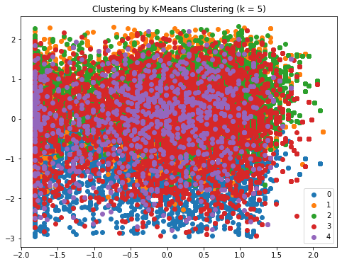
    


```python
# getting the optimum value of k for our KMeans model using the Elbow Method

# defining an empty list to store our errors
Error = []

# Using a for loop to run KNN several times and append values the sum of squared error
for i in range(1, 6):
    kmeans = KMeans(n_clusters = i).fit(X)
    kmeans.fit(X)
    Error.append(kmeans.inertia_)
```


```python
# visualizing the distribution of errors per number of clusters
plt.plot(range(1, 6), Error, 'bx-')
plt.title('Elbow method')
plt.xlabel('No of clusters')
plt.ylabel('Error')
plt.grid(True);
```


    
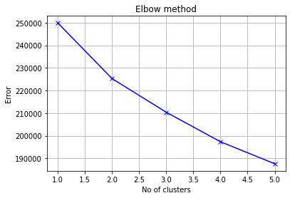
    


From the Error Distribution Plot, we observe the optimum number of clusters as 2


```python
# improving on our initial solution
clusterer_improved = KMeans(n_clusters = 2, random_state = 0)
clusterer_improved.fit(X)

# getting the cluster labels
clusterer_improved.labels_

# getting the KMeans scatter plot
kmeans_pred = clusterer_improved.labels_
kmeans_clust = np.unique(kmeans_pred)

plt.figure(figsize = (8, 6))
for cluster in kmeans_clust:
    row_ix = np.where(kmeans_pred == cluster)
    plt.scatter(X[row_ix, 0], X[row_ix, 1], label = cluster)
    
plt.title("Clustering by K-Means Clustering (k = 2)")
plt.legend()
plt.show()
```


    
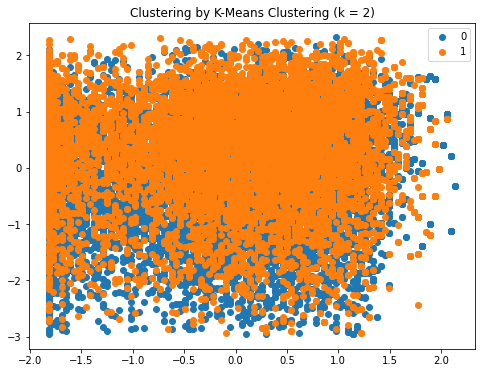
    


```python
# adding these cluster labels to our dataset
df['kmeans_cluster_group'] = clusterer_improved.predict(X)

# previewing a sample of our dataset
df.sample(10)
```


<div>
<style scoped>
    .dataframe tbody tr th:only-of-type {
        vertical-align: middle;
    }

    .dataframe tbody tr th {
        vertical-align: top;
    }

    .dataframe thead th {
        text-align: right;
    }
</style>
<table border="1" class="dataframe">
  <thead>
    <tr style="text-align: right;">
      <th></th>
      <th>track_id</th>
      <th>track_name</th>
      <th>track_artist</th>
      <th>track_popularity</th>
      <th>track_album_id</th>
      <th>track_album_name</th>
      <th>track_album_release_date</th>
      <th>playlist_name</th>
      <th>playlist_id</th>
      <th>playlist_genre</th>
      <th>playlist_subgenre</th>
      <th>danceability</th>
      <th>energy</th>
      <th>key</th>
      <th>loudness</th>
      <th>mode</th>
      <th>speechiness</th>
      <th>acousticness</th>
      <th>instrumentalness</th>
      <th>liveness</th>
      <th>valence</th>
      <th>tempo</th>
      <th>duration_ms</th>
      <th>cat_track_popularity</th>
      <th>kmeans_cluster_group</th>
    </tr>
  </thead>
  <tbody>
    <tr>
      <th>26342</th>
      <td>5PNbUaIYAbm7clBZeU7oeQ</td>
      <td>Misty Night Cruising</td>
      <td>オメガトライブ</td>
      <td>28</td>
      <td>3Vq6k1RTSR7NydAR6AoDw6</td>
      <td>ゴールデン☆ベスト</td>
      <td>2011-05-18</td>
      <td>Japanese Funk/Soul/NEO/Jazz/Acid</td>
      <td>4zNayWuATXCAA9gaXvnFnq</td>
      <td>r&amp;b</td>
      <td>neo soul</td>
      <td>0.587</td>
      <td>0.971</td>
      <td>10</td>
      <td>-3.576</td>
      <td>1</td>
      <td>0.0758</td>
      <td>0.0352</td>
      <td>0.000009</td>
      <td>0.4720</td>
      <td>0.558</td>
      <td>146.523</td>
      <td>270427</td>
      <td>0.0</td>
      <td>0</td>
    </tr>
    <tr>
      <th>32714</th>
      <td>6LNAf850QNFEThYE1gptdK</td>
      <td>No Sound</td>
      <td>FABV</td>
      <td>38</td>
      <td>6QF5eW9Ltg7gyAWKgk69D9</td>
      <td>No Sound</td>
      <td>2019-06-14</td>
      <td>Trending EDM by Nik Cooper</td>
      <td>4N1ipiKR3xla8UXtE12XBm</td>
      <td>edm</td>
      <td>progressive electro house</td>
      <td>0.496</td>
      <td>0.865</td>
      <td>0</td>
      <td>-3.241</td>
      <td>0</td>
      <td>0.1310</td>
      <td>0.2360</td>
      <td>0.000000</td>
      <td>0.3170</td>
      <td>0.323</td>
      <td>125.909</td>
      <td>219509</td>
      <td>0.0</td>
      <td>0</td>
    </tr>
    <tr>
      <th>19134</th>
      <td>1XJWsjiN9fD6AVBBBJ0sfg</td>
      <td>Aparentemente</td>
      <td>Mackieaveliko</td>
      <td>40</td>
      <td>2hUic00wq6dn7s5kJjggc3</td>
      <td>Mis Favoritas Vol. 1</td>
      <td>2015-12-12</td>
      <td>Reggaeton De Ayer</td>
      <td>37i9dQZF1DWWU6Rfto8Ppm</td>
      <td>latin</td>
      <td>reggaeton</td>
      <td>0.865</td>
      <td>0.586</td>
      <td>1</td>
      <td>-10.475</td>
      <td>0</td>
      <td>0.1510</td>
      <td>0.0969</td>
      <td>0.002740</td>
      <td>0.1300</td>
      <td>0.882</td>
      <td>93.994</td>
      <td>302942</td>
      <td>0.0</td>
      <td>1</td>
    </tr>
    <tr>
      <th>19589</th>
      <td>67bG5H7iT26q8ADWsfVWQM</td>
      <td>Yo Te Quiero</td>
      <td>Wisin &amp; Yandel</td>
      <td>16</td>
      <td>6EREkQF1kzKOJJeBaXQDwK</td>
      <td>El Disco De Reggaeton 04</td>
      <td>2007-01-01</td>
      <td>Reggaeton viejito🔥</td>
      <td>0si5tw70PIgPkY1Eva6V8f</td>
      <td>latin</td>
      <td>reggaeton</td>
      <td>0.819</td>
      <td>0.677</td>
      <td>3</td>
      <td>-6.023</td>
      <td>0</td>
      <td>0.2680</td>
      <td>0.5750</td>
      <td>0.000000</td>
      <td>0.1590</td>
      <td>0.765</td>
      <td>93.991</td>
      <td>207307</td>
      <td>0.0</td>
      <td>1</td>
    </tr>
    <tr>
      <th>13103</th>
      <td>17S4XrLvF5jlGvGCJHgF51</td>
      <td>Learning To Fly</td>
      <td>Tom Petty and the Heartbreakers</td>
      <td>71</td>
      <td>42G5ULkCRRl3crJMlg6eKd</td>
      <td>Into The Great Wide Open</td>
      <td>1991-01-01</td>
      <td>80s / Classic Rock</td>
      <td>29dTrOurPDrMcrnio2q6hZ</td>
      <td>rock</td>
      <td>classic rock</td>
      <td>0.651</td>
      <td>0.766</td>
      <td>0</td>
      <td>-9.935</td>
      <td>1</td>
      <td>0.0299</td>
      <td>0.2060</td>
      <td>0.001030</td>
      <td>0.3620</td>
      <td>0.949</td>
      <td>116.740</td>
      <td>242107</td>
      <td>1.0</td>
      <td>1</td>
    </tr>
    <tr>
      <th>23683</th>
      <td>35QutYlXHDefIzlO4GjXjk</td>
      <td>Tua Per Sempre</td>
      <td>Elisa</td>
      <td>64</td>
      <td>4MmmI8sqP83TZzmg0AyTae</td>
      <td>Diari Aperti</td>
      <td>2019-05-03</td>
      <td>Musica Italiana 2020 - Playlist Pop &amp; Hip-Hop ...</td>
      <td>6kVFIQBhLT4003iw2WWEv1</td>
      <td>r&amp;b</td>
      <td>hip pop</td>
      <td>0.394</td>
      <td>0.794</td>
      <td>4</td>
      <td>-4.369</td>
      <td>1</td>
      <td>0.0716</td>
      <td>0.2720</td>
      <td>0.000000</td>
      <td>0.1030</td>
      <td>0.585</td>
      <td>81.621</td>
      <td>207347</td>
      <td>1.0</td>
      <td>0</td>
    </tr>
    <tr>
      <th>2359</th>
      <td>2bZMOs3RjmhhGca6MEzjyl</td>
      <td>Bitch I'm Madonna</td>
      <td>Madonna</td>
      <td>60</td>
      <td>5TAX07toYGN4AFshlKpmZb</td>
      <td>Rebel Heart (Deluxe)</td>
      <td>2015-03-10</td>
      <td>post teen pop</td>
      <td>6rjxP7GQKoqqgoakzxl3PY</td>
      <td>pop</td>
      <td>post-teen pop</td>
      <td>0.722</td>
      <td>0.630</td>
      <td>3</td>
      <td>-5.784</td>
      <td>0</td>
      <td>0.1320</td>
      <td>0.0485</td>
      <td>0.000294</td>
      <td>0.1790</td>
      <td>0.519</td>
      <td>150.023</td>
      <td>227480</td>
      <td>1.0</td>
      <td>0</td>
    </tr>
    <tr>
      <th>13173</th>
      <td>3SOSAvBON7ZfpxPvNm3KJ1</td>
      <td>She's A Dropout</td>
      <td>The Apostles</td>
      <td>27</td>
      <td>3frHNk2EAU3GqMPYeHWpWk</td>
      <td>Ivory Music Classics, Vol. 1</td>
      <td>2010-06-27</td>
      <td>Afro Psychedelica</td>
      <td>37i9dQZF1DWVyizF9BJ61m</td>
      <td>rock</td>
      <td>classic rock</td>
      <td>0.668</td>
      <td>0.675</td>
      <td>0</td>
      <td>-11.181</td>
      <td>1</td>
      <td>0.0524</td>
      <td>0.1370</td>
      <td>0.001380</td>
      <td>0.0929</td>
      <td>0.745</td>
      <td>106.271</td>
      <td>191533</td>
      <td>0.0</td>
      <td>1</td>
    </tr>
    <tr>
      <th>10147</th>
      <td>206jQRISTbK1vN8GE4k95S</td>
      <td>Mona Lisa (prod.Dio Mudara)</td>
      <td>Malik Montana</td>
      <td>57</td>
      <td>4rG9TtJBtJGDgnR53VFULN</td>
      <td>Mona Lisa (prod.Dio Mudara)</td>
      <td>2019-09-11</td>
      <td>Trap strefa</td>
      <td>37i9dQZF1DWY3UKS6jvnxr</td>
      <td>rap</td>
      <td>trap</td>
      <td>0.798</td>
      <td>0.591</td>
      <td>8</td>
      <td>-9.786</td>
      <td>1</td>
      <td>0.1350</td>
      <td>0.3190</td>
      <td>0.000006</td>
      <td>0.0780</td>
      <td>0.561</td>
      <td>99.954</td>
      <td>168000</td>
      <td>1.0</td>
      <td>1</td>
    </tr>
    <tr>
      <th>30641</th>
      <td>6kwAbEjseqBob48jCus7Sz</td>
      <td>Elastic Heart</td>
      <td>Sia</td>
      <td>72</td>
      <td>3xFSl9lIRaYXIYkIn3OIl9</td>
      <td>1000 Forms Of Fear</td>
      <td>2014-07-04</td>
      <td>2015 songs</td>
      <td>6UJw1egIcZVfrBmcKs5uHH</td>
      <td>edm</td>
      <td>pop edm</td>
      <td>0.421</td>
      <td>0.791</td>
      <td>9</td>
      <td>-4.998</td>
      <td>1</td>
      <td>0.0496</td>
      <td>0.0117</td>
      <td>0.000015</td>
      <td>0.1460</td>
      <td>0.499</td>
      <td>130.075</td>
      <td>257200</td>
      <td>1.0</td>
      <td>0</td>
    </tr>
  </tbody>
</table>
</div>


### Heirarchial Agglomerative Clustering


```python
# fitting agglomerative clustering with 5 clusters
from sklearn.cluster import AgglomerativeClustering as AC

agglo_clusterer = AC(n_clusters=5).fit(X)

# get the labels
agglo_clusterer.labels_
```


    array([1, 3, 0, ..., 1, 1, 0])


```python
# Creating a scatter plot of the cluster analysis
ac_pred = agglo_clusterer.labels_
ac_clust = np.unique(ac_pred)

plt.figure(figsize = (8, 6))
for cluster in ac_clust:
    row_ix = np.where(ac_pred == cluster)
    plt.scatter(X[row_ix, 0], X[row_ix, 1], label = cluster)
    
plt.title("Clustering by Agglomerative Clustering (k = 5)")
plt.legend()
plt.show()
```


    
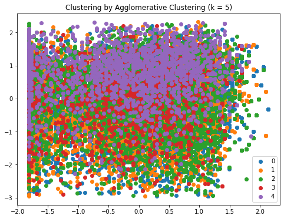
    


```python
# creating a dendrogram of our agglomerative clustering analysis
from scipy.cluster import hierarchy

plt.figure(figsize=(10, 7))
plt.title("Hierarchical Clustering Dendrogram")
dend = hierarchy.dendrogram(hierarchy.linkage(X, method='ward'))
```


    
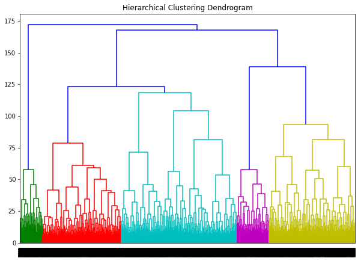
    


From the above dendomgram, the optimum number of clusters is 3


```python
# improve your agglomerative clustering model
agglo_clusterer_r = AC(n_clusters=3).fit(X)

ac_pred = agglo_clusterer_r.labels_
ac_clust = np.unique(ac_pred)

plt.figure(figsize = (8, 6))
for cluster in ac_clust:
    row_ix = np.where(ac_pred == cluster)
    plt.scatter(X[row_ix, 0], X[row_ix, 1], label = cluster)
    
plt.title("Clustering by Agglomerative Clustering (k = 3)")
plt.legend()
plt.show()
```


    
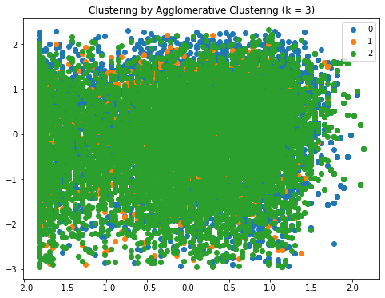
    


```python
# adding to our dataset
df['agglo_cluster_group'] = agglo_clusterer_r.labels_

# previewing a sample of our dataset
df.sample(10)
```


<div>
<style scoped>
    .dataframe tbody tr th:only-of-type {
        vertical-align: middle;
    }

    .dataframe tbody tr th {
        vertical-align: top;
    }

    .dataframe thead th {
        text-align: right;
    }
</style>
<table border="1" class="dataframe">
  <thead>
    <tr style="text-align: right;">
      <th></th>
      <th>track_id</th>
      <th>track_name</th>
      <th>track_artist</th>
      <th>track_popularity</th>
      <th>track_album_id</th>
      <th>track_album_name</th>
      <th>track_album_release_date</th>
      <th>playlist_name</th>
      <th>playlist_id</th>
      <th>playlist_genre</th>
      <th>playlist_subgenre</th>
      <th>danceability</th>
      <th>energy</th>
      <th>key</th>
      <th>loudness</th>
      <th>mode</th>
      <th>speechiness</th>
      <th>acousticness</th>
      <th>instrumentalness</th>
      <th>liveness</th>
      <th>valence</th>
      <th>tempo</th>
      <th>duration_ms</th>
      <th>cat_track_popularity</th>
      <th>kmeans_cluster_group</th>
      <th>agglo_cluster_group</th>
    </tr>
  </thead>
  <tbody>
    <tr>
      <th>30990</th>
      <td>3cNjgVBKTJ1SvKhunrCdVy</td>
      <td>Please Don't Go</td>
      <td>Joel Adams</td>
      <td>76</td>
      <td>2SF8Wbc61u8hlQkZYGVCnx</td>
      <td>Please Don't Go</td>
      <td>2015-11-06</td>
      <td>EDM/POP</td>
      <td>6gHk5RFrnALbDNJdaXKivi</td>
      <td>edm</td>
      <td>pop edm</td>
      <td>0.513</td>
      <td>0.768</td>
      <td>4</td>
      <td>-4.868</td>
      <td>0</td>
      <td>0.0587</td>
      <td>0.01180</td>
      <td>0.000019</td>
      <td>0.2940</td>
      <td>0.235</td>
      <td>84.264</td>
      <td>210580</td>
      <td>1.0</td>
      <td>0</td>
      <td>2</td>
    </tr>
    <tr>
      <th>24125</th>
      <td>2LP2NrdZlsabtHT0GUCwUa</td>
      <td>Knockin' Da' Boots</td>
      <td>H-Town</td>
      <td>1</td>
      <td>1cb11KrBGSuOOCK8xBO8VA</td>
      <td>Luke's Hall Of Fame Vol.3</td>
      <td>1998</td>
      <td>New Jack Swing - 90s R&amp;B fused w Hip Hop</td>
      <td>79xd4wnVuKZK4rJMsL2wPa</td>
      <td>r&amp;b</td>
      <td>new jack swing</td>
      <td>0.734</td>
      <td>0.583</td>
      <td>1</td>
      <td>-10.652</td>
      <td>0</td>
      <td>0.1260</td>
      <td>0.15200</td>
      <td>0.000000</td>
      <td>0.0472</td>
      <td>0.603</td>
      <td>128.122</td>
      <td>327693</td>
      <td>0.0</td>
      <td>1</td>
      <td>0</td>
    </tr>
    <tr>
      <th>28814</th>
      <td>5iDXwq88XnteAFT6Z8duPm</td>
      <td>Storm (feat. Kyra Mastro) - Siks Remix</td>
      <td>Famba</td>
      <td>35</td>
      <td>3HutjytS1VSnJdONETgHTj</td>
      <td>Storm (Remixes) (feat. Kyra Mastro)</td>
      <td>2019-08-30</td>
      <td>Dancefloor Beats</td>
      <td>6mMk6QCzEgT3QGaCV1R4S5</td>
      <td>edm</td>
      <td>big room</td>
      <td>0.715</td>
      <td>0.839</td>
      <td>11</td>
      <td>-5.706</td>
      <td>0</td>
      <td>0.0483</td>
      <td>0.17400</td>
      <td>0.000142</td>
      <td>0.1630</td>
      <td>0.851</td>
      <td>124.990</td>
      <td>205475</td>
      <td>0.0</td>
      <td>0</td>
      <td>2</td>
    </tr>
    <tr>
      <th>27264</th>
      <td>0kAqaILyqLeIYotgWr4FJz</td>
      <td>Not Really (Busta K Remix)</td>
      <td>Sage Charmaine</td>
      <td>21</td>
      <td>4Xw6BzFBGFqSAeKZEeFVJ4</td>
      <td>Not Really (Busta K Remix)</td>
      <td>2019-12-13</td>
      <td>EDM 2020 House &amp; Dance</td>
      <td>25ButZrVb1Zj1MJioMs09D</td>
      <td>edm</td>
      <td>electro house</td>
      <td>0.664</td>
      <td>0.475</td>
      <td>1</td>
      <td>-9.539</td>
      <td>0</td>
      <td>0.0330</td>
      <td>0.16000</td>
      <td>0.006190</td>
      <td>0.0871</td>
      <td>0.322</td>
      <td>123.011</td>
      <td>206169</td>
      <td>0.0</td>
      <td>1</td>
      <td>1</td>
    </tr>
    <tr>
      <th>9138</th>
      <td>4mTtMweEZoyyjq7emPX5hQ</td>
      <td>Lowlife</td>
      <td>Josh A</td>
      <td>54</td>
      <td>0SazAuttORzDn2zcNjxgyd</td>
      <td>Lowlife</td>
      <td>2019-10-30</td>
      <td>Gangsta Rap 💎 Rap Party</td>
      <td>0BwUQpqHSlC2YfKwOp2dQV</td>
      <td>rap</td>
      <td>gangster rap</td>
      <td>0.722</td>
      <td>0.791</td>
      <td>2</td>
      <td>-6.555</td>
      <td>1</td>
      <td>0.2450</td>
      <td>0.14300</td>
      <td>0.000000</td>
      <td>0.1290</td>
      <td>0.332</td>
      <td>160.061</td>
      <td>94582</td>
      <td>1.0</td>
      <td>0</td>
      <td>2</td>
    </tr>
    <tr>
      <th>14842</th>
      <td>176kpV6izJDVUwkG7GSurq</td>
      <td>Where Are You Eden?</td>
      <td>Magnum</td>
      <td>40</td>
      <td>5jHqO7WGurvhlT57OB2slf</td>
      <td>Where Are You Eden?</td>
      <td>2020-01-10</td>
      <td>Hard Rock</td>
      <td>37i9dQZF1DX1X7WV84927n</td>
      <td>rock</td>
      <td>hard rock</td>
      <td>0.570</td>
      <td>0.894</td>
      <td>10</td>
      <td>-5.179</td>
      <td>0</td>
      <td>0.0448</td>
      <td>0.00292</td>
      <td>0.000299</td>
      <td>0.1090</td>
      <td>0.288</td>
      <td>120.035</td>
      <td>336453</td>
      <td>0.0</td>
      <td>0</td>
      <td>2</td>
    </tr>
    <tr>
      <th>9976</th>
      <td>3CwocqtW6g2rCqsI8PQCf4</td>
      <td>NIENTE</td>
      <td>Giaime</td>
      <td>63</td>
      <td>0geVcUH2Ev47y8h6wjLNM9</td>
      <td>NIENTE</td>
      <td>2020-01-09</td>
      <td>Zona Trap</td>
      <td>37i9dQZF1DWXU2naFUn37x</td>
      <td>rap</td>
      <td>trap</td>
      <td>0.762</td>
      <td>0.697</td>
      <td>11</td>
      <td>-6.626</td>
      <td>0</td>
      <td>0.1030</td>
      <td>0.29800</td>
      <td>0.000000</td>
      <td>0.0999</td>
      <td>0.530</td>
      <td>91.984</td>
      <td>147391</td>
      <td>1.0</td>
      <td>1</td>
      <td>0</td>
    </tr>
    <tr>
      <th>17907</th>
      <td>6COqcps4L8EcHsf3lloItY</td>
      <td>Estrellita</td>
      <td>J-King y Maximan</td>
      <td>0</td>
      <td>1xGjeaeENAi011VFK6iMEI</td>
      <td>Los Superheroes</td>
      <td>2010-01-01</td>
      <td>MIX LATIN POP°</td>
      <td>6IS6XTdbS9qJZgfjNKgpB8</td>
      <td>latin</td>
      <td>latin pop</td>
      <td>0.693</td>
      <td>0.838</td>
      <td>4</td>
      <td>-4.630</td>
      <td>1</td>
      <td>0.1440</td>
      <td>0.12100</td>
      <td>0.000000</td>
      <td>0.1880</td>
      <td>0.731</td>
      <td>99.746</td>
      <td>244840</td>
      <td>0.0</td>
      <td>0</td>
      <td>2</td>
    </tr>
    <tr>
      <th>9863</th>
      <td>1va2rmvHBHJNXmtmq5shS0</td>
      <td>McDonalds Rich</td>
      <td>SAINt JHN</td>
      <td>50</td>
      <td>0AXB9yJXJXKYMOggunCnlk</td>
      <td>McDonalds Rich</td>
      <td>2018-10-17</td>
      <td>Rap Party 24/7 Radio / Gangsta Rap</td>
      <td>4sGnz2x5tbHE2YlW1nemfb</td>
      <td>rap</td>
      <td>gangster rap</td>
      <td>0.854</td>
      <td>0.805</td>
      <td>1</td>
      <td>-5.796</td>
      <td>1</td>
      <td>0.2400</td>
      <td>0.09210</td>
      <td>0.000052</td>
      <td>0.1140</td>
      <td>0.814</td>
      <td>156.011</td>
      <td>172706</td>
      <td>1.0</td>
      <td>0</td>
      <td>0</td>
    </tr>
    <tr>
      <th>24192</th>
      <td>46LEQkbfPT5x2ZanS3STg5</td>
      <td>I'm Still In Love With You</td>
      <td>New Edition</td>
      <td>52</td>
      <td>6fRUYwwUOmQbuwe9KujqQG</td>
      <td>Home Again</td>
      <td>1996-01-01</td>
      <td>New Jack Swing/ R&amp;B Hits: 1987 - 2002</td>
      <td>4sji14lrB5bgcr51lPALYH</td>
      <td>r&amp;b</td>
      <td>new jack swing</td>
      <td>0.741</td>
      <td>0.519</td>
      <td>8</td>
      <td>-4.683</td>
      <td>0</td>
      <td>0.0351</td>
      <td>0.42600</td>
      <td>0.000000</td>
      <td>0.3180</td>
      <td>0.418</td>
      <td>134.294</td>
      <td>279667</td>
      <td>1.0</td>
      <td>1</td>
      <td>0</td>
    </tr>
  </tbody>
</table>
</div>


## Summary of Findings

Based on our Spotify Dataset we are able to conclude the following:
<li> While regression techniques may seem like the obvious choice, they all perform poorly in terms of predicting track popularity </li>
<li> Using a Random Forest Classifier yields the best results in predicting popularity of a track </li>
<li> K-means clustering techniques show us two distinct clusters in the datset </li>

## Recommendation

From our data analysis and modeling, it is clear that there are two distinct segments in our dataset. We are also able to predict whether a given track will have above average or below average popularity. 

The Data Team should work on improving model accuracy as 65% is still not sufficiently accurate. 

## Suggested Improvements

The following improvements can be made to yield better results: 
<li> Hyperparameter tuning & feature engineering </li>
<li> Obtaining revenue earned for our distinct clusters could further validate our solution </li> 
<li> Time series analysis to observe how popularity changes over a specified timeframe </li>
