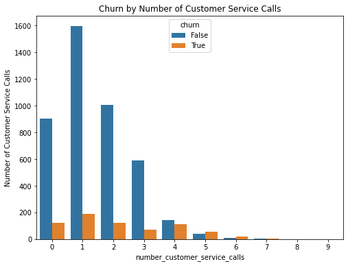
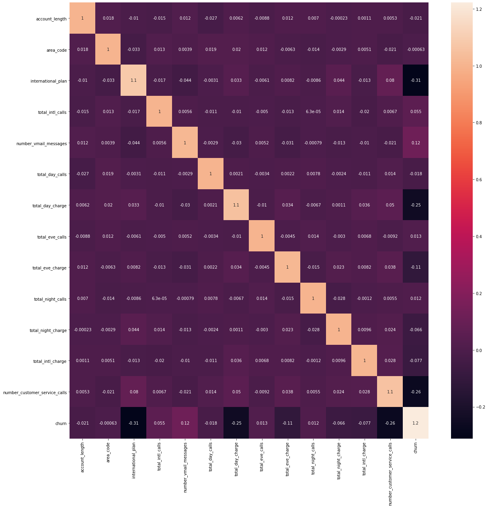

## <font color='#2F4F4F'>1. Defining the Question</font>

### a) Specifying the Data Analysis Question
How can we accurately predict which MTN customers will churn based on call center data records? 

### b) Defining the Metric for Success

A classification model that accurately predicts which MTN customers will churn based on call center records

### c) Understanding the Context 

You work as a Data Scientist for MTN Africa, a leading Telecommunications Company in Africa. In an effort to understand the behaviour of the company's customers, you are tasked to analyze relevant customer data and develop a solution that will help determine whether a customer will churn. Use the provided dataset to implement your solution. In addition, you will be expected to help relevant stakeholders understand the potential of your developed solution.

### d) Recording the Experimental Design
The following comprehensive steps will be taken in our analysis:
<li> Defining the Research Question </li>
<li> Data Importation </li>
<li> Data Exploration </li>
<li> Data Cleaning </li>
<li> Data Analysis (Univariate and Bivariate) </li>
<li> Data Preparation </li>
<li> Data Modeling </li>
<li> Model Evaluation </li>
<li> Challenging your Solution </li>
<li> Recommendations / Conclusion </li>

### e) Data Relevance

Our data consists of call centre data records with multiple qualitative data variables that are likely to give insight into whether an MTN customer will churn or not. 

## <font color='#2F4F4F'>2. Data Cleaning & Preparation</font>


```python
# load libraries
import pandas as pd
import numpy as np
import matplotlib.pyplot as plt
import seaborn as sns

%matplotlib inline

# to display all columns
pd.set_option('display.max.columns', None)

# to display the entire contents of a cell
pd.set_option('display.max_colwidth', None)
```

    /usr/local/lib/python3.6/dist-packages/statsmodels/tools/_testing.py:19: FutureWarning: pandas.util.testing is deprecated. Use the functions in the public API at pandas.testing instead.
      import pandas.util.testing as tm


```python
# load and preview dataset
df = pd.read_csv('call-center-data-QueryResult.csv')
df.sample(3)
```


<div>
<style scoped>
    .dataframe tbody tr th:only-of-type {
        vertical-align: middle;
    }

    .dataframe tbody tr th {
        vertical-align: top;
    }

    .dataframe thead th {
        text-align: right;
    }
</style>
<table border="1" class="dataframe">
  <thead>
    <tr style="text-align: right;">
      <th></th>
      <th>recordid</th>
      <th>customer_id</th>
      <th>account_length</th>
      <th>area_code</th>
      <th>international_plan</th>
      <th>total_intl_minutes</th>
      <th>total_intl_calls</th>
      <th>voice_mail_plan</th>
      <th>number_vmail_messages</th>
      <th>total_day_minutes</th>
      <th>total_day_calls</th>
      <th>total_day_charge</th>
      <th>total_eve_minutes</th>
      <th>total_eve_calls</th>
      <th>total_eve_charge</th>
      <th>total_night_minutes</th>
      <th>total_night_calls</th>
      <th>total_night_charge</th>
      <th>total_intl_minutes_2</th>
      <th>total_intl_calls_2</th>
      <th>total_intl_charge</th>
      <th>number_customer_service_calls</th>
      <th>churn</th>
    </tr>
  </thead>
  <tbody>
    <tr>
      <th>2623</th>
      <td>2624</td>
      <td>37554102.0</td>
      <td>77</td>
      <td>415</td>
      <td>False</td>
      <td>7.1</td>
      <td>3</td>
      <td>True</td>
      <td>23</td>
      <td>209.7</td>
      <td>73</td>
      <td>35.65</td>
      <td>183.6</td>
      <td>63</td>
      <td>15.61</td>
      <td>205.5</td>
      <td>111</td>
      <td>9.25</td>
      <td>7.1</td>
      <td>3</td>
      <td>1.92</td>
      <td>2</td>
      <td>False</td>
    </tr>
    <tr>
      <th>11490</th>
      <td>11491</td>
      <td>28510568.0</td>
      <td>127</td>
      <td>415</td>
      <td>True</td>
      <td>6.2</td>
      <td>4</td>
      <td>False</td>
      <td>0</td>
      <td>143.2</td>
      <td>60</td>
      <td>24.34</td>
      <td>179.5</td>
      <td>159</td>
      <td>15.26</td>
      <td>171.8</td>
      <td>122</td>
      <td>7.73</td>
      <td>6.2</td>
      <td>4</td>
      <td>1.67</td>
      <td>4</td>
      <td>True</td>
    </tr>
    <tr>
      <th>8037</th>
      <td>8038</td>
      <td>25474651.0</td>
      <td>113</td>
      <td>408</td>
      <td>False</td>
      <td>6.5</td>
      <td>4</td>
      <td>False</td>
      <td>0</td>
      <td>158.9</td>
      <td>137</td>
      <td>27.01</td>
      <td>242.8</td>
      <td>109</td>
      <td>20.64</td>
      <td>247.8</td>
      <td>97</td>
      <td>11.15</td>
      <td>6.5</td>
      <td>4</td>
      <td>1.76</td>
      <td>0</td>
      <td>False</td>
    </tr>
  </tbody>
</table>
</div>


```python
# load glossary
glossary = pd.read_csv('classification_analysis_glossary.csv',header = None)
glossary
```


<div>
<style scoped>
    .dataframe tbody tr th:only-of-type {
        vertical-align: middle;
    }

    .dataframe tbody tr th {
        vertical-align: top;
    }

    .dataframe thead th {
        text-align: right;
    }
</style>
<table border="1" class="dataframe">
  <thead>
    <tr style="text-align: right;">
      <th></th>
      <th>0</th>
    </tr>
  </thead>
  <tbody>
    <tr>
      <th>0</th>
      <td>account_length - Age of account in months.</td>
    </tr>
    <tr>
      <th>1</th>
      <td>customer_id - Enterprise ID of the customer.</td>
    </tr>
    <tr>
      <th>2</th>
      <td>area_code - Area code.</td>
    </tr>
    <tr>
      <th>3</th>
      <td>international_plan - Rather or not the customer has an international calling plan.</td>
    </tr>
    <tr>
      <th>4</th>
      <td>voice_mail_plan - Rather or not the customer has a voice mail plan.</td>
    </tr>
    <tr>
      <th>5</th>
      <td>number_vmail_messages - Number of VM messages customer currently has on the server.</td>
    </tr>
    <tr>
      <th>6</th>
      <td>total_day_minutes - Customers total usage of day minutes in plan.</td>
    </tr>
    <tr>
      <th>7</th>
      <td>total_day_calls - Total number of calls customer has made during the day.</td>
    </tr>
    <tr>
      <th>8</th>
      <td>total_day_charge - How much the customer has been charged for day minutes.</td>
    </tr>
    <tr>
      <th>9</th>
      <td>total_eve_minutes - Total number of calls customer has made during the evening.</td>
    </tr>
    <tr>
      <th>10</th>
      <td>total_eve_charge - How much the customer has been charged for evening minutes.</td>
    </tr>
    <tr>
      <th>11</th>
      <td>total_night_minutes - Customers total usage of night minutes in plan.</td>
    </tr>
    <tr>
      <th>12</th>
      <td>total_night_calls - Total number of calls customer has made during the night.</td>
    </tr>
    <tr>
      <th>13</th>
      <td>total_night_charge - How much the customer has been charged for night minutes.</td>
    </tr>
    <tr>
      <th>14</th>
      <td>total_intl_minutes - Total international minutes.</td>
    </tr>
    <tr>
      <th>15</th>
      <td>total_intl_calls - Total international calls.</td>
    </tr>
    <tr>
      <th>16</th>
      <td>total_intl_charge - Total international charges.</td>
    </tr>
    <tr>
      <th>17</th>
      <td>number_customer_service_calls - How many times the customer has called the IVR system.</td>
    </tr>
    <tr>
      <th>18</th>
      <td>churn - Customer has churned.</td>
    </tr>
  </tbody>
</table>
</div>


```python
# check dataset shape
df.shape
```


    (12892, 23)


Our dataset has 12,892 records and 23 variables.

We will drop 'recordid' and 'customer_id' since we have no need of them and they would interfere with our analysis.


```python
df.drop(columns = ['recordid', 'customer_id'], inplace = True)
```


```python
# preview variable datatypes
df.dtypes
```


    account_length                     int64
    area_code                          int64
    international_plan                  bool
    total_intl_minutes               float64
    total_intl_calls                   int64
    voice_mail_plan                     bool
    number_vmail_messages              int64
    total_day_minutes                float64
    total_day_calls                    int64
    total_day_charge                 float64
    total_eve_minutes                float64
    total_eve_calls                    int64
    total_eve_charge                 float64
    total_night_minutes              float64
    total_night_calls                  int64
    total_night_charge               float64
    total_intl_minutes_2             float64
    total_intl_calls_2                 int64
    total_intl_charge                float64
    number_customer_service_calls      int64
    churn                               bool
    dtype: object


With the exception of the 'international_plan', 'voice_mail_plan', and 'churn' variables which are boolean, this dataset is numerical.


```python
# check for duplicates
df.duplicated().sum()
```


    7892


7,892 duplicated records are found. We will drop them.


```python
df = df.drop_duplicates()
df.shape
```


    (5000, 21)


```python
# check for missing values
df.isna().sum()
```


    account_length                   0
    area_code                        0
    international_plan               0
    total_intl_minutes               0
    total_intl_calls                 0
    voice_mail_plan                  0
    number_vmail_messages            0
    total_day_minutes                0
    total_day_calls                  0
    total_day_charge                 0
    total_eve_minutes                0
    total_eve_calls                  0
    total_eve_charge                 0
    total_night_minutes              0
    total_night_calls                0
    total_night_charge               0
    total_intl_minutes_2             0
    total_intl_calls_2               0
    total_intl_charge                0
    number_customer_service_calls    0
    churn                            0
    dtype: int64


No missing values found. We will look at the unique values in each variable just to be safe.


```python
columns = df.columns

for col in columns:
    print("Variable:", col)
    print("Number of unique values:", df[col].nunique())
    print(df[col].unique())
    print()
```

    Variable: account_length
    Number of unique values: 218
    [101 137 103  99 108 117  63  94 138 128 113 140 102  60  96 178  75 106
     158 111  92  42  69  76  72 115  68  97  90  73  54 161 125 194 141  98
     110  70  66  79  61  77 105 159  83  93 163 169  57  85 132 190  39  84
      71 114 135  82  64 112 166 120 187 100  45  43  52  74  40  56 133 119
     131 118 107 109 127  33 145  47  53 148  55 143 170  65 157  89  91 104
     130  80 146  29  78 185 144  59 139  12 150 156  17 176  95 136 165 149
     124  87  51 126  62  48  58  81  36 177  25 171 122  44 167  41 184  88
     151 160 152  49  13 142   3  23  19 154 116 173  24  15  86 147  21 174
     162 186  14   7   1  18  20  11 192 121 134  67 164 180  35 155  32 123
     182 129  38  37  50  27 188 175   5  26   4  31 193 238  28 195 153 201
     216 183 168 222 232 233  22  46  34   8 217   2 200 172  16  30 202 181
      10   6 179 208 215 199 196 209 224 189 243 205   9 210 212 197 225 191
     204 221]
    
    Variable: area_code
    Number of unique values: 3
    [510 408 415]
    
    Variable: international_plan
    Number of unique values: 2
    [False  True]
    
    Variable: total_intl_minutes
    Number of unique values: 170
    [10.6  9.5 13.7 15.7  7.7  6.9 12.9 11.1  9.9 11.9  9.  10.5  7.2  7.4
     14.3 11.7 13.9  7.1 14.7  9.8  9.3 11.   5.2  9.2 10.1 12.3  9.1 12.6
     10.  12.  10.7 13.4  8.3 13.6 12.5 10.2  4.4  8.6  6.8 11.8 16.2 13.2
      8.  11.4 12.4 10.4  7.5 12.8 18.9  7.6  0.  11.3 13.8  7.   9.6  8.8
      7.3 15.1  7.9 11.6  6.1  8.7 13.3 10.3  5.7 10.9  7.8  5.6 13.5  9.7
     14.8  8.9  9.4  8.5 12.7 15.4  5.4 14.   8.2  6.6 11.5 12.1 13.1 11.2
      8.4 14.9  6.   6.3  4.5  8.1  6.2  3.9  4.6 12.2 13.   6.7 15.6 14.2
     18.7 10.8  5.8 15.   5.9  4.3  5.5 16.8 14.5  4.8  5.3  4.7 16.1 14.1
     15.2 15.3 16.5 16.3  3.1  5.1  6.5  3.7  3.8 17.2  4.2  0.4 19.3 14.6
     19.2  6.4 16.6  2.2 15.9  5.  14.4 15.5  4.9 19.7 16.  15.8 17.8  3.4
     18.5  3.5  4.1 16.4  4.   1.1  2.  17.7 20.  17.6  2.7 18.  17.5 18.2
      3.6 16.7  1.3 16.9 17.  17.1 17.9 17.3 18.4  2.9  3.3  2.6 18.3  2.1
      2.4  2.5]
    
    Variable: total_intl_calls
    Number of unique values: 21
    [ 3  7  6  2  4  5  1  9  8 13  0 12 10 19 16 11 15 18 17 14 20]
    
    Variable: voice_mail_plan
    Number of unique values: 2
    [False  True]
    
    Variable: number_vmail_messages
    Number of unique values: 48
    [ 0 29 32 43 39 22 25 35 31 38 41  6 37 30 40 33 36 12 21 46 27 20 18 24
     28 34 15 26 45 49 19 17 16 14 23 42 10 47 48 52 44 51 11  8  4 13 50  9]
    
    Variable: total_day_minutes
    Number of unique values: 1961
    [ 70.9 223.6 294.7 ... 224.1 124.9 321.1]
    
    Variable: total_day_calls
    Number of unique values: 123
    [123  86  95  78  85 124  97 117 100  77 109  93  66 105 121 142  88  99
     101 111  94 110 125 106  74 131 112 104  76 113 122 127  65  91  48 120
     102 103  81 108  83  56 118  75  57 132 114  92 126  98 119  87  82  96
     107  90  64 133  89 115 147  58  72  80  53 128 130 149  79  68 143 141
      61 116 148  84  62  60  51  73 135 137 151 136 134  50  71  70 129  52
     138  69  59  67 144  63  47  34  39 156 157 146  44  46 140 152 139 160
      49 145  55 158 163  54  36  40 150 165  30  42   0  45  35]
    
    Variable: total_day_charge
    Number of unique values: 1961
    [12.05 38.01 50.1  ... 38.1  21.23 54.59]
    
    Variable: total_eve_minutes
    Number of unique values: 1879
    [211.9 244.8 237.3 ... 153.4 288.8 265.9]
    
    Variable: total_eve_calls
    Number of unique values: 126
    [ 73 139 105  88 101  68 125 112  46  89  90 116  97 107 100  81 108 104
     106 120  71  70 131 128  91 109 126  75  87  78  94 127  62 103 110  96
     136  67 148 117  95  98  92 111  99  63 119 123  93 102  86 121  56 118
     114 133  76  79  65  85  72 113 115 132  84 143 130  83 124 142 150  74
     129 138  61 122  80  77 134  82 151 147  58  69 141  66  55  64  47 144
     169 149  53 140 152  54 154  60 135 145 155  51  52 137  38  57  44 146
      49 164  59  48 168  42  37  12  50 157  45  36 156 153  43   0 159 170]
    
    Variable: total_eve_charge
    Number of unique values: 1659
    [18.01 20.81 20.17 ... 13.04 24.55 22.6 ]
    
    Variable: total_night_minutes
    Number of unique values: 1853
    [236.   94.2 300.3 ... 131.9 280.9 279.1]
    
    Variable: total_night_calls
    Number of unique values: 131
    [ 73  81 127  82 107  90 120 106  71  92 100  94 124 119  89 114  99  98
      95 104 121  80 125  78 105  96 103 115  79 101 132  72  85 110  83  84
     109 118 134 116  64 113  88 123 135  56  68 148  76  93  91  97 141 102
     139 136 131  58 129 112  49  48 128 122  77 151 145 108 130 117  69  53
      66  40  87  70  75 111 168 149 137 161 133  67 138  65  60  74 126  61
     150 143 140 146 159 142 160  57  86 170 158  63  62  52 147 154  42  41
      59  50  38  46 155  12  55 165  54  43  51   0 152  44 153 175 157 144
     166  33 156  36 164]
    
    Variable: total_night_charge
    Number of unique values: 1028
    [10.62  4.24 13.51 ...  5.12  5.65 12.37]
    
    Variable: total_intl_minutes_2
    Number of unique values: 170
    [10.6  9.5 13.7 15.7  7.7  6.9 12.9 11.1  9.9 11.9  9.  10.5  7.2  7.4
     14.3 11.7 13.9  7.1 14.7  9.8  9.3 11.   5.2  9.2 10.1 12.3  9.1 12.6
     10.  12.  10.7 13.4  8.3 13.6 12.5 10.2  4.4  8.6  6.8 11.8 16.2 13.2
      8.  11.4 12.4 10.4  7.5 12.8 18.9  7.6  0.  11.3 13.8  7.   9.6  8.8
      7.3 15.1  7.9 11.6  6.1  8.7 13.3 10.3  5.7 10.9  7.8  5.6 13.5  9.7
     14.8  8.9  9.4  8.5 12.7 15.4  5.4 14.   8.2  6.6 11.5 12.1 13.1 11.2
      8.4 14.9  6.   6.3  4.5  8.1  6.2  3.9  4.6 12.2 13.   6.7 15.6 14.2
     18.7 10.8  5.8 15.   5.9  4.3  5.5 16.8 14.5  4.8  5.3  4.7 16.1 14.1
     15.2 15.3 16.5 16.3  3.1  5.1  6.5  3.7  3.8 17.2  4.2  0.4 19.3 14.6
     19.2  6.4 16.6  2.2 15.9  5.  14.4 15.5  4.9 19.7 16.  15.8 17.8  3.4
     18.5  3.5  4.1 16.4  4.   1.1  2.  17.7 20.  17.6  2.7 18.  17.5 18.2
      3.6 16.7  1.3 16.9 17.  17.1 17.9 17.3 18.4  2.9  3.3  2.6 18.3  2.1
      2.4  2.5]
    
    Variable: total_intl_calls_2
    Number of unique values: 21
    [ 3  7  6  2  4  5  1  9  8 13  0 12 10 19 16 11 15 18 17 14 20]
    
    Variable: total_intl_charge
    Number of unique values: 170
    [2.86 2.57 3.7  4.24 2.08 1.86 3.48 3.   2.67 3.21 2.43 2.84 1.94 2.
     3.86 3.16 3.75 1.92 3.97 2.65 2.51 2.97 1.4  2.48 2.73 3.32 2.46 3.4
     2.7  3.24 2.89 3.62 2.24 3.67 3.38 2.75 1.19 2.32 1.84 3.19 4.37 3.56
     2.16 3.08 3.35 2.81 2.03 3.46 5.1  2.05 0.   3.05 3.73 1.89 2.59 2.38
     1.97 4.08 2.13 3.13 1.65 2.35 3.59 2.78 1.54 2.94 2.11 1.51 3.65 2.62
     4.   2.4  2.54 2.3  3.43 4.16 1.46 3.78 2.21 1.78 3.11 3.27 3.54 3.02
     2.27 4.02 1.62 1.7  1.22 2.19 1.67 1.05 1.24 3.29 3.51 1.81 4.21 3.83
     5.05 2.92 1.57 4.05 1.59 1.16 1.49 4.54 3.92 1.3  1.43 1.27 4.35 3.81
     4.1  4.13 4.46 4.4  0.84 1.38 1.76 1.   1.03 4.64 1.13 0.11 5.21 3.94
     5.18 1.73 4.48 0.59 4.29 1.35 3.89 4.19 1.32 5.32 4.32 4.27 4.81 0.92
     5.   0.95 1.11 4.43 1.08 0.3  0.54 4.78 5.4  4.75 0.73 4.86 4.73 4.91
     0.97 4.51 0.35 4.56 4.59 4.62 4.83 4.67 4.97 0.78 0.89 0.7  4.94 0.57
     0.65 0.68]
    
    Variable: number_customer_service_calls
    Number of unique values: 10
    [3 0 1 2 4 5 6 7 9 8]
    
    Variable: churn
    Number of unique values: 2
    [False  True]
    


We can confirm that there are no missing values in this dataset.


```python
df.isnull().sum()
```


    account_length                   0
    area_code                        0
    international_plan               0
    total_intl_minutes               0
    total_intl_calls                 0
    voice_mail_plan                  0
    number_vmail_messages            0
    total_day_minutes                0
    total_day_calls                  0
    total_day_charge                 0
    total_eve_minutes                0
    total_eve_calls                  0
    total_eve_charge                 0
    total_night_minutes              0
    total_night_calls                0
    total_night_charge               0
    total_intl_minutes_2             0
    total_intl_calls_2               0
    total_intl_charge                0
    number_customer_service_calls    0
    churn                            0
    dtype: int64


An anomaly has been noted: there appears to be duplicated columns between 'total_intl_minutes' and 'total_intl_minutes_2', and 'total_intl_calls' and 'total_intl_calls_2'. Let's preview them:


```python
# previewing the possibly duplicated columns
df[['total_intl_minutes', 'total_intl_calls', 'total_intl_minutes_2', 'total_intl_calls_2']]
```


<div>
<style scoped>
    .dataframe tbody tr th:only-of-type {
        vertical-align: middle;
    }

    .dataframe tbody tr th {
        vertical-align: top;
    }

    .dataframe thead th {
        text-align: right;
    }
</style>
<table border="1" class="dataframe">
  <thead>
    <tr style="text-align: right;">
      <th></th>
      <th>total_intl_minutes</th>
      <th>total_intl_calls</th>
      <th>total_intl_minutes_2</th>
      <th>total_intl_calls_2</th>
    </tr>
  </thead>
  <tbody>
    <tr>
      <th>0</th>
      <td>10.6</td>
      <td>3</td>
      <td>10.6</td>
      <td>3</td>
    </tr>
    <tr>
      <th>1</th>
      <td>9.5</td>
      <td>7</td>
      <td>9.5</td>
      <td>7</td>
    </tr>
    <tr>
      <th>2</th>
      <td>13.7</td>
      <td>6</td>
      <td>13.7</td>
      <td>6</td>
    </tr>
    <tr>
      <th>3</th>
      <td>15.7</td>
      <td>2</td>
      <td>15.7</td>
      <td>2</td>
    </tr>
    <tr>
      <th>4</th>
      <td>7.7</td>
      <td>4</td>
      <td>7.7</td>
      <td>4</td>
    </tr>
    <tr>
      <th>...</th>
      <td>...</td>
      <td>...</td>
      <td>...</td>
      <td>...</td>
    </tr>
    <tr>
      <th>4995</th>
      <td>9.9</td>
      <td>6</td>
      <td>9.9</td>
      <td>6</td>
    </tr>
    <tr>
      <th>4996</th>
      <td>9.6</td>
      <td>4</td>
      <td>9.6</td>
      <td>4</td>
    </tr>
    <tr>
      <th>4997</th>
      <td>14.1</td>
      <td>6</td>
      <td>14.1</td>
      <td>6</td>
    </tr>
    <tr>
      <th>4998</th>
      <td>5.0</td>
      <td>10</td>
      <td>5.0</td>
      <td>10</td>
    </tr>
    <tr>
      <th>4999</th>
      <td>13.7</td>
      <td>4</td>
      <td>13.7</td>
      <td>4</td>
    </tr>
  </tbody>
</table>
<p>5000 rows × 4 columns</p>
</div>


The last two columns appear to be complete copies of the first two. We will confirm this so that we do not blindly drop them.


```python
# selecting the total number of records where the values of 'total_intl_minutes' are equal to the values of 
# 'total_intl_minutes_2', AND the values of 'total_intl_calls' are equal to the values of 'total_intl_calls_2'
df[(df['total_intl_minutes'] == df['total_intl_minutes_2']) & (df['total_intl_calls'] == df['total_intl_calls_2'])].count()
```


    account_length                   5000
    area_code                        5000
    international_plan               5000
    total_intl_minutes               5000
    total_intl_calls                 5000
    voice_mail_plan                  5000
    number_vmail_messages            5000
    total_day_minutes                5000
    total_day_calls                  5000
    total_day_charge                 5000
    total_eve_minutes                5000
    total_eve_calls                  5000
    total_eve_charge                 5000
    total_night_minutes              5000
    total_night_calls                5000
    total_night_charge               5000
    total_intl_minutes_2             5000
    total_intl_calls_2               5000
    total_intl_charge                5000
    number_customer_service_calls    5000
    churn                            5000
    dtype: int64


We see that the columns are indeed duplicates so we can safely drop them.


```python
df = df.drop(columns = ['total_intl_minutes_2', 'total_intl_calls_2'])
df.shape
```


    (5000, 19)


Another anomaly noted is that where there are records of 'total_intl_minutes', 'total_int_calls', and 'total_intl_charge' when 'international_plan' is False.


```python
df[(df['international_plan'] == False) & ((df['total_intl_minutes'] > 0) | (df['total_intl_calls'] > 0) |
                                         df['total_intl_charge'] > 0)]
```


<div>
<style scoped>
    .dataframe tbody tr th:only-of-type {
        vertical-align: middle;
    }

    .dataframe tbody tr th {
        vertical-align: top;
    }

    .dataframe thead th {
        text-align: right;
    }
</style>
<table border="1" class="dataframe">
  <thead>
    <tr style="text-align: right;">
      <th></th>
      <th>account_length</th>
      <th>area_code</th>
      <th>international_plan</th>
      <th>total_intl_minutes</th>
      <th>total_intl_calls</th>
      <th>voice_mail_plan</th>
      <th>number_vmail_messages</th>
      <th>total_day_minutes</th>
      <th>total_day_calls</th>
      <th>total_day_charge</th>
      <th>total_eve_minutes</th>
      <th>total_eve_calls</th>
      <th>total_eve_charge</th>
      <th>total_night_minutes</th>
      <th>total_night_calls</th>
      <th>total_night_charge</th>
      <th>total_intl_charge</th>
      <th>number_customer_service_calls</th>
      <th>churn</th>
    </tr>
  </thead>
  <tbody>
    <tr>
      <th>0</th>
      <td>101</td>
      <td>510</td>
      <td>False</td>
      <td>10.6</td>
      <td>3</td>
      <td>False</td>
      <td>0</td>
      <td>70.9</td>
      <td>123</td>
      <td>12.05</td>
      <td>211.9</td>
      <td>73</td>
      <td>18.01</td>
      <td>236.0</td>
      <td>73</td>
      <td>10.62</td>
      <td>2.86</td>
      <td>3</td>
      <td>False</td>
    </tr>
    <tr>
      <th>1</th>
      <td>137</td>
      <td>510</td>
      <td>False</td>
      <td>9.5</td>
      <td>7</td>
      <td>False</td>
      <td>0</td>
      <td>223.6</td>
      <td>86</td>
      <td>38.01</td>
      <td>244.8</td>
      <td>139</td>
      <td>20.81</td>
      <td>94.2</td>
      <td>81</td>
      <td>4.24</td>
      <td>2.57</td>
      <td>0</td>
      <td>False</td>
    </tr>
    <tr>
      <th>2</th>
      <td>103</td>
      <td>408</td>
      <td>False</td>
      <td>13.7</td>
      <td>6</td>
      <td>True</td>
      <td>29</td>
      <td>294.7</td>
      <td>95</td>
      <td>50.10</td>
      <td>237.3</td>
      <td>105</td>
      <td>20.17</td>
      <td>300.3</td>
      <td>127</td>
      <td>13.51</td>
      <td>3.70</td>
      <td>1</td>
      <td>False</td>
    </tr>
    <tr>
      <th>3</th>
      <td>99</td>
      <td>415</td>
      <td>False</td>
      <td>15.7</td>
      <td>2</td>
      <td>False</td>
      <td>0</td>
      <td>216.8</td>
      <td>123</td>
      <td>36.86</td>
      <td>126.4</td>
      <td>88</td>
      <td>10.74</td>
      <td>220.6</td>
      <td>82</td>
      <td>9.93</td>
      <td>4.24</td>
      <td>1</td>
      <td>False</td>
    </tr>
    <tr>
      <th>4</th>
      <td>108</td>
      <td>415</td>
      <td>False</td>
      <td>7.7</td>
      <td>4</td>
      <td>False</td>
      <td>0</td>
      <td>197.4</td>
      <td>78</td>
      <td>33.56</td>
      <td>124.0</td>
      <td>101</td>
      <td>10.54</td>
      <td>204.5</td>
      <td>107</td>
      <td>9.20</td>
      <td>2.08</td>
      <td>2</td>
      <td>False</td>
    </tr>
    <tr>
      <th>...</th>
      <td>...</td>
      <td>...</td>
      <td>...</td>
      <td>...</td>
      <td>...</td>
      <td>...</td>
      <td>...</td>
      <td>...</td>
      <td>...</td>
      <td>...</td>
      <td>...</td>
      <td>...</td>
      <td>...</td>
      <td>...</td>
      <td>...</td>
      <td>...</td>
      <td>...</td>
      <td>...</td>
      <td>...</td>
    </tr>
    <tr>
      <th>4994</th>
      <td>79</td>
      <td>415</td>
      <td>False</td>
      <td>11.8</td>
      <td>5</td>
      <td>False</td>
      <td>0</td>
      <td>134.7</td>
      <td>98</td>
      <td>22.90</td>
      <td>189.7</td>
      <td>68</td>
      <td>16.12</td>
      <td>221.4</td>
      <td>128</td>
      <td>9.96</td>
      <td>3.19</td>
      <td>2</td>
      <td>False</td>
    </tr>
    <tr>
      <th>4995</th>
      <td>192</td>
      <td>415</td>
      <td>False</td>
      <td>9.9</td>
      <td>6</td>
      <td>True</td>
      <td>36</td>
      <td>156.2</td>
      <td>77</td>
      <td>26.55</td>
      <td>215.5</td>
      <td>126</td>
      <td>18.32</td>
      <td>279.1</td>
      <td>83</td>
      <td>12.56</td>
      <td>2.67</td>
      <td>2</td>
      <td>False</td>
    </tr>
    <tr>
      <th>4996</th>
      <td>68</td>
      <td>415</td>
      <td>False</td>
      <td>9.6</td>
      <td>4</td>
      <td>False</td>
      <td>0</td>
      <td>231.1</td>
      <td>57</td>
      <td>39.29</td>
      <td>153.4</td>
      <td>55</td>
      <td>13.04</td>
      <td>191.3</td>
      <td>123</td>
      <td>8.61</td>
      <td>2.59</td>
      <td>3</td>
      <td>False</td>
    </tr>
    <tr>
      <th>4997</th>
      <td>28</td>
      <td>510</td>
      <td>False</td>
      <td>14.1</td>
      <td>6</td>
      <td>False</td>
      <td>0</td>
      <td>180.8</td>
      <td>109</td>
      <td>30.74</td>
      <td>288.8</td>
      <td>58</td>
      <td>24.55</td>
      <td>191.9</td>
      <td>91</td>
      <td>8.64</td>
      <td>3.81</td>
      <td>2</td>
      <td>False</td>
    </tr>
    <tr>
      <th>4999</th>
      <td>74</td>
      <td>415</td>
      <td>False</td>
      <td>13.7</td>
      <td>4</td>
      <td>True</td>
      <td>25</td>
      <td>234.4</td>
      <td>113</td>
      <td>39.85</td>
      <td>265.9</td>
      <td>82</td>
      <td>22.60</td>
      <td>241.4</td>
      <td>77</td>
      <td>10.86</td>
      <td>3.70</td>
      <td>0</td>
      <td>False</td>
    </tr>
  </tbody>
</table>
<p>4504 rows × 19 columns</p>
</div>


```python
df.international_plan.value_counts()
```


    False    4527
    True      473
    Name: international_plan, dtype: int64


Much as we'd like to remove these invalid variables, doing so would result in a huge loss of data. We will therefore leave them as is, but flag them for future work.

We will check to confirm that there are no 'number_vmail_messages' when 'voice_mail_plan' is set to False.


```python
df[(df['voice_mail_plan'] == False) & (df['number_vmail_messages'] > 0)]
```


<div>
<style scoped>
    .dataframe tbody tr th:only-of-type {
        vertical-align: middle;
    }

    .dataframe tbody tr th {
        vertical-align: top;
    }

    .dataframe thead th {
        text-align: right;
    }
</style>
<table border="1" class="dataframe">
  <thead>
    <tr style="text-align: right;">
      <th></th>
      <th>account_length</th>
      <th>area_code</th>
      <th>international_plan</th>
      <th>total_intl_minutes</th>
      <th>total_intl_calls</th>
      <th>voice_mail_plan</th>
      <th>number_vmail_messages</th>
      <th>total_day_minutes</th>
      <th>total_day_calls</th>
      <th>total_day_charge</th>
      <th>total_eve_minutes</th>
      <th>total_eve_calls</th>
      <th>total_eve_charge</th>
      <th>total_night_minutes</th>
      <th>total_night_calls</th>
      <th>total_night_charge</th>
      <th>total_intl_charge</th>
      <th>number_customer_service_calls</th>
      <th>churn</th>
    </tr>
  </thead>
  <tbody>
  </tbody>
</table>
</div>


After confirming this, we can now drop the 'voice_mail_plan' column.


```python
df.drop(columns = ['voice_mail_plan'], inplace = True)
```


```python
df.dtypes
```


    account_length                     int64
    area_code                          int64
    international_plan                  bool
    total_intl_minutes               float64
    total_intl_calls                   int64
    number_vmail_messages              int64
    total_day_minutes                float64
    total_day_calls                    int64
    total_day_charge                 float64
    total_eve_minutes                float64
    total_eve_calls                    int64
    total_eve_charge                 float64
    total_night_minutes              float64
    total_night_calls                  int64
    total_night_charge               float64
    total_intl_charge                float64
    number_customer_service_calls      int64
    churn                               bool
    dtype: object


```python
# looking for outliers
num_cols = df.columns.to_list()
num_cols.remove('international_plan')
num_cols.remove('churn')

plt.figure(figsize = (14, 6))
df.boxplot(num_cols)
plt.xticks(rotation = 45)
plt.show()
```


    

    


We see that all the remaining variables have outliers, which we will not drop.

We now save our clean dataset to a new CSV file.


```python
# save the data set to a clean CSV file

df.to_csv('call_center_clean.csv', index = False)

df = pd.read_csv('call_center_clean.csv')
df.head()
```


<div>
<style scoped>
    .dataframe tbody tr th:only-of-type {
        vertical-align: middle;
    }

    .dataframe tbody tr th {
        vertical-align: top;
    }

    .dataframe thead th {
        text-align: right;
    }
</style>
<table border="1" class="dataframe">
  <thead>
    <tr style="text-align: right;">
      <th></th>
      <th>account_length</th>
      <th>area_code</th>
      <th>international_plan</th>
      <th>total_intl_minutes</th>
      <th>total_intl_calls</th>
      <th>number_vmail_messages</th>
      <th>total_day_minutes</th>
      <th>total_day_calls</th>
      <th>total_day_charge</th>
      <th>total_eve_minutes</th>
      <th>total_eve_calls</th>
      <th>total_eve_charge</th>
      <th>total_night_minutes</th>
      <th>total_night_calls</th>
      <th>total_night_charge</th>
      <th>total_intl_charge</th>
      <th>number_customer_service_calls</th>
      <th>churn</th>
    </tr>
  </thead>
  <tbody>
    <tr>
      <th>0</th>
      <td>101</td>
      <td>510</td>
      <td>False</td>
      <td>10.6</td>
      <td>3</td>
      <td>0</td>
      <td>70.9</td>
      <td>123</td>
      <td>12.05</td>
      <td>211.9</td>
      <td>73</td>
      <td>18.01</td>
      <td>236.0</td>
      <td>73</td>
      <td>10.62</td>
      <td>2.86</td>
      <td>3</td>
      <td>False</td>
    </tr>
    <tr>
      <th>1</th>
      <td>137</td>
      <td>510</td>
      <td>False</td>
      <td>9.5</td>
      <td>7</td>
      <td>0</td>
      <td>223.6</td>
      <td>86</td>
      <td>38.01</td>
      <td>244.8</td>
      <td>139</td>
      <td>20.81</td>
      <td>94.2</td>
      <td>81</td>
      <td>4.24</td>
      <td>2.57</td>
      <td>0</td>
      <td>False</td>
    </tr>
    <tr>
      <th>2</th>
      <td>103</td>
      <td>408</td>
      <td>False</td>
      <td>13.7</td>
      <td>6</td>
      <td>29</td>
      <td>294.7</td>
      <td>95</td>
      <td>50.10</td>
      <td>237.3</td>
      <td>105</td>
      <td>20.17</td>
      <td>300.3</td>
      <td>127</td>
      <td>13.51</td>
      <td>3.70</td>
      <td>1</td>
      <td>False</td>
    </tr>
    <tr>
      <th>3</th>
      <td>99</td>
      <td>415</td>
      <td>False</td>
      <td>15.7</td>
      <td>2</td>
      <td>0</td>
      <td>216.8</td>
      <td>123</td>
      <td>36.86</td>
      <td>126.4</td>
      <td>88</td>
      <td>10.74</td>
      <td>220.6</td>
      <td>82</td>
      <td>9.93</td>
      <td>4.24</td>
      <td>1</td>
      <td>False</td>
    </tr>
    <tr>
      <th>4</th>
      <td>108</td>
      <td>415</td>
      <td>False</td>
      <td>7.7</td>
      <td>4</td>
      <td>0</td>
      <td>197.4</td>
      <td>78</td>
      <td>33.56</td>
      <td>124.0</td>
      <td>101</td>
      <td>10.54</td>
      <td>204.5</td>
      <td>107</td>
      <td>9.20</td>
      <td>2.08</td>
      <td>2</td>
      <td>False</td>
    </tr>
  </tbody>
</table>
</div>


## <font color='#2F4F4F'>3. Data Analysis</font>

### 3.1 Univariate Analysis


```python
# get the summary statistics
df.describe()
```


<div>
<style scoped>
    .dataframe tbody tr th:only-of-type {
        vertical-align: middle;
    }

    .dataframe tbody tr th {
        vertical-align: top;
    }

    .dataframe thead th {
        text-align: right;
    }
</style>
<table border="1" class="dataframe">
  <thead>
    <tr style="text-align: right;">
      <th></th>
      <th>account_length</th>
      <th>area_code</th>
      <th>total_intl_minutes</th>
      <th>total_intl_calls</th>
      <th>number_vmail_messages</th>
      <th>total_day_minutes</th>
      <th>total_day_calls</th>
      <th>total_day_charge</th>
      <th>total_eve_minutes</th>
      <th>total_eve_calls</th>
      <th>total_eve_charge</th>
      <th>total_night_minutes</th>
      <th>total_night_calls</th>
      <th>total_night_charge</th>
      <th>total_intl_charge</th>
      <th>number_customer_service_calls</th>
    </tr>
  </thead>
  <tbody>
    <tr>
      <th>count</th>
      <td>5000.00000</td>
      <td>5000.000000</td>
      <td>5000.000000</td>
      <td>5000.000000</td>
      <td>5000.000000</td>
      <td>5000.000000</td>
      <td>5000.000000</td>
      <td>5000.000000</td>
      <td>5000.000000</td>
      <td>5000.000000</td>
      <td>5000.000000</td>
      <td>5000.000000</td>
      <td>5000.000000</td>
      <td>5000.000000</td>
      <td>5000.000000</td>
      <td>5000.000000</td>
    </tr>
    <tr>
      <th>mean</th>
      <td>100.25860</td>
      <td>436.911400</td>
      <td>10.261780</td>
      <td>4.435200</td>
      <td>7.755200</td>
      <td>180.288900</td>
      <td>100.029400</td>
      <td>30.649668</td>
      <td>200.636560</td>
      <td>100.191000</td>
      <td>17.054322</td>
      <td>200.391620</td>
      <td>99.919200</td>
      <td>9.017732</td>
      <td>2.771196</td>
      <td>1.570400</td>
    </tr>
    <tr>
      <th>std</th>
      <td>39.69456</td>
      <td>42.209182</td>
      <td>2.761396</td>
      <td>2.456788</td>
      <td>13.546393</td>
      <td>53.894699</td>
      <td>19.831197</td>
      <td>9.162069</td>
      <td>50.551309</td>
      <td>19.826496</td>
      <td>4.296843</td>
      <td>50.527789</td>
      <td>19.958686</td>
      <td>2.273763</td>
      <td>0.745514</td>
      <td>1.306363</td>
    </tr>
    <tr>
      <th>min</th>
      <td>1.00000</td>
      <td>408.000000</td>
      <td>0.000000</td>
      <td>0.000000</td>
      <td>0.000000</td>
      <td>0.000000</td>
      <td>0.000000</td>
      <td>0.000000</td>
      <td>0.000000</td>
      <td>0.000000</td>
      <td>0.000000</td>
      <td>0.000000</td>
      <td>0.000000</td>
      <td>0.000000</td>
      <td>0.000000</td>
      <td>0.000000</td>
    </tr>
    <tr>
      <th>25%</th>
      <td>73.00000</td>
      <td>408.000000</td>
      <td>8.500000</td>
      <td>3.000000</td>
      <td>0.000000</td>
      <td>143.700000</td>
      <td>87.000000</td>
      <td>24.430000</td>
      <td>166.375000</td>
      <td>87.000000</td>
      <td>14.140000</td>
      <td>166.900000</td>
      <td>87.000000</td>
      <td>7.510000</td>
      <td>2.300000</td>
      <td>1.000000</td>
    </tr>
    <tr>
      <th>50%</th>
      <td>100.00000</td>
      <td>415.000000</td>
      <td>10.300000</td>
      <td>4.000000</td>
      <td>0.000000</td>
      <td>180.100000</td>
      <td>100.000000</td>
      <td>30.620000</td>
      <td>201.000000</td>
      <td>100.000000</td>
      <td>17.090000</td>
      <td>200.400000</td>
      <td>100.000000</td>
      <td>9.020000</td>
      <td>2.780000</td>
      <td>1.000000</td>
    </tr>
    <tr>
      <th>75%</th>
      <td>127.00000</td>
      <td>415.000000</td>
      <td>12.000000</td>
      <td>6.000000</td>
      <td>17.000000</td>
      <td>216.200000</td>
      <td>113.000000</td>
      <td>36.750000</td>
      <td>234.100000</td>
      <td>114.000000</td>
      <td>19.900000</td>
      <td>234.700000</td>
      <td>113.000000</td>
      <td>10.560000</td>
      <td>3.240000</td>
      <td>2.000000</td>
    </tr>
    <tr>
      <th>max</th>
      <td>243.00000</td>
      <td>510.000000</td>
      <td>20.000000</td>
      <td>20.000000</td>
      <td>52.000000</td>
      <td>351.500000</td>
      <td>165.000000</td>
      <td>59.760000</td>
      <td>363.700000</td>
      <td>170.000000</td>
      <td>30.910000</td>
      <td>395.000000</td>
      <td>175.000000</td>
      <td>17.770000</td>
      <td>5.400000</td>
      <td>9.000000</td>
    </tr>
  </tbody>
</table>
</div>


```python
print(df.area_code.value_counts())

plt.figure(figsize = (6, 6))
df.area_code.value_counts().plot(kind = 'pie', autopct = '%1.1f%%')
plt.title('Pie Chart of Area Code')
plt.show()
```

    415    2495
    408    1259
    510    1246
    Name: area_code, dtype: int64


    

    


Area Code 415 consists of almost half of the area codes in this dataset. Area Code 510 very slightly outnumbers Area Code 408.


```python
print(df.international_plan.value_counts())

plt.figure(figsize = (6, 6))
df.international_plan.value_counts().plot(kind = 'bar', rot = 0, color = ['skyblue', 'darkorange'])
plt.title('Distribution of International Plan')
plt.xlabel('International Plan')
plt.show()
```

    False    4527
    True      473
    Name: international_plan, dtype: int64


    

    


Very few of the customers are subscribed to an international plan.


```python
print(df.number_customer_service_calls.value_counts())

plt.figure(figsize = (8, 8))
df.number_customer_service_calls.value_counts().plot(kind = 'bar', rot = 0)
plt.xlabel("Number of Calls to Customer Service")
plt.show()
```

    1    1786
    2    1127
    0    1023
    3     665
    4     252
    5      96
    6      34
    7      13
    9       2
    8       2
    Name: number_customer_service_calls, dtype: int64


    

    


Most customers made exactly 1 call to customer service followed by those who made 2 calls, and then those who made 0 calls. Those who made more than 5 calls make up the minority.


```python
print(df.churn.value_counts())

plt.figure(figsize = (6, 6))
df.churn.value_counts().plot(kind ='bar', rot = 0, color = ['darkgreen', 'darkred'])
plt.xlabel("Churn")
plt.show()
```

    False    4293
    True      707
    Name: churn, dtype: int64


    

    


Majority of the customers in this dataset have not churned, thereby making this dataset very biased.


```python
# plotting the histograms of all our numerical variables with the
# exception of 'area_code' and 'number_customer_service_calls'
num_cols.remove('area_code')
num_cols.remove('number_customer_service_calls')

fig, axes = plt.subplots(nrows = 7, ncols = 2, figsize = (14, 30))
plt.suptitle('Countplots of Tests Measured', fontsize = 20, y = 1.01, color = 'blue')

colors = ['#00FF7F', '#8B0000', '#C71585', '#0000FF', '#DB7093', '#FFFF00', '#FF4500',
          '#7B68EE', '#FF00FF', '#ADFF2F', '#FFD700', '#A52A2A', '#2F4F4F', '#8B008B']
for ax, column, color in zip(axes.flatten(), num_cols, colors):
    sns.distplot(df[column], ax = ax, color = color, hist_kws = dict(alpha = 0.75))
    
plt.tight_layout()
```


    

    


Majority of the numerical variables have normal distributions. Apart from having most of its values in the 0-5 bin, the 'number_vmail_messages' variable appears to be normally distributed. The 'total_intl_calls' variable is skewed to the right and is not continuous.

### 3.2 Bivariata Analysis

We will make 'churn' our target variable and look at how the other variables relate to it.


```python
# churn by area code
plt.figure(figsize = (8, 6))
churn_area_code = sns.countplot('area_code', hue = 'churn', data = df)
churn_area_code.set(title = "Churn by Area Code", ylabel = 'Area Code')
plt.show()
```


    

    


Area code 415 reports the highest churn rates.


```python
# churn by international plan
plt.figure(figsize = (8, 6))
churn_area_code = sns.countplot('international_plan', hue = 'churn', data = df)
churn_area_code.set(title = "Churn by International Plan", ylabel = 'International Plan')
plt.show()
```


    

    


Those without international plans churned more than those with international plans.


```python
# churn by number of customer service calls
plt.figure(figsize = (8, 6))
churn_area_code = sns.countplot('number_customer_service_calls', hue = 'churn', data = df)
churn_area_code.set(title = "Churn by Number of Customer Service Calls",
                    ylabel = 'Number of Customer Service Calls')
plt.show()
```


    

    


The interesting thing to note here is that those who made 0 or 2 calls to customer service churned at around the same rate. Similarly, those who made more than 3 calls reported high churn rates.

### 3.3 Feature Engineering & Test for Multicollinearity

Before we can carry out the test for multicollinearity (a requirement for logistic regression), we need to convert the values of 'international_plan' and 'churn' to binary.


```python
df['international_plan'] = df['international_plan'].replace({False : 0, True : 1})
df['churn'] = df['churn'].replace({False : 0, True : 1})
df.head()
```


<div>
<style scoped>
    .dataframe tbody tr th:only-of-type {
        vertical-align: middle;
    }

    .dataframe tbody tr th {
        vertical-align: top;
    }

    .dataframe thead th {
        text-align: right;
    }
</style>
<table border="1" class="dataframe">
  <thead>
    <tr style="text-align: right;">
      <th></th>
      <th>account_length</th>
      <th>area_code</th>
      <th>international_plan</th>
      <th>total_intl_minutes</th>
      <th>total_intl_calls</th>
      <th>number_vmail_messages</th>
      <th>total_day_minutes</th>
      <th>total_day_calls</th>
      <th>total_day_charge</th>
      <th>total_eve_minutes</th>
      <th>total_eve_calls</th>
      <th>total_eve_charge</th>
      <th>total_night_minutes</th>
      <th>total_night_calls</th>
      <th>total_night_charge</th>
      <th>total_intl_charge</th>
      <th>number_customer_service_calls</th>
      <th>churn</th>
    </tr>
  </thead>
  <tbody>
    <tr>
      <th>0</th>
      <td>101</td>
      <td>510</td>
      <td>0</td>
      <td>10.6</td>
      <td>3</td>
      <td>0</td>
      <td>70.9</td>
      <td>123</td>
      <td>12.05</td>
      <td>211.9</td>
      <td>73</td>
      <td>18.01</td>
      <td>236.0</td>
      <td>73</td>
      <td>10.62</td>
      <td>2.86</td>
      <td>3</td>
      <td>0</td>
    </tr>
    <tr>
      <th>1</th>
      <td>137</td>
      <td>510</td>
      <td>0</td>
      <td>9.5</td>
      <td>7</td>
      <td>0</td>
      <td>223.6</td>
      <td>86</td>
      <td>38.01</td>
      <td>244.8</td>
      <td>139</td>
      <td>20.81</td>
      <td>94.2</td>
      <td>81</td>
      <td>4.24</td>
      <td>2.57</td>
      <td>0</td>
      <td>0</td>
    </tr>
    <tr>
      <th>2</th>
      <td>103</td>
      <td>408</td>
      <td>0</td>
      <td>13.7</td>
      <td>6</td>
      <td>29</td>
      <td>294.7</td>
      <td>95</td>
      <td>50.10</td>
      <td>237.3</td>
      <td>105</td>
      <td>20.17</td>
      <td>300.3</td>
      <td>127</td>
      <td>13.51</td>
      <td>3.70</td>
      <td>1</td>
      <td>0</td>
    </tr>
    <tr>
      <th>3</th>
      <td>99</td>
      <td>415</td>
      <td>0</td>
      <td>15.7</td>
      <td>2</td>
      <td>0</td>
      <td>216.8</td>
      <td>123</td>
      <td>36.86</td>
      <td>126.4</td>
      <td>88</td>
      <td>10.74</td>
      <td>220.6</td>
      <td>82</td>
      <td>9.93</td>
      <td>4.24</td>
      <td>1</td>
      <td>0</td>
    </tr>
    <tr>
      <th>4</th>
      <td>108</td>
      <td>415</td>
      <td>0</td>
      <td>7.7</td>
      <td>4</td>
      <td>0</td>
      <td>197.4</td>
      <td>78</td>
      <td>33.56</td>
      <td>124.0</td>
      <td>101</td>
      <td>10.54</td>
      <td>204.5</td>
      <td>107</td>
      <td>9.20</td>
      <td>2.08</td>
      <td>2</td>
      <td>0</td>
    </tr>
  </tbody>
</table>
</div>


```python
# checking the correlations between the numerical variables
corr = df.corr()

#enlargening our heatmap for visbility
plt.figure(figsize = [20,20])

# plotting the correlations onto a heatma
sns.heatmap(corr, annot = True);
```


    

    


We see some perfect correlations between the following variables:
- 'total_day_minutes' and 'total_day_charge'
- 'total_eve_minutes' and 'total_eve_charge'
- 'total_night_minutes' and 'total_night_charge'
- 'total_intl_minutes' and 'total_intl_charge'

We will drop the minutes.


```python
df.columns
```


    Index(['account_length', 'area_code', 'international_plan',
           'total_intl_minutes', 'total_intl_calls', 'number_vmail_messages',
           'total_day_minutes', 'total_day_calls', 'total_day_charge',
           'total_eve_minutes', 'total_eve_calls', 'total_eve_charge',
           'total_night_minutes', 'total_night_calls', 'total_night_charge',
           'total_intl_charge', 'number_customer_service_calls', 'churn'],
          dtype='object')


```python
# drop the columns with minutes, e.g., 'total_day_minutes', etc.
columns_to_drop = ['total_intl_minutes','total_day_minutes','total_eve_minutes','total_night_minutes']
df.drop(columns = columns_to_drop, inplace = True)
```


```python
# checking the correlations between the numerical variables
corr_revised = df.corr()

# enlargening our heatmap
plt.figure(figsize = [20,20])

# plotting the correlations onto a heatmap
sns.heatmap(corr_revised, annot = True)
```


    <matplotlib.axes._subplots.AxesSubplot at 0x7f088283f5c0>


    

    


We will then check the Variance Inflation Factor (VIF) scores to ensure there is no high multicollinearity.


```python
# calculate VIF and plot the heatmap
vif_score = pd.DataFrame(np.linalg.inv(corr_revised.values), index = corr_revised.index, columns=corr_revised.columns)

# enlargening the plot for visbility
plt.figure(figsize = [20,20])

# plotting the actual heatmap
sns.heatmap(vif_score, annot = True);
```


    

    


We don't see any VIF score of 5 and above, which means our dataset does not have high levels of multicollinearity. We are, therefore, good to go.

## <font color='#2F4F4F'>4. Data Modeling</font>

We will carry out 5 types of classification analysis, namely:
1. Logistic Regression
2. Gaussian Naive Bayes (NB) classification
3. Decision Trees Classification
4. K-Nearest Neighbors (KNN) Classification
5. Support Vector Machine (SVM) Classification

We will then compare the different classification models to assess the best performing one(s).


```python
# dividing our dataset into features (X) and target (y)

X = df.iloc[:, :-1].values
y = df.iloc[:, -1].values
```


```python
# splitting into 80-20 train-test sets

from sklearn.model_selection import train_test_split

X_train, X_test, y_train, y_test = train_test_split(X, y, test_size = 0.2, random_state = 0)
```


```python
# performing feature scaling on our training data
from sklearn.preprocessing import StandardScaler
scaler = StandardScaler()

# fitting and transforming X_train while transforming X_test
sc_X = StandardScaler()

X_train = sc_X.fit_transform(X_train)
X_test = sc_X.transform(X_test)
```


```python
# loading our classification libraries
from sklearn.linear_model import LogisticRegression # Logistic Regression Classifier
from sklearn.tree import DecisionTreeClassifier     # Decision Tree Classifier
from sklearn.svm import SVC                         # SVM Classifier
from sklearn.naive_bayes import GaussianNB          # Naive Bayes Classifier
from sklearn.neighbors import KNeighborsClassifier  # KNN Classifier

# instantiating our classifiers
logistic_classifier = LogisticRegression(random_state = 0, solver='lbfgs')
decision_classifier = DecisionTreeClassifier()
svm_classifier = SVC()
knn_classifier = KNeighborsClassifier(n_neighbors=5)
naive_classifier = GaussianNB()

# fitting our classifiers to the training data
logistic_classifier.fit(X_train, y_train)
decision_classifier.fit(X_train, y_train)
svm_classifier.fit(X_train, y_train)
knn_classifier.fit(X_train, y_train)
naive_classifier.fit(X_train, y_train)

# making predictions
logistic_y_prediction = logistic_classifier.predict(X_test) 
decision_y_prediction = decision_classifier.predict(X_test) 
svm_y_prediction = svm_classifier.predict(X_test) 
knn_y_prediction = knn_classifier.predict(X_test) 
naive_y_prediction = naive_classifier.predict(X_test)
```


```python
# printing the classification report for each classifier to assess performance
from sklearn.metrics import classification_report

# classification report for Logistic Regression
print("Logistic Regression classification report:")
print(classification_report(y_test, logistic_y_prediction))

# classification report for Gaussian Naive Bayes Classifier
print("Gaussian Naive Bayes classification report:")
print(classification_report(y_test, decision_y_prediction))

# classification report for Decision Tree Classifier
print("Decision Tree classification report:")
print(classification_report(y_test, svm_y_prediction))

# classification report for K-Nearest Neighbors Classifier
print("K-Nearest Neighbors classification report:")
print(classification_report(y_test, knn_y_prediction))

# classification report for Support Vector Machine Classifier
print("Support Vector Machine classification report:")
print(classification_report(y_test, naive_y_prediction))
```

    Logistic Regression classification report:
                  precision    recall  f1-score   support
    
               0       0.87      0.98      0.92       849
               1       0.58      0.19      0.29       151
    
        accuracy                           0.86      1000
       macro avg       0.73      0.58      0.60      1000
    weighted avg       0.83      0.86      0.83      1000
    
    Gaussian Naive Bayes classification report:
                  precision    recall  f1-score   support
    
               0       0.95      0.96      0.95       849
               1       0.76      0.72      0.73       151
    
        accuracy                           0.92      1000
       macro avg       0.85      0.84      0.84      1000
    weighted avg       0.92      0.92      0.92      1000
    
    Decision Tree classification report:
                  precision    recall  f1-score   support
    
               0       0.91      0.99      0.95       849
               1       0.87      0.44      0.58       151
    
        accuracy                           0.91      1000
       macro avg       0.89      0.71      0.76      1000
    weighted avg       0.90      0.91      0.89      1000
    
    K-Nearest Neighbors classification report:
                  precision    recall  f1-score   support
    
               0       0.89      0.99      0.93       849
               1       0.81      0.29      0.43       151
    
        accuracy                           0.88      1000
       macro avg       0.85      0.64      0.68      1000
    weighted avg       0.88      0.88      0.86      1000
    
    Support Vector Machine classification report:
                  precision    recall  f1-score   support
    
               0       0.90      0.94      0.91       849
               1       0.51      0.38      0.44       151
    
        accuracy                           0.85      1000
       macro avg       0.70      0.66      0.68      1000
    weighted avg       0.84      0.85      0.84      1000
    


From our classification report, we are able to summize the following on the performance of our model: 
<li> Our data is highly inbalanced as we have 849 0's and 151 1's across all models </li>
<li> The Naive Bayes & Decision Tree Classifiers give us the best performance with a weighted average of 92% & 90% respectively </li>

## <font color='#2F4F4F'>5. Summary of Findings</font>

From our analysis and modelling, we can conclude the following: 
<li> Our dataset is biased with more observations indicating that majority of MTN customers have not churned. </li>
<li> The dataset shows that approximately half the customers stem from Area Code 415 </li>
<li> As majority of the customers are from area 415, this is also where we witness the most churn </li>
<li> It is interesting to note here is that those who made 0 or 2 calls to customer service churned at around the same rate. Similarly, those who made more than 3 calls reported high churn rates. </li>
<li> After performing 5 classifications, Naive Bayes & Decision Tree Classifiers emerge the most accurate at predicting churn with weighted average accuracy scores of 92% & 90% respectively</li>

Finally based on our classifiers, it appears that there is a 15% probability of customer churn. 


## <font color='#2F4F4F'>6. Recommendations</font>
<li> Now that the business understands which variables influence customer churn, next steps would be to identify which customers in the MTN user base show high probability of churn and have the call-center team do an upsell campaign. </li>


## <font color='#2F4F4F'>7. Challenging your Solution</font>

<li> To further increase accuracy of the model, the organization would need to provide a larger dataset that is more representative of their customer base </li>
